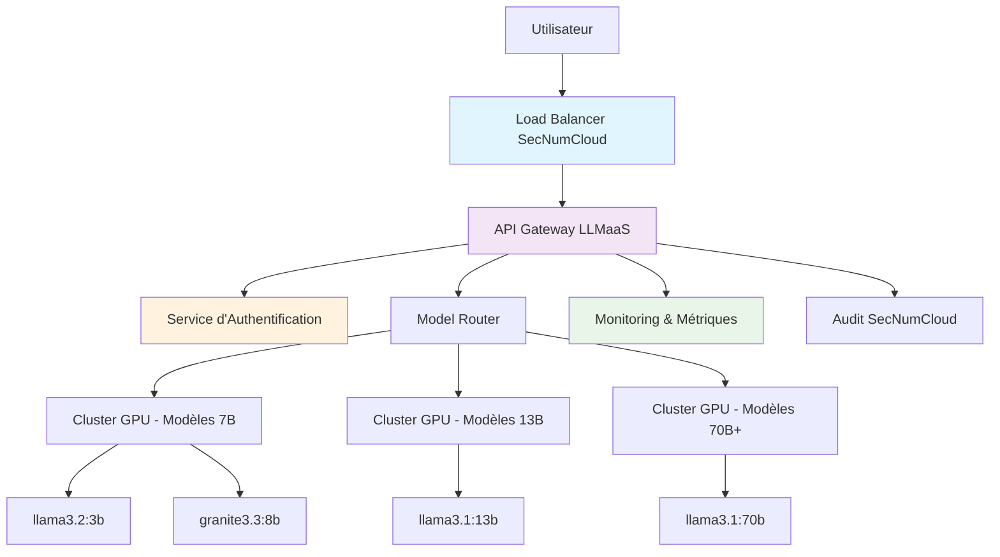
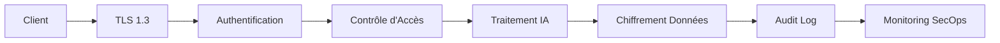
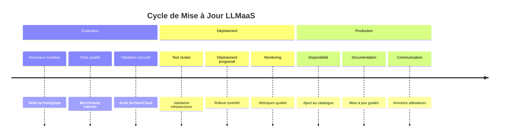

# Concepts et Architecture LLMaaS

## Vue d'Ensemble

Le service **LLMaaS** (Large Language Models as a Service) de Cloud Temple fournit un accès sécurisé et souverain aux modèles d'intelligence artificielle les plus avancés, avec la **qualification SecNumCloud** de l'ANSSI.

## 🏗️ Architecture Technique

### Infrastructure Cloud Temple



### Composants Principaux

#### 1. **API Gateway LLMaaS**
- **Compatible OpenAI** : Intégration transparente avec écosystème existant
- **Rate Limiting** : Gestion des quotas par tier de facturation
- **Load Balancing** : Distribution intelligente sur 12 machines GPU
- **Monitoring** : Métriques temps réel et alerting

#### 2. **Service d'Authentification**
- **Tokens API sécurisés** : Rotation automatique
- **Contrôle d'accès** : Permissions granulaires par modèle
- **Audit trails** : Traçabilité complète des accès

## 🤖 Modèles et Tokens

### Catalogue de Modèles

*Catalogue complet : [Liste des modèles](./models)*

### Gestion des Tokens

#### **Types de Tokens**
- **Tokens d'entrée** : Votre prompt et contexte
- **Tokens de sortie** : Réponse générée par le modèle
- **Tokens système** : Metadata et instructions

#### **Calcul des Coûts**
```
Coût total = (Tokens entrée × 0.9€/M) + (Tokens sortie × 4€/M) +  (Tokens sortie Raisonnement × 21€/M)
```

#### **Optimisation**
- **Context window** : Réutilisez les conversations pour économiser
- **Modèles appropriés** : Choisissez la taille selon la complexité
- **Max tokens** : Limitez la longueur des réponses

### Tokenisation

```python
# Exemple d'estimation de tokens
def estimate_tokens(text: str) -> int:
    """Estimation approximative : 1 token ≈ 4 caractères"""
    return len(text) // 4

prompt = "Expliquez la photosynthèse"
response_max = 200  # tokens max souhaités

estimated_input = estimate_tokens(prompt)  # ~6 tokens
total_cost = (estimated_input * 0.9 + response_max * 4) / 1_000_000
print(f"Coût estimé: {total_cost:.6f}€")
```

## 🔒 Sécurité et Conformité

### Qualification SecNumCloud

Le service LLMaaS bénéficie de la **qualification SecNumCloud** de l'ANSSI, garantissant :

#### **Protection des Données**
- **Chiffrement bout en bout** : TLS 1.3 pour tous les échanges
- **Stockage sécurisé** : Données chiffrées au repos (AES-256)
- **Isolation** : Environnements dédiés par tenant

#### **Souveraineté Numérique**
- **Hébergement France** : Datacenters Cloud Temple certifiés
- **Droit français** : Conformité RGPD native
- **Pas d'exposition** : Aucun transfert vers clouds étrangers

#### **Audit et Traçabilité**
- **Logs complets** : Toutes les interactions tracées
- **Rétention** : Conservation selon politiques légales
- **Compliance** : Rapports d'audit disponibles

### Contrôles de Sécurité



## 📈 Performance et Scalabilité

### Métriques de Performance

#### **Latence**
- **P50** : <200ms pour modèles 8B
- **P95** : <500ms pour modèles 13B
- **P99** : <1s pour modèles 70B

#### **Débit**
- **Concurrent users** : 100+ utilisateurs simultanés
- **Tokens/seconde** : 420 tokens/sec total
- **Disponibilité** : 99.9% SLA garanti

#### **Optimisations**
- **Model caching** : Modèles préchargés en mémoire
- **Batch processing** : Regroupement des requêtes
- **GPU optimization** : Kernels optimisés par modèle

### Monitoring en Temps Réel

Access via **Console Cloud Temple** :
- Métriques d'utilisation par modèle
- Graphiques de latence et débit
- Alertes sur seuils de performance
- Historique des requêtes

## 🌐 Intégration et Écosystème

### Compatibilité OpenAI

Le service LLMaaS est **100% compatible** avec l'API OpenAI :

```python
# Migration transparente
from openai import OpenAI

# Avant (OpenAI)
client_openai = OpenAI(api_key="sk-...")

# Après (Cloud Temple LLMaaS)
client_ct = OpenAI(
    api_key="votre-token-cloud-temple",
    base_url="https://api.ai.cloud-temple.com/v1"
)

# Code identique !
response = client_ct.chat.completions.create(
    model="granite3.3:8b",  # Modèle Cloud Temple
    messages=[{"role": "user", "content": "Bonjour"}]
)
```

### Écosystème Supporté

#### **Frameworks IA**
- ✅ **LangChain** : Intégration native
- ✅ **Haystack** : Pipeline de documents
- ✅ **Semantic Kernel** : Orchestration Microsoft
- ✅ **AutoGen** : Agents conversationnels

#### **Outils Développement**
- ✅ **Jupyter** : Notebooks interactifs
- ✅ **Streamlit** : Applications web rapides
- ✅ **Gradio** : Interfaces utilisateur IA
- ✅ **FastAPI** : APIs backend

#### **Plateformes No-Code**
- ✅ **Zapier** : Automatisations
- ✅ **Make** : Intégrations visuelles
- ✅ **Bubble** : Applications web

## 🔄 Cycle de Vie des Modèles

### Mise à Jour des Modèles



### Politique de Versioning

- **Modèles stables** : Versions fixes disponibles 12+ mois
- **Modèles expérimentaux** : Versions bêta pour early adopters
- **Dépréciation** : Préavis 6 mois avant retrait
- **Migration** : Assistance technique pour transitions

## 💡 Bonnes Pratiques

### Optimisation des Coûts

1. **Choix du modèle**
   ```python
   # Tâche simple → modèle léger
   if task_complexity == "simple":
       model = "llama3.2:3b"  # Moins cher
   else:
       model = "llama3.1:70b"  # Plus capable
   ```

2. **Gestion du contexte**
   ```python
   # Réutiliser les conversations
   messages = [
       {"role": "system", "content": "Vous êtes un assistant IA."},
       {"role": "user", "content": "Question 1"},
       {"role": "assistant", "content": "Réponse 1"},
       {"role": "user", "content": "Question 2"}  # Réutilise le contexte
   ]
   ```

3. **Limitation de tokens**
   ```python
   response = client.chat.completions.create(
       model="granite3.3:8b",
       messages=messages,
       max_tokens=100,  # Limite la longueur
       temperature=0.7
   )
   ```

### Performance

1. **Requêtes asynchrones**
   ```python
   import asyncio
   import aiohttp
   
   async def batch_requests(prompts):
       tasks = [process_prompt(prompt) for prompt in prompts]
       return await asyncio.gather(*tasks)
   ```

2. **Streaming pour UX**
   ```python
   # Interface temps réel
   for chunk in client.chat.completions.create(
       model="granite3.3:8b",
       messages=messages,
       stream=True
   ):
       if chunk.choices[0].delta.content:
           print(chunk.choices[0].delta.content, end="")
   ```

### Sécurité

1. **Validation des entrées**
   ```python
   def sanitize_input(user_input: str) -> str:
       # Nettoyer les injections potentielles
       cleaned = user_input.replace("```", "")
       return cleaned[:1000]  # Limiter la taille
   ```

2. **Gestion des erreurs**
   ```python
   try:
       response = client.chat.completions.create(...)
   except Exception as e:
       logger.error(f"LLMaaS error: {e}")
       return "Désolé, erreur temporaire."
   ```

## 📚 Ressources Supplémentaires

- **[Guide de démarrage rapide](./quickstart)** - Premiers pas en 5 minutes
- **[Documentation API](./api)** - Référence complète des endpoints
- **[Catalogue des modèles](./models)** - Liste détaillée des modèles
- **[Cas d'usage](./use-cases)** - Exemples sectoriels
- **[Sécurité](./security)** - Guide sécurité approfondi
- **[Tutoriels avancés](./tutorials)** - Guides d'intégration

---

*Le service LLMaaS Cloud Temple combine la puissance de l'IA moderne avec les exigences de sécurité et de souveraineté les plus strictes.*
