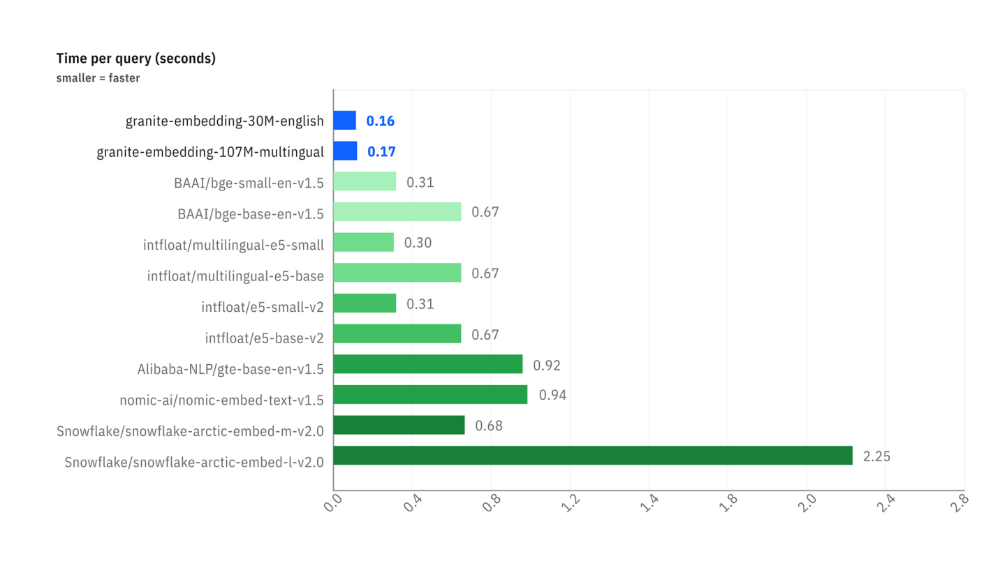

# Le RAG : Interroger vos Données avec un LLM

Ce document explique les concepts fondamentaux derrière la technique de **Retrieval-Augmented Generation (RAG)**.

:::tip Code d'Exemple Disponible
Les concepts abordés ici sont illustrés dans un démonstrateur complet et fonctionnel disponible sur notre GitHub. Il constitue une excellente base de départ pour comprendre le fonctionnement pratique d'un pipeline RAG.

➡️ **[Accéder au code du Simple RAG Demo](https://github.com/Cloud-Temple/product-llmaas-how-to/tree/main/simple_rag_demo)**
:::

## Le problème : Les LLMs n'ont pas de mémoire à long terme

Un grand modèle de langage (LLM) comme Mistral ou Granite est très puissant, mais il ne connaît que les données sur lesquelles il a été entraîné. Il ne connaît pas vos documents internes, les derniers articles de presse, ou les spécificités de votre métier.

Le **RAG** est une technique qui permet de donner au LLM un "mémoire externe" en lui fournissant, au moment de la question, les extraits de documents les plus pertinents pour l'aider à formuler sa réponse.

Le processus se déroule en deux temps :
1.  **Retrieval (Récupération)** : Trouver les bons documents.
2.  **Augmented Generation (Génération Augmentée)** : Utiliser ces documents pour générer une réponse.

C'est cette étape de **Retrieval** qui est au cœur de notre sujet. Comment un ordinateur parvient-il à "comprendre" qu'une question et un paragraphe parlent de la même chose ? La magie opère grâce aux **vecteurs**.

## Étape 1 : L'Embedding : Transformer les Mots en Nombres

Un ordinateur ne comprend pas les mots, mais il est excellent pour manipuler les nombres. L'**embedding** est le processus qui traduit un texte (un mot, une phrase, un document) en une liste de nombres, appelée **vecteur**.

:::tip Qu'est-ce qu'un vecteur ?
En termes simples, un vecteur est une liste de nombres qui représente un point dans un espace à plusieurs dimensions. Chaque nombre dans le vecteur correspond à une coordonnée sur un "axe" de cet espace. Pour les embeddings de texte, ces axes ne sont pas `x`, `y`, `z` mais des dimensions sémantiques abstraites (par exemple, un axe pourrait représenter le concept de "royauté", un autre celui de "félin", etc.).
:::

`"Le chat est sur le tapis."`  →  `[-0.01, 0.98, 0.45, ..., -0.33]`

Ce vecteur n'est pas aléatoire. Il représente la "position" du texte dans un espace sémantique multidimensionnel. Des textes ayant un sens similaire auront des vecteurs qui pointent dans des directions similaires.

:::tip Analogie Géographique
Imaginez une carte géographique. "Paris" et "France" seraient très proches, tout comme "Rome" et "Italie". "Paris" serait plus éloigné de "Rome" que de "France", mais plus proche que de "Tokyo". L'embedding fait la même chose, mais avec des milliers de "dimensions" au lieu de deux, pour capturer des nuances de sens complexes.
:::

Dans notre script, l'endpoint `/v1/embeddings` et le modèle `granite-embedding:278m` sont responsables de cette traduction.

### Focus sur les Modèles Granite Embedding

Les embeddings font partie intégrante de l’écosystème LLM. Un moyen précis et efficace de représenter les mots, les requêtes et les documents sous forme numérique est essentiel pour toute une série de tâches d’entreprise, y compris la recherche sémantique, la recherche vectorielle et la RAG, ainsi que pour maintenir des bases de données vectorielles efficaces. Un modèle d’embedding efficace peut notablement améliorer la compréhension de l’intention de l’utilisateur par le système et augmenter la pertinence des informations et des sources en réponse à une requête.

Alors que les deux dernières années ont vu la prolifération de LLM autorégressifs open source de plus en plus compétitifs pour des tâches comme la génération et la synthèse de texte, les modèles d’embedding open source publiés par les principaux fournisseurs sont relativement rares.

#### Pourquoi Granite Embedding ?

Les nouveaux modèles **Granite Embedding** d'IBM, que nous mettons à votre disposition, sont une évolution améliorée de la famille Slate de modèles de langage encodeurs uniquement basés sur RoBERTa. Ils se distinguent sur plusieurs points cruciaux pour un usage en entreprise :

1.  **Entraînement Éthique et Commercialement Sûr** : Alors que la grande majorité des modèles d'embedding ouverts du classement MTEB Hugging Face s'appuient sur des ensembles de données d'entraînement uniquement sous licence à des fins de recherche (comme MS-MARCO), IBM a vérifié l'éligibilité commerciale de toutes les sources de données utilisées pour entraîner Granite Embedding.
2.  **Indemnisation de Propriété Intellectuelle** : Soulignant le soin apporté à son utilisation en entreprise, IBM prend en charge Granite Embedding avec le même niveau d’indemnisation non plafonnée pour les réclamations de tiers liées à la propriété intellectuelle que celle prévue pour l’utilisation d’autres modèles développés par IBM.
3.  **Performance et Efficacité** : Les efforts d’IBM dans l’organisation et le filtrage des données d’entraînement n’ont pas empêché les modèles Granite Embedding de suivre le rythme des principaux modèles d’embedding open source de taille similaire.

Les benchmarks ci-dessous illustrent deux avantages clés :

-   **Précision de la Recherche** : Le premier graphique montre que les modèles Granite (en bleu) sont très compétitifs, voire supérieurs, à des modèles de taille similaire sur des tâches de recherche sémantique (`Retrieval Tasks`).
-   **Vitesse d'Inférence** : Le second graphique montre que les modèles Granite sont **nettement plus rapides** (temps par requête plus faible) que la plupart des alternatives populaires, ce qui est un avantage considérable pour les applications nécessitant des réponses en temps réel.

*Comparaison des performances sur des tâches de recherche (BEIR) et de recherche de code (CoIR).*

*Comparaison de la latence (temps par requête en secondes) entre différents modèles d'embedding.*

C'est pour cet équilibre entre **performance, vitesse, sécurité juridique et éthique** que nous avons choisi d'intégrer le modèle `granite-embedding:278m` (la version multilingue la plus puissante) comme service d'embedding par défaut.

## Étape 2 : La Recherche : Mesurer la Proximité Sémantique

Une fois que notre question et tous nos documents sont transformés en vecteurs, la recherche devient un problème mathématique : **trouver le vecteur de document le plus "proche" du vecteur de la question.**

Il existe plusieurs façons de mesurer cette "proximité". Notre script en utilise deux : la Similarité Cosinus et la Distance Euclidienne.

### La Similarité Cosinus (Le Standard)

-   **Concept** : Elle ne mesure pas la distance, mais l'**angle** entre deux vecteurs. Un angle faible (proche de 0°) signifie que les vecteurs pointent dans la même direction, et donc que les textes ont un sens très similaire.
-   **Score** : Le cosinus d'un angle de 0° est 1 (similarité parfaite). Le cosinus d'un angle de 90° est 0 (aucune similarité).
-   **Pourquoi est-elle si utilisée ?** Pour le texte, la *direction* sémantique est beaucoup plus importante que la *magnitude* (la longueur) du vecteur. La similarité cosinus ignore la magnitude et se concentre uniquement sur la direction.

**Exemple simple en 2D :**
-   Question : `v_q = [2, 2]`
-   Doc A : `v_a = [4, 4]` (même sens, plus long)
-   Doc B : `v_b = [-2, 2]` (direction différente)

Le calcul de la similarité cosinus donnera :
-   `cos(v_q, v_a) = 1.0` → Angle de 0°. Similarité parfaite.
-   `cos(v_q, v_b) = 0.0` → Angle de 90°. Aucune similarité.

C'est le résultat que nous voulons : le Document A est sémantiquement identique à la question, même si sa formulation est plus longue.

### La Distance Euclidienne (La Règle)

-   **Concept** : C'est la distance "à vol d'oiseau" entre les points terminaux des deux vecteurs.
-   **Score** : Un score de 0 signifie que les vecteurs sont identiques. Plus le score est élevé, plus ils sont éloignés.
-   **Inconvénient pour le texte** : Elle est sensible à la magnitude. Dans notre exemple ci-dessus, la distance entre `v_q` et `v_a` ne serait pas nulle, car les vecteurs n'ont pas la même longueur, même s'ils ont le même sens.

## Conclusion

Le tableau affiché par le script `simple-rag-demo` vous permet de visualiser ces deux métriques. Vous remarquerez que, bien que les classements puissent parfois différer légèrement, la **similarité cosinus est généralement la métrique de choix** pour les applications de recherche sémantique basées sur du texte.

Le plus grand défi, comme le montre l'exemple, reste la **qualité du modèle d'embedding**. Un bon modèle produira des vecteurs qui capturent fidèlement le sens, rendant le calcul de proximité, quelle que soit la méthode, beaucoup plus fiable.
