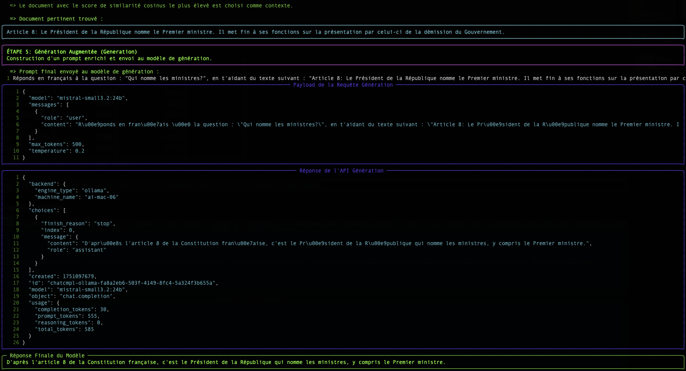

# Comprendre le RAG : L'Embedding et la Distance Vectorielle

Le script `simple-rag-demo` est une excellente illustration du fonctionnement d'un système RAG (Retrieval-Augmented Generation). Cette page explique les concepts fondamentaux qui le font fonctionner : l'**embedding** et la **recherche par similarité**.

## Le Problème : Les LLMs n'ont pas de mémoire à long terme

Un grand modèle de langage (LLM) comme Mistral ou Granite est très puissant, mais il ne connaît que les données sur lesquelles il a été entraîné. Il ne connaît pas vos documents internes, les derniers articles de presse, ou les spécificités de votre métier.

Le **RAG** est une technique qui permet de donner au LLM un "mémoire externe" en lui fournissant, au moment de la question, les extraits de documents les plus pertinents pour l'aider à formuler sa réponse.

Le processus se déroule en deux temps :
1.  **Retrieval (Récupération)** : Trouver les bons documents.
2.  **Augmented Generation (Génération Augmentée)** : Utiliser ces documents pour générer une réponse.

C'est l'étape de "Retrieval" qui nous intéresse ici. Comment un ordinateur peut-il "comprendre" qu'une question est sémantiquement proche d'un paragraphe ? La réponse est : avec des vecteurs.

## Étape 1 : L'Embedding - Transformer les Mots en Nombres

Un ordinateur ne comprend pas les mots, mais il est excellent pour manipuler les nombres. L'**embedding** est le processus qui traduit un texte (un mot, une phrase, un document) en une liste de nombres, appelée **vecteur**.

`"Le chat est sur le tapis."`  →  `[-0.01, 0.98, 0.45, ..., -0.33]`

Ce vecteur n'est pas aléatoire. Il représente la "position" du texte dans un espace sémantique multidimensionnel. Des textes ayant un sens similaire auront des vecteurs qui pointent dans des directions similaires.

**Analogie** : Imaginez une carte géographique. "Paris" et "France" seraient très proches, tout comme "Rome" et "Italie". "Paris" serait plus éloigné de "Rome" que de "France", mais plus proche que de "Tokyo". L'embedding fait la même chose, mais avec des milliers de "dimensions" au lieu de deux, pour capturer des nuances de sens complexes.

Dans notre script, l'endpoint `/v1/embeddings` et le modèle `granite-embedding:278m` sont responsables de cette traduction.

## Étape 2 : La Recherche - Mesurer la Proximité Sémantique

Une fois que notre question et tous nos documents sont transformés en vecteurs, la recherche devient un problème mathématique : **trouver le vecteur de document le plus "proche" du vecteur de la question.**

Il existe plusieurs façons de mesurer cette "proximité". Notre script en utilise deux : la Similarité Cosinus et la Distance Euclidienne.

### La Similarité Cosinus (Le Standard)

-   **Concept** : Elle ne mesure pas la distance, mais l'**angle** entre deux vecteurs. Un angle faible (proche de 0°) signifie que les vecteurs pointent dans la même direction, et donc que les textes ont un sens très similaire.
-   **Score** : Le cosinus d'un angle de 0° est 1 (similarité parfaite). Le cosinus d'un angle de 90° est 0 (aucune similarité).
-   **Pourquoi est-elle si utilisée ?** Pour le texte, la *direction* sémantique est beaucoup plus importante que la *magnitude* (la longueur) du vecteur. La similarité cosinus ignore la magnitude et se concentre uniquement sur la direction.

**Exemple simple en 2D :**
-   Question : `v_q = [2, 2]`
-   Doc A : `v_a = [4, 4]` (même sens, plus long)
-   Doc B : `v_b = [-2, 2]` (direction différente)

Le calcul de la similarité cosinus donnera :
-   `cos(v_q, v_a) = 1.0` → Angle de 0°. Similarité parfaite.
-   `cos(v_q, v_b) = 0.0` → Angle de 90°. Aucune similarité.

C'est le résultat que nous voulons : le Document A est sémantiquement identique à la question, même si sa formulation est plus longue.

### La Distance Euclidienne (La Règle)

-   **Concept** : C'est la distance "à vol d'oiseau" entre les points terminaux des deux vecteurs.
-   **Score** : Un score de 0 signifie que les vecteurs sont identiques. Plus le score est élevé, plus ils sont éloignés.
-   **Inconvénient pour le texte** : Elle est sensible à la magnitude. Dans notre exemple ci-dessus, la distance entre `v_q` et `v_a` ne serait pas nulle, car les vecteurs n'ont pas la même longueur, même s'ils ont le même sens.

## Conclusion

Le tableau affiché par le script `simple-rag-demo` vous permet de visualiser ces deux métriques. Vous remarquerez que, bien que les classements puissent parfois différer légèrement, la **similarité cosinus est généralement la métrique de choix** pour les applications de recherche sémantique basées sur du texte.

Le plus grand défi, comme le montre l'exemple, reste la **qualité du modèle d'embedding**. Un bon modèle produira des vecteurs qui capturent fidèlement le sens, rendant le calcul de proximité, quelle que soit la méthode, beaucoup plus fiable.
