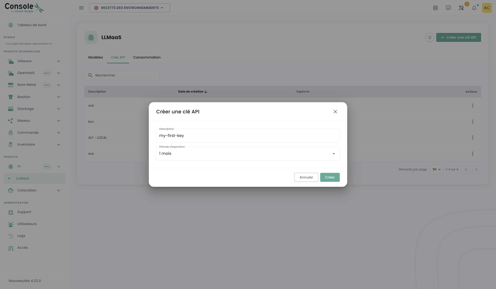

# Tutorials LLMaaS

## Vue d'overview

Ces tutorials avancés couvrent l'intégration, l'optimisation et les meilleures pratiques pour exploiter pleinement LLMaaS Cloud Temple en production. Chaque tutorial inclut du code testé et des métriques de performance réelles.

## 🚀 Intégrations LangChain et Frameworks

### 1. Intégration de base avec LangChain

Ce premier exemple montre comment intégrer notre API LLMaaS avec le framework populaire LangChain en créant un "wrapper" personnalisé. Un wrapper est une classe qui "enveloppe" notre API pour la rendre compatible avec les mécanismes internes de LangChain.

#### Le code expliqué

Le code ci-dessous définit une classe `CloudTempleLLM` qui hérite de la classe de base `LLM` de LangChain. Cela nous permet de définir un comportement sur mesure tout en restant compatible avec l'écosystème LangChain (chaînes, agents, etc.).

1. **`CloudTempleLLM(LLM)`** : Notre classe hérite de `LLM`, ce qui nous oblige à implémenter certaines méthodes, notamment `_call`.
2. **`_call(self, prompt: str, ...)`** : C'est le cœur de notre wrapper. À chaque fois que LangChain aura besoin de faire appel à notre modèle de langage, il invoquera cette méthode. À l'intérieur, nous formatons une requête HTTP POST standard avec les bons headers (`Authorization`) et le `payload` attendu par notre API `/v1/chat/completions`.
3. **`exemple_langchain_basic()`** : Cette fonction de démonstration montre comment utiliser notre wrapper. On l'instancie, on crée un `PromptTemplate` pour structurer notre requête, et on les combine dans une `LLMChain`. Lorsque l'on exécute la chaîne (`chain.run(...)`), LangChain appelle en coulisses la méthode `_call` que nous avons définie.

Cette approche est utile si vous souhaitez un contrôle total sur la manière dont LangChain interagit avec l'API, mais elle est plus verbeuse que l'utilisation du client `ChatOpenAI` (voir [API Reference](./api#langchain)).

```python
# Installation des dépendances
# pip install langchain requests pydantic

from langchain.llms.base import LLM
from langchain.schema import LLMResult, Generation
from typing import Optional, List, Any
from pydantic import Field
import requests
import json
import os

# --- Configuration ---
# Il est recommandé de stocker votre clé API dans une variable d'environnement
API_KEY = os.getenv("LLMAAS_API_KEY", "votre-clé-api-ici")
BASE_URL = "https://api.ai.cloud-temple.com/v1"

class CloudTempleLLM(LLM):
    """
    Wrapper LangChain personnalisé pour l'API LLMaaS de Cloud Temple.
    Cette classe permet d'utiliser notre API comme un LLM standard dans LangChain.
    """
    
    api_key: str = Field(default="")
    model_name: str = Field(default="granite3.3:8b")
    temperature: float = Field(default=0.7)
    max_tokens: int = Field(default=1000)
    
    @property
    def _llm_type(self) -> str:
        """Identifiant unique pour notre type de LLM."""
        return "cloud_temple_llmaas"
    
    def _call(self, prompt: str, stop: Optional[List[str]] = None) -> str:
        """
        La méthode principale qui effectue l'appel à l'API LLMaaS.
        LangChain utilise cette méthode pour chaque requête au modèle.
        """
        headers = {
            "Authorization": f"Bearer {self.api_key}",
            "Content-Type": "application/json"
        }
        
        payload = {
            "model": self.model_name,
            "messages": [{"role": "user", "content": prompt}],
            "temperature": self.temperature,
            "max_tokens": self.max_tokens
        }
        
        if stop:
            payload["stop"] = stop
        
        # Exécution de la requête POST vers l'API
        response = requests.post(
            f"{BASE_URL}/chat/completions",
            headers=headers,
            json=payload,
            timeout=60
        )
        
        response.raise_for_status()  # Lève une exception en cas d'erreur HTTP
        result = response.json()
        
        # Retourne le contenu du message de l'assistant
        return result['choices'][0]['message']['content']

# --- Exemple d'utilisation ---
from langchain.chains import LLMChain
from langchain.prompts import PromptTemplate

def exemple_langchain_wrapper():
    """Démontre l'utilisation du wrapper LLM avec une chaîne LangChain."""
    
    # 1. Initialisation de notre LLM personnalisé
    llm = CloudTempleLLM(
        api_key=API_KEY,
        model_name="granite3.3:8b"
    )
    
    # 2. Création d'un template de prompt pour structurer les requêtes
    template = """
    Tu es un expert en {domaine}. 
    Réponds à cette question de manière détaillée et professionnelle :
    
    Question: {question}
    
    Réponse:
    """
    prompt = PromptTemplate(
        input_variables=["domaine", "question"],
        template=template
    )
    
    # 3. Création d'une chaîne qui combine le prompt et le LLM
    chain = LLMChain(llm=llm, prompt=prompt)
    
    # 4. Exécution de la chaîne avec des variables spécifiques
    result = chain.run(
        domaine="cybersécurité",
        question="Quelles sont les meilleures pratiques pour sécuriser une API REST ?"
    )
    
    return result

# --- Lancement du test ---
if __name__ == "__main__":
    if API_KEY == "votre-clé-api-ici":
        print("Veuillez configurer votre LLMAAS_API_KEY dans vos variables d'environnement.")
    else:
        reponse = exemple_langchain_wrapper()
        print("Réponse de l'expert en cybersécurité :\n")
        print(reponse)
```

### 2. RAG (Retrieval-Augmented Generation) avec l'API LLMaaS

Le RAG est une technique puissante qui permet à un LLM de répondre à des questions en s'appuyant sur une base de connaissances externe. Ce tutoriel vous guide à travers la création d'un pipeline RAG simple en utilisant notre API pour les embeddings et la génération, et FAISS, une bibliothèque de similarité vectorielle, pour créer un index en mémoire.

#### Le code expliqué

Le pipeline se décompose en plusieurs étapes logiques :

1. **Configuration** : Nous importons les bibliothèques nécessaires et chargeons notre clé API depuis les variables d'environnement. Nous définissons les modèles à utiliser : `granite-embedding:278m` pour la vectorisation et `granite3.3:8b` pour la génération.
2. **`LLMaaSEmbeddings`** : Comme dans l'exemple précédent, nous avons besoin d'un wrapper pour interagir avec notre API d'embeddings. Cette classe se charge de transformer les morceaux de texte (chunks) en vecteurs numériques (embeddings).
3. **`setup_rag_pipeline`** : Cette fonction orchestre la création du pipeline.
    * **Chargement des documents** : `DirectoryLoader` charge les fichiers texte de notre base de connaissances.
    * **Division en chunks** : `RecursiveCharacterTextSplitter` découpe les documents en plus petits morceaux. C'est essentiel pour que le modèle d'embedding puisse traiter efficacement le texte et pour que la recherche de similarité soit précise.
    * **Vectorisation et Indexation** : `FAISS.from_documents` est une étape clé. Elle prend les chunks de texte, utilise notre classe `LLMaaSEmbeddings` pour appeler l'API et obtenir les vecteurs correspondants, puis stocke ces vecteurs dans un index FAISS en mémoire.
    * **Configuration du LLM** : Nous utilisons `ChatOpenAI` qui est nativement compatible avec notre API pour la partie génération de réponse.
    * **Création de la chaîne `RetrievalQA`** : C'est la chaîne LangChain qui lie tous les éléments. Quand on lui pose une question, elle :
        a. Utilise le `retriever` (basé sur notre index FAISS) pour trouver les chunks de texte les plus pertinents.
        b. "Stuff" (fourre) ces chunks dans un prompt avec la question.
        c. Envoie ce prompt enrichi au LLM pour générer une réponse contextuelle.
4. **Exécution** : La fonction `main` simule une utilisation réelle en créant des fichiers de connaissance temporaires, en construisant le pipeline et en posant une question.

```python
import os
import tempfile
import shutil
from pathlib import Path
from dotenv import load_dotenv
from typing import List

# --- Imports LangChain ---
from langchain_core.embeddings import Embeddings
from langchain_openai import ChatOpenAI
from langchain_community.document_loaders import DirectoryLoader, TextLoader
from langchain.text_splitter import RecursiveCharacterTextSplitter
from langchain_community.vectorstores import FAISS
from langchain.chains import RetrievalQA

# --- Configuration ---
# Charge les variables d'environnement (ex: LLMAAS_API_KEY)
load_dotenv()
API_KEY = os.getenv("LLMAAS_API_KEY")
BASE_URL = os.getenv("API_URL", "https://api.ai.cloud-temple.com/v1")
EMBEDDING_MODEL = "granite-embedding:278m"
LLM_MODEL = "granite3.3:8b"

# --- Classe d'Embedding Personnalisée ---
class LLMaaSEmbeddings(Embeddings):
    """Classe d'embedding personnalisée pour l'API LLMaaS de Cloud Temple."""
    def __init__(self, api_key: str, model_name: str):
        if not api_key:
            raise ValueError("La clé API LLMaaS ne peut pas être vide.")
        self.api_key = api_key
        self.model_name = model_name
        self.base_url = BASE_URL
        self.headers = {
            "Authorization": f"Bearer {self.api_key}",
            "Content-Type": "application/json",
        }

    def _embed(self, texts: List[str]) -> List[List[float]]:
        import httpx
        payload = {"input": texts, "model": self.model_name}
        try:
            with httpx.Client(timeout=60.0) as client:
                response = client.post(f"{self.base_url}/embeddings", headers=self.headers, json=payload)
                response.raise_for_status()
                data = response.json()['data']
                data.sort(key=lambda e: e['index'])
                return [item['embedding'] for item in data]
        except httpx.HTTPStatusError as e:
            print(f"Erreur HTTP lors de la génération des embeddings: {e.response.text}")
            raise
        except Exception as e:
            print(f"Une erreur inattendue est survenue lors de la génération des embeddings: {e}")
            raise

    def embed_documents(self, texts: List[str]) -> List[List[float]]:
        return self._embed(texts)

    def embed_query(self, text: str) -> List[float]:
        # La méthode _embed attend une liste, nous encapsulons donc le texte unique.
        return self._embed([text])[0]

# --- Pipeline RAG ---
def setup_rag_pipeline(documents_path: str):
    """Configuration complète du pipeline RAG avec les outils LLMaaS."""
    print("1. Chargement et division des documents...")
    loader = DirectoryLoader(documents_path, glob="*.txt", loader_cls=TextLoader, loader_kwargs={'encoding': 'utf-8'})
    documents = loader.load()
    text_splitter = RecursiveCharacterTextSplitter(chunk_size=1000, chunk_overlap=200)
    splits = text_splitter.split_documents(documents)
    print(f"   -> {len(documents)} document(s) chargé(s) et divisé(s) en {len(splits)} chunks.")
    
    print(f"2. Création des embeddings via LLMaaS (modèle: {EMBEDDING_MODEL})...")
    embeddings = LLMaaSEmbeddings(api_key=API_KEY, model_name=EMBEDDING_MODEL)
    
    print("3. Création de l'index vectoriel en mémoire (FAISS)...")
    vectorstore = FAISS.from_documents(splits, embeddings)
    print("   -> Index FAISS créé avec succès.")
    
    print(f"4. Configuration du LLM (modèle: {LLM_MODEL})...")
    # Correction pour la compatibilité Pydantic/LangChain
    from langchain_core.caches import BaseCache
    from langchain_core.callbacks.base import Callbacks
    ChatOpenAI.model_rebuild()
    
    llm = ChatOpenAI(
        api_key=API_KEY,
        base_url=BASE_URL,
        model=LLM_MODEL,
        temperature=0.3,
        model_kwargs={"max_tokens": 300}
    )
    
    print("5. Création de la chaîne de Question/Réponse (RAG)...")
    qa_chain = RetrievalQA.from_chain_type(
        llm=llm,
        chain_type="stuff",
        retriever=vectorstore.as_retriever(),
        return_source_documents=True
    )
    print("   -> Pipeline RAG prêt.")
    return qa_chain

# --- Exécution ---
def main():
    """Fonction principale pour exécuter le pipeline RAG de bout en bout."""
    if not API_KEY:
        print("Erreur: La variable d'environnement LLMAAS_API_KEY n'est pas définie.")
        return

    # Créer des documents de test temporaires
    temp_dir = tempfile.mkdtemp()
    print(f"\nCréation de documents de test dans: {temp_dir}")
    try:
        documents_content = {
            "overview.txt": "Cloud Temple est un fournisseur de cloud souverain français qualifié SecNumCloud.",
            "pricing.txt": "Les tarifs de l'API LLMaaS sont de 0.9€/million de tokens en entrée et 4€/million en sortie."
        }
        for filename, content in documents_content.items():
            with open(Path(temp_dir) / filename, 'w', encoding='utf-8') as f:
                f.write(content)
        
        # Configurer et exécuter le pipeline
        rag_chain = setup_rag_pipeline(temp_dir)
        
        print("\n--- Interrogation du Pipeline RAG ---")
        question = "Quel est le tarif des tokens en sortie sur l'API LLMaaS de Cloud Temple ?"
        result = rag_chain({"query": question})
        
        print(f"\nQuestion: {question}")
        print(f"Réponse: {result['result']}")
        print("\nSources utilisées pour la réponse:")
        for source in result["source_documents"]:
            print(f"- Fichier: {os.path.basename(source.metadata['source'])}")
            print(f"  Contenu: \"{source.page_content}\"")

    finally:
        # Nettoyer le répertoire temporaire
        print(f"\nNettoyage du répertoire temporaire: {temp_dir}")
        shutil.rmtree(temp_dir)

if __name__ == "__main__":
    main()
```

### 3. Intégration avec une base de données vectorielle (Qdrant)

Pour des applications RAG en production, l'utilisation d'une base de données vectorielle dédiée comme **Qdrant** est recommandée. Contrairement à FAISS qui fonctionne en mémoire, Qdrant offre la persistance des données, des capacités de recherche avancées et une meilleure scalabilité.

#### Le code expliqué

Ce tutoriel adapte le pipeline RAG précédent pour utiliser Qdrant.

1. **Prérequis** : La première étape est de lancer une instance de Qdrant. Le moyen le plus simple est d'utiliser Docker.
2. **`setup_qdrant_rag_pipeline`** :
    * **Embeddings et Documents** : La création des embeddings et des documents reste identique à l'exemple précédent.
    * **Connexion à Qdrant** : Au lieu de créer un index FAISS, nous utilisons `Qdrant.from_documents`. Cette méthode LangChain gère plusieurs étapes :
        a. Elle se connecte à votre instance Qdrant via l'URL fournie.
        b. Elle crée une nouvelle "collection" (l'équivalent d'une table dans une base de données SQL) si elle n'existe pas.
        c. Elle appelle notre classe `LLMaaSEmbeddings` pour vectoriser les documents.
        d. Elle insère les documents et leurs vecteurs dans la collection Qdrant.
    * **`force_recreate=True`** : Pour ce tutoriel, nous utilisons ce paramètre pour nous assurer que la collection est vide à chaque exécution. En production, vous le mettriez à `False` pour conserver vos données.
3. **Le reste du pipeline** (configuration du LLM, création de la chaîne `RetrievalQA`) est identique, ce qui démontre la flexibilité de LangChain : il suffit de changer la source du `retriever` (le chercheur d'informations) pour passer de FAISS à Qdrant.

:::info Prérequis : Lancer Qdrant
Pour ce tutoriel, vous aurez besoin d'une instance Qdrant. Vous pouvez la lancer facilement avec Docker :

```bash
# 1. Télécharger la dernière image de Qdrant
docker pull qdrant/qdrant

# 2. Démarrer le conteneur Qdrant
docker run -p 6333:6333 -p 6334:6334 qdrant/qdrant
```
:::

Le code ci-dessous montre comment adapter le pipeline RAG pour utiliser Qdrant comme base de données vectorielle.

```python
import os
from dotenv import load_dotenv
from langchain_openai import ChatOpenAI
from langchain.chains import RetrievalQA
from langchain_community.vectorstores import Qdrant
from langchain.docstore.document import Document
from langchain.text_splitter import RecursiveCharacterTextSplitter
from typing import List
from langchain_core.embeddings import Embeddings

# (La classe LLMaaSEmbeddings est la même que dans l'exemple précédent,
# nous la réutilisons ici. Assurez-vous qu'elle est définie dans votre script.)

# --- Configuration ---
load_dotenv()
API_KEY = os.getenv("LLMAAS_API_KEY")
BASE_URL = os.getenv("API_URL", "https://api.ai.cloud-temple.com/v1")
EMBEDDING_MODEL = "granite-embedding:278m"
LLM_MODEL = "granite3.3:8b"
QDRANT_URL = os.getenv("QDRANT_URL", "http://localhost:6333")
QDRANT_COLLECTION_NAME = "tutorial_collection"

# --- Classe d'Embedding (réutilisée de l'exemple précédent) ---
class LLMaaSEmbeddings(Embeddings):
    def __init__(self, api_key: str, model_name: str):
        if not api_key: raise ValueError("API Key is required.")
        self.api_key, self.model_name, self.base_url = api_key, model_name, BASE_URL
        self.headers = {"Authorization": f"Bearer {self.api_key}", "Content-Type": "application/json"}
    def _embed(self, texts: List[str]) -> List[List[float]]:
        import httpx
        payload = {"input": texts, "model": self.model_name}
        with httpx.Client(timeout=60.0) as client:
            r = client.post(f"{self.base_url}/embeddings", headers=self.headers, json=payload)
            r.raise_for_status()
            data = r.json()['data']
            data.sort(key=lambda e: e['index'])
            return [item['embedding'] for item in data]
    def embed_documents(self, texts: List[str]) -> List[List[float]]: return self._embed(texts)
    def embed_query(self, text: str) -> List[float]: return self._embed([text])[0]

def setup_qdrant_rag_pipeline():
    """Configure et retourne un pipeline RAG utilisant Qdrant."""
    print("1. Initialisation du client d'embedding LLMaaS...")
    embeddings = LLMaaSEmbeddings(api_key=API_KEY, model_name=EMBEDDING_MODEL)

    print("2. Préparation des documents...")
    documents_content = [
        "Cloud Temple est un fournisseur de cloud souverain français avec la qualification SecNumCloud.",
        "Les tarifs LLMaaS sont de 0.9€ pour l'input et 4€ pour l'output par million de tokens."
    ]
    documents = [Document(page_content=d) for d in documents_content]
    
    print(f"3. Connexion à Qdrant et peuplement de la collection '{QDRANT_COLLECTION_NAME}'...")
    vectorstore = Qdrant.from_documents(
        documents,
        embeddings,
        url=QDRANT_URL,
        collection_name=QDRANT_COLLECTION_NAME,
        force_recreate=True, # Assure une collection propre pour le tutoriel
    )
    print("   -> Collection créée et peuplée avec succès.")

    print(f"4. Configuration du LLM ({LLM_MODEL})...")
    llm = ChatOpenAI(
        api_key=API_KEY,
        base_url=BASE_URL,
        model=LLM_MODEL,
        temperature=0.3
    )

    print("5. Création de la chaîne RAG...")
    qa_chain = RetrievalQA.from_chain_type(
        llm=llm,
        retriever=vectorstore.as_retriever(),
        return_source_documents=True
    )
    print("   -> Pipeline RAG avec Qdrant prêt.")
    return qa_chain

# --- Exécution ---
def main_qdrant():
    """Fonction principale pour exécuter le pipeline RAG avec Qdrant."""
    if not API_KEY:
        print("Erreur: La variable d'environnement LLMAAS_API_KEY n'est pas définie.")
        return
        
    try:
        rag_chain = setup_qdrant_rag_pipeline()
        question = "Quels sont les tarifs de l'API LLMaaS de Cloud Temple ?"
        
        print(f"\n--- Interrogation du pipeline ---")
        result = rag_chain({"query": question})

        print(f"\nQuestion: {question}")
        print(f"Réponse: {result['result']}")
        print("\nSources utilisées pour la réponse:")
        for source in result["source_documents"]:
            print(f"- Contenu: \"{source.page_content}\"")
            
    except Exception as e:
        print(f"\nUne erreur est survenue: {e}")
        print("Veuillez vous assurer que le conteneur Qdrant est bien en cours d'exécution.")

if __name__ == "__main__":
    main_qdrant()
```

### 4. Agents LangChain avec Outils

Un agent est un LLM qui ne se contente pas de répondre à une question, mais qui peut utiliser un ensemble d'**outils** (fonctions, API, etc.) pour construire une réponse plus complexe. Il peut raisonner, décomposer un problème, choisir un outil, l'exécuter, observer le résultat, et répéter ce cycle jusqu'à obtenir une réponse finale.

#### Le code expliqué

Cet exemple construit un agent simple capable d'utiliser deux outils : un pour interroger une API (simulée) de Cloud Temple et un autre pour faire des calculs.

1. **Définition des Outils** : Les classes `CloudTempleAPITool` et `CalculatorTool` héritent de `BaseTool`. Chaque outil a :
    * Un `name` : un nom simple et descriptif.
    * Une `description` : **cruciale**, c'est ce que le LLM lit pour décider quel outil utiliser. Elle doit être très claire sur ce que fait l'outil et quand l'utiliser.
    * Une méthode `_run` : le code qui est réellement exécuté lorsque l'agent choisit cet outil.
2. **`create_agent_with_tools`** :
    * **Initialisation du LLM** : Nous utilisons notre wrapper `CloudTempleLLM` défini dans le premier tutoriel.
    * **Liste des outils** : Nous fournissons à l'agent la liste des outils qu'il a le droit d'utiliser.
    * **Prompt de l'agent** : Le prompt est très spécifique. Il s'agit d'un "prompt de raisonnement" qui instruit le LLM sur la manière de penser (`Thought`), de choisir une action (`Action`), de fournir une entrée à cette action (`Action Input`), et d'observer le résultat (`Observation`). C'est le mécanisme central du framework ReAct (Reasoning and Acting) utilisé ici.
    * **Création de l'agent** : `create_react_agent` assemble le LLM, les outils et le prompt pour créer l'agent.
    * **`AgentExecutor`** : C'est le moteur qui fait tourner l'agent en boucle jusqu'à ce qu'il produise une `Final Answer`. Le paramètre `verbose=True` est très utile pour voir le "dialogue intérieur" de l'agent (ses pensées, ses actions, etc.).

```python
from langchain.agents import Tool, AgentExecutor, create_react_agent
from langchain.tools import BaseTool
from langchain.prompts import PromptTemplate
import requests
import json
import os

# (La classe CloudTempleLLM est la même que dans le premier exemple)

# --- Définition des Outils ---

class CloudTempleAPITool(BaseTool):
    """Un outil qui simule un appel à une API interne pour obtenir des informations sur les services."""
    name = "cloud_temple_api_checker"
    description = "Utile pour obtenir des informations sur les services, produits et offres de Cloud Temple."

    def _run(self, query: str) -> str:
        # Dans un cas réel, ceci appellerait une véritable API.
        print(f"--- Outil CloudTempleAPITool appelé avec la requête: '{query}' ---")
        if "service" in query.lower():
            return "Cloud Temple propose les services suivants : IaaS, PaaS, LLMaaS, Sécurité Managée."
        return "Information non trouvée."

    async def _arun(self, query: str) -> str:
        # Implémentation asynchrone non nécessaire pour cet exemple.
        raise NotImplementedError("L'outil API ne supporte pas l'exécution asynchrone.")

class SimpleCalculatorTool(BaseTool):
    """Un outil simple pour effectuer des calculs mathématiques."""
    name = "simple_calculator"
    description = "Utile pour effectuer des calculs mathématiques simples. Prend une expression valide en Python."

    def _run(self, expression: str) -> str:
        print(f"--- Outil SimpleCalculatorTool appelé avec l'expression: '{expression}' ---")
        try:
            # ATTENTION: eval() est dangereux en production. C'est uniquement pour la démo.
            return str(eval(expression))
        except Exception as e:
            return f"Erreur de calcul: {e}"

    async def _arun(self, expression: str) -> str:
        raise NotImplementedError("L'outil Calculatrice ne supporte pas l'exécution asynchrone.")

# --- Création de l'Agent ---

def create_agent():
    """Configure et retourne un agent LangChain avec les outils définis."""
    print("1. Initialisation du LLM pour l'agent...")
    llm = CloudTempleLLM(api_key=os.getenv("LLMAAS_API_KEY", "votre-clé-api-ici"))

    tools = [CloudTempleAPITool(), SimpleCalculatorTool()]
    
    # Le template de prompt est crucial : il guide le LLM dans son raisonnement.
    template = """
    Réponds aux questions suivantes du mieux que tu peux. Tu as accès aux outils suivants :

    {tools}

    Utilise le format suivant :

    Question: la question à laquelle tu dois répondre
    Thought: tu dois toujours réfléchir à ce que tu vas faire
    Action: l'action à prendre, doit être l'un de [{tool_names}]
    Action Input: l'entrée de l'action
    Observation: le résultat de l'action
    ... (cette séquence Thought/Action/Action Input/Observation peut se répéter)
    Thought: Je connais maintenant la réponse finale.
    Final Answer: la réponse finale à la question d'origine

    Commence !

    Question: {input}
    Thought:{agent_scratchpad}
    """
    
    prompt = PromptTemplate.from_template(template)
    
    print("2. Création de l'agent avec le framework ReAct...")
    agent = create_react_agent(llm, tools, prompt)

    # L'AgentExecutor est responsable de l'exécution des cycles de l'agent.
    agent_executor = AgentExecutor(agent=agent, tools=tools, verbose=True)
    print("   -> Agent prêt.")
    return agent_executor

# --- Exécution ---

def run_agent():
    """Exécute l'agent avec différentes questions pour tester ses capacités."""
    if os.getenv("LLMAAS_API_KEY") is None:
        print("Veuillez configurer votre LLMAAS_API_KEY.")
        return
        
    agent_executor = create_agent()
    
    print("\n--- Test 1 : Question nécessitant un outil d'information ---")
    question1 = "Quels sont les services offerts par Cloud Temple ?"
    response1 = agent_executor.invoke({"input": question1})
    print(f"\nRéponse finale de l'agent: {response1['output']}")
    
    print("\n--- Test 2 : Question nécessitant un calcul ---")
    question2 = "Quel est le résultat de 125 * 8 + 50 ?"
    response2 = agent_executor.invoke({"input": question2})
    print(f"\nRéponse finale de l'agent: {response2['output']}")

if __name__ == "__main__":
    run_agent()
```

### 5. Intégration OpenAI SDK

**Migration transparente depuis OpenAI**

```python
from openai import OpenAI

# Configuration pour Cloud Temple LLMaaS
def setup_cloud_temple_client():
    """Configuration client OpenAI pour Cloud Temple"""
    
    client = OpenAI(
        api_key="your-cloud-temple-api-key",
        base_url="https://api.ai.cloud-temple.com/v1"
    )
    
    return client

def test_openai_compatibility():
    """Test de compatibilité avec SDK OpenAI"""
    
    client = setup_cloud_temple_client()
    
    # Chat completion standard
    response = client.chat.completions.create(
        model="granite3.3:8b",
        messages=[
            {"role": "system", "content": "Tu es un assistant IA professionnel."},
            {"role": "user", "content": "Explique-moi l'architecture cloud native."}
        ],
        max_tokens=300,
        temperature=0.7
    )
    
    print(f"Réponse: {response.choices[0].message.content}")
    
    # Streaming
    stream = client.chat.completions.create(
        model="granite3.3:8b",
        messages=[
            {"role": "user", "content": "Écris un poème sur l'IA."}
        ],
        stream=True,
        max_tokens=200
    )
    
    print("Stream:")
    for chunk in stream:
        if chunk.choices[0].delta.content is not None:
            print(chunk.choices[0].delta.content, end="")
    print()

# Test de compatibilité
test_openai_compatibility()
```

### 5. Intégration Semantic Kernel (Microsoft)

[Semantic Kernel](https://learn.microsoft.com/fr-fr/semantic-kernel/overview/) est un SDK open-source de Microsoft qui permet d'intégrer des LLMs dans des applications .NET, Python, et Java. Bien qu'il soit optimisé pour les services Azure OpenAI, sa flexibilité permet de l'utiliser avec n'importe quelle API compatible OpenAI, y compris la nôtre.

#### Le code expliqué

Cet exemple ne nécessite pas le SDK Semantic Kernel complet. Il démontre comment le **concept de "fonction sémantique"** peut être implémenté par un simple appel à notre API. Une fonction sémantique est essentiellement un prompt structuré envoyé à un LLM pour accomplir une tâche spécifique.

1. **`semantic_kernel_simple()`** : Cette fonction simule une "fonction de résumé".
2. **Prompt Structuré** : Nous utilisons un message `system` pour donner un rôle au LLM ("Tu es un expert en résumé.") et un message `user` contenant le texte à résumer. C'est le cœur du concept de fonction sémantique.
3. **Appel API Direct** : Un simple appel `requests.post` à notre endpoint `/v1/chat/completions` suffit pour exécuter la fonction.

Cet exemple illustre qu'il n'est pas toujours nécessaire d'utiliser un framework lourd. Pour des tâches simples et bien définies, un appel direct à l'API LLMaaS est souvent la solution la plus efficace et la plus performante.

```python
import requests
import os
from dotenv import load_dotenv

def semantic_kernel_simulation():
    """
    Simule une "fonction sémantique" de résumé en appelant directement l'API LLMaaS.
    """
    load_dotenv()
    api_key = os.getenv("LLMAAS_API_KEY")
    if not api_key:
        print("Veuillez définir la variable d'environnement LLMAAS_API_KEY.")
        return

    headers = {
        "Authorization": f"Bearer {api_key}",
        "Content-Type": "application/json"
    }
    
    text_to_summarize = """
    L'intelligence artificielle (IA) transforme de nombreux secteurs industriels en automatisant les tâches, 
    en optimisant les processus et en permettant des analyses prédictives avancées. 
    Cloud Temple, avec son offre LLMaaS souveraine et certifiée SecNumCloud, permet aux entreprises 
    d'intégrer ces capacités d'IA tout en garantissant la sécurité et la confidentialité de leurs données.
    """
    
    # Le prompt combine une instruction (rôle système) et des données (rôle utilisateur)
    payload = {
        "model": "granite3.3:8b",
        "messages": [
            {"role": "system", "content": "Tu es un assistant expert en synthèse de documents techniques."},
            {"role": "user", "content": f"Résume le texte suivant en une seule phrase concise: {text_to_summarize}"}
        ],
        "max_tokens": 100,
        "temperature": 0.5
    }
    
    try:
        response = requests.post(
            "https://api.ai.cloud-temple.com/v1/chat/completions",
            headers=headers,
            json=payload,
            timeout=30
        )
        response.raise_for_status()
        result = response.json()
        summary = result['choices'][0]['message']['content']
        
        print("Texte original:\n", text_to_summarize)
        print("\nRésumé généré:\n", summary)
        return summary
        
    except requests.exceptions.RequestException as e:
        print(f"Une erreur d'API est survenue: {e}")

if __name__ == "__main__":
    semantic_kernel_simulation()
```

### 6. Framework Haystack

[Haystack](https://haystack.deepset.ai/) est un autre framework open-source puissant pour construire des applications de recherche sémantique, de RAG et d'agents. Comme pour Semantic Kernel, notre API peut être intégrée directement.

#### Le code expliqué

Cet exemple simule un "pipeline" Haystack de base pour la recherche de réponses dans un contexte donné (Question Answering).

1. **`process_with_context`** : Cette fonction représente le cœur d'un pipeline de QA. Elle prend un `contexte` (par exemple, un paragraphe de document) et une `question`.
2. **Prompt Contextuel** : Le prompt est soigneusement structuré pour inclure à la fois le contexte et la question. C'est une technique fondamentale en RAG : on fournit au LLM les informations pertinentes pour qu'il puisse formuler une réponse factuelle.
3. **Appel API** : Encore une fois, un simple appel `requests.post` à notre API suffit. Le LLM reçoit le contexte et la question, et sa tâche est de synthétiser une réponse basée *uniquement* sur les informations fournies.

Cet exemple illustre la flexibilité de l'API LLMaaS, qui peut servir de brique de base pour la génération de texte dans n'importe quel framework, même ceux pour lesquels il n'existe pas d'intégration officielle.

```python
import requests
import os
from dotenv import load_dotenv

def haystack_simulation():
    """
    Simule un pipeline de Question-Answering de type Haystack
    en utilisant un appel direct à l'API LLMaaS.
    """
    load_dotenv()
    api_key = os.getenv("LLMAAS_API_KEY")
    if not api_key:
        print("Veuillez définir la variable d'environnement LLMAAS_API_KEY.")
        return

    headers = {
        "Authorization": f"Bearer {api_key}",
        "Content-Type": "application/json"
    }
    
    # Le contexte est l'information que le LLM est autorisé à utiliser.
    context = """
    Un cloud souverain est une infrastructure de cloud computing qui est entièrement contenue 
    dans les frontières d'un pays spécifique et soumise à ses lois. 
    Les principaux avantages sont la garantie de la résidence des données, la conformité avec 
    les réglementations locales (comme le RGPD en Europe), et une protection accrue contre 
    l'accès par des entités étrangères en vertu de lois extraterritoriales comme le CLOUD Act américain.
    """
    
    question = "Quels sont les avantages d'un cloud souverain ?"
    
    # Le prompt guide le LLM pour qu'il base sa réponse sur le contexte fourni.
    prompt = f"""
    En te basant uniquement sur le contexte suivant, réponds à la question.
    
    Contexte:
    ---
    {context}
    ---
    
    Question: {question}
    """
    
    payload = {
        "model": "granite3.3:8b",
        "messages": [{"role": "user", "content": prompt}],
        "max_tokens": 200,
        "temperature": 0.2 # Température basse pour une réponse factuelle
    }
    
    try:
        response = requests.post(
            "https://api.ai.cloud-temple.com/v1/chat/completions",
            headers=headers,
            json=payload,
            timeout=30
        )
        response.raise_for_status()
        result = response.json()
        answer = result['choices'][0]['message']['content']
        
        print(f"Question: {question}")
        print("\nRéponse générée:\n", answer)
        return answer
        
    except requests.exceptions.RequestException as e:
        print(f"Une erreur d'API est survenue: {e}")

if __name__ == "__main__":
    haystack_simulation()
```

### 7. Intégration LlamaIndex

[LlamaIndex](https://www.llamaindex.ai/) est un framework spécialisé dans la construction d'applications RAG. Il offre des composants de haut niveau pour l'ingestion de données, l'indexation et l'interrogation. Notre API, étant compatible avec l'interface OpenAI, s'intègre très facilement.

#### Le code expliqué

Cet exemple montre comment configurer LlamaIndex pour utiliser l'API LLMaaS pour la génération de texte, tout en utilisant un modèle d'embedding local pour la vectorisation.

1. **`setup_and_run_llamaindex`** : Cette fonction unique orchestre l'ensemble du processus.
    * **Configuration du LLM** : LlamaIndex fournit une classe `OpenAILike` qui permet de se connecter à n'importe quelle API respectant le format OpenAI. Il suffit de lui fournir notre `api_base` et une `api_key`. C'est la méthode la plus simple pour rendre notre LLM compatible.
    * **Configuration des Embeddings** : Pour cet exemple, nous utilisons un modèle d'embedding local (`HuggingFaceEmbedding`). Cela montre la flexibilité de LlamaIndex, qui permet de mixer les composants. Vous pourriez tout aussi bien utiliser la classe `LLMaaSEmbeddings` des exemples précédents pour utiliser notre API d'embedding.
    * **`Settings`** : L'objet `Settings` de LlamaIndex est un moyen pratique de configurer les composants par défaut (LLM, modèle d'embedding, taille des chunks, etc.) qui seront utilisés par les autres objets LlamaIndex.
    * **Ingestion des données** : `SimpleDirectoryReader` charge les documents d'un dossier.
    * **Création de l'index** : `VectorStoreIndex.from_documents` est la méthode de haut niveau de LlamaIndex. Elle gère automatiquement le découpage en chunks, la vectorisation des chunks (en utilisant le `embed_model` configuré dans `Settings`), et la création de l'index en mémoire.
    * **Moteur de requête** : `.as_query_engine()` crée une interface simple pour poser des questions à notre index. Lorsque vous appelez `.query()`, le moteur vectorise votre question, trouve les documents les plus pertinents dans l'index, et les envoie au LLM (configuré dans `Settings`) avec la question pour générer une réponse.

```python
# Dépendances:
# pip install llama-index llama-index-llms-openai-like llama-index-embeddings-huggingface

import os
from dotenv import load_dotenv
from llama_index.core import VectorStoreIndex, SimpleDirectoryReader, Settings
from llama_index.llms.openai_like import OpenAILike
from llama_index.embeddings.huggingface import HuggingFaceEmbedding
import shutil

def setup_and_run_llamaindex():
    """
    Configure et exécute un pipeline RAG simple avec LlamaIndex et l'API LLMaaS.
    """
    load_dotenv()
    api_key = os.getenv("LLMAAS_API_KEY")
    if not api_key:
        print("Veuillez définir la variable d'environnement LLMAAS_API_KEY.")
        return

    # 1. Configuration du LLM pour utiliser l'API LLMaaS via l'interface OpenAILike
    print("1. Configuration du LLM pour pointer vers l'API LLMaaS...")
    llm = OpenAILike(
        api_key=api_key,
        api_base="https://api.ai.cloud-temple.com/v1",
        model="granite3.3:8b",
        is_chat_model=True,
        # Il est parfois nécessaire d'ajouter des paramètres de contexte pour certains modèles
        # context_window=3900, 
    )

    # 2. Configuration du modèle d'embedding (local dans cet exemple pour la simplicité)
    print("2. Configuration du modèle d'embedding local...")
    embed_model = HuggingFaceEmbedding(
        model_name="sentence-transformers/all-MiniLM-L6-v2"
    )

    # 3. Application des configurations globales via l'objet Settings de LlamaIndex
    Settings.llm = llm
    Settings.embed_model = embed_model
    print("   -> LLM et modèle d'embedding configurés.")

    # 4. Création d'une base de connaissances simple dans un répertoire temporaire
    print("4. Création et chargement d'une base de connaissances temporaire...")
    temp_dir = "temp_llama_data"
    os.makedirs(temp_dir, exist_ok=True)
    knowledge_file = os.path.join(temp_dir, "knowledge.txt")
    with open(knowledge_file, "w", encoding="utf-8") as f:
        f.write("L'offre LLMaaS de Cloud Temple est une solution d'IA générative souveraine, "
                "entièrement opérée en France et qualifiée SecNumCloud par l'ANSSI.")
    
    documents = SimpleDirectoryReader(temp_dir).load_data()
    print(f"   -> {len(documents)} document(s) chargé(s).")

    # 5. Création de l'index vectoriel. LlamaIndex gère le chunking et l'embedding.
    print("5. Création de l'index vectoriel...")
    index = VectorStoreIndex.from_documents(documents)
    print("   -> Index créé.")

    # 6. Création du moteur de requête et interrogation de la base de connaissances
    print("6. Création du moteur de requête et interrogation...")
    query_engine = index.as_query_engine()
    question = "Quelles sont les garanties de souveraineté de l'offre LLMaaS ?"
    response = query_engine.query(question)
    
    print(f"\nQuestion: {question}")
    print(f"Réponse: {response}")

    # Nettoyage du répertoire temporaire
    shutil.rmtree(temp_dir)
    print(f"\nRépertoire temporaire '{temp_dir}' supprimé.")

if __name__ == "__main__":
    setup_and_run_llamaindex()
```

### 8. Configuration de l'extension CLINE pour VSCode

Ce tutoriel vous guide pour configurer l'extension CLINE dans Visual Studio Code afin d'utiliser les modèles de langage de Cloud Temple directement depuis votre éditeur.

#### Étapes de configuration

1. **Ouvrir les paramètres de CLINE** : Dans VSCode, ouvrez les paramètres de l'extension CLINE.
2. **Créer un nouveau modèle** : Ajoutez une nouvelle configuration de modèle.
3. **Remplir les champs** : Configurez les champs comme suit, en vous basant sur l'image ci-dessous.

    

    * **API Provider**: Sélectionnez `OpenAI Compatible`.
    * **Base URL**: Entrez l'endpoint de l'API LLMaaS de Cloud Temple : `https://api.ai.cloud-temple.com/v1`.
    * **OpenAI Compatible API Key**: Collez la clé d'API que vous avez générée depuis la console Cloud Temple.
    
    :::tip Génération de la clé API
    Pour générer votre clé API, rendez-vous dans la console Cloud Temple, section **LLMaaS** > **Clés API**, puis cliquez sur **"Créer une clé API"**.
    
    
    :::
    
    * **Model ID**: Spécifiez le modèle que vous souhaitez utiliser, par exemple `qwen3-coder:30b`. Vous pouvez trouver la liste des modèles disponibles dans la section [Modèles](./models.md).
    * **Model Configuration**:
        * **Supports Images**: Cochez cette case si le modèle supporte les images.
        * **Supports browser use**: Cochez cette case.
        * **Context Window Size**: Indiquez la taille de la fenêtre de contexte du modèle (ex: `128000`).
        * **Max Output Tokens**: Laissez à `-1` pour une sortie non limitée par défaut.
        * **Temperature**: Réglez la température selon vos besoins (ex: `0`).

Vous pouvez maintenant sélectionner un modèle dans CLINE et l'utiliser pour générer du code, répondre à des questions, etc.

---

## 💡 Exemples Avancés

Vous trouverez dans le répertoire GitHub ci-dessous une collection d'exemples de code et de scripts démontrant les différentes fonctionnalités et cas d'utilisation de l'offre LLM as a Service (LLMaaS) de Cloud Temple :

[Cloud-Temple/product-llmaas-how-to](https://github.com/Cloud-Temple/product-llmaas-how-to/tree/main)

Vous y trouverez des guides pratiques pour :
- __Extraction d'Informations et Analyse de Texte :__ Capacité à analyser des documents pour en extraire des données structurées telles que des entités, des événements, des relations et des attributs, en s'appuyant sur des ontologies spécifiques à des domaines (ex: juridique, RH, IT).

- __Interaction Conversationnelle et Chatbots :__ Développement d'agents conversationnels capables de dialoguer, de maintenir un historique d'échange, d'utiliser des instructions système (prompts système) et d'invoquer des outils externes.

- __Transcription Audio (Speech-to-Text) :__ Conversion de contenu audio en texte, y compris pour des fichiers volumineux, grâce à des techniques de découpage, de normalisation et de traitement par lots.

- __Traduction de Texte :__ Traduction de documents d'une langue à une autre, en gérant le contexte sur plusieurs segments pour améliorer la cohérence.

- __Gestion et Évaluation des Modèles :__ Listage des modèles de langage disponibles via l'API, consultation de leurs spécifications et exécution de tests pour comparer leurs performances.

- __Streaming de Réponses en Temps Réel :__ Démonstration de la capacité à recevoir et afficher les réponses des modèles de manière progressive (token par token), essentielle pour les applications interactives.
- __Pipeline RAG avec Base de Connaissances en Mémoire :__ Démonstrateur RAG pédagogique pour illustrer le fonctionnement du Retrieval-Augmented Generation. Utilise l'API LLMaaS pour l'embedding et la génération, avec stockage des vecteurs en mémoire (FAISS) pour une compréhension claire du processus.
- __Pipeline RAG avec Base de Données Vectorielle (Qdrant) :__ Démonstrateur RAG complet et conteneurisé utilisant Qdrant comme base de données vectorielle. L'API LLMaaS est utilisée pour l'embedding des documents et la génération de réponses augmentées.
- __OCR & Analyse de Documents (DeepSeek-OCR) :__ Guide complet et outil de démonstration pour convertir des images et PDF en Markdown structuré, extraire des tableaux et transcrire des formules mathématiques. Voir la [documentation dédiée](./ocr).
