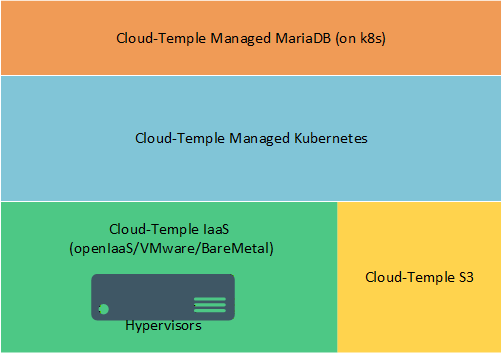
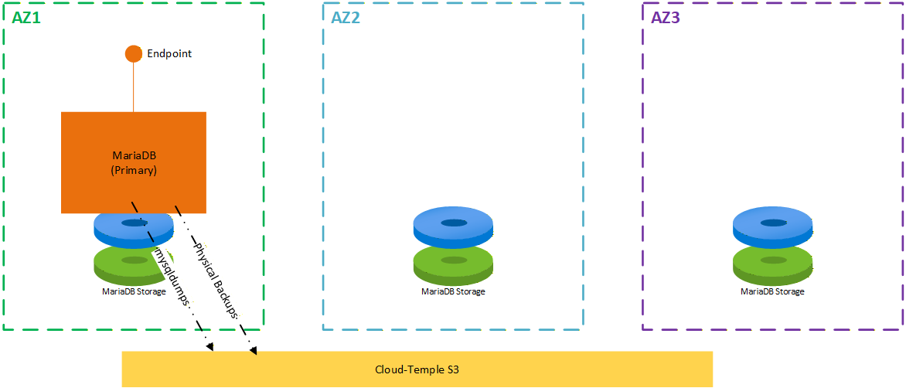
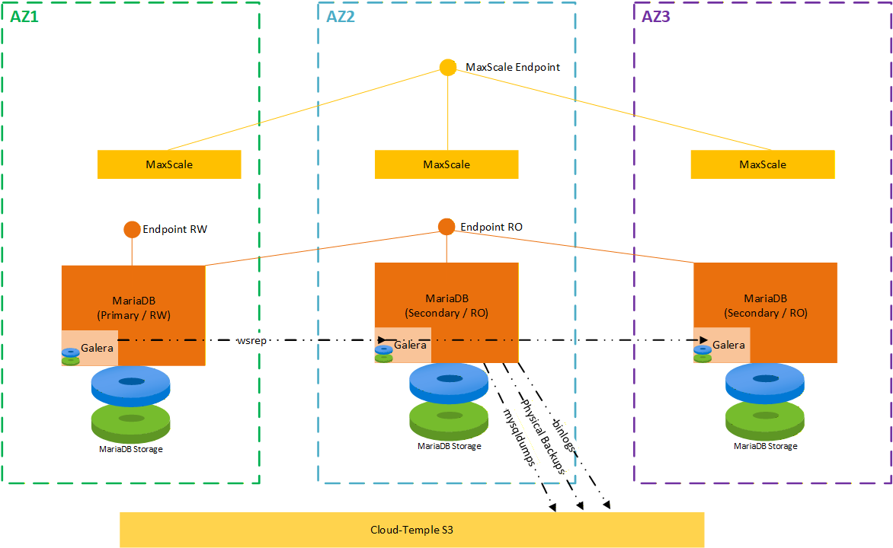

import stack from './images/stack.png'
import StandAlone from './images/StandAlone.png'
import Distributed from './images/Distributed.png'

# MariaDB Managé Preview

  

    <h3>Concepts</h3>
    
Découvrez les bases et principes essentiels pour maîtriser notre infrastructure.

    <a href="managed_mariadb/concepts" class="card-link">Explorer les concepts &rarr;</a>
  

  

    <h3>Guide de démarrage</h3>
    
Commencez rapidement en suivant des instructions claires et simples.

    <a href="managed_mariadb/quickstart" class="card-link">Lancer le Quickstart &rarr;</a>
  

---

### Aperçu
>
> Ce produit est en version préliminaire, et sa documentation peut comporter des erreurs ou des approximations.

**MariaDB Managé (on Kubernetes) by Cloud Temple** est une solution managée de moteur de base de données MariaDB, hébergée sur Kubernetes. Elle vient en complément des offres de moteur de base de données managés sur machines virtuelles (nommées ici **MariaDB Managé (on IaaS)**)

Cette offre est adaptée pour les clients qui disposent de charges de travail Kubernetes avec des bases de données MariaDB/MySQL, ou de clients qui souhaitent mutualiser de nombreux moteurs de bases de données MariaDB/PostgreSQL sur un même cluster kubernetes (mutualisation). Elle convient particulièrement bien aux bases de données de petite et moyenne dimensions ne nécessitant pas de tuning ou de fonctionnalités spécifiques. Pour les bases de grande dimension ou nécessitant un tuning particulier, il est préférable d'opter pour l'offre **MariaDB Managé (on IaaS)** qui permet plus d'adaptations par nos équipes d'experts DBA.

Les moteurs MariaDB peuvent être choisis en version 11.4 LTS ou 11.8 LTS.

Toutes les sauvegardes utilisent le stockage S3 Cloud-Temple (qualifié SNC) avec chiffrement at-rest.

### Bénéfices Clés

- **Souveraineté et Réversibilité** : La solution s'appuie exclusivement sur des standards open source pour éviter toute dépendance technologique et garantir la portabilité de vos applications.
- **Simplicité et délégation** : La solution permet de déléguer à Cloud-Temple la gestion des moteurs de bases de données, en particulier : mises à jour et sauvegardes.

## Modèles de Déploiement

Nous proposons deux modèles de déploiement pour répondre à vos besoins:  ***StandAlone*** ou ***Distributed***.

### StandAlone

Le modèle ***StandAlone*** déploie une instance unique du moteur MariaDB dans une infrastructure multi-AZ.

Le stockage utilisé par cette instance est répliqué sur 3 AZ, et permet un redémarrage automatique de l'instance MariaDB sur une autre AZ en cas de panne.

- **Cas d'usage** : Ce modèle de déploiement convient parfaitement pour les applications simples, comme des CMS, qui n'utilisent qu'un seul endpoint pour se connecter aux bases de données.
- **Points clés** :
  - 1 instance de moteur de base de données
  - stockage réparti sur 3 AZ pour une reprise automatique en cas de panne
  - sauvegardes physiques (`mariabackup`) et logiques (`mysqldump`)
  - SLA 99.9 % (hors plages de maintenance)

### Distributed

Le modèle ***Distributed*** déploie un cluster de 3 instances du moteur MariaDB, avec Galera en mode "single primary" et MaxScale:

- un endpoint MaxScale permet un routage vers les différentes instances suivant le type de requete (read ou write).
- l'instance en lecture-écriture (RW) est accessible via un endpoint spécifique.
- Les 2 instances en lecture seule (RO) sont accessibles via un autre endpoint spécifique.

Ainsi, les applicatifs peuvent au choix utiliser des connexions RW ou RO, ou laisser MaxScale router de lui même vers les endpoints les plus adaptés.

- **Cas d'usage** : Ce modèle de déploiement convient parfaitement pour les applications avec des accès distribués, comme les applications de data ou de business intelligence, qui bénéficient d'accès en lecture seule sans impact sur l'ingestion des données.
- **Points clés** :
  - 3 Instances de moteur de base de données avec Galera en mode "single primary"
  - Proxy MaxScale pour un routage efficace des requêtes.
  - stockage réparti sur 3 AZ pour une reprise automatique en cas de panne
  - sauvegardes PiTR et Logiques
  - SLA 99.9 % (hors plages de maintenance)

