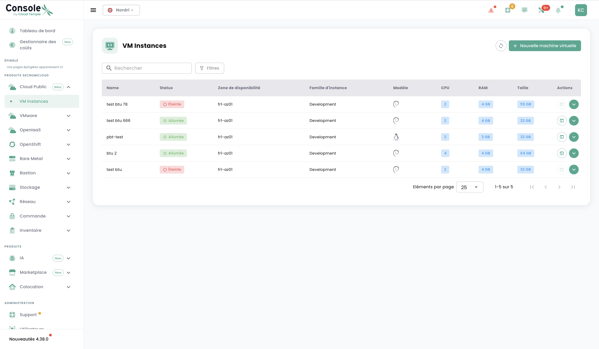

# VM Instances Preview

Le service **VM Instances** de Cloud Temple permet le déploiement rapide de machines virtuelles sur une infrastructure mutualisée et performante. Ce produit combine la souplesse du cloud public avec les garanties de sécurité d'un cloud souverain.

Elle s'adapte à tous les besoins grâce à ses différentes classes de service — du développement économique à la production critique — tout en s'intégrant nativement à l'écosystème Cloud Temple.

  

    <h3>Concepts</h3>
    
Découvrez l'architecture, les classes de service et les fonctionnalités du service VM Instances.

    <a href="/docs/public_cloud/vm_instances/concepts" class="card-link">Explorer les concepts &rarr;</a>
  

  

    <h3>Quickstart</h3>
    
Déployez votre première machine virtuelle en quelques minutes depuis la Marketplace Cloud Temple.

    <a href="/docs/public_cloud/vm_instances/quickstart" class="card-link">Lancer le Quickstart &rarr;</a>
  

  

    <h3>Tutoriels</h3>
    
Guides pratiques : créer une VM, gérer les disques, prendre des snapshots.

    <a href="/docs/public_cloud/vm_instances/tutorials" class="card-link">Voir les tutoriels &rarr;</a>
  

