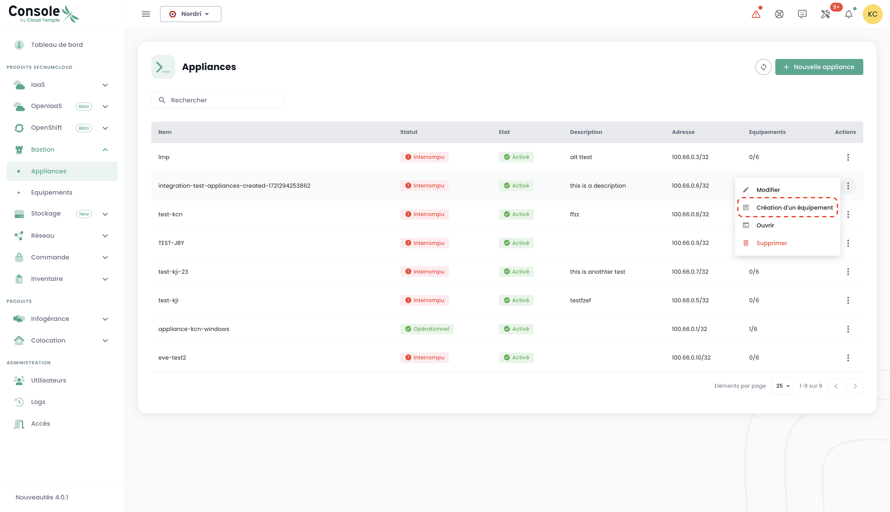

Diese Tutorials helfen Ihnen, ein Cloud-Temple-Bastion vom Shiva-Portal aus bereitzustellen und zu verwalten.

## Voraussetzungen

1. Abonnierung des Cloud-Temple-Angebots (Bastion-Appliance-Abonnement).
2. Die zu verwaltenden Geräte müssen aus dem Netzwerk zugänglich sein, in dem die Bastion-Appliance bereitgestellt wird.
3. Berechtigungen für das Bastion-Modul besitzen.
4. Im Rahmen einer On-Premises-Bereitstellung müssen die entsprechenden Flows geöffnet sein.

## Schnittstelle

Sobald Sie sich beim Shiva-Webportal angemeldet haben, gehen Sie zum Reiter "Bastion" im linken Menü.

Der Reiter „Equipements“ ermöglicht Ihnen die Anzeige der Liste Ihrer Geräte. Ein Gerät entspricht einer Konfigurationsverbindung über eine Bastion-Appliance. Für jedes Gerät werden der Name, die Tags, die Beschreibung, die zugehörige Appliance, der Verbindungstyp (SSH oder RDP), die IP des Hosts und schließlich die Tastaturkonfiguration angegeben.

Sie können die Liste Ihrer Geräte nach den ihnen zugewiesenen Tags filtern, und eine Suchmaschine ermöglicht das Suchen einer Sitzung nach ihrem Namen.

Der Reiter „Appliances“ zeigt Ihnen die Liste Ihrer Bastion-Appliances. Für jede Appliance sind der Name der Appliance und ihre Beschreibung angegeben.

Eine Suchmaschine steht zur Verfügung, um Ihnen das Suchen einer Appliance nach ihrem Namen zu ermöglichen.

## Bereitstellung einer Appliance

Bevor eine Appliance bereitgestellt werden kann, muss ein Abonnement für eine Appliance über eine Anfrage beim Support beantragt werden.

## Öffnen eines Flows zu einem Gerät

Im Reiter „Appliances“ klicken Sie auf die Aktionsleiste der Appliance, die Sie öffnen möchten. Klicken Sie anschließend auf die Schaltfläche „Ouvrir“.

Geben Sie anschließend die für die Verbindung benötigten Informationen ein:

    - Auswahl des Protokolls (SSH oder RDP);
    - IP-Adresse des zu verwaltenden Hosts;
    - Anmeldeinformationen;
    - Tastaturkonfiguration.

Klicken Sie dann auf „Connecter“, um die Appliance zu öffnen. Die Konsole der zu verwaltenden virtuellen Maschine öffnet sich dann.

## Registrieren eines Geräts

Für den regelmäßigen Zugriff auf ein zu verwaltendes Gerät ist es besser, eine Gerätekonfiguration zu erstellen, bei der Sie bei jeder Verbindung lediglich Ihren Benutzernamen und Ihr Passwort eingeben müssen.

Gehen Sie dazu zum Reiter „Equipements“ im Menü „Bastion“ und klicken Sie auf die Schaltfläche „Nouveau équipement“.

Geben Sie anschließend die für die Erstellung Ihres Geräts erforderlichen Informationen ein:

    - Name des Geräts;
    - Beschreibung;
    - Zugehörige Appliance;
    - Protokolltyp (SSH oder RDP);
    - IP-Adresse des Hosts;
    - Sprache der Tastatur.

Eine Benachrichtigung, dass die Konfiguration Ihres Geräts erstellt wurde, sollte oben rechts auf der Seite erscheinen. Die Konfiguration wird dann zur Liste Ihrer Geräte hinzugefügt.

Um eine neue Verbindung zu erstellen, können Sie auch den Reiter „Appliances“ verwenden, indem Sie auf die Aktionsleiste der Appliance klicken, der Sie eine Gerätekonfiguration zuordnen möchten.

## Verbindung zu einem Gerät herstellen

Gehen Sie zum Reiter „Equipements“ im Reiter „Bastion“. Klicken Sie auf die Aktionsleiste des Geräts, das Sie öffnen möchten, und dann auf die Schaltfläche „Ouvrir“.

Bei jeder Verbindung zum Gerät müssen Sie nur Ihre Anmeldeinformationen eingeben.

Nach Eingabe Ihrer Anmeldeinformationen erscheint eine Benachrichtigung, die den Beginn der Sitzung bestätigt, und die Konsole zu Ihrer virtuellen Maschine öffnet sich.

## Ändern einer Gerätekonfiguration

Gehen Sie zum Reiter „Equipements“ im Abschnitt „Bastion“, klicken Sie auf die Aktionsleiste des Geräts, das Sie ändern möchten, und klicken Sie auf die Schaltfläche „Modifier“.

Sie können dann den Namen des Geräts, die Beschreibung, die zugehörige Appliance, das Protokoll (SSH oder RDP), die IP-Adresse des Hosts oder die Sprache der Tastatur ändern.

## Löschen einer Gerätekonfiguration

Gehen Sie zum Reiter „Equipements“ im Abschnitt „Bastion“, klicken Sie auf die Aktionsleiste des Geräts, das Sie löschen möchten, und klicken Sie auf die Schaltfläche „Supprimer“.

