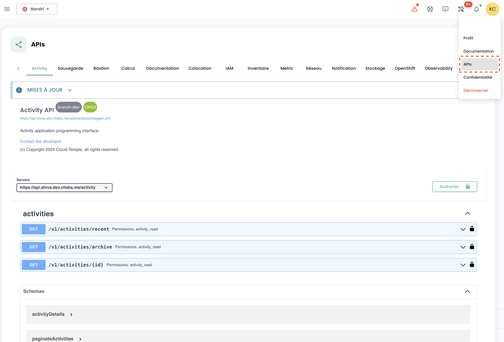

## API-Schlüssel

Der __API-Schlüssel__ ermöglicht die Authentifizierung, wenn Sie Anfragen an die API stellen möchten. Das Generieren eines API-Schlüssels, auch __Personal Access Token (PAT)__ genannt,
ist eine sichere Methode, um sich ohne grafische Benutzeroberfläche bei den Shiva-APIs anzumelden. Jeder dieser Tokens ist einem Tenant und dem Benutzer, der ihn erstellt hat, zugeordnet.

Die Erstellung dieses Tokens erfolgt über Ihr Konto. Es ist möglich, mehrere Schlüssel zu generieren und für jeden die Berechtigungen bis zu den Grenzen Ihrer Rechte zu konfigurieren.

Um einen API-Schlüssel zu erstellen, klicken Sie einfach auf __Ihr Profil__ :


Im Profilmenü klicken Sie auf __'Persönlicher Zugriffstoken'__


Auf dem Bildschirm sehen Sie nun alle API-Schlüssel, die für diesen Benutzer in diesem Tenant erstellt wurden. Klicken Sie auf __'Neuer persönlicher Zugriffstoken'__


Sie müssen nun:

- Den Namen dieses neuen Tokens angeben,
- Ein Ablaufdatum angeben (maximal 12 Monate Gültigkeit),
- Die dem Token zugeordneten Berechtigungen auswählen.

Die Details zu Ihrem Token werden dann angezeigt. __Achtung, nachträglich ist ein Zugriff nicht mehr möglich.__

Sollten Sie diese Informationen nicht notieren, müssen Sie den Token zerstören und neu erstellen.


Aus Sicherheitsgründen wird empfohlen, mehrere Tokens zu erstellen, die jeweils eine spezifische Funktion haben (ein Token für jede Anwendung oder jeden Geschäftsprozess), anstatt einen einzigen Token mit allen Rechten zu erstellen.

Anschließend sehen Sie den neu erstellten Token und sein zukünftiges Ablaufdatum.


## Zugriff auf das API-Portal

Die OpenAPI 3.0 (Swagger)-Dokumentation der APIs der Cloud Temple-Konsole ist direkt in der Anwendung verfügbar:



Der Zugang zu den APIs erfordert eine Authentifizierung. Sobald Sie authentifiziert sind, müssen alle Operationen den Header
__'Authorization'__ mit dem Bearer Access Token enthalten, das während der Authentifizierungsphase erhalten wurde.

Die URL der Zugriffspunkte wird direkt in __Swagger__ angegeben (im "Servers"-Objekt jeder API-Seite).

## Die Aktivitäten

Die Überwachung von Schreibanfragen (POST, PUT, PATCH, DELETE) erfolgt durch das Aktivitätsmanagement. Jede Anfrage dieser Art erzeugt automatisch eine zugehörige Aktivität. Ein HTTP-Statuscode 201 bestätigt die erfolgreiche Erstellung der Aktivität. Die eindeutige Kennung dieser Aktivität wird in den Antwort-Headern unter dem Schlüssel 'Location' zurückgegeben.


Sobald Sie die Kennung erhalten haben, ist es möglich, die Details der Aktivität über die API des Activity-Moduls abzurufen:


Der Inhalt der Aktivität enthält alle wesentlichen Informationen zur Identifizierung des Vorgangs, das Ausführungsdatum sowie den Fortschrittsstatus. Hier ist das Modell einer Aktivität:

```
    {
    "tenantId": "UUIDV4",
    "description": "STRING",
    "type": "ComputeActivity" | "BackupActivity" | "IAMActivity" | "TagActivity" | "RTMSActivity" | "BastionActivity" | "SupportActivity",
    "tags": "STRING[]",
    "initiator": "UUIDV4",
    "concernedItems": [
        {
        "type": "string",
        "id": "string"
        }
    ],
    "id": "UUIDV4",
    "creationDate": "DATE",
    "operationType": "read" | "write",
    "state": "CompletedState | RunningState | WaitingState | FailedState"
}
```

Das Objekt **state** kann je nach Status der Aktivität verschiedene Formen annehmen, nämlich:

**waiting**, Zustand bevor der Vorgang begonnen hat:
```
    waiting: {}
```
**running**, Zustand während der Vorgang läuft:
```
    running: {
    status: string;
    startDate: Date;
    progression: number;
    };
```
**failed**, Zustand, wenn der Vorgang fehlgeschlagen ist:
```
    failed: {
    startDate: Date;
    stopDate: Date;
    reason: string;
    };
```
**completed**, Zustand, wenn der Vorgang abgeschlossen ist:
```
    completed: {
    startDate: Date;
    stopDate: Date;
    result: string;
    };
```

**Hinweis: Die Kennung (UUIDv4) der erstellten Ressource ist im Ergebnis der Aktivität verfügbar, sobald diese abgeschlossen ist.**

## API-Limits

### Warum Limits?

Die Cloud Temple-Konsole setzt __Obergrenzen für das Volumen der Anfragen__, die ein Benutzer innerhalb eines bestimmten Zeitraums
an die API senden kann. Die Einführung dieser Frequenzlimits ist eine gängige Maßnahme im API-Management, die aus mehreren wichtigen Gründen ergriffen wird:

- **Missbrauchsverhinderung**: Diese Limits tragen zur Wahrung der Integrität der API bei, indem sie missbräuchliche oder unbeabsichtigte Nutzungen verhindern, die ihren Betrieb gefährden könnten.
- **Qualitätssicherung**: Durch die Regulierung des API-Zugriffs sorgen wir für eine faire Verteilung der Ressourcen, sodass alle Benutzer eine stabile und leistungsstarke Erfahrung genießen können.

Nehmen wir ein schlecht konzipiertes oder ineffizientes Skript als Beispiel, das wiederholt API-Aufrufe tätigt und so die Ressourcen überlastet und die Leistung beeinträchtigt. Durch die Festlegung von Anfragelimiten verhindern wir solche Situationen und sichern den __reibungslosen und unterbrechungsfreien Service__ für alle unsere Kunden.

### Was sind die Rate-Limits für die API der Cloud Temple-Konsole?

Wir setzen quantitative Beschränkungen für die Interaktionen der Benutzer mit der Konsole für jedes Produkt durch.

Die Limits werden in __Anfragen pro Sekunde (r/s) und pro Quell-IP__ definiert. Sobald die Grenze überschritten wird, antwortet das System
mit einem HTTP-Fehlercode 429, der anzeigt, dass die zulässige Anfragerate überschritten wurde.

Hier sind die festgelegten Limits:

| Produkt              | Grenzwert    |
|----------------------|--------------|
| Cloud Temple Console | 60 r/s       |
| Identity (IAM)       | 60 r/s       |
| IaaS - Compute       | 60 r/s       |
| IaaS - Storage       | 20 r/s       |
| IaaS - Backup        | 60 r/s       |
| PaaS - S3            | 60 r/s       |
| PaaS - Openshift     | 60 r/s       |
| Netzwerk             | 60 r/s       |
| Hosting              | 60 r/s       |

### Wie funktionieren die Rate-Limits?

Wenn die Anzahl der Anfragen an einen API-Endpunkt das erlaubte Limit überschreitet, reagiert der API-Endpunkt, indem er
__einen HTTP-Antwortcode 429__ zurückgibt. Dieser Code zeigt an, dass der Benutzer die zulässige Anfragerate überschritten hat.
Wenn dies geschieht, liefert der API-Endpunkt auch ein JSON-Objekt als Antwort,
das detaillierte Informationen zur angewendeten Begrenzung enthält:
```
    {
        "error": {
            "status": "429 Too Many Requests",
            "message": "Too Many Requests"
        }
    }
```
### Wie kann man zu viele Anfragen vermeiden?

Es wird empfohlen, die Anzahl der API-Aufrufe, die durch Ihre Automatisierung durchgeführt werden, zu begrenzen, damit Sie unterhalb
des festgelegten Rate-Limits für den Endpunkt bleiben.

Diese Situation tritt häufig auf, wenn mehrere Anfragen parallel ausgeführt werden,
mittels mehrerer Prozesse oder Threads.

Es gibt mehrere Möglichkeiten, die Effizienz Ihrer Automatisierung zu verbessern, unter anderem durch den Einsatz von Mechanismen
zum __Caching__ und die Implementierung eines __Replay-Systems mit progressiver Dämpfung__. Diese Methode besteht darin,
eine kurze Pause einzulegen, wenn auf ein Rate-Limit-Fehler gestoßen wird, und dann die Anfrage erneut zu versuchen.
Schlägt die Anfrage erneut fehl, wird die Dauer der Pause nach und nach verlängert, bis die Anfrage erfolgreich ist
oder eine maximale Anzahl von Wiederholversuchen erreicht ist.

Diese Vorgehensweise hat viele Vorteile:

- __Progressive Dämpfung__ stellt sicher, dass die ersten Versuche schnell wiederholt werden, während längere Pausen bei wiederholtem Fehlschlag vorgesehen sind.
- Die Hinzufügung einer __zufälligen Variation__ zur Pause trägt dazu bei, zu verhindern, dass alle Versuche gleichzeitig stattfinden.

Es ist wichtig zu beachten, dass __fehlgeschlagene Anfragen Ihr Rate-Limit nicht beeinflussen__.
Das kontinuierliche Senden einer Anfrage könnte jedoch auf lange Sicht keine tragfähige Lösung sein,
da dieses Verhalten zukünftig geändert werden könnte. Daher empfehlen wir, nicht ausschließlich auf diesen Mechanismus zu vertrauen.

Die Bibliotheken __[Backoff](https://pypi.org/project/backoff/)__ und __[Tenacity](https://pypi.org/project/tenacity/)__ in Python
sind gute Ausgangspunkte für die Implementierung von Dämpfungsstrategien.

## Lebenszyklus eines API-Endpunkts

Die Informationen zur Entwicklung der API-Endpunkte sind in den Release-Notes verfügbar:


Sie finden die Liste der Endpunkte, die Aktivität für Aktivität abgekündigt werden.

Darüber hinaus erscheinen die abgekündigten Endpunkte auf unseren APIs folgendermaßen:
__~~this/is/an/endpoint~~__ sowie ein endgültiges Löschungsdatum in der Beschreibung.