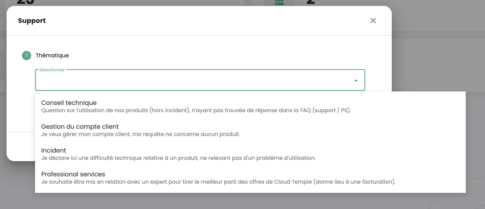

## Voraussetzungen
- Ein Cloud Temple-Angebot abonniert haben. Um einfach zu abonnieren, können Sie [uns kontaktieren](https://www.cloud-temple.com/contactez-nous/) oder per E-Mail an die Adresse __contact@cloud-temple.com__.
- Zugang zur Shiva-Konsole haben
- Ihre öffentliche IPv4 in der Cloud Temple-Vertrauenszone deklariert haben (der Zugang zur Shiva-Konsole ist auf identifizierte vertrauenswürdige Adressen beschränkt)

## Verbindung zu Ihrem Cloud Temple-Tenant
Shiva ist über die unten stehende URL zugänglich:
    https://shiva.cloud-temple.com
    Oder über die direkte URL, die Ihnen per E-Mail mitgeteilt wurde.

Auf der ersten Seite können Sie die [Organisation](iam/concepts.md#organisations) auswählen, in der Ihr Benutzer erstellt wurde.
Sobald die Firma angegeben ist, klicken Sie bitte auf __'Verbinden'__.

Sie werden dann auf eine Seite weitergeleitet, die Sie zur Authentifizierung auffordert.
Nach der Anmeldung gelangen Sie auf diese Seite.

## Sprachverwaltung
Die Konsole ist in __Französisch__, __Englisch__ verfügbar. Sie können die Betriebssprache über das __Sprach__-Symbol oben rechts im Bildschirm ändern.

Die Sprachänderung eines Benutzers erfolgt in seinem __'Profil'__, oben rechts im Bildschirm, in den __'Benutzereinstellungen'__.

Die Konfiguration erfolgt für jeden Tenant [Tenant](iam/concepts.md#tenant).

## Zugang zum technischen Support

Jederzeit können Sie das __Cloud Temple-Supportteam__ über das __'Rettungsring'-Symbol__ oben rechts im Bildschirm kontaktieren.

Sie werden während des gesamten Supportanfrage-Prozesses geleitet.

Der erste Schritt besteht darin, den Typ der Supportanfrage zu identifizieren:

- Rat zur Nutzung eines Produkts einholen (außerhalb von Zwischenfällen),
- Hilfe bezüglich Ihres Kundenkontos anfordern,
- Einen Zwischenfall melden oder technischen Support anfordern.
- Hilfe von einem professionellen Service anfordern (Bereitstellung eines Cloud Temple-Ingenieurs für ein Problem).

Anschließend haben Sie die Möglichkeit, weitere Details anzugeben und Dateien (z.B. Bilder oder Protokolle) beizufügen.

Der Auftraggeber kann im Ticketbeschreibung auch einen Kritikalitätsgrad (P1 bis P4) angeben. Bei einem Zwischenfall, beispielsweise:

**KRITISCH (P1)**:

- Verdacht auf Leckage sensibler Daten
- Erkennung eines unbefugten Zugriffs auf Ihre Daten
- Kompromittierung Ihrer Verwaltungsanmeldeinformationen
- Totale Unverfügbarkeit Ihrer kritischen Dienste
- Abnormales Verhalten bei sensiblen Daten
- Verletzung personenbezogener Daten

**HOCH (P2)**:

- Fehlfunktion der Benutzerzugriffe
- Anomalie bei der Verschlüsselung Ihrer Daten
- Verlust des Zugangs zu bestimmten kritischen Funktionen
- Inkonsistenzen in den Daten
- Große Verzögerungen, die die Aktivität beeinträchtigen

**MITTEL (P3)**:

- Lokalisierte Leistungsprobleme
- Zwischenfall bei einer nicht-kritischen Funktion
- Konfigurationsfehler mit begrenztem Einfluss
- Gelegentliche Zugangsschwierigkeiten

**NIEDRIG (P4)**:

- Anfrage zur Untersuchung
- Anomalie ohne direkten Einfluss
- Frage zur Konformität
- Bedarf an technischer Klarstellung

Sobald Ihre Anfrage gemacht wurde, ist es möglich, Ihre Anfragen über das __'Rettungsring'-Symbol__ oben rechts im Bildschirm zu finden:

## Zugang zu Benutzerfunktionen über die Webschnittstelle

Alle Ihrem Benutzer zugänglichen Funktionen (je nach seinen Rechten) befinden sich links auf dem Bildschirm im grünen Banner.
Die Funktionen sind in Module gruppiert. Dies umfasst hauptsächlich:

- Das __Inventar__ Ihrer Ressourcen,
- Die __Überwachung der Operationen__,
- Die __Verwaltung der IaaS-Ressourcen__ (Berechnung, Speicherung, Netzwerk, ...)
- Die __Verwaltung der OpenIaaS-Ressourcen__ (Berechnung, Speicherung, Netzwerk, ...)
- Zugang zu __zusätzlichen Diensten__ (Bastion, Überwachung, ...)
- Die __Verwaltung Ihrer Organisation__ (Verwaltung der Tenants, Rechte, ...)

Die Aktivierung eines Moduls für einen Benutzer hängt von den Rechten des Benutzers ab. Zum Beispiel wird das Modul __'Bestellung'__ nicht verfügbar sein, wenn der Benutzer nicht das Recht __'ORDER'__ hat.

Hier ist eine Präsentation der verschiedenen verfügbaren Module. Neue Module bereichern regelmäßig die Konsole:

- __Dashboard__: bietet einen schnellen Überblick über __die Gesamtressourcen für Berechnungen und Speicherung__, die Statistiken der __Sicherung__ und eine __Zusammenfassung der Supporttickets__,
- __Inventar__: bietet eine Ansicht aller Ihrer Ressourcen des Typs __'virtuelle Maschinen'__. Wenn __Tags__ verwendet werden, bietet es eine Ansicht nach __Tag__ (z.B. Geschäftsansicht, Anwendungsansicht, ...),
- __IT-Management__: bietet Zugang zur Überwachung Ihrer __Supportanfragen__ und zur __Messung der Dienste__,
- __IaaS__: ermöglicht die __Verwaltung der VMware-IaaS-Infrastrukturen__ (virtuelle Maschinen, Cluster, Hypervisoren, Replikationen, Sicherung, ...),
- __OpenIaaS__: ermöglicht die __Verwaltung der Xen Orchestra-Ressourcen__ (virtuelle Maschinen, Sicherung, ...),
- __OpenShift__: erlaubt das Management Ihrer **RedHat Openshift-PaaS-Architektur** und das Management Ihrer Container in den 3 Verfügbarkeitszonen der Plattform.
- __Bastion__: erlaubt die Bereitstellung und Verwaltung von SSH/RDP Bastion-Appliances in Ihren Netzwerken,
- __Netzwerk__: erlaubt die Verwaltung der __Netzwerke der Ebenen 2 und 3__, der __öffentlichen IPs__ und Ihrer __Telekommunikationskreisläufe__,
- __Colocation__: bietet die Ansicht der Geräte, die sich in einem __gemeinsamen oder dedizierten Colocation-Bereich__ befinden,
- __Bestellung__: erlaubt die Bestellung von Ressourcen und die Überwachung von Bereitstellungen,
- __Verwaltung__: umfasst die Verwaltungsfunktionen der Benutzer und Tenants sowie den Zugang zur Gesamtprotokollierung.

Die Piktogramme __'NEW'__ bedeuten, dass das betreffende Produkt bereitgestellt wurde, aber noch nicht als __SecNumCloud-Angebot__ qualifiziert ist, und __'BETA'__ bedeuten, dass das betreffende Produkt bereitgestellt wurde und gerade als __SecNumCloud-Angebot__ qualifiziert wurde.

**Protokollierung - Aktivitätsverfolgung**
==========================================

Die Aktivitätsseite soll eine vollständige Sicht auf alle Lese- und Schreiboperationen innerhalb der Konsole bieten und dadurch eine erhöhte Rückverfolgbarkeit und Sicherheit gewährleisten. Sie hebt die beiden Hauptregisterkarten hervor: Kürzliche und Archivierte.

### **Struktur der Seite**

#### **Registerkarten**
	+ **Kürzliche**
		- Kürzliche Operationen
	- Echtzeitverfolgung
	+ **Archivierte**
		- Operationen über einen längeren Zeitraum
		- Archivierte Operationen zur Rückverfolgbarkeit und Konformität
#### **Angezeigte Informationen**
	+ Datum und Uhrzeit
	+ Art der Operation
	+ Zustand
	+ Benutzer
	+ Beschreibung der Operation
#### **Funktionalität**
	+ Suche/Filterung für spezifische Operationen

### **Nutzung**
* **Zugang:** Berechtigung `activity_read`
* **Navigation:**
	- Wählen Sie die Registerkarte "Kürzliche" für Echtzeitoperationen.
	- Wählen Sie "Archivierte", um das Historische anzuzeigen.
	- Nutzen Sie die Such- und Filterfunktionen, um spezifische Operationen zu finden.

#### **Konformitätshinweis**
Gemäß der SecNumCloud-Qualifizierung werden die Ereignisse in der Cloud Temple-Konsole mindestens **6 Monate** lang gespeichert, wodurch die Einhaltung der Sicherheits- und Nachverfolgbarkeitsanforderungen gewährleistet wird.

## Zugang zu Benutzerfunktionen über die API

Der Zugang zu allen Funktionen der Shiva-Konsole ist über die Shiva-API möglich. Sie können die Details der Verben und Konfigurationen über __'Profil'__ und __'APIs'__ einsehen:

## Terraform-Provider

Cloud Temple stellt Ihnen einen Terraform-Provider zur Verfügung, um Ihre Cloud-Plattform *"als Code"* zu verwalten. Er ist hier verfügbar:

https://registry.terraform.io/providers/Cloud-Temple/cloudtemple/latest