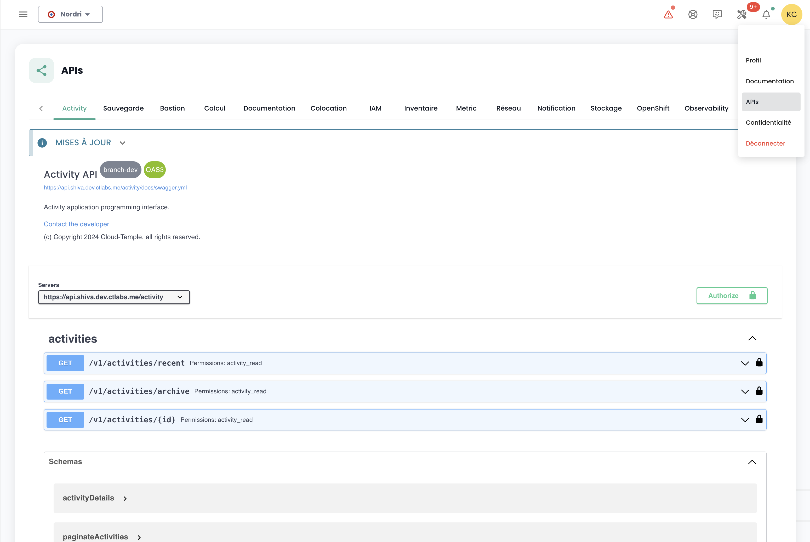

## Voraussetzungen
- Ein Abonnement für ein Cloud Temple-Angebot haben. Um sich einfach anzumelden, können Sie [uns kontaktieren](https://www.cloud-temple.com/contactez-nous/) oder per E-Mail an __contact@cloud-temple.com__.
- Zugang zur Shivakonsole haben.
- Eigene öffentliche IPv4-Adresse im Cloud Temple Vertrauensbereich registrieren (der Zugang zur Shiva-Konsole ist auf identifizierte Vertrauensadressen beschränkt).

## Verbindung zu Ihrem Cloud Temple Tenant
Shiva ist über die folgende URL zugänglich:
    https://shiva.cloud-temple.com
    Oder über die direkte URL, die Ihnen per E-Mail mitgeteilt wurde.

Auf der ersten Seite können Sie die [Organisation](iam/concepts.md#organisations) auswählen, in der Ihr Benutzer erstellt wurde.
Nachdem das Unternehmen ausgewählt wurde, klicken Sie bitte auf __'Se connecter'__.

Sie werden dann auf eine Seite weitergeleitet, auf der Sie aufgefordert werden, sich zu authentifizieren.
Nach dem Einloggen gelangen Sie auf diese Seite.

## Sprachverwaltung
Die Konsole ist in __französisch__, __englisch__ verfügbar. Sie können die Sprache über das __Sprach__-Symbol oben rechts auf dem Bildschirm ändern.

Die Sprachänderung eines Benutzers erfolgt in seinem __'Profil'__, oben rechts auf dem Bildschirm, in den __'Benutzereinstellungen'__.

Die Konfiguration erfolgt für jeden Tenant [Tenant](iam/concepts.md#tenant).

## Zugang zum technischen Support

Sie können jederzeit das __Cloud Temple Support-Team__ über das __'Rettungsring'-Symbol__ oben rechts auf dem Bildschirm kontaktieren.

Sie werden während des gesamten Support-Anfrageprozesses geführt.

Der erste Schritt ist die Identifizierung des Typs der Support-Anfrage:

- Beratung zur Nutzung eines Produkts anfordern (außerhalb eines Vorfalls),
- Unterstützung im Zusammenhang mit Ihrem Kundenkonto anfordern,
- Einen Vorfall melden oder technischen Support anfordern.
- Unterstützung durch einen professionellen Service anfordern (Bereitstellung eines Cloud Temple-Ingenieurs für ein bestimmtes Problem).

Sie haben dann die Möglichkeit, Details anzugeben und Dateien hochzuladen (z.B. Bilder oder Protokolle).

Der Anfragesteller kann auch einen Schweregrad (P1 bis P4) in der Ticketbeschreibung angeben, im Falle eines Vorfalls, wie:

**KRITISCH (P1)**:

- Verdacht auf Leckage sensibler Daten
- Erkennung eines unbefugten Zugriffs auf Ihre Daten
- Kompromittierung Ihrer Administrations-Anmeldedaten
- Totale Unverfügbarkeit Ihrer kritischen Dienste
- Ungewöhnliches Verhalten bei sensiblen Daten
- Verletzung personenbezogener Daten

**HOCH (P2)**:

- Fehlfunktion der Benutzerzugänge
- Anomalie bei der Verschlüsselung Ihrer Daten
- Verlust des Zugangs zu bestimmten kritischen Funktionen
- Dateninkonsistenzen
- Schwerwiegende Verlangsamungen, die die Aktivität beeinträchtigen

**MITTEL (P3)**:

- Lokalisierte Leistungsprobleme
- Vorfall bei einer nicht kritischen Funktion
- Konfigurationsfehler mit begrenzten Auswirkungen
- Temporäre Zugangsschwierigkeiten

**NIEDRIG (P4)**:

- Untersuchungsanforderung
- Anomalie ohne direkte Auswirkungen
- Compliance-Frage
- Bedarf an technischer Klärung

Nach Ihrer Anfrage können Sie Ihre Anfragen über das __'Rettungsring'-Symbol__ oben rechts auf dem Bildschirm verfolgen:

## Zugang zu Benutzerfunktionen über die Weboberfläche

Alle für Ihren Benutzer zugänglichen Funktionen (abhängig von seinen Rechten) befinden sich auf der linken Seite des Bildschirms im grünen Banner.
Die Funktionen sind nach Modulen gruppiert. Dies umfasst hauptsächlich:

- Das __Inventar__ Ihrer Ressourcen,
- Die __Überwachung der Operationen__,
- Das __Management der IaaS-Ressourcen__ (Rechen, Speicher, Netzwerk, ...),
- Das __Management der OpenIaaS-Ressourcen__ (Rechen, Speicher, Netzwerk, ...),
- Der Zugang zu __zusätzlichen Diensten__ (Bastion, Überwachung, ...),
- Die __Verwaltung Ihrer Organisation__ (Management der Tenants, Rechte, ...).

Die Aktivierung eines Moduls für einen Benutzer hängt von den Rechten des Benutzers ab. Zum Beispiel wird das Modul __'Bestellung'__ nicht verfügbar sein, wenn der Benutzer nicht das Recht __'ORDER'__ besitzt.

Hier ist eine Präsentation der verschiedenen verfügbaren Module. Regelmäßig kommen neue Module hinzu:

- __Dashboard__: bietet einen schnellen Überblick über __Gesamtrechen- und Speicherressourcen__, __Sicherung__-Statistiken und eine __Zusammenfassung der Support-Anfragen__,
- __Inventar__: ermöglicht eine Übersicht über alle Ihre __'virtuellen Maschinen'__. Wenn __Tags__ verwendet werden, ermöglicht es eine Ansicht nach __Tag__ (z.B. Geschäftsansicht, Anwendungsansicht, ...),
- __Outsourcing__: bietet Zugang zur Verfolgung Ihrer __Support-Anfragen__ und zur __Metrik der Dienste__,
- __IaaS__: ermöglicht das __Management der VMware IaaS-Infrastrukturen__ (Virtuelle Maschinen, Cluster, Hypervisoren, Replikationen, Sicherung, ...),
- __OpenIaaS__: ermöglicht das __Management der Xen Orchestra-Ressourcen__ (Virtuelle Maschinen, Sicherung, ...),
- __OpenShift__: ermöglicht das Management Ihrer **RedHat Openshift PaaS-Architektur** und die Verwaltung Ihrer Container in den 3 Verfügbarkeitszonen der Plattform.
- __Bastion__: Ermöglicht die Bereitstellung und das Management von SSH/RDP Bastion Appliances in Ihren Netzwerken,
- __Netzwerk__: ermöglicht das Management von __Layer 2 und Layer 3 Netzwerken__, __öffentlichen IP-Adressen__ und Ihren __Telekommunikationsverbindungen__,
- __Colocation__: bietet eine Übersicht über die Geräte in gemeinsamen oder dedizierten __Colocation-Bereichen__,
- __Bestellung__: Ermöglicht die Bestellung von Ressourcen und die Verfolgung der Bereitstellungen,
- __Verwaltung__: umfasst die Funktionen zur Verwaltung von Benutzern und Tenants sowie den Zugang zur globalen Protokollierung.

Die Piktogramme __'NEW'__ bedeuten, dass das betreffende Produkt bereitgestellt wurde, aber noch nicht als __SecNumCloud-Angebot__ qualifiziert ist, und __'BETA'__ bedeuten, dass das betreffende Produkt bereitgestellt wurde und gerade als __SecNumCloud-Angebot__ qualifiziert wurde.

## Zugang zu Benutzerfunktionen über die API

Der Zugriff auf alle Funktionen der Shiva-Konsole ist über die Shiva-API möglich. Sie können die Details der Verben und Konfigurationen über __'Profil'__ und __'APIs'__ einsehen:

## Terraform Provider

Cloud Temple stellt Ihnen einen Terraform-Provider zur Verfügung, um Ihre Cloud-Plattform „as code“ zu steuern. Es ist hier zugänglich:

https://registry.terraform.io/providers/Cloud-Temple/cloudtemple/latest