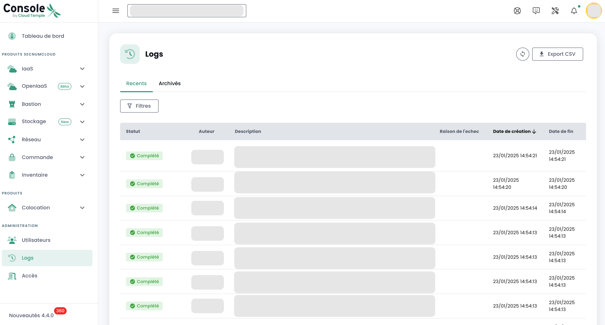

## Voraussetzungen
- Ein Cloud Temple Angebot abonniert haben. Um einfach zu abonnieren, können Sie [uns kontaktieren](https://www.cloud-temple.com/contactez-nous/) oder per E-Mail an __contact@cloud-temple.com__.
- Zugang zur Shiva-Konsole haben
- Ihre öffentliche IPv4-Adresse in der Cloud Temple-Vertrauenszone registriert haben (der Zugriff auf die Shiva-Konsole ist auf vertrauenswürdige Adressen beschränkt)

## Verbindung zu Ihrem Cloud Temple Tenant
Shiva ist über die unten stehende URL zugänglich:
    https://shiva.cloud-temple.com
    Oder über die direkte URL, die Ihnen per E-Mail mitgeteilt wurde.

Die erste Seite ermöglicht Ihnen die Auswahl der [Organisation](iam/concepts.md#organisations), in der Ihr Benutzer erstellt wurde.
Sobald das Unternehmen angegeben ist, klicken Sie bitte auf __'Se connecter'__.

Sie werden auf eine Seite weitergeleitet, die Sie zur Authentifizierung auffordert.
Nach der Anmeldung gelangen Sie auf diese Seite.

## Spracheinstellungen
Die Konsole ist in __Französisch__, __Englisch__ verfügbar. Sie können die Sprache über das __Sprach-Symbol__ oben rechts auf dem Bildschirm ändern.

Das Ändern der Sprache eines Benutzers erfolgt in seinem __'Profil'__, oben rechts auf dem Bildschirm, in den __'Benutzereinstellungen'__.

Die Konfiguration wird für jeden [Tenant](iam/concepts.md#tenant) getrennt durchgeführt.

## Zugriff auf den technischen Support

Sie können jederzeit __das Cloud Temple Supportteam__ über das __'Rettungsring-Symbol'__ oben rechts auf dem Bildschirm kontaktieren.

Sie werden während des gesamten Supportanforderungsprozesses geführt.

Der erste Schritt besteht darin, den Supportanfragetyp zu identifizieren:

- Beratung zur Nutzung eines Produkts anfordern (außerhalb von Störungen),
- Unterstützung im Zusammenhang mit Ihrem Kundenkonto anfordern,
- Eine Störung melden oder technischen Support anfordern,
- Unterstützung eines professionellen Dienstes anfordern (Bereitstellung eines Cloud Temple-Ingenieurs bei einem Problem).

Sie haben anschließend die Möglichkeit, Details anzugeben und Dateien anzuhängen (z.B. Bilder oder Protokolle).

Der Anforderer kann auch einen Kritikalitätsgrad (P1 bis P4) in der Beschreibung des Tickets angeben, im Falle einer Störung, wie z.B.:

**KRITISCH (P1)**:

- Verdacht auf Verlust sensibler Daten
- Erkennung eines unautorisierten Zugriffs auf Ihre Daten
- Kompromittierung Ihrer Administrationsanmeldeinformationen
- Totale Unverfügbarkeit Ihrer kritischen Dienste
- Abnormale Verhaltensweisen bei sensiblen Daten
- Verletzung personenbezogener Daten

**HOCH (P2)**:

- Fehlerhafte Benutzerzugriffe
- Anomalie bei der Verschlüsselung Ihrer Daten
- Verlust des Zugangs zu einigen kritischen Funktionen
- Dateninkonsistenz
- Erhebliche Verlangsamungen, die die Aktivität beeinträchtigen

**MITTEL (P3)**:

- Lokalisierte Leistungsprobleme
- Vorfall bei einer nicht kritischen Funktion
- Konfigurationsfehler mit begrenztem Einfluss
- Gelegentliche Zugangsprobleme

**NIEDRIG (P4)**:

- Untersuchung anfordern
- Anomalie ohne direkten Einfluss
- Konformitätsfrage
- Bedarf an technischer Klärung

Nachdem Ihre Anfrage eingereicht wurde, können Sie Ihre Anforderungen über das __'Rettungsring-Symbol'__ oben rechts auf dem Bildschirm einsehen:

## Zugriff auf Benutzerfunktionen über die Web-Oberfläche

Alle Ihrem Benutzer zugänglichen Funktionen (je nach seinen Rechten) befinden sich links auf dem Bildschirm, im grünen Banner.
Die Funktionen sind nach Modulen gruppiert. Dies umfasst hauptsächlich:

- Das __Inventar__ Ihrer Ressourcen,
- Die __Verfolgung der Operationen__,
- Die __Steuerung der IaaS-Ressourcen__ (Rechenleistung, Speicher, Netzwerk, ...)
- Die __Steuerung der OpenIaaS-Ressourcen__ (Rechenleistung, Speicher, Netzwerk, ...)
- Zugang zu __zusätzlichen Diensten__ (Bastion, Monitoring, ...)
- Die __Verwaltung Ihrer Organisation__ (Tenant-Verwaltung, Rechteverwaltung, ...)

Die Aktivierung eines Moduls für einen Benutzer hängt von den Rechten des Benutzers ab. Zum Beispiel wird das Modul __'Bestellung'__ nicht verfügbar sein, wenn der Benutzer nicht das Recht __'ORDER'__ besitzt.

Hier finden Sie eine Übersicht der verschiedenen verfügbaren Module. Neue Module werden regelmäßig hinzugefügt:

- __Dashboard__ : bietet einen schnellen Überblick über die __Gesamtmenge der Rechen- und Speicherressourcen__, die Statistiken der __Sicherung__ und eine __Zusammenfassung der Supportfälle__,
- __Inventar__ : bietet eine Übersicht über alle Ihre Ressourcen vom Typ __'virtuelle Maschinen'__. Wenn __Tags__ verwendet werden, ermöglicht es die Ansicht nach __Tag__ (z.B. Geschäftsansicht, Anwendungsansicht, ...),
- __Infogérance__ : gewährt Zugriff auf die Verfolgung Ihrer __Supportanfragen__ und auf die __Dienstmetriken__,
- __IaaS__ : ermöglicht die __Steuerung der VMware IaaS-Infrastrukturen__ (Virtuelle Maschinen, Cluster, Hypervisoren, Replikationen, Sicherungen, ...),
- __OpenIaaS__ : ermöglicht die __Steuerung der Xen Orchestra Ressourcen__ (Virtuelle Maschinen, Sicherungen, ...),
- __OpenShift__ : ermöglicht die Steuerung Ihrer **RedHat Openshift PaaS-Architektur** und das Management Ihrer Container in den 3 Verfügbarkeitszonen der Plattform.
- __Bastion__ : Ermöglicht die Bereitstellung und Steuerung von SSH/RDP-Bastion Appliances in Ihren Netzwerken,
- __Netzwerk__ : ermöglicht die Steuerung der __Netzwerke der Ebenen 2 und 3__, der __öffentlichen IP-Adressen__ und Ihrer __Telekommunikationskreise__,
- __Colocation__ : bietet einen Überblick über die Geräte, die in der __gemeinsamen oder dedizierten Colocation Zone__ platziert sind,
- __Bestellung__ : ermöglicht die Bestellung von Ressourcen und die Verfolgung der Bereitstellungen,
- __Verwaltung__ : fasst die Verwaltungsfunktionen der Benutzer und Tenants sowie den Zugang zu globalen Protokollen zusammen.

Die Piktogramme __'NEW'__ bedeuten, dass das betreffende Produkt bereitgestellt wurde, aber noch nicht als __SecNumCloud-Angebot__ qualifiziert ist, und __'BETA'__ bedeuten, dass das betreffende Produkt bereitgestellt wurde und als __SecNumCloud-Angebot__ qualifiziert wurde.

**Protokollierung - Aktivitätsverfolgung**
=====================================

Die Aktivitätsseite soll eine vollständige Übersicht über alle Lese- und Schreibvorgänge in der Konsole bieten, um so eine erhöhte Nachverfolgbarkeit und Sicherheit zu gewährleisten. Sie hebt die beiden Hauptregisterkarten hervor: Kürzlich und Archiviert.

### **Seitenstruktur**

#### **Registerkarten**
	+ **Kürzlich**
		- Kürzliche Vorgänge
		- Echtzeit-Verfolgung
	+ **Archiviert**
		- Vorgänge über einen längeren Zeitraum
		- Archivierte Vorgänge zur Nachverfolgbarkeit und Konformität
#### **Angezeigte Informationen**
	+ Datum und Uhrzeit
	+ Vorgangstyp
    + Der Status
	+ Benutzer
	+ Beschreibung des Vorgangs
#### **Funktionalität**
	+ Suche/Filter für spezifische Vorgänge

### **Verwendung**

* **Zugang :** Berechtigung `activity_read`
* **Navigation :**
	- Wählen Sie die Registerkarte "Kürzlich" für Echtzeitvorgänge.
	- Wählen Sie "Archiviert", um die Historie zu durchsuchen.
	- Nutzen Sie die Such- und Filterfunktionen, um spezifische Vorgänge zu finden.

#### **Konformitätshinweis**
Entsprechend der SecNumCloud-Qualifikation wird die Speicherung von Ereignissen in der Cloud Temple Konsole für mindestens **6 Monate** garantiert, um die Sicherheits- und Nachverfolgbarkeitsanforderungen zu erfüllen.

## Abrufen der neuesten Updates

Klicken Sie unten links im grünen Banner auf das __'Neuigkeiten'-Symbol__. Sie erhalten eine detaillierte Liste der Änderungen für jede Version der Cloud Temple Konsole.

## Zugriff auf Benutzerfunktionen über die API

Der Zugriff auf alle Funktionen der Shiva-Konsole ist über die Shiva-API möglich. Sie können die Details der Verben und Konfigurationen über __'Profil'__ und __'APIs'__ einsehen:

## Terraform Provider

Cloud Temple stellt Ihnen einen Terraform Provider zur Verfügung, um Ihre Cloud-Plattform "as code" zu steuern. Es ist hier zugänglich:

https://registry.terraform.io/providers/Cloud-Temple/cloudtemple/latest