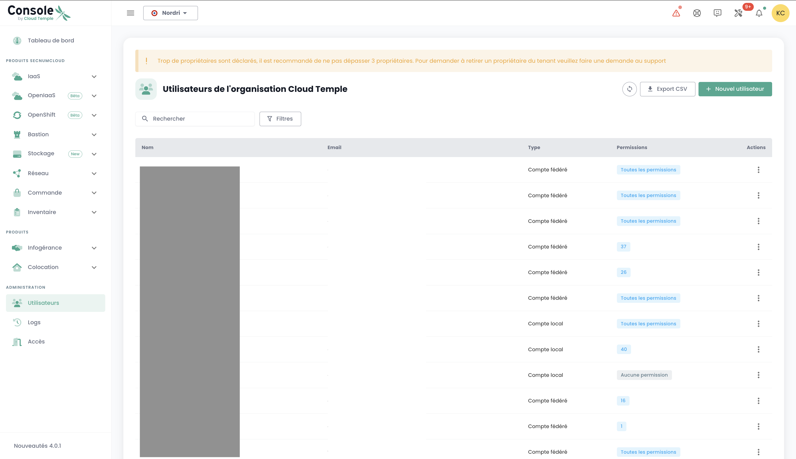
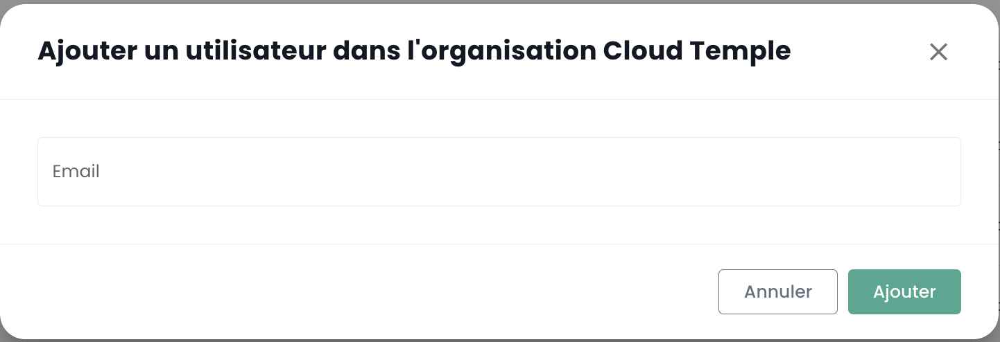
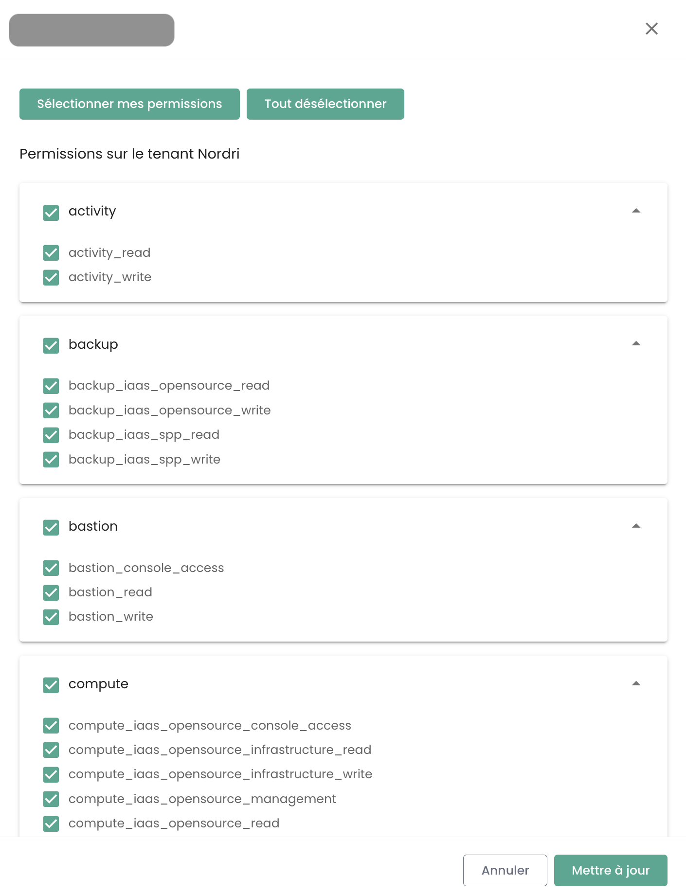
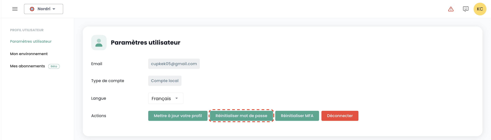
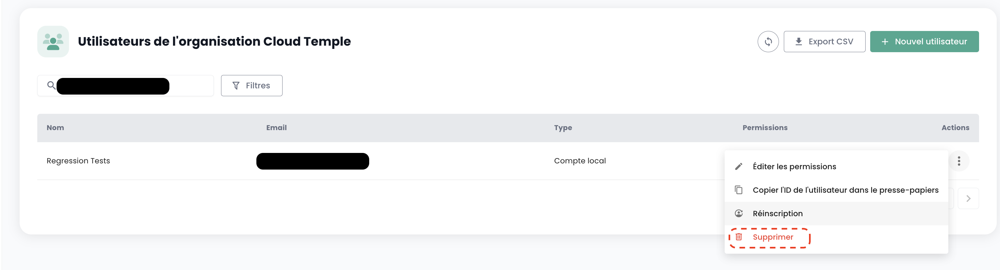
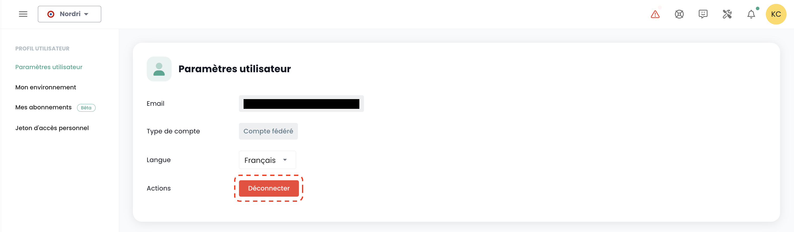

## Benutzer

Die Zugriffsberechtigungen für die Shiva-Konsole-Konten werden durch das Hauptkonto des Auftraggebers auf Einladung erstellt (unabhängig vom Authentifizierungsverzeichnis).
Die Anmeldeinformationen sind global für Ihre [Organisation](#organisations).

*__Hinweis:__ [Die Identitätsföderation wird auf Organisationsebene verwaltet](#organisations#mecanismes-dauthentification)*

### Erstellung eines Benutzerkontos in Ihrer Organisation

Die Erstellung eines Benutzerkontos in Ihrer Organisation erfolgt durch Einladung. Um einen Benutzer zu einer [Organisation](#organisations) einzuladen, gehen Sie im linken Menü __'Administration'__ auf Ihrem Bildschirm im grünen Banner und dann im Untermenü __'Benutzer'__.

Klicken Sie auf die Schaltfläche __'Neuer Benutzer'__ auf der Benutzungsseite.

Geben Sie anschließend die E-Mail-Adresse des Benutzers an

Der Benutzer erhält dann eine Bestätigungs-E-Mail.

Nachdem die Überprüfung abgeschlossen ist, kann sich der Benutzer bei der Konsole anmelden.

### Zuweisen von Berechtigungen an einen Benutzer

Die Benutzerrechte werden auf der Benutzungsseite verwaltet.

Standardmäßig hat ein Benutzer keine Rechte. Es ist daher notwendig, dass der einladende Administrator ihm die erforderlichen Rechte für seine Tätigkeit zuweist. Sie müssen einfach auf das Menü __'Aktionen'__ des Benutzers klicken und die Option __'Bearbeiten'__ wählen.

Das Berechtigungsaktivierungsmenü erscheint dann:

Die Konfiguration der Berechtigungen erfolgt für jeden [Tenant](#tenants) der [Organisation](#organisations).

Die Liste der Berechtigungen und ihre Definition ist [hier](#permissions) verfügbar.

### Wiederanmeldung eines Benutzers

Wenn ein Benutzer bereitgestellt wurde, aber seine Anmeldung nicht innerhalb des Ablaufzeitraums der von der Konsole gesendeten E-Mail bestätigt hat, kann er seine Anmeldung nicht mehr bestätigen. Es ist dann möglich, ihm einen Link erneut zu senden, damit er seine Erstregistrierung erneuert.

Die Wiederanmeldung eines Benutzers erfolgt im Tab __'Benutzer'__ des Verwaltungsabschnitts unten links auf dem Bildschirm.

Wählen Sie den Benutzer aus, den Sie erneut anmelden möchten, und klicken Sie am Ende der Zeile auf die Aktionsschaltfläche und dann auf __'Wiederanmeldung'__.

**Warnung**: Stellen Sie sicher, dass Sie der Urheber der Anforderung zur Wiederanmeldung Ihres Benutzerkontos sind. Bitte melden Sie alle Anfragen, die nicht von Ihnen stammen, über ein Support-Ticket.

### Aktualisieren Sie Ihr Profil

Diese Aktion ist nur für ein lokales Konto (kein SSO) verfügbar.

Wählen Sie in Ihrem __'Profil'__, oben rechts auf dem Bildschirm, dann __'Benutzereinstellungen'__ und wählen Sie die Aktion __'Profil aktualisieren'__.

Gehen Sie dann zu Ihrem Posteingang und klicken Sie auf den Link, der von der Konsole generiert wurde. Folgen Sie einfach den Schritten, um Ihr Profil zu aktualisieren.

**Warnung**: Stellen Sie sicher, dass Sie der Urheber der Anforderung zur Profilaktualisierung sind. Bitte melden Sie alle Anfragen, die nicht von Ihnen stammen, über ein Support-Ticket.

### Zurücksetzen des Passworts

Diese Aktion ist nur für ein lokales Konto (kein SSO) verfügbar.

Wählen Sie in Ihrem __'Profil'__, oben rechts auf dem Bildschirm, dann __'Benutzereinstellungen'__ und wählen Sie die Aktion __'Passwort zurücksetzen'__.

Gehen Sie dann zu Ihrem Posteingang und klicken Sie auf den Link, der von der Konsole generiert wurde. Folgen Sie einfach den Schritten, um Ihr Passwort zu aktualisieren.

**Warnung**: Stellen Sie sicher, dass Sie der Urheber der Anforderung zur Zurücksetzung Ihres Passworts sind. Bitte melden Sie alle Anfragen, die nicht von Ihnen stammen, über ein Support-Ticket.

### Zurücksetzen der Multi-Faktor-Authentifizierung

Diese Aktion ist nur für ein lokales Konto (kein SSO) verfügbar.

Wählen Sie in Ihrem __'Profil'__, oben rechts auf dem Bildschirm, dann __'Benutzereinstellungen'__ und wählen Sie die Aktion __'MFA zurücksetzen'__.

Gehen Sie dann zu Ihrem Posteingang und klicken Sie auf den Link, der von der Konsole generiert wurde. Folgen Sie einfach den Schritten, um Ihre Multi-Faktor-Authentifizierung zu aktualisieren.

**Warnung**: Stellen Sie sicher, dass Sie der Urheber der Anforderung zur Zurücksetzung Ihrer Multi-Faktor-Authentifizierung sind. Bitte melden Sie alle Anfragen, die nicht von Ihnen stammen, über ein Support-Ticket.

### Löschen eines Benutzers

Das Löschen eines Benutzers erfolgt im Tab __'Benutzer'__ des Verwaltungsabschnitts unten links auf dem Bildschirm.

Wählen Sie den Benutzer aus, den Sie löschen möchten, und klicken Sie am Ende der Zeile auf die Aktionsschaltfläche und dann auf __'Löschen'__.

Hinweis: Sie können sich nicht selbst löschen und Sie können keinen __'Eigentümer'__-Benutzer löschen.

### Abmelden

Das Abmelden eines Benutzers erfolgt in seinem __'Profil'__, oben rechts auf dem Bildschirm, dann __'Abmelden'__.

Eine automatische Abmeldung erfolgt nach Ablauf des Sitzungs-Tokens (JWT-Token).

### Ändern der Sprache eines Benutzers

Das Ändern der Sprache eines Benutzers erfolgt in seinem __'Profil'__, oben rechts auf dem Bildschirm, in den __'Benutzereinstellungen'__.

Die Konfiguration erfolgt für jeden Tenant [Tenant](#tenants).

### Abonnement für thematische Benachrichtigungen

Die Abonnementverwaltung ermöglicht den Empfang von E-Mails zu aktivierten Themen, die automatisch bei Auftreten entsprechender Ereignisse gesendet werden.

Sie ist im Benutzerprofil im Reiter "Meine Abonnements" verfügbar:

 Zum Beispiel werden im Falle eines Vorfalls spezifische E-Mail-Benachrichtigungen zu diesem Thema generiert.

Die Liste der verfügbaren Themen kann sich weiterentwickeln und allmählich erweitert werden, um sich an die Bedürfnisse und Veränderungen in unserer Betriebsumgebung anzupassen.

## Berechtigungen

Die Shiva-Konsole ermöglicht eine feine Verwaltung der Rechte der Benutzer einer Organisation, mit einem Mandantensegregation.
Anfänglich ist es das Hauptkonto des Auftraggebers, das die anfängliche Konfiguration der Konten und der zugehörigen Berechtigungen ermöglicht.
Anschließend ermöglicht das Recht __'iam_write'__ einem Konto die Verwaltung der Berechtigungen anderer Benutzer.

### Verfügbare Berechtigungen für die Benutzer Ihrer Organisation

Wenn ein Benutzer erstellt wird, besitzt er standardmäßig keine Berechtigung. Jede Berechtigung wird einzeln zugewiesen und funktioniert unabhängig, ohne Überschneidung mit anderen Berechtigungen. Sie gelten gemeinsam, was bedeutet, dass ein Benutzer über alle erforderlichen Berechtigungen verfügen muss, um eine bestimmte Aktion auszuführen.

Die folgenden Berechtigungen können für jeden Benutzer und für jeden Mandanten Ihrer Organisation konfiguriert werden:
	•	Berechtigungen des Typs „read“: erlauben nur die Ansicht von Ressourcen ohne Änderungsmöglichkeit.
	•	Berechtigungen des Typs „write“: erlauben die Änderung von Konfigurationen.
 	•	Berechtigungen des Typs „management“: erlauben die erweiterte Verwaltung von Ressourcen.

- __Dies sind Berechtigungen, keine Rollen.__ Daher ist es notwendig, die Berechtigung READ und WRITE zu haben, um eine Konfiguration zu ändern.

Letzte Aktualisierung: 23/01/2025

| Berechtigungsname                             | Berechtigungsbeschreibung                                                                                                       |
| --------------------------------------------- | ------------------------------------------------------------------------------------------------------------------------------ |
| activity_read                                 | Ansicht von Log- und Aktivitätsprotokollen                                                                                      |
| activity_write                                | Verwaltung von Log- und Aktivitätsprotokollen                                                                                   |
| backup_iaas_opensource_read                   | Verwaltung von Backup-Ressourcen - OpenIaaS-Angebot - Ansicht                                                                   |
| backup_iaas_opensource_write                  | Verwaltung von Backup-Ressourcen - OpenIaaS-Angebot - Änderung                                                                  |
| backup_iaas_spp_read                          | Verwaltung von Backup-Ressourcen - Vmware-Angebot - Ansicht                                                                     |
| backup_iaas_spp_write                         | Verwaltung von Backup-Ressourcen - Vmware-Angebot - Änderung                                                                    |
| bastion_read                                  | Ansicht von Bastion-Ressourcen                                                                                                  |
| bastion_write                                 | Verwaltung von Bastion-Ressourcen (Appliances, Sitzungen,...)                                                                   |
| bastion_console_access                        | Autorisierung für den Zugriff auf die Konsole (ssh/rdp) einer durch eine Bastion-Appliance geschützten Ressource                |
| compute_iaas_opensource_console_access        | OpenIaaS-Angebot - Öffnen der Konsole einer virtuellen Maschine                                                                 |

| compute_iaas_opensource_infrastructure_read   | OpenIaaS Angebot - Erweiterte Datenabfrage der Xen Orchestra Ressourcen |
| compute_iaas_opensource_infrastructure_write  | OpenIaaS Angebot - Erweiterte Verwaltung der Xen Orchestra Ressourcen                                                                          |
| compute_iaas_opensource_read                  | OpenIaaS Angebot - Abfrage der Ressourcen vom Typ Virtuelle Maschinen                                                        |
| compute_iaas_opensource_management            | OpenIaaS Angebot - Verwaltung der Ressourcen vom Typ Virtuelle Maschinen                                                             |
| compute_iaas_opensource_virtual_machine_power | OpenIaaS Angebot - Verwaltung der Stromversorgung einer virtuellen Maschine                                                              |
| compute_iaas_vmware_console_access            | Vmware Angebot - Öffnen der Konsole einer virtuellen Maschine                                                                 |
| compute_iaas_vmware_infrastructure_read       | Vmware Angebot - Erweiterte Datenabfrage der VMware-Ressourcen (Affinity/Anti-Affinity-Regeln, DRS-Konfigurationen, etc.)  |
| compute_iaas_vmware_infrastructure_write      | Vmware Angebot - Erweiterte Verwaltung der VMware-Ressourcen                                                                           |
| compute_iaas_vmware_read                      | Vmware Angebot - Abfrage der Ressourcen vom Typ Virtuelle Maschinen                                                         |
| compute_iaas_vmware_management                | Vmware Angebot - Verwaltung der Ressourcen vom Typ Virtuelle Maschinen (ermöglicht die Verschlüsselung einer virtuellen Maschine)                                                              |
| compute_iaas_vmware_virtual_machine_power     | Vmware Angebot - Verwaltung der Stromversorgung einer virtuellen Maschine                                                               |
| baremetal_read                                | Bare Metal Angebot - Abfrage der Ressourcen vom Typ Bare Metal                                                               |
| baremetal_console_access                      | Bare Metal Angebot - Öffnen der Konsole eines Bare Metal                                                                  |
| console_public_access_read                    | Abfrage der IPs, die Zugriff auf die Konsole haben                                                                         |
| console_public_access_write                   | Hinzufügen von IPs, die Zugriff auf die Konsole haben                                                                                  |
| compute_virtual_machine_power                 | Verwaltung der Stromversorgung einer virtuellen Maschine                                                                              |
| documentation_read                            | Abfrage der Dokumentationsressourcen von Confluence                                                                        |
| housing_read                                  | Abfrage der Ressourcen vom Typ Colocation                                                                                 |
| iam_offline_access                            | Erstellung und Löschung von Personal Access Tokens (PAT)                                                                        |
| iam_read                                      | Abfrage der Benutzerrechte                                                                                           |
| iam_write                                     | Verwaltung der Benutzerrechte                                                                                                |
| intervention_read                             | Abfrage der geplanten Änderungen und Inbetriebnahmen auf der Plattform                                                  |
| inventory_read                                | Abfrage der Ressourcen vom Typ Inventar                                                                                 |
| inventory_write                               | Verwaltung der Ressourcen vom Typ Inventar                                                                                      |
| monitoring_read                               | Abfrage des Monitorings                                                                                                     |
| monitoring_write                              | Verwaltung des Monitorings                                                                                                          |
| metric_read                                   | Abfrage der Gesundheitsdaten von virtuellen Maschinen und Hosts                                                         |
| network_read                                  | Abfrage der Netzwerkressourcen                                                                                             |
| network_write                                 | Verwaltung der Netzwerkressourcen                                                                                                  |
| order_read                                    | Abfrage der Infrastrukturaufträge                                                                                     |
| order_write                                   | Erstellung eines Infrastrukturauftrags                                                                                            |
| object-storage_iam_management                 | Verwaltung der Konten für den S3-Speicher                                                                       |
| object-storage_read                           | Anzeige der Buckets und deren Konfigurationen                                                                   |
| object-storage_write                          | Bearbeitung der Buckets und deren Konfigurationen                                                                  |
| openshift_management                          | Verbindung zu den Openshift-Plattformen (auf den Tenant begrenzt)                                                          |
| support_management                            | Abfrage aller Support-Tickets des Tenants                                                                       |
| support_read                                  | Abfrage der eigenen Support-Tickets des Tenants                                                                                  |
| support_write                                 | Erstellung eines Support-Tickets auf dem Tenant                                                                                     |
| tag_read                                      | Abfrage der Tags, außer den RTMS-Tags                                                                                   |
| tag_write                                     | Verwaltung der Tags, außer den RTMS-Tags                                                                                        |
| ticket_comment_read                           | Abfrage der Kommentare                                                                                                  |
| ticket_comment_write                          | Verwaltung der Kommentare                                                                                                       |
| ticket_read                                   | Abfrage der Tickets                                                                                                       |
| ticket_write                                  | Verwaltung der Tickets                                                                                                            |

## Organisationen

Die Organisation ist mit Ihrem __Sponsor-Konto__ und dem __zugehörigen Cloud Temple Vertrag__ verbunden. Sie stellt Ihre Entität (Firma, Abteilung, Team, ...) dar, die die vertragliche Beziehung zwischen Cloud Temple und Ihnen trägt.

### Prinzip einer Organisation

Die Organisation hat vier Hauptrollen:

- Sie stellt die __vertragliche Entität__ für die Aspekte der Nachverfolgung und Abrechnung dar,
- Sie definiert __die globale Konfiguration des Authentifizierungsmechanismus__: Die Authentifizierung kann lokal auf der Shiva-Konsole oder mittels eines Identitäts-Federationsdienstes erfolgen,
- Sie trägt alle __Benutzerkonten__,
- Sie __vereint die Tenants__ (Produktion, Pre-Produktion, Dev, Anwendung 1, Anwendung 2, ...) die Sie für Ihre Cloud-Architekturanforderungen definieren.

Die Rollen (Rechte/Berechtigungen) der Benutzer sind für jeden in Ihrer Organisation definierten Tenant konfigurierbar. Beispielsweise kann ein Konto berechtigt sein, Ressourcen in einem Tenant zu bestellen, aber nicht in einem anderen.

### Authentifizierungsmechanismen

Die Shiva-Konsole ermöglicht es auf Organisationsebene __den Authentifizierungsmechanismus zu konfigurieren__. Sie können
das lokale Authentifizierungsverzeichnis der Shiva-Konsole verwenden oder Ihre Organisation mit einem Ihrer
Authentifizierungsverzeichnisse verbinden.

Die folgenden externen Verzeichnisse werden unterstützt:

- Verzeichnisse, die mit __OpenID Connect__ kompatibel sind,
- Verzeichnisse, die mit __SAML__ kompatibel sind,
- __Microsoft ADFS__
- __Microsoft EntraID__ (Microsoft Azure Active Directory)
- Amazon AWS Cognito
- Okta
- Auth0
- KeyCloak

## Tenant

Der Tenant ist eine __Ressourcengruppe innerhalb einer Organisation__. Eine [Organisation](#organisations) hat mindestens einen Tenant (genannt __Standard-Tenant__, der umbenannt werden kann). In der Regel werden mehrere Tenants verwendet, um Verantwortlichkeiten oder technische Bereiche zu segmentieren.

Zum Beispiel:

- Ein __Produktions__-Tenant
- Ein __Pre-Produktions__-Tenant
- Ein __Test__-Tenant
- Ein __Qualifizierungs__-Tenant
Mais il est aussi possible d'organiser les choses avec une __vue applicative__ ou par __criticité__ :

- Ein Tenant __Application 1__ oder __Kritikalität 1__
- Ein Tenant __Application 2__ oder __Kritikalität 2__
- ...

Die bestellten technischen Ressourcen werden einem bestimmten Tenant zugewiesen und nicht mit anderen Tenants geteilt. Zum Beispiel sind ein Cluster von Hypervisoren und die zugehörigen L2-Netzwerke nur in einem Tenant verfügbar.
Bezüglich der Netzwerke ist es möglich, __'cross tenant'__ Netzwerke anzufordern, um die Netzwerkkontinuität zwischen den Tenants sicherzustellen.

Die Benutzerberechtigungen sind für jeden Tenant festzulegen. Daher muss jede Organisation sorgfältig über die gewünschten Tenants nachdenken. Dieser Punkt wird normalerweise im Initialisierungs-Workshop angesprochen, wenn die Organisation erstellt wird.

Es ist möglich, die Architektur weiterzuentwickeln, indem Tenants hinzugefügt oder entfernt werden.

Ein Tenant kann nicht leer sein. Er muss zwingend mit einem Mindestmaß an Ressourcen initialisiert werden:

- Eine Verfügbarkeitszone (AZ, also ein physisches Rechenzentrum),
- Ein Cluster zur Berechnung,
- Ein Speicherplatz,
- Ein Netzwerk-VLAN.

| Auftragsreferenz                                             | Einheit  | SKU                     |
|--------------------------------------------------------------|----------|-------------------------|
| TENANT - *(REGION)* - Tenant-Aktivierung                     | 1 Tenant | csp:tenant:v1           |
| TENANT - *(REGION)* - Aktivierung einer Verfügbarkeitszone   | 1 Tenant | csp:(region):iaas:az:v1 |

### Verwaltung der Eigentümer in einem Tenant
Jeder Tenant hat mindestens einen Eigentümer, der eine klare Verantwortlichkeit und eine effiziente Verwaltung der zugehörigen Ressourcen sicherstellt. Zudem ist es möglich, mehrere Eigentümer für denselben Tenant zu deklarieren, was eine Zusammenarbeit und eine geteilte Entscheidungsfindung ermöglicht. Nachfolgend finden Sie wichtige Informationen zur Verwaltung dieser Eigentümer.

#### Wichtige Informationen zur Verwaltung der Eigentümer

#### 1. Anzahl der Eigentümer
* Es gibt keine technische Begrenzung für die Anzahl der Eigentümer, die im Tenant definiert werden können.
* Das Verwaltungstool (IHM) gibt eine Warnung aus, wenn es mehr als 3 Eigentümer gibt, um die Anzahl der Eigentümer aus Sicherheitsgründen und zur optimalen Verwaltung der Zugriffe zu begrenzen.

#### 2. Hinzufügen eines neuen Eigentümers
* Beim Hinzufügen eines neuen Eigentümers kann die Aktualisierung seiner Berechtigungen bis zu 60 Minuten dauern.
* Diese Verzögerung ist normal und stellt sicher, dass die Zugriffsrechte ordnungsgemäß auf alle zugehörigen Dienste und Ressourcen angewendet werden.

#### 3. Entfernung eines Eigentümers
* Um einen Eigentümer aus dem Tenant zu entfernen, muss der Benutzer eine Anfrage beim Support einreichen.
* Dieses Verfahren stellt sicher, dass Änderungen der Zugriffsrechte sicher und in Übereinstimmung mit den bewährten Verfahren für das Zugriffsmanagement vorgenommen werden.

### Zugriffsberechtigung auf einen Tenant: Zugelassene IP-Adressen

Der Zugang zur Cloud-Verwaltungskonsole ist strikt auf zuvor zugelassene IP-Adressen beschränkt, in Übereinstimmung mit den Anforderungen der SecNumCloud-Qualifikation. Diese Einschränkung gewährleistet ein erhöhtes Sicherheitsniveau, indem der Zugang nur Benutzern von bestimmten IP-Bereichen ermöglicht wird. Dies minimiert das Risiko unbefugter Zugriffe und schützt die Cloud-Infrastruktur gemäß den höchsten Sicherheitsstandards.

Hinweis: *Das Entfernen einer zugelassenen IP-Adresse erfolgt durch eine Support-Anfrage in der Cloud Temple-Konsole.*

### Ressourcenverbrauch innerhalb eines Tenants

Es ist möglich, die innerhalb eines Tenants verbrauchten Cloud-Ressourcen anzuzeigen, um eine detaillierte Ansicht der Nutzung der verschiedenen eingesetzten Dienste zu erhalten. Diese Funktion ermöglicht es den Benutzern, den Verbrauch ihrer Ressourcen in Echtzeit zu verfolgen, die am stärksten genutzten Dienste zu identifizieren und ihre Nutzung entsprechend den Bedürfnissen zu optimieren.

Klicken Sie im Menü der Konsole auf "Verbrauchsbericht" und wählen Sie den gewünschten Zeitraum aus. So können Sie den Verbrauch der Cloud-Ressourcen im definierten Zeitraum im Detail einsehen, wodurch Sie die Nutzung der Dienste analysieren und Ihr Management entsprechend optimieren können:

