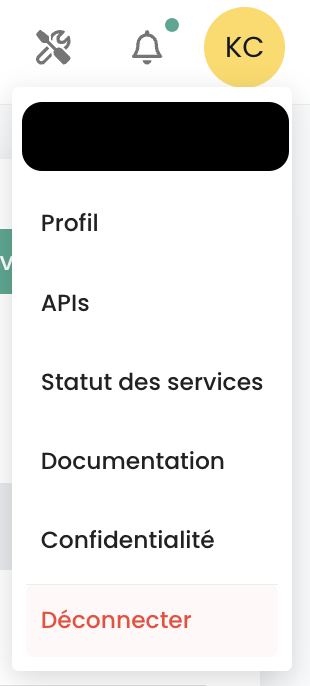

## Benutzer

Die Zugangskonten zur Shiva-Konsole werden vom Hauptkonto des Auftraggebers auf Einladung erstellt (unabhängig vom Authentifizierungsverzeichnis).
Die Anmeldeinformationen sind global für Ihre [Organisation](#organisations).

*__Hinweis:__ [Die Verwaltung der Identitätsföderation erfolgt auf Organisationsebene](#organisations#mecanismes-dauthentification)*

### Erstellung eines Benutzerkontos in Ihrer Organisation

Das Erstellen eines Benutzerkontos in Ihrer Organisation erfolgt durch Einladung. Um einen Benutzer in eine [Organisation](#organisations) einzuladen, gehen Sie im linken Menü auf Ihrem Bildschirm im grünen Banner zu __'Administration'__ und dann zum Untermenü __'Benutzer'__.

Klicken Sie auf der Benutzerseite auf den Button __'Neuer Benutzer'__.

Geben Sie anschließend die E-Mail-Adresse des Benutzers an.

Der Benutzer erhält dann eine Bestätigungs-E-Mail.

Nachdem die Überprüfung abgeschlossen ist, kann sich der Benutzer bei der Konsole anmelden.

### Zuordnung von Berechtigungen zu einem Benutzer

Die Verwaltung der Benutzerrechte erfolgt auf der Benutzerseite.

Standardmäßig hat ein Benutzer keine Rechte. Daher muss der Administrator, der die Einladung ausgesprochen hat, dem Benutzer die für seine Tätigkeit erforderlichen Rechte zuweisen. Klicken Sie einfach auf das Menü __'Aktionen'__ des Benutzers und wählen Sie die Option __'Bearbeiten'__.

Das Menü zur Rechtevergabe erscheint dann:

Die Konfiguration der Berechtigungen ist für jeden [Tenant](#tenants) der [Organisation](#organisations) vorzunehmen.

Die Liste der Berechtigungen und deren Definition ist [hier](#permissions) verfügbar.

### Neuanmeldung eines Benutzers

Wenn ein Benutzer bereitgestellt wurde, aber seine Anmeldung nicht innerhalb der Ablauffrist der von der Konsole gesendeten E-Mail bestätigt hat, kann er seine Anmeldung nicht mehr bestätigen. Es ist dann möglich, ihm einen Link erneut zu senden, damit er seine erste Anmeldung erneuert.

Die Neuanmeldung eines Benutzers wird im Reiter __'Benutzer'__ des Administrationsbereichs unten links auf dem Bildschirm durchgeführt.

Wählen Sie den Benutzer aus, den Sie neu anmelden möchten, und klicken Sie dann auf den Aktionsbutton am Ende der Zeile und auf __'Neuanmeldung'__.

### Löschung eines Benutzers

Die Löschung eines Benutzers erfolgt im Reiter __'Benutzer'__ des Administrationsbereichs unten links auf dem Bildschirm.

Wählen Sie den Benutzer aus, den Sie löschen möchten, und klicken Sie dann auf den Aktionsbutton am Ende der Zeile und auf __'Löschen'__.

Hinweis: Sie können sich nicht selbst löschen und Sie können keinen Benutzer __'Eigentümer'__ löschen.

### Abmelden

Das Abmelden eines Benutzers erfolgt in seinem __'Profil'__ oben rechts auf dem Bildschirm und dann auf __'Abmelden'__.

### Ändern der Sprache eines Benutzers

Das Ändern der Sprache eines Benutzers erfolgt in seinem __'Profil'__ oben rechts auf dem Bildschirm in den __'Benutzereinstellungen'__.

Die Konfiguration erfolgt für jeden [Tenant](#tenants).

### Abonnement thematischer Benachrichtigungen

Das Management der Abonnements ermöglicht den Empfang von E-Mails zu aktiven Themen, die automatisch bei eintretenden Ereignissen gesendet werden.

Dieses ist im Benutzerprofil im Reiter "Meine Abonnements" zugänglich:

Zum Beispiel werden bei einem Vorfall spezifische E-Mail-Benachrichtigungen zu diesem Thema generiert.

Die Liste der verfügbaren Themen kann sich entwickeln und wird schrittweise erweitert, um den Bedürfnissen und Veränderungen in unserer operativen Umgebung gerecht zu werden.

## Berechtigungen

Die Shiva-Konsole ermöglicht eine feingranulare Verwaltung der Rechte der Benutzer einer Organisation, mit einer Trennung nach Tenant.
Zu Beginn ermöglicht es das Hauptkonto des Auftraggebers, die initiale Konfiguration der Konten und der zugehörigen Berechtigungen vorzunehmen.
Danach ermöglicht das Recht __'iam_write'__ einem Konto, die Berechtigungen anderer Benutzer zu verwalten.

### Verfügbare Berechtigungen für die Benutzer Ihrer Organisation

Die folgenden Berechtigungen sind für jeden [Benutzer](#utilisateurs) und für jeden [Tenant](#tenants#selection-dun-tenant) Ihrer Organisation konfigurierbar.

- Die Berechtigungen vom Typ __'read'__ sind mit der Ansicht ohne Konfigurationsmöglichkeit verbunden.
- Die Berechtigungen vom Typ __'write'__ sind mit der Änderung der Konfiguration verbunden.
- __Es handelt sich um Berechtigungen, keine Rollen.__ Dementsprechend ist es notwendig, sowohl die Berechtigung READ als auch WRITE zu haben, um eine Konfiguration zu ändern.

__VERSION : 20241007__

| Name der Berechtigung                         | Beschreibung der Berechtigung                                                                                                  |
| --------------------------------------------- | ------------------------------------------------------------------------------------------------------------------------------ |
| activity_read                                 | Ansicht der Protokoll- und Aktivitätslogs                                                                                      |
| activity_write                                | Verwaltung der Protokoll- und Aktivitätslogs                                                                                   |
| backup_iaas_opensource_read                   | Verwaltung der Backup-Ressourcen - OpenIaaS-Angebot - Ansicht                                                                  |
| backup_iaas_opensource_write                  | Verwaltung der Backup-Ressourcen - OpenIaaS-Angebot - Änderung                                                                 |
| backup_iaas_spp_read                          | Verwaltung der Backup-Ressourcen - Vmware-Angebot - Ansicht                                                                    |
| backup_iaas_spp_write                         | Verwaltung der Backup-Ressourcen - Vmware-Angebot - Änderung                                                                   |
| bastion_read                                  | Ansicht der Bastion-Ressourcen                                                                                                 |
| bastion_write                                 | Verwaltung der Ressourcen (Appliances, Sitzungen, ...) vom Typ Bastion                                                         |
| bastion_console_access                        | Berechtigung zum Zugriff auf die Konsole (ssh/rdp) einer durch eine Bastion-Appliance geschützten Ressource                    |
| compute_iaas_opensource_console_access        | OpenIaaS-Angebot - Öffnen der Konsole einer virtuellen Maschine                                                               |
| compute_iaas_opensource_infrastructure_read   | OpenIaaS-Angebot - Ansicht erweiterter Daten der Xen Orchestra Ressourcen                                                     |
| compute_iaas_opensource_infrastructure_write  | OpenIaaS-Angebot - Erweiterte Verwaltung der Xen Orchestra Ressourcen                                                            |
| compute_iaas_opensource_read                  | OpenIaaS-Angebot - Ansicht der virtuellen Maschinen                                                                            |
| compute_iaas_opensource_management            | OpenIaaS-Angebot - Verwaltung der virtuellen Maschinen                                                                         |
| compute_iaas_opensource_virtual_machine_power | OpenIaaS-Angebot - Verwaltung der Stromversorgung einer virtuellen Maschine                                                    |
| compute_iaas_vmware_console_access            | Vmware-Angebot - Öffnen der Konsole einer virtuellen Maschine                                                                 |
| compute_iaas_vmware_infrastructure_read       | Vmware-Angebot - Ansicht erweiterter Daten der VMware Ressourcen (Affinitäts-/Anti-Affinitätsregeln, DRS-Konfiguration usw.)   |
| compute_iaas_vmware_infrastructure_write      | Vmware-Angebot - Erweiterte Verwaltung der VMware Ressourcen                                                                  |
| compute_iaas_vmware_read                      | Vmware-Angebot - Ansicht der virtuellen Maschinen                                                                             |
| compute_iaas_vmware_management                | Vmware-Angebot - Verwaltung der virtuellen Maschinen                                                                          |
| compute_iaas_vmware_virtual_machine_power     | Vmware-Angebot - Verwaltung der Stromversorgung einer virtuellen Maschine                                                     |
| console_public_access_read                    | Ansicht der IPs, die berechtigt sind, auf die Konsole zuzugreifen                                                             |
| console_public_access_write                   | Hinzufügen von IPs, die berechtigt sind, auf die Konsole zuzugreifen                                                          |
| compute_virtual_machine_power                 | Verwaltung der Stromversorgung einer virtuellen Maschine                                                                      |
| documentation_read                            | Ansicht der Dokumentationsressourcen von Confluence                                                                           |

| housing_read                                  | Abfrage von Ressourcen des Typs Wohngemeinschaft                                                                            |
| iam_offline_access                            | Erstellung und Löschung von Persönlichen Access Tokens (PAT)                                                                |
| iam_read                                      | Abfrage der Benutzerrechte                                                                                                 |
| iam_write                                     | Verwaltung der Benutzerrechte                                                                                              |
| intervention_read                             | Abfrage geplanter Änderungen und Einführungen auf der Plattform                                                             |
| inventory_read                                | Abfrage von Ressourcen des Typs Inventar                                                                                   |
| inventory_write                               | Verwaltung der Ressourcen des Typs Inventar                                                                                |
| monitoring_read                               | Abfrage des Monitorings                                                                                                    |
| monitoring_write                              | Verwaltung des Monitorings                                                                                                 |
| metric_read                                   | Abfrage der Gesundheitsdaten von virtuellen Maschinen und Hosts                                                            |
| network_read                                  | Abfrage der Netzwerkressourcen                                                                                             |
| network_write                                 | Verwaltung der Netzwerkressourcen                                                                                          |
| order_read                                    | Abfrage von Infrastrukturaufträgen                                                                                         |
| order_write                                   | Erstellung von Infrastrukturaufträgen                                                                                      |
| object-storage_iam_management                 | Verwaltung von Speicherkonten auf dem S3-Produkt                                                                           |
| object-storage_read                           | Anzeige von Buckets und Bucket-Konfigurationen                                                                             |
| object-storage_write                          | Bearbeitung von Buckets und Bucket-Konfigurationen                                                                         |
| openshift_management                          | Verbindung zu Openshift-Plattformen (pro Tenant)                                                                           |
| Owner                                         | Der Benutzer hat die Administrationsrechte für einen Tenant                                                                |
| support_management                            | Abfrage aller Support-Tickets des Tenants                                                                                  |
| support_read                                  | Abfrage der eigenen Support-Tickets des Tenants                                                                            |
| support_write                                 | Erstellung eines Support-Tickets auf dem Tenant                                                                           |
| tag_read                                      | Abfrage von Tags, außer RTMS-Tags                                                                                          |
| tag_write                                     | Verwaltung von Tags, außer RTMS-Tags                                                                                       |
| ticket_comment_read                           | Abfrage von Kommentaren                                                                                                    |
| ticket_comment_write                          | Verwaltung von Kommentaren                                                                                                |
| ticket_read                                   | Abfrage von Tickets                                                                                                        |
| ticket_write                                  | Verwaltung von Tickets                                                                                                     |

**Notizen** :

- *Es gibt keine Begrenzung der Anzahl von Eigentümern (Owners), die für einen Tenant definiert werden können. Allerdings gibt die Verwaltungsoberfläche (IHM) eine Warnung aus, wenn mehr als 3 Eigentümer vorhanden sind, um darauf hinzuweisen, die Anzahl der Eigentümer aus Sicherheits- und verwaltungstechnischen Gründen zu begrenzen.*
- *Beim Hinzufügen eines neuen Eigentümers (Owner) kann das Aktualisieren seiner Berechtigungen bis zu 60 Minuten dauern. Diese Verbreitungszeit ist normal und stellt sicher, dass die Zugriffsrechte korrekt auf alle zugehörigen Dienste und Ressourcen angewendet werden.*
- *Um einen Eigentümer (Owner) vom Tenant zu entfernen, muss der Benutzer eine Support-Anfrage einreichen. Dieses Verfahren stellt sicher, dass Änderungen der Zugriffsrechte sicher und gemäß bewährten Praktiken der Zugriffsverwaltung vorgenommen werden.*

### Veraltete Berechtigungen

Die folgenden Berechtigungen sind nicht mehr verfügbar:

| Berechtigungsname                              | Datum      | Beschreibung der Berechtigung                                                                                                 |
| --------------------------------------------- | ---------- | ---------------------------------------------------------------------------------------------------------------------------- |
| backup_read  (**DEPRECATED**)                 | 07/10/2024 | Abfrage von Ressourcen des Typs Backup                                                                                       |
| backup_write (**DEPRECATED**)                 | 07/10/2024 | Verwaltung von Ressourcen des Typs Backup - ändern                                                                           |
| compute_console_access (**DEPRECATED**)       | 07/10/2024 | Öffnen der Konsole einer virtuellen Maschine                                                                                 |
| compute_infrastructure_read (**DEPRECATED**)  | 07/10/2024 | Abfrage erweiterter Daten von VMware-Ressourcen (Affinitäts-/Anti-Affinitätsregeln, DRS-Konfiguration usw.)                  |
| compute_infrastructure_write (**DEPRECATED**) | 07/10/2024 | Erweiterte Verwaltung von VMware-Ressourcen                                                                                  |
| compute_read (**DEPRECATED**)                 | 07/10/2024 | Abfrage von Ressourcen des Typs Virtuelle Maschinen                                                                          |
| compute_management (**DEPRECATED**)           | 07/10/2024 | Verwaltung von Ressourcen des Typs Virtuelle Maschinen                                                                       |
| compute_virtual_machine_power (**DEPRECATED**) | 07/10/2024 | Verwaltung der Stromversorgung einer virtuellen Maschine                                                                     |
| iam_manage_permissions (**DEPRECATED**)       | 07/10/2024 | Verwaltung neuer Berechtigungen für sich selbst                                                                              |

## Organisationen

Die Organisation ist mit Ihrem __Sponsor-Konto__ und dem zugehörigen __Cloud Temple-Vertrag__ verbunden. Sie repräsentiert Ihre Entität (Unternehmen, Abteilung, Team, ...), die die vertragliche Beziehung zwischen Cloud Temple und Ihnen trägt.

### Prinzip einer Organisation

Die Organisation hat vier große Rollen: 

- Sie repräsentiert die __vertragliche Entität__ hinsichtlich der Nachverfolgung und Abrechnung,
- Sie definiert __die globale Konfiguration des Authentifizierungsmechanismus__: Die Authentifizierung kann lokal auf der Shiva-Konsole oder extern über einen Identitäts-Federationsdienst erfolgen,
- Sie trägt alle __Benutzerkonten__,
- Sie __vereint die Tenants__ (Produktion, Vorproduktion, Dev, Anwendung 1, Anwendung 2, ...), die Sie für die Anforderungen Ihrer Cloud-Architektur definieren.

Die Rollen (Rechte/Berechtigungen) der Benutzer sind für jeden definierten Tenant in Ihrer Organisation konfigurierbar. Zum Beispiel kann ein Konto berechtigt sein, Ressourcen in einem Tenant zu bestellen, aber nicht in einem anderen.

### Authentifizierungsmechanismen

Die Shiva-Konsole ermöglicht auf Organisationsebene __die Konfiguration des Authentifizierungsmechanismus__. Sie können den lokalen Authentifizierungs-Repository der Shiva-Konsole verwenden oder Ihre Organisation mit einem Ihrer Authentifizierungs-Repositorys verbinden.  

Die folgenden externen Repositorys werden unterstützt:

- Mit __OpenID Connect__ kompatible Repositorys,
- Mit __SAML__ kompatible Repositorys,
- __Microsoft ADFS__
- __Microsoft EntraID__ (Microsoft Azure Active Directory)
- Amazon AWS Cognito
- Okta
- Auth0
- KeyCloak

## Tenant

Der Tenant ist eine __Gruppierung von Ressourcen innerhalb einer Organisation__. Eine [Organisation](#organisations) hat mindestens einen Tenant (genannt __Standard-Tenant__, der umbenannt werden kann). In der Regel werden mehrere Tenants verwendet, um Verantwortlichkeiten oder technische Bereiche zu segmentieren.

Zum Beispiel:

- Ein __Produktions-Tenant__
- Ein __Vorproduktions-Tenant__
- Ein __Test-Tenant__
- Ein Tenant __Qualifikation__

Aber es ist auch möglich, die Dinge mit einer __Anwendungsansicht__ oder nach __Kritikalität__ zu organisieren: 

- Ein Tenant __Anwendung 1__ oder __Kritikalität 1__
- Ein Tenant __Anwendung 2__ oder __Kritikalität 2__
- ...

Die bestellten technischen Ressourcen sind einem bestimmten Tenant zugewiesen und werden nicht mit anderen Tenants geteilt. Zum Beispiel ist ein Hypervisor-Cluster und die zugehörigen L2-Netzwerke nur in einem Tenant verfügbar.
Bezüglich der Netzwerke ist es möglich, __'cross tenant'__ Netzwerke anzufordern, um die Netzwerkkontinuität zwischen den Tenants sicherzustellen.

Die Benutzerberechtigungen sind in jedem Tenant zu definieren. Somit muss jede Organisation gründlich über die gewünschten Tenants nachdenken. Dieser Punkt wird in der Regel in der Initialisierungs-Workshop besprochen, zum Zeitpunkt der Erstellung der Organisation.

Es ist möglich, die Architektur durch Hinzufügen oder Entfernen von Tenants anzupassen.

Ein Tenant kann nicht leer sein. Er muss unbedingt mit einem Minimum an Ressourcen initialisiert werden:

- Eine Verfügbarkeitszone (AZ, also ein physisches Rechenzentrum),
- Ein Compute-Cluster,
- Ein Speicherplatz,
- Ein Netzwerk-VLAN.

| Bestellreferenz                                             | Einheit  | SKU                     |  
|--------------------------------------------------------------|----------|-------------------------|
| TENANT - *(REGION)* - Aktivierung eines Tenants              | 1 Tenant | csp:tenant:v1           |
| TENANT - *(REGION)* - Aktivierung einer Verfügbarkeitszone   | 1 Tenant | csp:(region):iaas:az:v1 |

### Zugangsauthorisierung zu einem Tenant: Zugelassene IPs

Der Zugang zur Cloud-Management-Konsole ist strikt auf zuvor zugelassene IP-Adressen beschränkt, im Einklang mit den Anforderungen der SecNumCloud-Qualifikation. Diese Einschränkung gewährleistet ein erhöhtes Sicherheitsniveau, indem nur Benutzern aus spezifizierten IP-Bereichen Zugang gewährt wird, wodurch das Risiko unbefugter Zugriffe minimiert und die Cloud-Infrastruktur gemäß den höchsten Sicherheitsstandards geschützt wird.

Hinweis: *Das Entfernen einer zugelassenen IP erfolgt durch eine Support-Anfrage in der Cloud Temple-Konsole.*

### Ressourcenverbrauch innerhalb eines Tenants

Es ist möglich, die innerhalb eines Tenants verbrauchten Cloud-Ressourcen einzusehen, was eine detaillierte Ansicht der Nutzung der verschiedenen bereitgestellten Dienste bietet. Diese Funktion erlaubt es den Benutzern, den Verbrauch ihrer Ressourcen in Echtzeit zu verfolgen, die am meisten genutzten Dienste zu identifizieren und ihre Nutzung entsprechend den Bedürfnissen zu optimieren.

Im Konsolenmenü klicken Sie auf "Verbrauchsbericht" und wählen Sie den gewünschten Zeitraum aus. So können Sie den Ressourcenverbrauch im definierten Zeitraum im Detail einsehen, was Ihnen ermöglicht, die Nutzung der Dienste zu analysieren und Ihr Management entsprechend zu optimieren:

