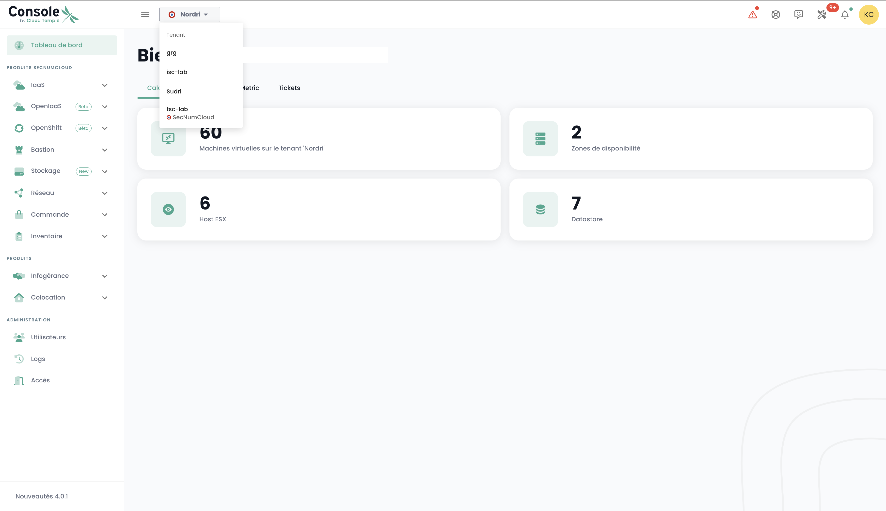

##  Tenant

### Erstellen eines Tenants

Die Erstellung eines Tenants erfolgt durch eine Serviceanforderung, die angibt:

    Den Namen Ihrer Organisation
    Den Namen eines Kontakts mit seiner E-Mail und Telefonnummer, um die Konfiguration abzuschließen
    Den Namen des Tenants
    Die Verfügbarkeitszone oder, falls nicht vorhanden, den gewünschten physischen Standort für den Tenant

### Auswahl eines Tenants

Die Auswahl des Tenants erfolgt von der Hauptseite der Shiva-Konsole aus:

*__Hinweis:__ Die Ressourcen eines Tenants sind ihm eigen und können nicht mit anderen Tenants vermischt werden.*

## Zugriffskonten für die Shiva-Konsole

Die Zugriffskonten für die Shiva-Konsole werden vom Hauptkonto des Auftraggebers auf Einladung erstellt (unabhängig vom Authentifizierungsrepository).
Die Anmeldeinformationen sind global für Ihre [Organisation](concepts.md#organisations).

*__Hinweis:__ Die Identitätsföderation wird auf Organisationsebene verwaltet.*

### Erstellen eines Benutzerkontos in Ihrer Organisation

Die Erstellung eines Benutzerkontos in Ihrer Organisation erfolgt durch Einladung. Um einen Benutzer in eine [Organisation](concepts.md#organisations) einzuladen, gehen Sie in das Menü __'Verwaltung'__ links auf Ihrem Bildschirm im grünen Streifen und dann in das Untermenü __'Benutzer'__.

Klicken Sie auf der Benutzerseite auf die Schaltfläche __'Neuer Benutzer'__.

Geben Sie danach die E-Mail-Adresse des Benutzers an.

Der Benutzer erhält dann eine Bestätigungs-E-Mail.

Nach Abschluss der Verifizierung kann sich der Benutzer bei der Konsole anmelden.

### Zuweisen von Berechtigungen an einen Benutzer

Die Verwaltung der Benutzerrechte erfolgt über die Benutzerseite.

Standardmäßig hat ein Benutzer keine Rechte. Es ist daher erforderlich, dass der Administrator, der die Einladung verschickt hat, dem Benutzer die für seine Tätigkeit erforderlichen Rechte gewährt. Klicken Sie einfach auf das Menü __'Aktionen'__ des Benutzers und wählen Sie die Option __'Bearbeiten'__.

Das Berechtigungsaktivierungsmenü erscheint dann:

Die Konfiguration der Berechtigungen muss für jeden [Tenant](concepts.md#tenants) der
[Organisation](concepts.md#organisations) vorgenommen werden.

Die Liste der Berechtigungen und deren Definition ist [hier](#permissions) zugänglich.

### Ändern der Sprache eines Benutzers

Das Ändern der Sprache eines Benutzers erfolgt in seinem __'Profil'__, oben rechts auf dem Bildschirm, in den __'Benutzereinstellungen'__.

Die Konfiguration erfolgt für jeden [Tenant](concepts.md#tenants).

### Abonnement für thematische Benachrichtigungen

Das Abonnement-Management ermöglicht es, E-Mails zu den aktivierten Themenbereichen zu erhalten, die automatisch bei Auftreten entsprechender Ereignisse versendet werden.

Es ist im Benutzerprofil im Tab "Meine Abonnements" zugänglich:

Zum Beispiel werden im Falle eines Vorfalls spezifische E-Mail-Benachrichtigungen zu diesem Thema erstellt.

Die Liste der verfügbaren Themenbereiche kann sich weiterentwickeln und wird schrittweise erweitert, um den Bedürfnissen und Änderungen in unserer operativen Umgebung gerecht zu werden.

## Berechtigungen

### Welche Berechtigungen sind für die Benutzerkonten der Shiva-Konsole verfügbar?

Hier ist die Liste der [verfügbaren Berechtigungen](#permissions).

### Wie füge ich eine Berechtigung hinzu?

Hier ist die [Anleitung zum Hinzufügen einer Berechtigung](#permissions).

### Warum kann ich keine Berechtigung hinzufügen?

Um eine Berechtigung hinzuzufügen, benötigen Sie die Berechtigung __'iam_write'__ sowie __die Berechtigung, die Sie hinzufügen möchten__.

### Wie füge ich einen Benutzer hinzu?

*__Hinweis__ : Um einen Benutzer hinzuzufügen, müssen Sie das Recht __'iam_write'__ besitzen.*

### Wie auditiere ich die Zugriffe/Berechtigungen der Benutzer?

Gehen Sie auf die Benutzerseite und klicken Sie auf die Schaltfläche __'csv exportieren'__:

### Wie lösche ich einen Benutzer?

Im Menü __'Verwaltung'__ im grünen Streifen links auf dem Bildschirm, im Untermenü __'Benutzer'__, klicken Sie auf das Symbol __'Aktion'__ des Zielbenutzers und wählen Sie __'Löschen'__.

*__Hinweis__ :*
- *Um einen Benutzer hinzuzufügen, müssen Sie das Recht __'iam_write'__ besitzen.*
- *Für einen föderierten Benutzer, __stellen Sie sicher, dass der Benutzer auch im Identitäts-Repository gelöscht wurde__.*

### Wie setze ich mein Passwort zurück?
Es ist möglich, sein Passwort von der Anmeldeseite der Shiva-Konsole aus durch Klicken auf __'Passwort vergessen?'__ zurückzusetzen.

### Warum sind einige Benutzer grau hinterlegt ?
Grau hinterlegte Benutzer sind diejenigen, die ihr Konto nicht bestätigt haben. Bei der Kontoerstellung hat der Benutzer eine Bestätigungs-E-Mail erhalten.

Nach Abschluss der Verifizierung kann sich der Benutzer bei der Konsole anmelden.

Das Konto bleibt grau hinterlegt, solange die Verifizierung nicht abgeschlossen ist.

### Was ist ein Personal Access Token (PAT) ?

Die Generierung eines API-Schlüssels, auch __Personal Access Token (PAT)__ genannt, ist eine sichere Methode, um auf die Shiva-APIs zuzugreifen, ohne auf eine grafische Benutzeroberfläche zuzugreifen.

### Was ist MFA und ist es obligatorisch?
MFA (Multi-Faktor-Authentifizierung) ist ein Konzept der Überprüfung der Identität eines Benutzers in zwei Schritten, auch bekannt als __Zwei-Faktor-Authentifizierung__.

Der Benutzer muss zwei verschiedene Identitätsnachweise vorlegen. Im Fall der Shiva-Konsole ist die Zwei-Faktor-Authentifizierung obligatorisch und erfordert, dass der Benutzer einen Einmalcode eingibt, nachdem er das Passwort seines Kontos eingegeben hat.

## Zugriffskontrolle und Authentifizierung

### Zugriffserlaubnis zu einem Tenant: zulässige IPs

Der Zugriff auf die Verwaltungsseite der Cloud-Konsole ist streng auf vorher autorisierte IP-Adressen beschränkt, in Übereinstimmung mit den Anforderungen der SecNumCloud-Qualifizierung. Diese Einschränkung gewährleistet ein erhöhtes Sicherheitsniveau, indem der Zugriff nur Nutzern von spezifizierten IP-Bereichen erlaubt wird, wodurch das Risiko unbefugten Zugriffs minimiert und die Cloud-Infrastruktur nach höchsten Sicherheitsstandards geschützt wird.

Es ist nun möglich, die Liste der autorisierten öffentlichen IP-Adressen auf dem Tenant anzuzeigen und direkt über den Tab "Verwaltung > Zugriff" eine neue öffentliche IP-Adresse zu dieser Liste hinzuzufügen.

Hierfür muss der Nutzer das Recht `console_public_access_read` besitzen, um die autorisierten IPs einzusehen, und das Recht `console_public_access_write`, um eine öffentliche IP-Adresse zur Liste hinzuzufügen.

Es ist dann möglich, eine neue IP hinzuzufügen:

Hinweis: *Die Entfernung einer autorisierten IP erfolgt über eine Support-Anfrage in der Cloud Temple-Konsole.*