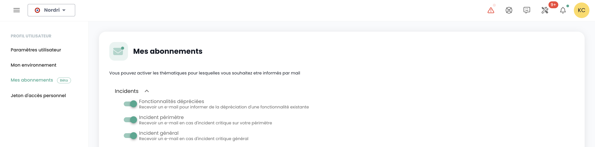

##  Tenant

### Création d'un tenant

La création d'un tenant est réalisée par une demande de service indiquant :

    Der Name Ihrer Organisation
    Der Name eines Ansprechpartners mit seiner E-Mail und Telefonnummer zur Finalisierung der Konfiguration
    Den Namen des Tenants
    Die Verfügbarkeitszone oder alternativ den gewünschten physischen Standort des Tenants

### Auswahl eines Tenants

Die Auswahl des Tenants erfolgt über die Hauptseite der Shiva-Konsole:

*__Hinweis:__ Die Ressourcen eines Tenants sind ihm eigen und nicht mit anderen Tenants austauschbar.*

## Zugangskonten zur Shiva-Konsole

Die Zugangskonten zur Shiva-Konsole werden vom Hauptkonto des Auftraggebers nach Einladung erstellt (unabhängig vom Authentifizierungsverzeichnis).
Die Anmeldeinformationen sind global für Ihre [Organisation](concepts.md#organisations).

*__Hinweis:__ Die Identitätsföderation wird auf Organisationsebene verwaltet*

### Erstellung eines Benutzerkontos in Ihrer Organisation

Die Erstellung eines Benutzerkontos in Ihrer Organisation erfolgt durch Einladung. Um einen Benutzer in eine [Organisation](concepts.md#organisations) einzuladen, gehen Sie im linken Menü 'Administration' im grünen Banner in das Untermenü 'Benutzer'.  

Klicken Sie auf der Benutzerseite auf die Schaltfläche 'Neuer Benutzer'. 

Geben Sie dann die E-Mail-Adresse des Benutzers ein

Der Benutzer erhält dann eine Bestätigungs-E-Mail.  

Nach erfolgter Überprüfung kann sich der Benutzer in der Konsole anmelden.

### Zuweisung von Berechtigungen an einen Benutzer

Die Verwaltung der Benutzerrechte erfolgt über die Benutzerseite. 

Standardmäßig hat ein Benutzer keine Rechte. Daher muss der einladende Administrator ihm die für seine Tätigkeit erforderlichen Rechte zuweisen. Klicken Sie einfach auf das Menü 'Aktionen' des Benutzers und wählen Sie die Option 'Bearbeiten'.  

Das Menü zur Aktivierung der Rechte erscheint dann:

Die Konfiguration der Berechtigungen muss für jeden [Tenant](concepts.md#tenants) der [Organisation](concepts.md#organisations) erfolgen.

Die Liste der Berechtigungen und deren Definition ist [hier](#permissions) verfügbar.

### Ändern der Sprache eines Benutzers

Die Änderung der Sprache eines Benutzers erfolgt in seinem 'Profil', oben rechts auf dem Bildschirm, in den 'Benutzereinstellungen'.

Die Konfiguration wird für jeden Tenant [Tenant](concepts.md#tenants) vorgenommen.

### Abonnement zu thematischen Benachrichtigungen

Das Management der Abonnements ermöglicht den Erhalt von E-Mails zu aktivierten Themen, die automatisch bei entsprechenden Ereignissen gesendet werden.

Es ist im Benutzerprofil im Tab "Meine Abonnements" zugänglich:

Zum Beispiel werden im Falle eines Zwischenfalls E-Mail-Benachrichtigungen zu diesem Thema generiert.

Die Liste der verfügbaren Themen kann sich weiterentwickeln und an unsere operativen Umweltbedürfnisse und -veränderungen anpassen.

## Berechtigungen

### Welche Berechtigungen sind für Benutzerkonten der Shiva-Konsole verfügbar?

Hier ist die Liste der [verfügbaren Berechtigungen](#permissions).

### Wie fügt man eine Berechtigung hinzu?

Hier ist die [Verfahrensweise zur Zuweisung von Berechtigungen](#permissions).

### Warum kann ich keine Berechtigung hinzufügen?

Um eine Berechtigung hinzuzufügen, benötigen Sie die Berechtigung 'iam_write' sowie die Berechtigung, die Sie hinzufügen möchten.

### Wie fügt man einen Benutzer hinzu?

*__Hinweis:__ Um einen Benutzer hinzuzufügen, benötigen Sie die Berechtigung 'iam_write'__.*

### Wie auditiere ich die Zugriffe/Berechtigungen der Benutzer?

Gehen Sie auf die Benutzerseite und klicken Sie auf die Schaltfläche 'csv exportieren':

### Wie lösche ich einen Benutzer?

Im Menü 'Administration' auf dem grünen Banner links im Bildschirm, im Untermenü 'Benutzer', klicken Sie auf das Symbol 'Aktion' des Zielbenutzers und wählen Sie 'Löschen'.

*__Hinweis:__*
- *Um einen Benutzer hinzuzufügen, benötigen Sie die Berechtigung 'iam_write'.*
- *Wenn es sich um einen föderierten Benutzer handelt, __stellen Sie sicher, dass der Benutzer auch aus dem Identitätsverzeichnis entfernt wurde__.*

### Wie setze ich mein Passwort zurück?
Es ist möglich, das Passwort von der Anmeldeseite der Shiva-Konsole durch Klicken auf 'Passwort vergessen?' zurückzusetzen.

### Warum sind manche Benutzer ausgegraut?
Ausgegraute Benutzer sind diejenigen, die ihr Konto nicht bestätigt haben. Bei der Erstellung des Kontos hat der Benutzer eine Bestätigungs-E-Mail erhalten.  

Sobald die Verifizierung abgeschlossen ist, kann sich der Benutzer in der Konsole anmelden.  

Das Konto ist ausgegraut, solange die Überprüfung nicht abgeschlossen wurde.

### Was ist ein Personal Access Token (PAT)?

Die Generierung eines API-Schlüssels, auch __Personal Access Token (PAT)__ genannt,
ist eine sichere Möglichkeit, sich ohne grafische Benutzeroberfläche mit den Shiva-APIs zu verbinden.

### Was ist MFA und ist es obligatorisch?
MFA (Multi-Faktor-Authentifizierung) ist ein Konzept zur Überprüfung der Identität eines Benutzers in zwei Schritten, genannt __Zwei-Faktor-Authentifizierung__.

Der Benutzer muss zwei verschiedene Nachweise der Identität vorlegen. Im Fall der Shiva-Konsole ist die Zwei-Faktor-Authentifizierung obligatorisch und erfordert die Eingabe eines einmaligen Codes, nachdem der Benutzer sein Kontopasswort eingegeben hat.

## Zugriffs- und Authentifizierungsverwaltung

### Genehmigung des Zugangs zu einem Tenant: Zulässige IPs

Der Zugang zur Cloud-Management-Konsole ist streng auf zuvor zugelassene IP-Adressen beschränkt, in Übereinstimmung mit den Anforderungen der SecNumCloud-Zertifizierung. Diese Einschränkung gewährleistet ein erhöhtes Sicherheitsniveau, indem der Zugriff nur für Benutzer aus bestimmten IP-Bereichen möglich ist, wodurch unbefugter Zugriff minimiert und die Cloud-Infrastruktur nach den höchsten Sicherheitsstandards geschützt wird.

Es ist nun möglich, die Liste der zugelassenen öffentlichen IP-Adressen für den Tenant anzuzeigen und direkt von der Registerkarte "Administration > Zugriff" eine neue öffentliche IP-Adresse zu dieser Liste hinzuzufügen.

Hierfür muss der Benutzer über das Recht `console_public_access_read` verfügen, um die zugelassenen IPs anzusehen, und über das Recht `console_public_access_write`, um eine öffentliche IP-Adresse zur Liste hinzuzufügen.

Es ist dann möglich, eine neue IP hinzuzufügen:

Hinweis: *Das Löschen einer zugelassenen IP erfolgt durch eine Support-Anfrage in der Cloud Temple-Konsole.*