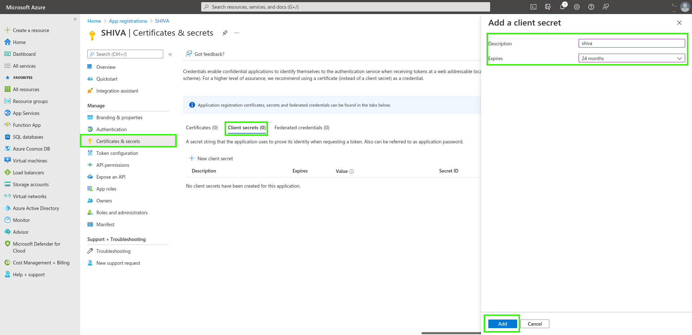
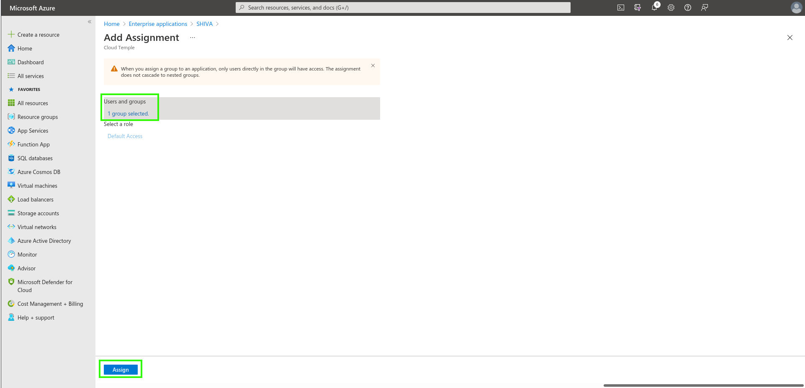

Hier ist ein Beispiel für die Konfiguration des Authentifizierungsrepositorys einer Cloud Temple Organisation mit __Microsoft EntraID__ (Azure Active Directory).  

Die Konfiguration Ihres Microsoft Repositorys auf Organisationsebene in Cloud Temple erleichtert die Authentifizierung Ihrer Benutzer in der Shiva Konsole. Dies vermeidet die Vervielfachung von Authentifizierungsfaktoren und verringert die Angriffsfläche.  

Wenn Ihre Benutzer bei ihrem Microsoft-Konto authentifiziert sind, wird die Authentifizierung bei den Diensten der Shiva Konsole nahtlos sein.

Hier sind die verschiedenen Schritte zur Durchführung dieser Konfiguration:


## Schritt 1: Konfiguration des SSO auf der Microsoft Azure Seite

### Registrierung einer neuen Azure Anwendung (Azure-Portal)

Für die Erstellung der __App Registration__ muss man sich auf das Microsoft Azure Portal begeben, dann zu Microsoft EntraID, __"ADD > App Registration"__ 

Auf der Seite "Register an application", geben Sie bitte folgendes an:
```
- __Name__ : Geben Sie "__SHIVA__" ein
- __Supported account types__ :  __Accounts in this organizational directory only__ (__<Ihr Azure Tenant>__ only - Single tenant)
- __Redirect URL__ : Zunächst nicht konfigurieren. Die URL wird vom Cloud Temple Support bereitgestellt und muss später in dieses Feld eingefügt werden.
```


Die Informationen **Application (client) ID** und **Directory (tenant) ID** sind die relevanten Angaben, die bei der Supportanfrage an das Cloud Temple Team zur Aktivierung der Microsoft EntraID Authentifizierung auf Organisationsebene angegeben werden müssen.


### Definition eines Geheimnisses
Im Reiter "Certificates & secrets" ein neues Geheimnis erstellen.  

*Hinweis: Das Ablaufdatum des Geheimnisses darf maximal 24 Monate betragen, auch mit einem benutzerdefinierten Ablaufdatum.*



Das generierte Geheimnis muss in der Supportanfrage angegeben werden:


### Definition des EntraID Tokens

Das EntraID Token ist für die Konfiguration der Authentifizierung erforderlich.  

Im Menü __"Token Configuration"__ auf __"Add optional claim"__ klicken. Sie müssen "ID" als Token-Typ auswählen und "email" ankreuzen.


Die Azure Schnittstelle wird Sie fragen, ob Sie eine Berechtigung hinzufügen möchten, die es Ihnen ermöglicht, die E-Mail eines Benutzers zu lesen (Microsoft Graph email), kreuzen Sie das entsprechende Kästchen an und bestätigen Sie.


Gehen Sie dann zu "API permissions" und klicken Sie auf __"Grant admin consent for Cloud Temple"__.


### Zusätzliche Sicherheitskonfigurationen (optional, aber empfohlen)

Standardmäßig erlaubt Microsoft EntraID in der konfigurierten Form jedem Benutzer Ihres Azure Tenants, sich in Ihre Cloud Temple Organisation einzuloggen.
Es ist möglich, im Bereich __"App Registration"__ den Zugriff einzuschränken, um nur einer Liste von Benutzern oder Gruppen zu erlauben, sich in Ihre Cloud Temple Organisation einzuloggen.

Hier ist das Verfahren zu befolgen;

#### Zugriff auf die zusätzlichen Einstellungen "App Registration"
##### Option 1
Gehen Sie zum Reiter "Overview" und klicken Sie auf den Namen der Anwendung (den Link hinter "Managed application").


##### Option 2
Gehen Sie zu den "Enterprise applications" und suchen Sie unter Verwendung des zuvor erstellten Anwendungsnamens.


#### Einschränkung der Authentifizierung auf Benutzer, die der Anwendung zugewiesen sind

Geben Sie hier die Notwendigkeit einer Benutzerzuweisung zur Anwendung an, um deren Authentifizierung zu erlauben:


#### Zuweisung von Benutzern und Gruppen zur Anwendung
Nur die Benutzer und Gruppen, die der Anwendung zugewiesen sind, können sich über die App Registration in Ihre Cloud Temple Organisation einloggen.


Schließlich müssen Sie nur noch die Zuweisung durch Klicken auf "Assign" bestätigen.



Nun können sich die der Anwendung zugewiesenen Benutzer in Ihre Cloud Temple Organisation über die erstellte Anwendung einloggen.

## Schritt 2: Beantragung der Konfiguration des SSO (Single Sign-On) für Ihre Organisation

Dieser Teil der Konfiguration erfolgt auf Organisationsebene durch das Cloud Temple Team.  

Dazu stellen Sie bitte __eine Supportanfrage__ in der Konsole und geben an, dass Sie eine Microsoft EntraID SSO konfigurieren möchten.  

Geben Sie in der Supportanfrage die folgenden Informationen an:

    Der Name Ihrer Organisation
    Der Name eines Kontakts mit seiner E-Mail und Telefonnummer zur abschließenden Konfiguration
    Application ID (eindeutig identifizierend mit der zuvor erstellten Anwendung verbunden)
    Directory ID (entspricht der Azure AD-Tenant-ID)
    Secret (mit der zuvor erstellten Anwendung verbundenes Geheimnis)

Sobald die Konfiguration auf der Shiva Konsole abgeschlossen ist, wird die angegebene Kontaktperson informiert.

## Schritt 3: Abschluss der Konfiguration

Auf der Startseite der App Registration im Menü Overview, klicken Sie auf "Add a Redirect URL".


Gehen Sie dann zu "Add a platform" und fügen Sie eine vom Typ Web hinzu.


Sie müssen nur die von der Team Produkt Anwendungen bereitgestellte "Redirect URL" eintragen.


Sie sollten dieses Ergebnis erhalten, sobald die "Redirect URL" hinzugefügt wurde.


Die Konfiguration der "Redirect URL" kann einige Minuten dauern, bis sie wirksam wird.
Sobald alle Schritte abgeschlossen sind, können Sie sich über Ihr SSO in Ihre Cloud Temple Organisation authentifizieren.

