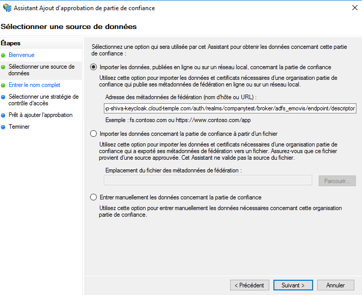
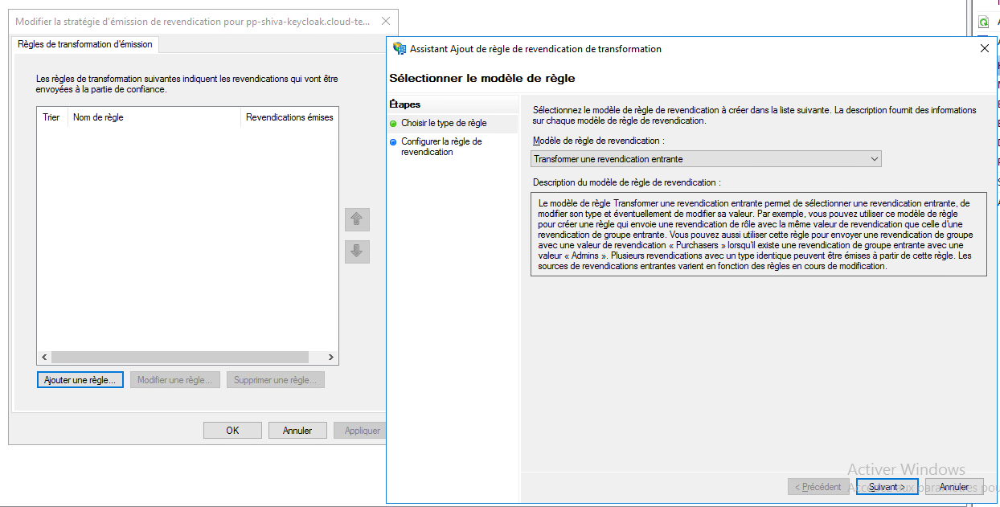

Hier ist ein Beispiel für die Konfiguration des Authentifizierungsrepositorys einer Cloud Temple-Organisation mit __Microsoft ADFS__.

Die Konfiguration Ihres Microsoft-Repositorys auf Organisationsebene bei Cloud Temple erleichtert die Authentifizierung Ihrer Benutzer auf der Shiva-Konsole.
Dies vermeidet die Vervielfachung von Authentifizierungsfaktoren und verringert die Angriffsfläche.
Wenn Ihre Benutzer bei ihrem Microsoft-Konto authentifiziert sind, wird die Authentifizierung für die Dienste der Shiva-Konsole transparent sein.

Hier sind die verschiedenen Schritte zur Durchführung dieser Konfiguration:


## Voraussetzungen
Ihr Microsoft ADFS-Server muss auf die folgende Cloud Temple-URL zugreifen können: https://keycloak-shiva.cloud-temple.com/auth/.

ADFS muss von den Netzwerken von Cloud Temple aus zugänglich sein und __ein TLS-Zertifikat von einer öffentlichen CA ausstellen__ können.

Benutzer, die sich über das Portal anmelden möchten, müssen ihre E-Mail, ihren Vor- und Nachnamen im Active Directory eingetragen haben.

## Schritt 2: Konfigurieren des SSO (Single Sign-On) für Ihre Organisation anfordern

Dieser Teil der Konfiguration erfolgt auf Organisationsebene durch das Cloud Temple-Team.

Stellen Sie hierzu __eine Supportanfrage__ in der Konsole, in der Sie Ihr Interesse an der Konfiguration Ihres Microsoft ADFS-Authentifizierungsrepositorys mitteilen.

Bitte geben Sie in der Supportanfrage folgende Informationen an:
```
    Den Namen Ihrer Organisation
    Den Namen eines Ansprechpartners mit E-Mail und Telefonnummer zur abschließenden Konfiguration
    Öffentliche URL für die Metadaten der ADFS-Föderation (<ADFS-Domänenname>/FederationMetadata/2007-06/FederationMetadata.xml)
    (Beispiel: https://adfs.test.local/FederationMetadata/2007-06/FederationMetadata.xml)
```
Sobald die Konfiguration auf der Shiva-Konsole abgeschlossen ist, wird der angegebene Kontakt informiert.

Das Cloud Temple-Supportteam wird Ihnen eine URL übermitteln, die in etwa so aussieht: https://keycloak-shiva.cloud-temple.com/auth/realms/companytest/broker/adfs_test/endpoint/descriptor

*Sie können die URL in einen Webbrowser einfügen, um sie zu testen. Wenn sie korrekt funktioniert, sollten Sie ein XML-Dokument sehen.*

## Schritt 3: Durchführung der ADFS-Konfiguration
### Konfiguration der Authentifizierungsföderation

#### Hinzufügen einer Vertrauensstellung für vertrauende Seiten

Wechseln Sie auf Ihrem ADFS-Server zu __"Vertrauensstellung für ADFS hinzufügen"__.


### Konfigurieren der "Claims"
Die Claims bieten Informationen für das Token, das an die Cloud Temple-Konsole übermittelt wird.

Sie übermitteln die Informationen des angemeldeten Benutzers, die für das ordnungsgemäße Funktionieren der verschiedenen Dienste erforderlich sind, wie z.B. seine E-Mail, seinen Vor- und Nachnamen.


Wählen Sie "Daten der vertrauenden Partei online oder auf einem lokalen Netzwerk importieren" und geben Sie die vom Cloud Temple-Support bereitgestellte URL ein.



Sie können einen Namen und eine Beschreibung für die vertrauende Partei angeben, dieser Teil ist optional.


Standardmäßig erlauben wir allen Zugriff, es ist jedoch möglich, __"Eine bestimmte Gruppe zulassen"__ auszuwählen, um die Gruppen zu bestimmen, die über ADFS Zugriff auf die Dienste der Shiva-Konsole haben.


Nach dem Ausführen aller dieser Schritte haben Sie die Konfiguration der vertrauenden Partei abgeschlossen.


Anschließend müssen Sie die Anspruchsausstellungsrichtlinie für diese neue vertrauende Partei bearbeiten.


Klicken Sie auf "Regel hinzufügen" und geben Sie das Modell an, z.B. "Eingehenden Anspruch transformieren".



Sie müssen dann die Informationen gemäß dem untenstehenden Screenshot ausfüllen.


### Anspruch hinzufügen
Fügen Sie eine zweite Regel hinzu, diesmal mit dem Modell "LDAP-Attribute als Claims senden".


Wählen Sie den Attributspeicher und fügen Sie die Attribute "E-Mail-Adressen, Vorname, Nachname und SAM-Account-Name" hinzu, wie im folgenden Screenshot angegeben.


Sie müssen nur die Änderungen übernehmen.

## Schritt 3: Abschluss

Sie können nun testen, indem Sie zur Shiva-Konsole wechseln und auf die Schaltfläche für die ADFS-Client-Authentifizierung klicken; in diesem Beispiel lautet diese __"ADFS Test"__

