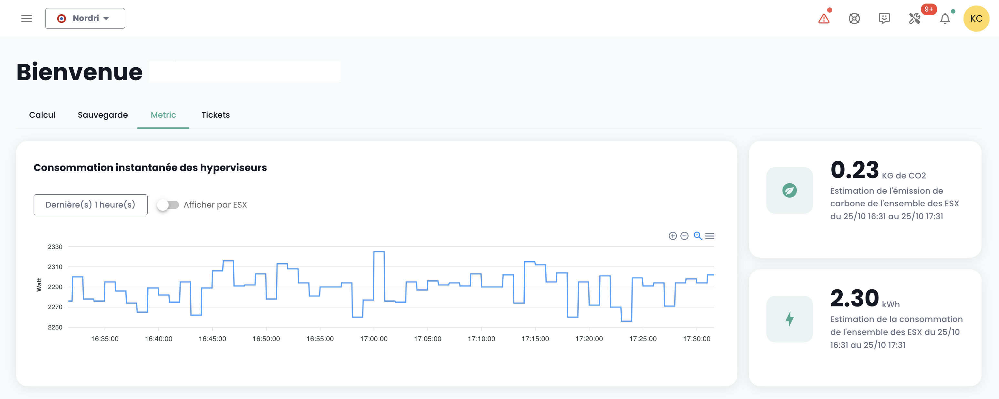
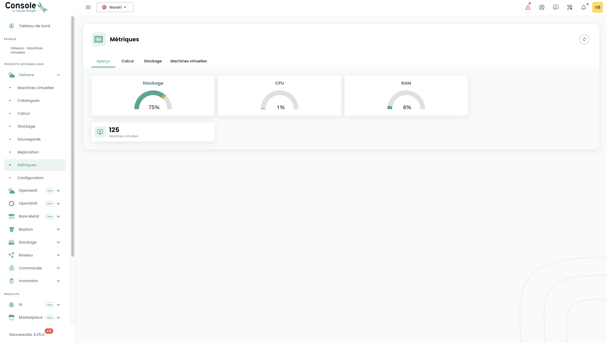
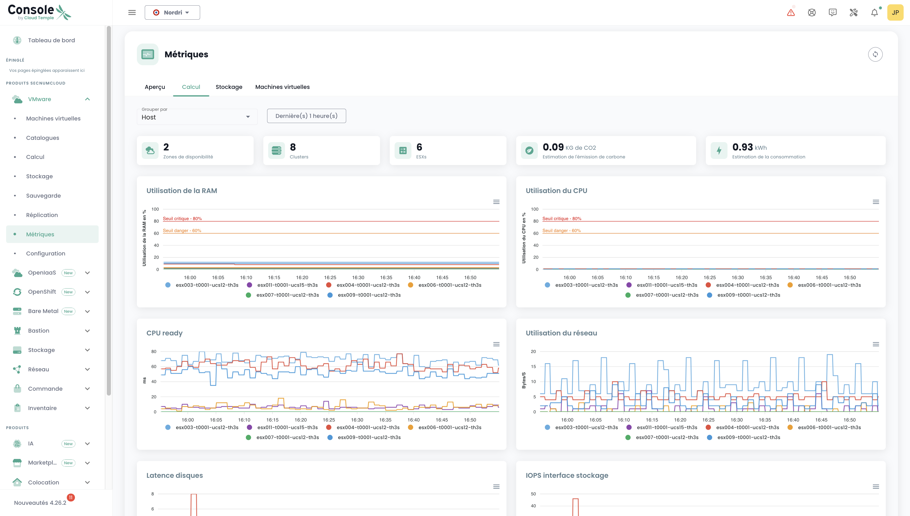

## Concept

Die Mehrheit der __Cloud Temple__-Kunden verfügt über Visualisierungs-, Überwachungs- und Messwerkzeuge zur Verfolgung ihrer Operationen.

Das Konzept der Shiva-Konsole besteht darin, den Zugang zu Daten zu ermöglichen, um sich über einen integrierten Prometheus-Proxy in diese Werkzeuge zu integrieren.

Dieser Proxy ermöglicht es Ihnen, Daten aus einem Visualisierungswerkzeug wie [Grafana](https://grafana.com) abzufragen und zu manipulieren.

Es ist jedoch möglich, bestimmte Leistungsdaten Ihrer Cloud-Ressourcen in der Weboberfläche der Shiva-Konsole anzuzeigen.

*__Hinweis:__ Die Philosophie von __Cloud Temple__ besteht nicht darin, mehrere Grafiken in die Weboberfläche zu integrieren, sondern möglichst viele Informationen über die API zugänglich zu machen.*

## In das Webinterface integriertes Dashboard

*__Hinweis:__ Um auf diese Dashboards zugreifen zu können, ist das Recht __'metric_read'__ erforderlich.*

### Überwachung der Kohlenstoffemissionen für die Berechnung

Das Dashboard der Shiva-Konsole enthält standardmäßig ein Diagramm zur Überwachung des Energieverbrauchs Ihrer Berechnungen sowie die geschätzten Kohlenstoffemissionen.

Es ist direkt auf der Startseite der Weboberfläche der Cloud Temple-Konsole zugänglich, indem Sie auf __'Metric'__ klicken:

### Gesamtsicht auf den Zustand der virtuellen Maschinen

Die Zusammenfassung des Zustands der virtuellen Maschinen ist im Menü __'IaaS'__ links auf Ihrem Bildschirm, im Untermenü __'Gesundheit'__ und dann __'Virtuelle Maschinen'__ verfügbar.

Diese Zusammenfassung bietet, innerhalb des in __'Filter'__ ausgewählten Zeitraums:

- die Anzahl der CPUs und die __durchschnittliche CPU-Auslastung__,
- die Anzahl der GB an Speicher und die __durchschnittliche Speichernutzung__,
- die Durchschnittswerte für die __Latenzzeiten beim Speicherzugriff__ beim Lesen und Schreiben,
- Den __'CPU Ready'__-Durchschnitt der virtuellen Maschine (das entspricht der durchschnittlichen Wartezeit einer virtuellen Maschine auf die Verfügbarkeit eines physischen Kerns).

Für jede VM können Sie auf die Leistungsübersicht zugreifen, indem Sie auf das grüne Symbol __'Historique'__ in der Aktionsspalte der virtuellen Maschine klicken:

Sie gelangen dann zur Seite mit der grafischen Anzeige der archivierten Daten, einschließlich einer __Umweltleistungsansicht__:

## Verwendung mit __Grafana__

Die Shiva-Konsole kann als __Datenquelle__ für Ihre [Grafana](https://grafana.com)-Infrastruktur dienen.

Eine Reihe von __Beispielkonfigurationen für Grafana__ finden Sie hier:

https://github.com/Cloud-Temple/console-grafana-iaas

