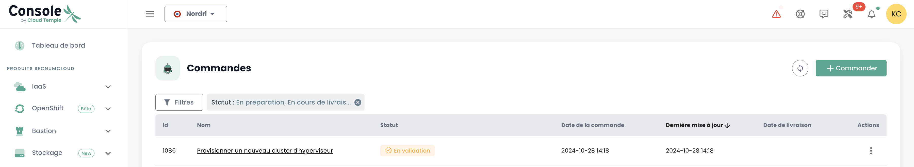

## Konzept

Die Überwachung des Einsatzes neuer Ressourcen erfolgt im Menü __'Befehle'__ im linken grünen Panel des Bildschirms.

Es ermöglicht die Anzeige der georderten, in Bereitstellung befindlichen und etwaigen Fehler innerhalb eines [Tenants](iam/concepts.md#tenant) Ihrer [Organisation](iam/concepts.md#organisations).

*__Hinweis: Derzeit ist eine globale Ansicht auf Organisationsebene aller bereitgestellten Ressourcen in den verschiedenen Tenants noch nicht möglich.__ Dieses Thema wird 2024 durch die Implementierung eines speziellen Portals für den Auftraggeber (im Sinne des Unterzeichners) und die Verwaltung seiner Organisation behandelt.*

Die Bereitstellung oder Löschung von Ressourcen erfolgt in den jeweiligen Produkten in den Menüs __'IaaS'__ und __'Netzwerk'__ im linken grünen Panel des Bildschirms.

Es ist auch möglich, die Lieferungen direkt auf der Benachrichtigungsseite der Cloud Temple-Konsole zu sehen:

Auf der Bestellseite können Sie den Fortschritt einer Lieferung sehen und bei Bedarf mit dem Team kommunizieren, indem Sie Kommentare oder Klarstellungen hinzufügen:

**Hinweis**: **Es ist nicht möglich, mehrere Bestellungen desselben Ressourcentyps gleichzeitig zu starten. Sie müssen daher warten, bis die aktuelle Bestellung bearbeitet und abgeschlossen ist, bevor Sie eine neue aufgeben können. Dies gewährleistet ein effizientes und geordnetes Ressourcenmanagement in Ihrer Umgebung.**

## Eine neue Verfügbarkeitszone bestellen

Es ist möglich, eine neue Verfügbarkeitszone hinzuzufügen, indem Sie auf das Menü "**Bestellung**" zugreifen. Diese Option ermöglicht es Ihnen, Ihre Ressourcen zu erweitern und die Verfügbarkeit und Ausfallsicherheit Ihrer Anwendungen in nur wenigen Klicks zu verbessern:

Beginnen Sie zunächst mit der Auswahl des gewünschten Standorts, indem Sie die geografische Region auswählen, gefolgt von der entsprechenden Verfügbarkeitszone (AZ) aus den verfügbaren. In diesem Schritt können Sie die Bereitstellung Ihrer Ressourcen an die Lokalisierung und Anforderungen Ihrer Infrastruktur anpassen:

Fahren Sie dann mit der Auswahl der gewünschten Hypervisor-Cluster-Option fort, indem Sie denjenigen auswählen, der am besten zu den Leistungsanforderungen und Verwaltungsbedürfnissen Ihrer Cloud-Infrastruktur passt:

Wählen Sie anschließend die Anzahl der Hypervisoren sowie die gewünschte Speichergröße aus, um die Ressourcen an die Arbeitslast und spezifischen Anforderungen Ihrer Cloud-Umgebung anzupassen:

Wählen Sie dann die Anzahl der zu provisionierenden Datenspeicher im Cluster sowie deren Typen. Es ist wichtig zu beachten, dass die maximal zulässige Anzahl an Datenspeichern 10 beträgt, wobei mindestens 2 erforderlich sind. Jede unterschiedliche Datenspeichertypenwahl führt zur Erstellung eines zusätzlichen datastoreCluster. Beispielsweise führt die Auswahl von 2 Datenspeichern des Typs "Live" und 1 des Typs "Mass" zur Bildung von 2 separaten datastoreClusters:

Legen Sie die benötigte Speicherkapazität für das Backup fest und stellen Sie sicher, eine gleichwertige Kapazität wie bei Ihrem Produktionsspeicher vorzusehen. Berücksichtigen Sie eine durchschnittliche Kompressionsrate von 2, um den Speicherplatz effizient zu nutzen und einen wirksamen Schutz Ihrer Daten zu gewährleisten:

Wählen Sie die Netzwerke aus, die je nach Bedarf propagiert werden sollen. Sie haben auch die Möglichkeit, die Option "Internet-Zugang" zu aktivieren, indem Sie die gewünschte Anzahl an IP-Adressen definieren, die zwischen 1 und maximal 8 liegen kann:

Abschließend erhalten Sie eine Zusammenfassung der ausgewählten Optionen, bevor Sie Ihre Bestellung bestätigen.

## Zusätzlichen Speicher bestellen

Die Logik zur Speicherzuweisung im Blockmodus auf den Rechen-Cluster ist TODO

### Einen neuen Rechen-Cluster bereitstellen

Bestellen Sie einen Hypervisor-Cluster, indem Sie die Optionen auswählen, die Ihren Virtualisierungsbedürfnissen entsprechen. Definieren Sie die Schlüsselfaktoren wie die Anzahl der Hypervisoren, den Cluster-Typ, die Speichergröße sowie die benötigten Rechenressourcen:

Wählen Sie die Verfügbarkeitszone aus:

Wählen Sie den Typ der Rechenleistung:

Sie haben dann die Möglichkeit, bestehende Netzwerke auszuwählen und zu propagieren oder neue Netzwerke direkt in diesem Schritt je nach Bedarf Ihrer Infrastruktur zu erstellen. Beachten Sie, dass die Gesamtanzahl der konfigurierbaren Netzwerke auf maximal 20 begrenzt ist:

Abschließend erhalten Sie eine Zusammenfassung der ausgewählten Optionen, bevor Sie Ihre Bestellung bestätigen und die laufende Bestellung einsehen können:

### Einen neuen Speicher-Cluster bereitstellen

Im Menü "**Bestellung**" bestellen Sie einen **neuen Speicher-Cluster** für Ihre Umgebung, indem Sie die Optionen auswählen, die Ihren Bedürfnissen in Bezug auf Kapazität, Leistung und Redundanz entsprechen. Wählen Sie den Standort:

Definieren Sie die Anzahl der zu provisionierenden Datenspeicher im Cluster sowie deren Typen, indem Sie die folgenden Einschränkungen beachten: Mindestens 2 und maximal 10 Datenspeicher können konfiguriert werden. Wählen Sie die Datenspeichertypen, die am besten zu Ihren Leistungs-, Kapazitäts- und Einsatzanforderungen passen, um den Speicher Ihrer Umgebung zu optimieren:

Wählen Sie den gewünschten Speichertyp aus den verfügbaren Optionen:

Abschließend erhalten Sie eine vollständige Zusammenfassung der ausgewählten Optionen, die es Ihnen ermöglicht, alle Parameter zu überprüfen, bevor Sie Ihre Bestellung endgültig bestätigen:

### Einen neuen Datastore in einem VMware SDRS-Cluster bereitstellen

In diesem Beispiel fügen wir Blockspeicher für eine VMware-Infrastruktur hinzu. Um einen weiteren Datenspeicher in Ihrem SDRS-Speicher-Cluster hinzuzufügen, gehen Sie in das Untermenü __'Infrastruktur'__ und dann __'VMWare'__. Wählen Sie dann den VMware-Stack und die Verfügbarkeitszone. Gehen Sie dann in das Untermenü __'Speicher'__.

Wählen Sie den SDRS-Cluster aus, der den gewünschten Leistungsmerkmalen entspricht, und klicken Sie auf die Schaltfläche __'Datastore hinzufügen'__, die sich in der Tabelle mit der Datenspeicherliste befindet.

__Hinweis__:  
- *Die kleinste auf einem Cluster aktivierbare LUN-Größe beträgt __500 GiB__.*  
- *Die Leistung eines Datenspeichers reicht durchschnittlich von 500 IOPS/TiB bis zu 15000 IOPS/TiB. __Dies ist eine softwareseitige Drosselung auf Controller-Ebene__.*  
- *Das Volumen des von Ihrer Organisation genutzten Speicherplatzes ergibt sich aus der Summe aller LUNs in den verwendeten AZs.*  
- *Die Berechtigungen __'order'__ sowie __'compute'__ sind für das Konto erforderlich, um diese Aktion auszuführen.*

### Neue Netzwerke bestellen

Die Netzwerktechnologie, die in der Cloud Temple-Infrastruktur verwendet wird, basiert auf [VPLS](https://fr.wikipedia.org/wiki/Virtual_Private_LAN_Service). Sie ermöglicht Ihnen __Layer-2-Netzwerke zwischen Ihren Verfügbarkeitszonen innerhalb einer Region__. Es ist auch möglich, Netzwerke zwischen Ihren Tenants zu teilen und sie in der Hosting-Zone zu beenden. Grundsätzlich können Sie sich ein Cloud Temple-Netzwerk wie ein 802.1Q-VLAN vorstellen, das an jedem Punkt Ihres Tenants verfügbar ist.

TODO

Die Bestellung eines neuen Netzwerks und die Entscheidungen über das Teilen zwischen Ihren Tenants werden im Menü __'Netzwerk'__ im linken grünen Panel des Bildschirms vorgenommen. Die Netzwerke werden zuerst erstellt, dann wird eine separate Bestellung zur Propagierung generiert. Sie können den Fortschritt der laufenden Bestellungen im Register "Bestellung" im Menü verfolgen oder auf die Info-Labels klicken, die Sie zu den aktiven oder in Bearbeitung befindlichen Bestellungen weiterleiten.

Es ist auch möglich, bestehende Netzwerke zu propagieren oder die beiden Schritte zu trennen, indem zuerst das Netzwerk erstellt und dann je nach Bedarf später propagiert wird. Die Propagierungsoption befindet sich in den Optionen des ausgewählten Netzwerks:

Klicken Sie auf die Option "Propagieren" für ein bestehendes Netzwerk und wählen Sie dann das gewünschte Ziel der Propagierung. Dieser Schritt ermöglicht es Ihnen, den Ort oder die Ressourcen zu definieren, auf die das Netzwerk propagiert werden soll:

### Deaktivierung eines Netzwerks

Ein Netzwerk kann bei Bedarf auch deaktiviert werden. Diese Option ermöglicht es Ihnen, den Zugriff oder die Nutzung des Netzwerks vorübergehend zu pausieren, ohne es endgültig zu löschen, und bietet so Flexibilität bei der Verwaltung Ihrer Infrastruktur nach Ihren Bedürfnissen.

Die Deaktivierungsoption befindet sich in den Optionen des ausgewählten Netzwerks.

## Zusätzlichen Hypervisor zu einem Rechen-Cluster hinzufügen

Die Betriebslogik der Rechen-Cluster ist TODO

Das Hinzufügen von Hypervisoren zu einem Rechen-Cluster erfolgt im Menü __'IaaS'__ im linken grünen Panel des Bildschirms.
Im folgenden Beispiel fügen wir Rechenleistung zu einem Hypervisor-Cluster hinzu, der VMware-Technologie verwendet.
Allez dans le sous menu __'Infrastructure'__ puis __'VMWare'__. Choisissez alors la stack vmware et la zone de disponibilité et le cluster de calcul. Dans cet exemple, il s'agit du __'clu001-ucs12'__. Cliquez sur le bouton __'Ajouter un host'__ qui se situe dans le tableau avec la liste des hosts, en haut à droite.

__nota__ :

- *__La configuration d'un cluster doit être homogène__. Ainsi, il n'est pas permis de mixer les types d'hyperviseur au sein d'un cluster. Toutes les lames doivent être de même type.*
- *Les droits __'order'__ ainsi que __'compute'__ sont nécessaires au compte pour mener cette action.*

## Ajouter de la ressource mémoire supplémentaire à un cluster de calcul

La logique d'allocation de la mémoire sur les clusters de calcul est TODO

Pour ajouter de la mémoire vive sur un cluster, il suffit de se rendre sur la configuration du cluster (comme pour l'ajout d'un hôte de calcul tel que précédemment vue) et de cliquer sur __'Modifier la mémoire'__.

__nota__ :
- *__Les machines sont livrées avec la totalité de la mémoire physique__. Le débridage de la ressource mémoire n'est qu'une activation logicielle au niveau d'un cluster.*  
- *Il n'est pas possible de modifier la quantité de mémoire physique d'un type de lame. Bien tenir compte de la capacité maximale d'une lame lors de la création d'un cluster.*  
- *Les droits __'order'__ ainsi que __'compute'__ sont nécessaires au compte pour mener cette action.*