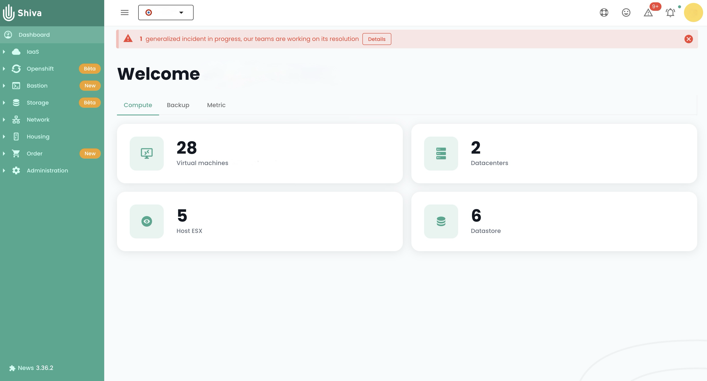
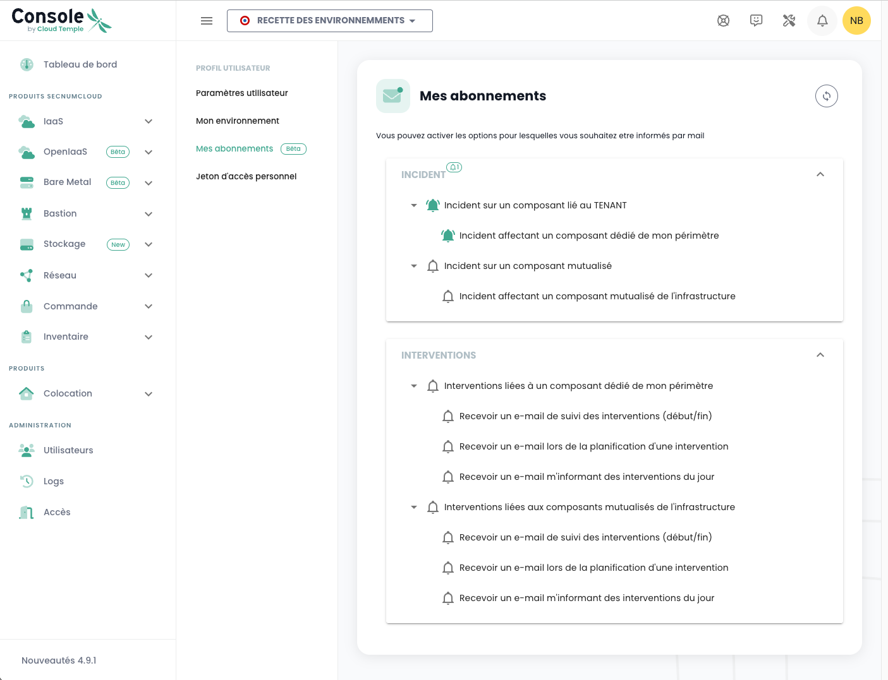
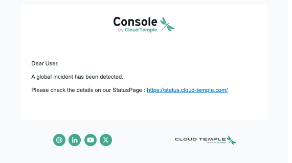

title: Geplante Operationen und Vorfallmanagement
---

Wie jede Cloud-Infrastrukturplattform unterliegt die Cloud Temple Plattform regelmäßigen Hardware- und Software-Wartungen und -Upgrades.

## Zugriff auf laufende Operationen und Vorfälle

Das Symbol zur Operationsverfolgung ermöglicht es Ihnen, geplante Operationen auf der Cloud Temple Infrastruktur sowie offene Vorfälle auf dem Tenant einzusehen. Dieses Symbol ist in der Symbolleiste oben links auf dem Bildschirm zugänglich und hat die Form eines __'Werkzeug'__-Symbols.

Dieses Symbol soll Sichtbarkeit über laufende und abgeschlossene geplante Eingriffe und/oder Vorfälle auf dem Tenant bieten.

Wenn Eingriffe und/oder Vorfälle im Gange sind, erscheint eine Zahl auf dem Symbol.

Durch Klicken auf Schnellansicht finden Sie die laufenden Eingriffe. Es ist auch möglich, auf __'Alle Eingriffe'__ oder __'Alle Tenant-Vorfälle und Berichte'__ zu klicken, um weitere Details anzuzeigen.

## Verfolgung geplanter Eingriffe

Die Seite Eingriffe besteht aus zwei Registerkarten. Die erste Registerkarte ermöglicht es Ihnen, Eingriffe einzusehen, die für die nächsten 30 Tage geplant sind, sowie laufende Eingriffe.

Abgeschlossene Eingriffe sind in der zweiten Registerkarte 'Abgeschlossen' sichtbar.

Der Zugriff auf diese Informationen erfordert für das Benutzerprofil die Berechtigung '**intervention_read**'.

## Vorfallmanagement

Es können zwei Arten von Vorfällen unterschieden werden: globale Vorfälle, die das gesamte System betreffen, und Vorfälle, die spezifisch für einen Kundenbereich sind und nur die Ressourcen oder Dienste betreffen, die mit einem bestimmten Kunden verbunden sind.

### Globale Vorfälle

Das Abrufen von Informationen über globale Vorfälle erfordert keine besondere Berechtigung. Ein rotes Banner wird angezeigt, sobald Sie sich mit der Konsole verbinden, um vor dem Vorhandensein eines globalen Vorfalls zu warnen, der gerade gelöst wird. Der Benutzer hat die Möglichkeit, dieses Banner während seiner Sitzung vorübergehend auszublenden, aber es wird bei jeder neuen Verbindung oder beim Aktualisieren der Seite wieder erscheinen, solange der Vorfall nicht gelöst ist.

Eine Schaltfläche __'Mehr erfahren'__ leitet zur öffentlichen Seite zur Vorfallverfolgung weiter, die Zugang zu zusätzlichen Informationen über den laufenden Vorfall ermöglicht:

Es ist möglich, Berichte über globale Vorfälle zu erhalten. Der Zugriff auf diese Berichte erfordert die spezifische Berechtigung '**incident_management**'.

Hier ist ein Beispiel für die Registerkarte, die diese Berichte anzeigt:

### Vorfälle in einem Kundenbereich

Die Sichtbarkeit von Vorfällen, die spezifisch für einen Kundenbereich sind, erfordert die Berechtigung **incident_read**. Diese Vorfälle werden durch ein spezielles Symbol dargestellt, begleitet von einem roten Abzeichen, das die Anzahl der laufenden Vorfälle anzeigt.

Das Symbol ist anklickbar und ermöglicht es, die mit den Vorfällen verbundenen Tickets aufzulisten. Jedes Ticket enthält einen Link zu den Details des Vorfalls, der die Möglichkeit bietet, den Fortschritt ihrer Lösung zu verfolgen:

Um die Details eines Vorfalls einzusehen, ist es notwendig, der Autor des Vorfalltickets zu sein oder über die Berechtigung **support_management** zu verfügen.

### Benachrichtigungsverwaltung

Um Benutzer im Falle eines neuen Vorfalls schnell zu informieren, wurde ein E-Mail-Benachrichtigungssystem eingerichtet. Von ihrem Benutzerprofil aus ermöglicht eine Registerkarte mit dem Titel '*Meine Abonnements*' den Benutzern, Benachrichtigungen für beide Arten von Vorfällen zu abonnieren. So erhalten sie innerhalb kürzester Zeit eine E-Mail, wenn ein Vorfall gemeldet oder gelöst wird.

Der Betreff der E-Mail gibt die Art des Vorfalls an und im Falle eines bereichsbezogenen Vorfalls den Namen des betroffenen Bereichs. Die Benachrichtigung enthält auch einen Link, der direkten Zugang zu den Details des Vorfalls ermöglicht:

