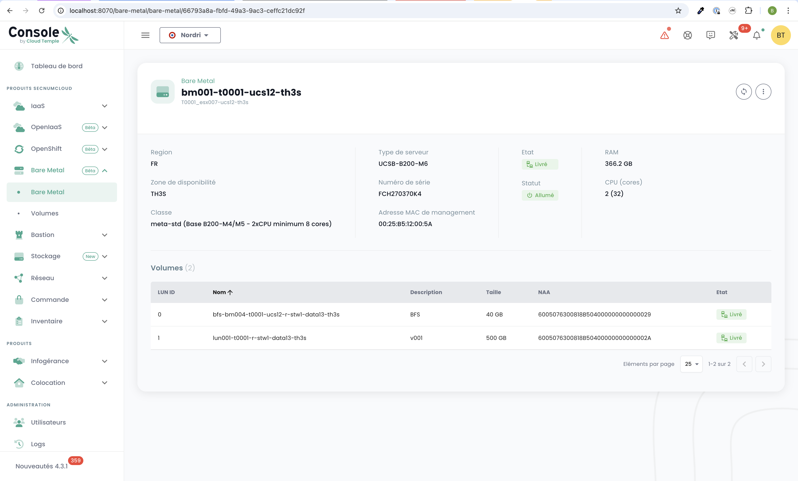

# QuickStart für das Bare-Metal-Angebot

Diese Seite führt Sie durch die ersten Schritte zur Nutzung des **Bare Metal** Angebots über die Cloud Temple Konsole. Folgen Sie diesen Anweisungen, um die verfügbaren Menüs und Funktionen zu entdecken.

---

## Voraussetzungen
Bevor Sie beginnen, stellen Sie sicher, dass die folgenden Punkte erfüllt sind:
1. **Aktiviertes Abonnement**: Ihre Organisation muss eine Bare-Metal-Subscription abgeschlossen haben.
2. **Benutzerberechtigungen**: Ihr Benutzerkonto muss über die erforderlichen Rechte verfügen, um auf die Bare-Metal-Ressourcen zuzugreifen und diese zu verwalten.

---

## Zugriff auf die Bare-Metal-Oberfläche

Sobald das Abonnement aktiviert und die Berechtigungen konfiguriert wurden, erscheint ein neues Menü mit dem Titel **Bare Metal** in der Cloud Temple Konsole. Dieses Menü enthält zwei Hauptuntermenüs: **Bare Metal** und **Volumes**.

---

### 1. Untermenü **Bare Metal**

Das Untermenü **Bare Metal** zeigt Ihnen eine Tabelle mit allen verfügbaren Bare-Metal-Instanzen an. Diese Tabelle enthält die Hauptinformationen für jede Instanz:
- **Bare Metal Name**
- **Status**
- **Hardware-Konfiguration**
- **IP-Adresse**

#### Hauptfunktionen
- **Aktions-Button**: Ermöglicht den direkten Zugriff auf die Verwaltungsoberfläche des Bare Metal.
- **Klickbarer Name**: Durch Klicken auf den Namen einer Bare-Metal-Instanz wird eine neue Seite mit den **vollständigen Details** der Instanz angezeigt:
  - Hardware-Informationen (RAM, CPU, GPU usw.).
  - Netzwerkkonfiguration (zugeordnete IP-Adressen).
  - Konnektivitätsinformationen für die Verwaltung.

---

### 2. Untermenü **Volumes**

Das Untermenü **Volumes** zeigt eine Tabelle mit allen Speicherdateien, die Ihrem Bare-Metal-Abonnement zugeordnet sind. Für jedes Volume sind folgende Informationen verfügbar:
- **Volume-Name**
- **Kapazität**
- **Leistungsklasse** (IOPS pro TB)
- **Status** (Verfügbar, In Bereitstellung usw.)

#### Hauptfunktionen
- Verwaltung von Volumes: Über diese Tabelle können Sie Volumes Ihren Bare-Metal-Instanzen zuordnen.

---
