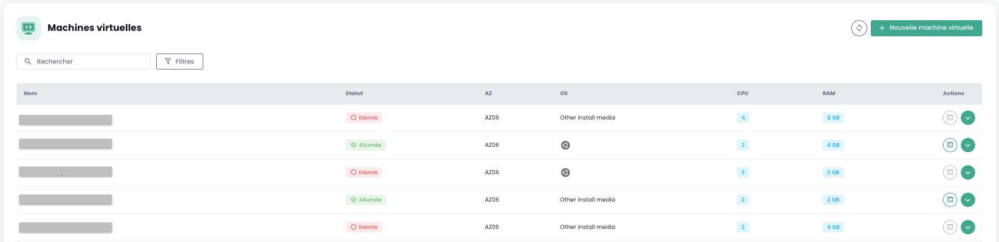
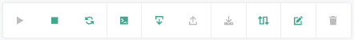

## Berechnung

### Verwaltung der virtuellen Maschinen

Die Verwaltungsoberfläche für Ihre virtuellen Maschinen ist in der Shiva-Konsole im Menü __'OpenIaaS'__ verfügbar, die sich auf dem grünen Banner links auf dem Bildschirm befindet.

### Liste der virtuellen Maschinen

Im Abschnitt __'Virtuelle Maschinen'__ haben Sie Zugang zur Liste Ihrer auf Ihrem vertrauenswürdigen Cloud gehosteten virtuellen Maschinen.

Sie haben Zugriff auf die folgenden Informationen für jede virtuelle Maschine:

- Ihr Name.
- Ihr Status (ausgeschaltet, eingeschaltet).
- Ihre Verfügbarkeitszone (AZ).
- Ihr Betriebssystem.
- Die Anzahl der virtuellen CPUs (vCPU).
- Die Menge des virtuellen Speichers (vRAM).

### Aktionen auf den virtuellen Maschinen

Die folgenden Aktionen sind von dieser Oberfläche aus möglich:

- Die Liste der virtuellen Maschinen aktualisieren.
- Die Liste filtern.
- Eine virtuelle Maschine nach ihrem Namen suchen.
- Eine neue virtuelle Maschine erstellen.

Wenn Sie auf den grünen Dropdown-Pfeil auf der rechten Seite der Liste für eine virtuelle Maschine klicken, erhalten Sie Zugriff auf alle Informationen zu dieser.

Ein Schnellzugriffsband ermöglicht die Durchführung der folgenden Aktionen:

- Die virtuelle Maschine einschalten.
- Sie ausschalten.
- Sie neu starten.
- Die Konsole öffnen.
- Ein ISO einbinden.
- Ein ISO aushängen.
- Die virtuelle Maschine in ein Template konvertieren.
- Sie verschieben.
- Sie umbenennen.
- Sie löschen.

Im Informationsreiter '**Allgemein**' finden Sie detaillierte Informationen zu Ihrer virtuellen Maschine, wie z. B. ihren physischen Standort (AZ, Pool, Host), den RAM, die CPU, die IP-Adressen und andere.

Ein '**Erweitert**'-Reiter ermöglicht das Einsehen spezifischerer Informationen:

- UUID der virtuellen Maschine
- Gasttools
- Gast-OS
- DVD-Laufwerk

Sowie das Ändern einiger Optionen wie:
- Die Startreihenfolge
- Secure Boot
- Automatischer Start (nicht möglich, wenn keine Sicherungsrichtlinie mit der VM verknüpft ist)

