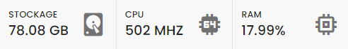
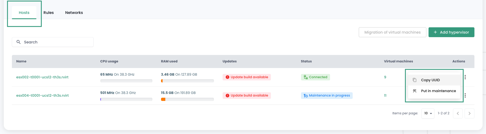
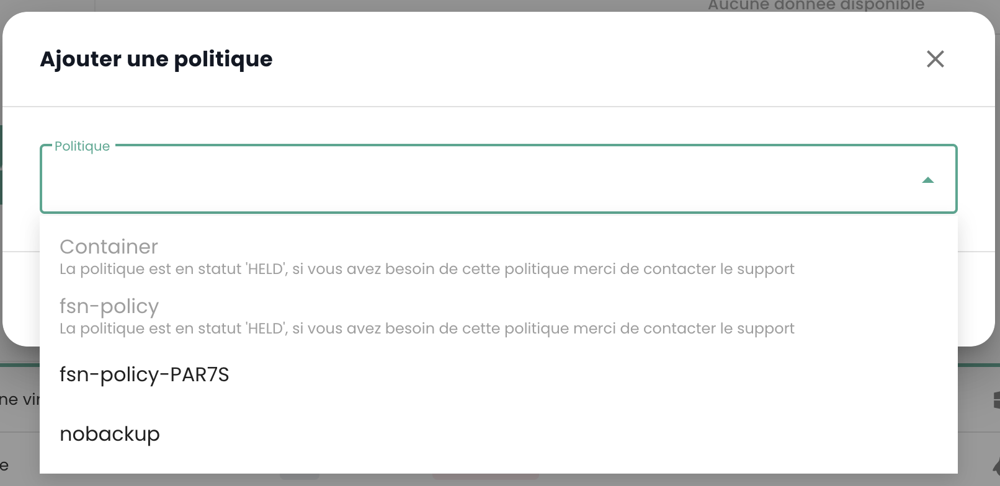

## Berechnung

### Steuerung der virtuellen Maschinen

Die Verwaltungsoberfläche für Ihre virtuellen Maschinen ist in der Shiva-Konsole im Menü __'IaaS'__ auf dem grünen Balken links auf dem Bildschirm verfügbar.

### Liste der virtuellen Maschinen

Im Abschnitt __'Virtuelle Maschinen'__ haben Sie Zugriff auf die Liste Ihrer virtuellen Maschinen, die auf Ihrer vertrauenswürdigen Cloud gehostet werden.

Sie haben Zugriff auf die folgenden Informationen für jede virtuelle Maschine:

- ihren Namen,
- die ihr zugewiesenen Tags,
- ihren Status (ausgeschaltet, eingeschaltet, in Bearbeitung, Host getrennt oder ungültig),
- ihren Manager (in der VMware-Umgebung das zugehörige Vcenter),
- ihr Betriebssystem,
- die Anzahl der virtuellen CPUs (vCPU),
- die Menge des virtuellen Speichers (vRAM).

### Aktionen auf den virtuellen Maschinen

Die folgenden Aktionen sind über diese Schnittstelle möglich:

- Aktualisieren der Liste der virtuellen Maschinen;
- Exportieren der Liste im CSV-Format;
- Filtern der Liste;
- Suchen einer virtuellen Maschine nach ihrem Namen;
- Erstellen einer neuen virtuellen Maschine.

__Ein Alarmbanner kann oben in der Liste vorhanden sein__: Es gibt an, dass kritische Alarme für eine oder mehrere Ihrer virtuellen Maschinen ausgelöst wurden.
Die Schaltfläche __'Anzeigen'__ ermöglicht es Ihnen, die von dieser Benachrichtigung betroffenen virtuellen Maschinen zu sehen.

Wenn Sie auf den grünen Dropdown-Pfeil rechts in der Liste für eine virtuelle Maschine klicken:

Erhalten Sie Zugang zu allen Informationen über diese:

Ein Schnellzugriffsleiste ermöglicht die Durchführung der folgenden Aktionen:

- Einschalten der virtuellen Maschine;
- Ausschalten;
- Neustart;
- Ändern der Energieoptionen des Gastbetriebssystems;
- Öffnen der Konsole;
- Einfügen einer ISO;
- Auswerfen einer ISO;
- Klonen der virtuellen Maschine;
- Verschieben (vMotion);
- Umbenennen;
- Löschen.

Eine Schnellansicht bietet eine Visualisierung des __Speichers__, der __CPU__ und des __RAM__ der virtuellen Maschine.

Im Reiter __'Allgemeine Informationen'__ finden Sie detaillierte Informationen zu Ihrer virtuellen Maschine, wie das Betriebssystem, den physischen Standort (Rechenzentrum, Datenspeicher usw.), den RAM, die CPU, die IP-Adressen, die Protokolle und andere.

Von dieser Ansicht aus können Sie die folgenden Aktionen ausführen:

- Ändern des Betriebssystems (die virtuelle Maschine muss ausgeschaltet sein),
- Aktualisieren der Hardwareversion (die virtuelle Maschine muss ausgeschaltet sein),
- Ändern des RAM oder der CPU.

Ein Reiter __'Erweitert'__ ermöglicht den Zugriff auf spezifischere Informationen wie "VMware-Tools", die Hardwareversion, den Manager usw.

### Ändern des Festplattencontrollers einer virtuellen Maschine

Sie können den Festplattencontrollertyp für Ihre virtuelle Maschine ändern. Die unterstützten Typen sind __SCSI__ und __NVME__. Sie können bis zu 4 Controller jedes Typs hinzufügen.

### Konsole einer virtuellen Maschine

Die Konsole einer virtuellen Maschine ist über die Liste der virtuellen Maschinen zugänglich, indem Sie auf das Symbol __'Konsole'__ klicken:

Ein neuer Tab in Ihrem Browser öffnet sich und zeigt die Konsole Ihrer Maschine an, die auf einem VNC-Client basiert:

Im VNC-Menü ist es möglich:

- spezielle Tastendrucke zu senden,
- Kopieren/Einfügen aus der Zwischenablage Ihres Betriebssystems durchzuführen,
- in den Vollbildmodus zu wechseln,
- die Größe des Fensters zu ändern (Skalierung).

Die Tastaturverwaltung mit der Konsole der virtuellen Maschinen funktioniert perfekt in einer vollständig *englischen* Umgebung.

Die Eingaben in der Konsole hängen von der Tastatursprache Ihrer physischen Maschine, der Tastatursprache der virtuellen Maschine und der Aktivierung oder Deaktivierung der Option 'Tastatur erzwingen' auf der linken Seite des Bildschirms ab.
Hier ist eine Zusammenfassung der möglichen Situationen mit der französischen Sprache:

| Sprache der Tastatur der physischen Maschine (Eingabe) | Sprache der Tastatur der virtuellen Maschine | Option 'Tastatur erzwingen' ausgewählt | Ergebnis (Ausgabe)                                   |
| ------------------------------------------------------ | -------------------------------------------- | ------------------------------------- | --------------------------------------------------- |
| Französisch                                             | Französisch                                   | Nein                                  | Nicht empfohlen (Probleme mit Sonderzeichen)       |
| Französisch                                             | Französisch                                   | Ja                                    | < und > funktionieren nicht                        |
| Französisch                                             | Englisch                                     | Nein                                  | Nicht empfohlen (Probleme mit Sonderzeichen)       |
| Französisch                                             | Englisch                                     | Ja                                    | Englisch                                             |
| Englisch                                                | Französisch                                   | Nein                                  | < und > funktionieren nicht                        |
| Englisch                                                | Französisch                                   | Ja                                    | < und > funktionieren nicht                        |
| Englisch                                                | Englisch                                     | Nein                                  | Englisch                                             |
| Englisch                                                | Englisch                                     | Ja                                    | Englisch                                             |

__Hinweis__:

- Wenn die Kombination __'AltGr'__ und __'@'__ auf der Tastatur nicht funktioniert, aktivieren Sie die Schaltfläche __'Tastatur erzwingen'__ im __'VNC'__-Menü der Konsole und versuchen Sie es erneut.
- Wenn dies immer noch nicht funktioniert und das Betriebssystem der physischen Maschine __Windows__ ist, ändern Sie die Tastatur der physischen Maschine auf Englisch
und versuchen Sie, das @ wie gewohnt einzugeben__ *(Ausgabe azerty: AltGr + 0 oder Ausgabe qwerty: 2-Taste)*.

### Kataloge der virtuellen Maschinen Cloud Temple

Cloud Temple stellt Ihnen einen regelmäßig von unseren Teams angereicherten und aktualisierten Katalog von `Vorlagen` zur Verfügung.
Er umfasst derzeit mehrere Dutzend `Vorlagen` und Images, die Sie auf Ihre virtuellen Maschinen montieren können.

### Erweiterte Konfiguration der virtuellen Maschinen: Extra Config

Die Extra Config bietet eine flexible Möglichkeit, Schlüssel=Wert-Paare in die Konfiguration einer virtuellen Maschine aufzunehmen. Schlüssel und Werte werden vom System interpretiert, wenn die virtuelle Maschine bereitgestellt wird.

Ab sofort können Sie selbst die __Extra Config__-Eigenschaften in den erweiterten Optionen einer virtuellen Maschine ändern:

Sie können eine Eigenschaft aus einer Liste von Schlüsseln hinzufügen. Zudem können Sie den Wert eines Schlüssels ändern, den Sie selbst hinzugefügt haben. Bereits vorhandene Schlüssel=Wert-Paare können nicht geändert werden.

Bitte kontaktieren Sie den Support für Anfragen zur Hinzufügung neuer Schlüssel.

__Hinweis__: *Für die Nutzung von GPUs durch die virtuelle Maschine muss der Schlüssel 'pciPassthru.use64bitMMIO' aktiviert und die erforderliche MMIO (Memory-mapped I/O)-Menge über 'pciPassthru.64bitMMIOSizeGB' zugewiesen werden. Es wird dringend empfohlen, sich auf die [offizielle Nvidia-Dokumentation](https://docs.nvidia.com/vgpu/17.0/grid-vgpu-release-notes-vmware-vsphere/index.html#tesla-p40-large-memory-vms) zu beziehen.*

### Erweiterte Konfiguration der virtuellen Maschinen: vAPP

Sie können auch die __vAPP__-Eigenschaften in den erweiterten Optionen einer virtuellen Maschine ändern:

Sie können eine Eigenschaft hinzufügen, ändern oder löschen. Vier Eigenschaftstypen werden angeboten: Zeichenkette, Zahl, Boolescher Wert, Passwort:

__Hinweis__: *Die virtuelle Maschine muss gestoppt werden, um ihre vAPP-Eigenschaften zu ändern.*

### Steuerung der __'Hypervisoren'__ und __'Cpool'__ (Hypervisor-Cluster)

Die Verwaltung Ihrer Hypervisoren erfolgt im Untermenü __'Berechnung'__ des Menüs __'IaaS'__, das sich auf dem grünen Balken links auf Ihrem Bildschirm befindet.

In diesem Untermenü haben Sie eine Ansicht von:

- Der Hypervisor-Software-Stack, ihre AZ und ihre Ressourcen,
- Der Backup-Software-Stack.

Im Januar 2024 basiert das auf der qualifizierten Cloud Temple-Infrastruktur verfügbare Hypervisor-Angebot auf VMware. Die verwendete Backup-Software ist IBM Spectrum Protect Plus.

### Verwaltung der VMware-Cluster

Um die Verwaltung der VMware-Cluster aufzurufen, klicken Sie im Untermenü __'Berechnung'__ des Menüs __'IaaS'__:

Standardmäßig listet der erste Reiter alle Hypervisoren (über alle Cluster hinweg) auf:

Es ist möglich, die Details eines Hypervisors anzuzeigen, indem Sie auf seinen Namen klicken:

Es gibt einen Reiter pro Hypervisor-Cluster, um die Details jedes einzelnen anzuzeigen:

Wenn Sie auf einen Cluster klicken, sehen Sie die Zusammenfassung seiner Zusammensetzung:

- Die gesamte Rechenleistung, ausgedrückt in GHz,
- Die insgesamt verfügbare Speicher- und die genutzte Menge,

- Der Gesamtwert des Speicherkapazität (aller Typen) sowie die genutzte Anteile,
- Die Automatisierungsmechanismen bei Nichtverfügbarkeit eines Rechenknotens (__'Vsphere DRS'__),
- Die Anzahl der virtuellen Maschinen,
- Die Anzahl der Hypervisoren.

<!-- TODO: Add missing page. -->
<!-- Beim Betrachten der Seite eines Clusters sind mehrere Registerkarten verfügbar. Die Registerkarte __'Regeln'__ ermöglicht es Ihnen, die [Affinity-/Anti-Affinity-Regeln](compute.md#gestion-de-laffinité-de-vos-machines-virtuelles) zu definieren. -->

Im Reiter __'Hosts'__ sehen Sie für jeden Hypervisor:

- Die Auslastung von __CPU__ und __Speicher__,
- Die Anzahl der zugewiesenen virtuellen Maschinen,
- Die Verfügbarkeit eines neuen Builds für das Betriebssystem des Hypervisors gegebenenfalls,
- Der Status des Hypervisors (in Produktion verbunden, in Wartung, ausgeschaltet, ...),
- Ein Aktionsmenü.

Mehrere Aktionen sind auf der Registerkarte __'Hosts'__ möglich:

- Neue Hypervisoren über den Button __'Host hinzufügen'__ bestellen:

- Möglichkeit, __die Details eines Hypervisors__ anzusehen:

- einen Hypervisor in den __Wartungsmodus__ versetzen oder aus diesem herausnehmen,
- gegebenenfalls diesen Hypervisor __aktualisieren__; dazu __muss er sich zwingend im Wartungsmodus befinden__. Es gibt zwei Arten von Updates:

1. VMware-Builds (neue Versionen des Hypervisors):

2. Das Firmware-Update Ihres Rechenknotens (BIOS und Firmware der Tochterkarten):

*__Hinweis__*:

- *Cloud Temple stellt regelmäßig Builds für die Hypervisoren zur Verfügung.
Es ist wichtig, Ihre Hypervisoren regelmäßig zu aktualisieren, insbesondere um die Anwendung von Sicherheitskorrekturen zu ermöglichen.
Wir aktualisieren jedoch __nicht eigenständig Ihre Hypervisoren__. Cloud Temple hat keine Übersicht über die Verfügbarkeitsverpflichtungen Ihrer Workloads.
Daher überlassen wir es Ihnen, Ihre Change-Management-Prozesse umzusetzen und die neuen Builds zum optimalen Zeitpunkt anzuwenden.*
- *Der Aktualisierungsprozess ist vollständig automatisiert. Sie müssen mindestens zwei Hypervisoren in Ihrem Cluster haben, um eine Aktualisierung ohne Dienstunterbrechung zu ermöglichen.*

<!-- TODO: Add missing page. -->
<!-- - *Es ist erforderlich, [die entsprechenden Berechtigungen](../console/permissions.md) zu haben, um die verschiedenen Aktionen durchzuführen.* -->

Sie sehen auch alle Affinity-/Anti-Affinity-Regeln für Ihren Hypervisor-Cluster im Abschnitt __'Regeln'__.

### Verwaltung der Affinität Ihrer virtuellen Maschinen

Die __Affinity- und Anti-Affinity-Regeln__ ermöglichen es, den Standort der virtuellen Maschinen auf Ihren Hypervisoren zu steuern.
Sie können verwendet werden, um die Ressourcennutzung Ihres __'Cpool'__ zu verwalten.
Beispielsweise können sie dazu beitragen, die Arbeitslast zwischen den Servern auszugleichen oder ressourcenintensive Arbeitslasten zu isolieren.
In einem VMware __'Cpool'__ werden diese Regeln oft verwendet, um das Verhalten von virtuellen Maschinen mit vMotion zu verwalten.
vMotion ermöglicht es, virtuelle Maschinen von einem Host auf einen anderen zu verschieben, ohne den Dienst zu unterbrechen.

Mit der Verwaltung der Regeln können Sie konfigurieren:

- __Affinity-Regeln__: Diese Regeln stellen sicher, dass bestimmte virtuelle Maschinen auf demselben physischen Host ausgeführt werden.
Sie werden verwendet, um die Leistung zu verbessern, indem sie virtuelle Maschinen, die häufig miteinander
kommunizieren, auf demselben Server halten, um die Netzwerklatenz zu reduzieren. Affinity-Regeln sind in Szenarien nützlich,
in denen die Leistung kritisch ist, wie bei Datenbanken oder Anwendungen, die schnelle Kommunikation zwischen den Servern erfordern.

- __Anti-Affinity-Regeln__: Umgekehrt stellen diese Regeln sicher, dass bestimmte virtuelle Maschinen nicht
auf demselben physischen Host ausgeführt werden. Sie sind wichtig für die Verfügbarkeit und Resilienz, beispielsweise
um zu vermeiden, dass kritische Maschinen alle von einem einzigen Serverausfall betroffen sind.
Anti-Affinity-Regeln sind entscheidend für Anwendungen, die hohe Verfügbarkeit erfordern,
z.B. in Produktionsumgebungen, in denen Fehlertoleranz oberste Priorität hat.
Beispielsweise möchten Sie nicht, dass beide Active Directories auf demselben Hypervisor laufen.

Beim Erstellen einer Regel definieren Sie den Regeltyp (Affinity / Anti-Affinity), den Namen der Regel,
deren Aktivierungsstatus (__'Status'__) und die betreffenden Maschinen in Ihrem Hypervisor-Cluster.

*Hinweis: Die in der Konsole angebotenen Affinity-/Anti-Affinity-Regeln beziehen sich auf die virtuellen Maschinen untereinander (keine Regeln zwischen Hypervisoren und virtuellen Maschinen).*

## Backup

### Erstellen eine Backup-Politik

Um eine neue Backup-Politik hinzuzufügen, müssen Sie eine Anfrage beim Support stellen. Der Support ist über das Rettungsring-Symbol oben rechts im Fenster erreichbar.

Die Erstellung einer neuen Backup-Politik erfolgt durch __einen Service Request__, in dem Folgendes angegeben wird:

    Der Name Ihrer Organisation
    Der Name eines Ansprechpartners mit seiner E-Mail und Telefonnummer zur abschließenden Konfiguration
    Der Name des Tenants
    Der Name der Backup-Politik
    Die Eigenschaften (x Tage, y Wochen, z Monate, ...)

### Eine Backup-Politik einer virtuellen Maschine zuweisen

Wenn ein SLA einer virtuellen Maschine (VM) zugewiesen wird, übernehmen automatisch alle mit dieser VM verbundenen Festplatten dasselbe SLA. Anschließend ist es möglich, das Backup manuell über die Registerkarte "Backup-Politiken" auszuführen. Fehlt eine manuelle Ausführung, wird das Backup automatisch gemäß dem von der SLA konfigurierten Zeitplan ausgeführt.

SecNumCloud macht die Zuweisung einer Backup-Politik zu einer virtuellen Maschine vor deren Start obligatorisch. Andernfalls erhalten Sie die folgende Benachrichtigung:

Klicken Sie auf die Registerkarte __'Backup-Politiken'__ im Menü Ihrer virtuellen Maschine. Dort können Sie die zugewiesenen Backup-Politiken einsehen.

Um einer virtuellen Maschine eine neue Backup-Politik zuzuweisen, klicken Sie auf die Schaltfläche __'Politik hinzufügen'__ und wählen Sie die gewünschte Backup-Politik aus.

### Eine Backup-Politik einem virtuellen Datenträger zuweisen

Es ist auch möglich, ein SLA direkt einem bestimmten virtuellen Datenträger einer Maschine zuzuweisen. In diesem Fall übernimmt die virtuelle Maschine nicht dieses individuell auf den Datenträger angewendete SLA. Allerdings ist es nicht möglich, das Backup manuell auf der Festplattenebene auszuführen, da diese Funktion in Spectrum Protect Plus nicht unterstützt wird.

Es ist jedoch möglich, bestimmte Festplatten von einer oder mehreren Backup-Politiken (SLA) der VM auszuschließen, was es ermöglicht, ein oder mehrere SLA(s) festplattenweise zu entfernen. Dieser Ansatz bietet die Flexibilität, die Ausführung des Backups einer SLA manuell zu starten, ohne alle Festplatten der virtuellen Maschine zu betreffen, wodurch eine feinere Verwaltung der Backups ermöglicht wird.

Klicken Sie auf die Aktionsleiste der Festplatte, der Sie eine Backup-Politik zuweisen möchten. Klicken Sie dann auf __'Politiken'__ und wählen Sie die gewünschte Backup-Politik aus.

*Hinweis*: Die hinzuzufügende Politik muss sich in einer anderen Verfügbarkeitszone befinden als die virtuelle Maschine.

### Eine Backup-Politik ausführen

Im Menü __'Backup-Politiken'__ Ihrer virtuellen Maschine klicken Sie in der Spalte __'Aktionen'__ der Backup-Politik, die Sie ausführen möchten, auf die Schaltfläche __'Ausführen'__.

Um eine Backup-Politik auszuführen, können Sie auch aus dem Abschnitt __'Backups'__ im Menü Ihrer virtuellen Maschine starten. Klicken Sie auf die Schaltfläche __'Backup ausführen'__ und wählen Sie das Backup aus, das Sie aus der Dropdown-Liste ausführen möchten.

### Eine Backup-Politik entfernen

Im Menü __'Backup-Politiken'__ Ihrer virtuellen Maschine klicken Sie in der Spalte __'Aktionen'__ der zu entfernenden Backup-Politik auf die Schaltfläche __'Entfernen'__.

__Achtung, es ist nicht möglich, das letzte SLA auf einer eingeschalteten virtuellen Maschine zu entfernen:__

### Löschung einer Backup-Politik: Fall einer angehaltenen Backup-Politik ("held")

Wenn die letzte Ressource von einer SLA-Politik getrennt wird, erkennt das System diese Situation automatisch. Infolgedessen wechseln alle mit dieser SLA-Politik verbundenen Aufträge automatisch in den Status "Angehalten" ("Held"). Es ist wichtig zu beachten, dass die direkte Löschung der SLA-Politik zu diesem Zeitpunkt aufgrund der bestehenden abhängigen Aufträge nicht möglich ist. Um die Politik zu löschen, muss eine Reihe von Schritten beachtet werden.

Es muss überprüft werden, dass die betroffenen Aufträge tatsächlich den Status "Angehalten" haben. Nach dieser Überprüfung können diese Aufträge gelöscht werden. Erst nachdem alle abhängigen Aufträge gelöscht wurden, kann die SLA-Politik endgültig aus dem System entfernt werden.
Un cas particulier mérite une attention spécifique : l'ajout d'une nouvelle ressource à une politique SLA dont les travaux dépendants n'ont pas été supprimés. Dans cette situation, les identifiants des travaux seront conservés. Cependant, il est crucial de noter que les travaux en état "Suspendu" ne reprendront pas automatiquement. Une intervention manuelle sera nécessaire pour les réactiver et permettre leur exécution.

note : Pour toute précision sur cette situation, contactez le support Cloud Temple.

La console Cloud Temple empêche l'affectation d'une machine virtuelle à une politique suspendue :

De même, il n'est pas possible de démarrer une machine virtuelle qui est associée à une politique de sauvegarde suspendue :

### Wiederherstellen einer Sicherung

Der __'Sicherungen'__ Tab im Menü Ihrer virtuellen Maschinen ermöglicht den Zugriff auf die Liste der Sicherungen.
Um eine Sicherung wiederherzustellen, klicken Sie auf die Schaltfläche __'Wiederherstellen'__ in der Zeile der Sicherung, die Sie wiederherstellen möchten.

1. __Produktionsmodus__: Der Produktionsmodus ermöglicht die Wiederherstellung nach einem Zwischenfall am lokalen Standort vom primären Speicher oder einem entfernten Standort für die Wiederherstellung nach einem Zwischenfall, indem die originalen Maschinenabbilder durch die Wiederherstellungsabbilder ersetzt werden. Alle Konfigurationen werden im Rahmen der Wiederherstellung übertragen, einschließlich Namen und Identifikatoren, und alle mit der virtuellen Maschine verbundenen Datenkopieraufträge laufen weiter. Im Rahmen einer Wiederherstellung im Produktionsmodus können Sie wählen, den Speicher in der virtuellen Maschine durch eine virtuelle Festplatte aus einem früheren Sicherungsabbild einer virtuellen Maschine zu ersetzen.

2. __Testmodus__: Der Testmodus erstellt temporäre virtuelle Maschinen für Entwicklung, Test, Snapshots-Verifizierung und Überprüfung der Wiederherstellung nach einem Zwischenfall nach einem wiederholbaren Zeitplan, ohne Auswirkungen auf Produktionsumgebungen. Testmaschinen laufen so lange wie nötig, um die Tests und Verifikationen durchzuführen, und werden dann bereinigt. Durch isoliertes Netzwerk können Sie eine sichere Umgebung schaffen, um Ihre Aufträge zu testen, ohne Produktionsmaschinen zu stören. Die im Testmodus erstellten virtuellen Maschinen haben eindeutige Namen und Identifikatoren, um Konflikte in Ihrer Produktionsumgebung zu vermeiden.

3. __Klonmodus__: Der Klonmodus erstellt Kopien von virtuellen Maschinen für Anwendungsfälle, die dauerhafte oder lang laufende Kopien für die Datenexploration oder die Duplizierung einer Testumgebung in einem isolierten Netzwerk erfordern. Die im Klonmodus erstellten virtuellen Maschinen haben eindeutige Namen und Identifikatoren, um Konflikte in Ihrer Produktionsumgebung zu vermeiden. Im Klonmodus müssen Sie auf den Ressourcenverbrauch achten, da der Klonmodus permanente oder lang laufende Maschinen erstellt.

__Die Wiederherstellung ist standardmäßig im Modus "TEST", um die Produktion zu schonen__ und Sie können den Namen der wiederhergestellten virtuellen Maschine wählen:

Beachten Sie, dass eine virtuelle Maschine vom Testmodus in den Produktionsmodus überführt werden kann, wenn die Tests zufriedenstellend sind:

