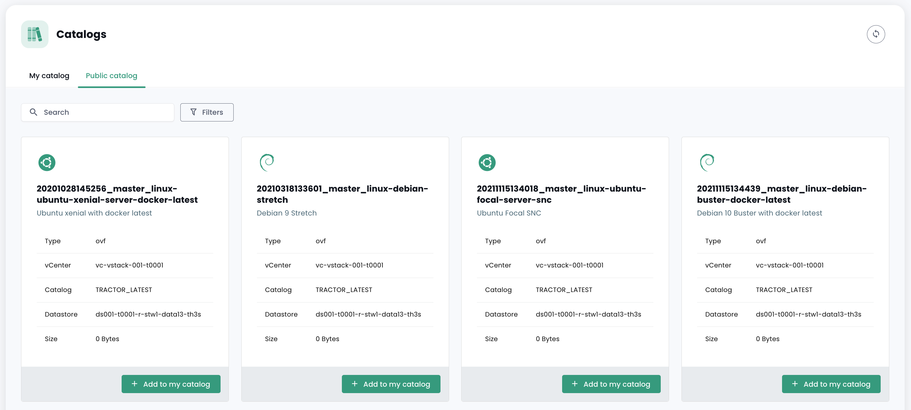
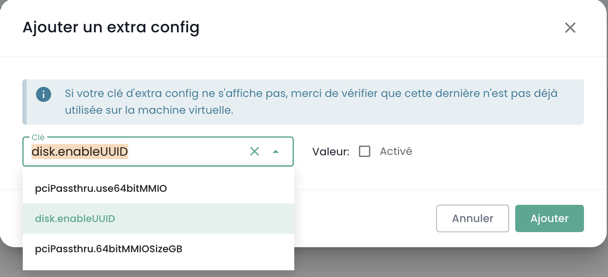
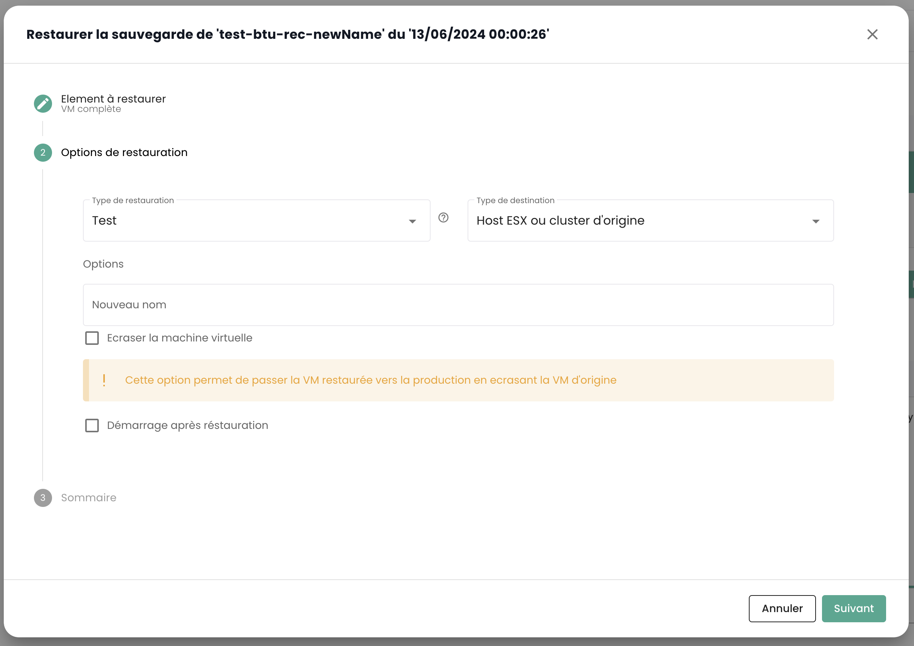

## Berechnung

### Verwaltung von Virtuellen Maschinen

Die Verwaltungsoberfläche Ihrer virtuellen Maschinen ist in der Shiva-Konsole im Menü __'IaaS'__ verfügbar, das sich auf dem grünen Balken links auf dem Bildschirm befindet.

### Liste der virtuellen Maschinen

Im Abschnitt __'Virtuelle Maschinen'__ haben Sie Zugriff auf die Liste Ihrer auf Ihrer vertrauenswürdigen Cloud gehosteten virtuellen Maschinen.


Sie haben Zugriff auf die folgenden Informationen für jede virtuelle Maschine:
- ihren Namen,
- die ihr zugewiesenen Tags,
- ihren Status (ausgeschaltet, eingeschaltet, in Bearbeitung, Host getrennt oder ungültig),
- ihren Manager (in einer VMware-Umgebung das zugehörige Vcenter),
- ihr Betriebssystem,
- die Menge der virtuellen CPUs (vCPU),
- die Menge des virtuellen Arbeitsspeichers (vRAM).

### Aktionen auf virtuellen Maschinen

Die folgenden Aktionen sind über diese Schnittstelle möglich:

- Liste der virtuellen Maschinen aktualisieren;
- Liste im CSV-Format exportieren;
- Liste filtern;
- Eine virtuelle Maschine nach ihrem Namen suchen;
- Eine neue virtuelle Maschine erstellen.


__Ein Alarmbanner kann oben in der Liste angezeigt werden__: Es zeigt an, dass kritische Alarme auf einer oder mehreren Ihrer virtuellen Maschinen ausgelöst wurden.
Die Schaltfläche __'Anzeigen'__ ermöglicht das Anzeigen der virtuellen Maschinen, die von dieser Benachrichtigung betroffen sind.


Wenn Sie auf den grünen Dropdown-Pfeil rechts in der Liste für eine virtuelle Maschine klicken:


haben Sie Zugriff auf alle Informationen zu dieser Maschine:


Ein Schnellaktionsleiste ermöglicht die Ausführung der folgenden Aktionen:


- Die virtuelle Maschine einschalten;
- Sie ausschalten;
- Sie neu starten;
- Die Energieoptionen des Gastbetriebssystems ändern;
- Die Konsole öffnen;
- Ein ISO einhängen;
- Ein ISO aushängen;
- Die virtuelle Maschine klonen;
- Sie verschieben (vMotion);
- Sie umbenennen;
- Sie löschen.

Eine Schnellansicht bietet eine Visualisierung des __Speichers__, der __CPU__ und des __RAM__ der virtuellen Maschine.


Im Tab __'Allgemeine Informationen'__ finden Sie detaillierte Informationen zu Ihrer virtuellen Maschine, wie ihr Betriebssystem, ihren physischen Standort (Datacenter, Datastore usw.), RAM, CPU, IP-Adressen, Logs und mehr.


Über diese Ansicht können Sie die folgenden Aktionen ausführen:

- Das Betriebssystem ändern (die virtuelle Maschine muss ausgeschaltet sein),
- Die Hardwareversion aktualisieren (die virtuelle Maschine muss ausgeschaltet sein),
- RAM oder CPU ändern.

Ein Tab __'Erweitert'__ bietet spezifischere Informationen wie "VMware Tools"-Informationen, die Hardwareversion, den Manager usw.


### Bearbeiten des RAM oder der CPU einer virtuellen Maschine
Gehen Sie zum Tab __'Virtuelle Maschinen'__, zeigen Sie die Details einer virtuellen Maschine an,
wählen Sie den Tab __'Allgemeine Informationen'__ und klicken Sie auf die Schaltfläche zum Bearbeiten der zu ändernden Variable:


### Die Betriebsmodi von Festplatten

Sie können verschiedene Festplattenmodi hinzufügen:
  - __Persistente__ : Änderungen werden sofort und dauerhaft auf die virtuelle Festplatte geschrieben. **Dies ist der empfohlene Modus.**
  - __Unabhängig, nicht persistent__ : Änderungen an der virtuellen Festplatte werden in einem neuen Logbuch aufgezeichnet und beim Ausschalten gelöscht. Nicht betroffen von Snapshots. **Wird nicht von der Sicherung unterstützt.**
  - __Unabhängig, persistent__ : Änderungen werden sofort und dauerhaft auf die virtuelle Festplatte geschrieben. Nicht betroffen von Snapshots. **Wird nicht von der Sicherung unterstützt.**

### Verwaltung der Controller einer virtuellen Maschine

Sie können den Festplattentyp Ihrer virtuellen Maschine ändern.


Virtuelle Maschinen können mit SCSI- und NVME-Controllern ausgestattet werden, mit einer Grenze von 4 Controllern pro Typ. Jeder Controller kann bis zu 15 Festplatten verwalten.

Ein SCSI-Controller kann mit verschiedenen Untertypen konfiguriert werden: Para Virtual, Bus Logic, LSI Logic oder LSI Logic SAS.

Der Para Virtual Controller zeichnet sich durch seine erweiterte Kapazität aus. Er kann bis zu 64 Festplatten unterstützen, wenn die Hardwareversion der virtuellen Maschine mit einem ESXi ab Version 6.7 kompatibel ist.

> **Wichtig**: Wenn Sie den Typ eines Para Virtual Controllers ändern möchten, der mehr als 15 Festplatten besitzt, müssen Sie zunächst die Festplatten an den betreffenden Steckplätzen trennen.

### Konsole einer virtuellen Maschine

Die Konsole einer virtuellen Maschine ist über die Liste der virtuellen Maschinen zugänglich, indem Sie auf das Symbol __'Konsole'__ klicken:


Ein neuer Tab in Ihrem Browser wird geöffnet und die Konsole Ihrer Maschine, basierend auf einem VNC-Client, wird angezeigt:


Im VNC-Menü sind folgende Aktionen möglich:

- Eine spezielle Taste senden,
- Kopieren/Einfügen aus der Zwischenablage Ihres Betriebssystems,
- In den Vollbildmodus wechseln,
- Die Fenstergröße ändern (Skalierung).

Die Tastatursteuerung mit der Konsole virtueller Maschinen funktioniert perfekt in einer vollständig *englischen* Umgebung.

Die Eingabe in die Konsole hängt von der Sprache der Tastatur Ihrer physischen Maschine, der Sprache der Tastatur der virtuellen Maschine und davon ab, ob die Option 'Tastatur erzwingen' links auf dem Bildschirm aktiviert ist oder nicht.
Hier ist eine Zusammenfassung der möglichen Situationen für die französische Sprache:

| Sprache der Tastatur der physischen Maschine (Eingabe) | Sprache der Tastatur der virtuellen Maschine | Option 'Tastatur erzwingen' ausgewählt | Ergebnis (Ausgabe)                                   |
| ------------------------------------------------------- | -------------------------------------------- | ------------------------------------- | ---------------------------------------------------- |
| Französisch                                              | Französisch                                   | Nein                                  | Nicht empfohlen (Problem mit Sonderzeichen) |
| Französisch                                              | Französisch                                   | Ja                                    | < und > funktionieren nicht                      |
| Französisch                                              | Englisch                                     | Nein                                  | Nicht empfohlen (Problem mit Sonderzeichen) |
| Französisch                                              | Englisch                                     | Ja                                    | Englisch                                              |
| Englisch                                                | Französisch                                   | Nein                                  | < und > funktionieren nicht                       |
| Englisch                                                | Französisch                                   | Ja                                    | < und > funktionieren nicht                      |
| Englisch                                                | Englisch                                     | Nein                                  | Englisch                                              |
| Englisch                                                | Englisch                                     | Ja                                    | Englisch                                              |

__Hinweis__:

- Wenn die Kombination __'AltGr'__ und __'@'__ auf der Tastatur nicht funktioniert, aktivieren Sie die Schaltfläche __'Taste erzwingen'__ im __'VNC'__-Menü der Konsole und versuchen Sie es erneut.
- Wenn es weiterhin nicht funktioniert und das Betriebssystem der physischen Maschine __Windows_ ist, stellen Sie die Tastatur der physischen Maschine auf Englisch 
und versuchen Sie, das @-Zeichen auf die normale Weise einzugeben__ *(AZERTY-Ausgabe: AltGr + 0-Taste oder QWERTY-Ausgabe: 2-Taste)*.

### Kataloge von virtuellen Maschinen bei Cloud Temple

Cloud Temple stellt Ihnen einen regelmäßig von unseren Teams erweiterten und aktualisierten `Templates`-Katalog zur Verfügung.
Er umfasst derzeit mehrere Dutzend `Templates` und Images, die Sie auf Ihren virtuellen Maschinen verwenden können.



Um ein ISO/OVF zu veröffentlichen, gehen Sie zur Ansicht __'Katalog'__ und klicken Sie auf die Schaltfläche __'Dateien veröffentlichen'__ oben auf der Seite:


Sie können eine virtuelle Maschine in ein Modell umwandeln und in den Katalog exportieren. Wählen Sie dazu eine virtuelle Maschine aus und verwenden Sie die Schaltfläche __'Klonen'__:


Wählen Sie __'Als VM-Template exportieren'__:


Geben Sie dann die erforderlichen Informationen ein. Es wird möglich sein, eine neue VM aus dem Modell über die Schaltfläche __'Neue virtuelle Maschine'__ oder über die Seite __'Kataloge'__ zu starten. Es ist auch möglich, die VM im OVF-Format zu exportieren.

**Gut zu wissen**: Es ist möglich, eine OVA-Datei in eine OVF-Datei zu konvertieren und umgekehrt.
Die am häufigsten verwendete Methode ist der VMware-Konverter, aber es gibt auch eine einfache Methode unter Verwendung von ```tar```

Extrahieren der OVA-Datei:
```
$ tar -xvf vmName.ova
```

Erstellen einer OVA-Datei aus einer OVF-Datei:
```
$ tar -cvf vmName-NEW.ova vmName.ovf vmName-disk1.vmdk vmName.mf
```

### Erweiterte Einstellungen für virtuelle Maschinen: Extra Config

Die Extra Config bietet eine flexible Möglichkeit, Schlüssel=Wert-Paare in die Konfiguration einer virtuellen Maschine aufzunehmen. Die Schlüssel und Werte werden vom System interpretiert, wenn die virtuelle Maschine bereitgestellt wird.
Désormais, vous pouvez, vous même, modifier les propriétés de type __Extra Config__ dans les options avancées d'une machine virtuelle :


Vous pouvez ajouter une propriété parmi une liste de clés. De plus, vous pouvez modifier la valeur d'une clé que vous avez vous-même ajouté. Les paires clé=valeur déjà existantes ne sont pas modifiables.

Veuillez contacter le support pour toute demande d'ajout de nouvelles clés.



__Note__ : *Pour l'utilisation de GPU par la machine virtuelle, il est obligatoire d'activer la clé 'pciPassthru.use64bitMMIO' et d'allouer la quantité d'espace MMIO (Memory-mapped I/O) nécessaire via 'pciPassthru.64bitMMIOSizeGB'. Il est fortement recommandé de vous référerer à la [documentation officielle Nvidia](https://docs.nvidia.com/vgpu/17.0/grid-vgpu-release-notes-vmware-vsphere/index.html#tesla-p40-large-memory-vms).*

### Paramétrage avancé des machines virtuelles : vAPP

Vous pouvez, également, modifier les propriétés de type __vAPP__ dans les options avancées d'une machine virtuelle :


Vous pouvez ajouter une propriété, la modifier ou la supprimer. Quatre types de propriétés sont proposées, String, Nombre, Booléen, Mot de passe:


__Note__ : *La machine virtuelle doit être stoppée pour modifier ses propriétés vAPP.*

### Pilotage des __'hyperviseurs'__ et __'Cpool'__ (clusters d'hyperviseurs)

Le pilotage de vos hyperviseurs se fait dans le sous menu __'Calcul'__ du menu __'IaaS'__, situé dans le bandeau vert à gauche de votre écran.


Dans ce sous menu, vous disposez d'une vue sur :

- La stack logicielle d'hyperviseurs, leur AZ et leurs ressources,
- La stack logicielle de sauvegarde.

En janvier 2024, l'offre d'hyperviseur disponible sur l'infrastructure qualifiée Cloud Temple est basée sur VMware. Le logiciel de sauvegarde utilisé est IBM Spectrum Protect Plus.

### Pilotage des clusters VMware

Pour accéder au pilotage des clusters VMware, cliquez dans le sous menu __'Calcul'__ du menu __'IaaS'__ :

Par défaut, le premier onglet liste tous les hyperviseurs (tous cluster confondus):


Il est possible de visualiser les détails d'un hyperviseur en cliquant sur son nom:


Il existe un onglet par cluster d'hyperviseur pour consulter les détails de chacun:


Si vous cliquez sur un cluster, vous voyez la synthèse de sa composition :

- Le total de la puissance de calcul exprimé en Ghz,
- Le total de la mémoire disponible et le ratio utilisé,
- Le total de l'espace de stockage (tous types confondus) ainsi que la cote part utilisée,
- Les mécanismes d'automatisation sur indisponibilité d'une lame de calcul (__'Vsphere DRS'__),
- Le nombre de machines virtuelles,
- Le nombre d'hyperviseurs.

<!-- TODO: Add missing page. -->
<!-- En consultant la page d'un cluster, plusieurs onglets sont disponibles. L'onglet __'Règles'__ vous permet de définir les [règles d'affinité / anti-affinité](compute.md#gestion-de-laffinité-de-vos-machines-virtuelles) -->


Vous voyez apparaitre pour chaque hyperviseur dans l'onglet __'Hosts'__ :

- L'usage __CPU__ et __Mémoire__,
- Le nombre de machines virtuelles affectées,
- La disponibilité d'un nouveau build pour le système d'exploitation de l'hyperviseur le cas échéant,
- Le statut de l'hyperviseur (connecté en production, en maintenance, éteint, ...),
- Un menu action.


Plusieurs actions sont possibles depsuis l'onglet __'Hosts'__ :

- commander de nouveaux hyperviseurs via le bouton __'Ajouter un host'__ :


- possibilité de consulter __le détail d'un hyperviseur__ :


- de rentrer ou de sortir de l'__état de maintenance__ un hyperviseur,
- de __mettre à jour__ le cas échéant cet hyperviseur ; pour ce faire, __il doit impérativement être en maintenance__. Il existe deux types de mises à jours :

1. Les builds VMware (les nouvelles versions de l'hyperviseur):


2. La mise à jour du firmware de votre lame de calcul (bios et firmware cartes filles):


*__Remarque__* :

- *Cloud Temple met à disposition les builds pour les hyperviseurs à intervalles réguliers.
Il est important de mettre régulièrement à jour vos hyperviseurs, notamment pour permettre l'application des correctifs de sécurité.
Cependant, __nous ne mettons pas de nous même à jour vos hyperviseurs__. Cloud Temple n'a pas de visibilité sur les engagements de disponibilité de vos workloads.
Nous vous laissons donc mettre en œuvre votre gestion du changement et appliquer au meilleur moment les nouveaux builds.*
- *Le processus de mise à jour est entièrement automatisé. Vous devez disposer d'au moins deux hyperviseurs dans votre cluster pour permettre une mise à jour sans interruption de service.*

<!-- TODO: Add missing page. -->
<!-- - *Il est nécessaire d'avoir [les permissions adéquates](../console/permissions.md) pour effectuer les différentes actions.* -->

Vous voyez aussi l'ensemble des règles d'affinité/anti-affinité pour votre cluster d'hyperviseurs dans la partie __'Règles'__.

### Gestion de l'affinité de vos machines virtuelles

Les __règles d'affinité et d'anti-affinité__ permettent de contrôler l'emplacement des machines virtuelles sur vos hyperviseurs.
Elles peuvent être utilisées pour gérer l'utilisation des ressources de votre __'Cpool'__.
Par exemple, elles peuvent aider à équilibrer la charge de travail entre les serveurs ou à isoler les charges de travail gourmandes en ressources.
Dans un __'Cpool'__ VMware, ces règles sont souvent utilisées pour gérer le comportement des machines virtuelles avec vMotion.
vMotion permet de déplacer des machines virtuelles d'un hôte à un autre sans interruption de service.

Vous pouvez configurer grâce à la gestion des règles :

- __Règles d'Affinité__ : Ces règles assurent que certaines machines virtuelles soient exécutées sur le même hôte physique.
Elles sont utilisées pour améliorer les performances en maintenant les machines virtuelles qui communiquent fréquemment
ensemble sur le même serveur pour réduire la latence réseau. Les règles d'affinité sont utiles dans des scénarios
où la performance est critique, comme dans le cas de bases de données ou d'applications qui nécessitent une communication rapide entre les serveurs.

- __Règles d'Anti-affinité__ : À l'inverse, ces règles garantissent que certaines machines virtuelles ne soient pas exécutées
sur le même hôte physique. Elles sont importantes pour la disponibilité et la résilience, par exemple,
pour éviter que des machines critiques ne soient toutes affectées en cas de défaillance d'un serveur unique.
Les règles d'anti-affinité sont cruciales pour les applications nécessitant une haute disponibilité,
comme dans les environnements de production où la tolérance aux pannes est une priorité.
Par exemple, vous ne souhaitez pas que vos deux Actives Directory soient sur le même hyperviseur.

Lors de la création d'une règle, vous définissez le type de règle (affinité / anti-affinité), le nom de la règle,
son état d'activation (__'Statut'__) et les machines concernées de votre cluster d'hyperviseurs.


*Remarque : les règles affinité/aint-affinité proposées dans la console sont des règles concernant les machines virtuelles entre elles (pas de règles entre hyperviseurs et machines virtuelles).*

## Sauvegarde

### Créer une politique de sauvegarde

Pour ajouter une nouvelle politique de sauvegarde, il faut faire une demande auprès du support. Le support est accessible depuis l'icône de bouée en haut à droite de la fenêtre.

La création d'une nouvelle politique de sauvegarde est réalisée par __une demande de service__ indiquant :

    Le nom de votre Organisation
    Le nom d'un contact avec son mail et n° de téléphone pour finaliser la configuration
    Le nom du tenant
    Le nom de la politique de sauvegarde
    Les caractéristiques (x jours, y semaines, z mois, ...)


### Assigner une politique de sauvegarde à une machine virtuelle

Lorsqu'une SLA est assignée à une machine virtuelle (VM), tous les disques associés à cette VM héritent automatiquement de la même SLA. Par la suite, il est possible de lancer manuellement l'exécution de la sauvegarde via l'onglet "Politiques de sauvegarde". À défaut d'un lancement manuel, la sauvegarde s'exécutera automatiquement selon le planning configuré par la SLA.

SecNumCloud rend obligatoire l'assignation d'une politique de sauvegarde à une machine virtuelle avant son démarrage. Dans le cas contraire, vous aurez la notification suivante :


Cliquez sur l’onglet __'Politiques de sauvegarde'__ du menu de votre machine virtuelle. Vous pouvez y visualiser la ou les politiques de sauvegardes assignée(s) à celle-ci.

Pour assigner une nouvelle politique de sauvegarde à la machine virtuelle, cliquez sur le bouton __'Ajouter une politique'__ et sélectionnez la politique de sauvegarde voulue.


### Assigner une politique de sauvegarde à un disque virtuel

Il est également possible d'assigner une SLA directement à un disque virtuel spécifique d'une machine. Dans ce cas, la machine virtuelle ne hérite pas de cette SLA appliquée individuellement au disque. Cependant, il n'est pas possible de lancer manuellement l'exécution de la sauvegarde au niveau des disques, car cette fonctionnalité n'est pas prise en charge dans Spectrum Protect Plus.
En revanche, il est possible d'exclure certains disques d'une ou plusieurs politiques de sauvegarde (SLA) de la VM, ce qui permet de désassigner une ou plusieurs SLA(s) sur une base disque par disque. Cette approche offre la flexibilité de lancer manuellement l'exécution de la sauvegarde d'une SLA sans affecter tous les disques de la machine virtuelle, permettant ainsi une gestion plus fine des sauvegardes.

Cliquez sur la barre d'actions du disque auquel vous souhaitez assigner une politique de sauvegarde. Puis, cliquez sur __'Politiques'__ et sélectionnez la politique de sauvegarde souhaitée.


*Nota* : La politique à ajouter doit se trouver sur une zone de disponibilité différente de la machine virtuelle.

### Ausführen einer Sicherheitskopie-Richtlinie

Im Menü __'Sicherheitskopie-Richtlinien'__ Ihrer virtuellen Maschine klicken Sie auf die Schaltfläche __'Ausführen'__ in der Spalte __'Aktionen'__ der Sicherheitskopie-Richtlinie, die Sie ausführen möchten.


Um eine Sicherheitskopie-Richtlinie auszuführen, können Sie auch zum Abschnitt __'Sicherungen'__ im Menü Ihrer virtuellen Maschine gehen. Klicken Sie auf die Schaltfläche __'Sicherung ausführen'__, und wählen Sie die Sicherung aus, die Sie in der Dropdown-Liste ausführen möchten.


### Eine Sicherheitskopie-Richtlinie entfernen

Im Menü __'Sicherheitskopie-Richtlinien'__ Ihrer virtuellen Maschine klicken Sie auf die Schaltfläche __'Entfernen'__ in der Spalte __'Aktionen'__ der Sicherheitskopie-Richtlinie, die Sie entfernen möchten.


__Achtung, es ist nicht möglich, die letzte SLA auf einer eingeschalteten virtuellen Maschine zu entfernen:__


### Löschen einer Sicherheitskopie-Richtlinie: Fall einer gestoppten Sicherheitskopie-Richtlinie ("held")

Wenn die letzte Ressource von einer SLA-Richtlinie dissiziert wird, erkennt das System diese Situation automatisch. Infolgedessen wechseln alle Arbeiten, die mit dieser SLA-Richtlinie verbunden sind, automatisch in den Zustand "Gestoppt" ("Held"). Es ist wichtig zu beachten, dass in diesem Stadium das direkte Löschen der SLA-Richtlinie aufgrund der Existenz abhängiger Arbeiten nicht möglich ist. Um die Richtlinie zu löschen, muss eine Reihe von Schritten befolgt werden.

Es muss überprüft werden, dass die betroffenen Arbeiten tatsächlich im Zustand "Gestoppt" sind. Nach dieser Überprüfung können diese Arbeiten gelöscht werden. Erst nach dem Löschen dieser abhängigen Arbeiten kann die SLA-Richtlinie endgültig aus dem System gelöscht werden.

Ein spezieller Fall verdient besondere Aufmerksamkeit: das Hinzufügen einer neuen Ressource zu einer SLA-Richtlinie, deren abhängige Arbeiten nicht gelöscht wurden. In dieser Situation werden die Arbeits-IDs beibehalten. Es ist jedoch wichtig zu beachten, dass die Arbeiten im Zustand "Gestoppt" nicht automatisch wieder aufgenommen werden. Ein manuelles Eingreifen ist erforderlich, um sie wieder zu aktivieren und ihre Ausführung zu ermöglichen.

Hinweis: Für Einzelheiten zu dieser Situation wenden Sie sich an den Cloud Temple-Support.

Die Cloud Temple-Konsole verhindert die Zuordnung einer virtuellen Maschine zu einer gestoppten Sicherheitskopie-Richtlinie:


Ebenso ist es nicht möglich, eine virtuelle Maschine zu starten, die mit einer gestoppten Sicherheitskopie-Richtlinie verknüpft ist:


### Eine Sicherung wiederherstellen

Der Tab __'Sicherungen'__ im Menü Ihrer virtuellen Maschinen ermöglicht Ihnen den Zugriff auf die Sicherungsliste dieser. Um eine Sicherung wiederherzustellen, klicken Sie auf die Schaltfläche __'Wiederherstellen'__ in der Zeile der Sicherung, die Sie wiederherstellen möchten.


1. __Produktionsmodus__ : Der Produktionsmodus ermöglicht die Wiederherstellung nach einem Vorfall vor Ort vom Primärspeicher oder einem entfernten Wiederherstellungsort, indem die Originalmaschinen-Images durch Wiederherstellungs-Images ersetzt werden. Alle Konfigurationen werden im Rahmen der Wiederherstellung übertragen, einschließlich Namen und Identifikatoren, und alle mit der virtuellen Maschine verbundenen Datenkopierarbeiten werden fortgesetzt. Im Rahmen einer Wiederherstellung im Produktionsmodus können Sie den Speicher in der virtuellen Maschine durch ein virtuelles Laufwerk aus einer früheren Sicherung der virtuellen Maschine ersetzen.

2. __Testmodus__ : Der Testmodus erstellt temporäre virtuelle Maschinen für die Entwicklung, den Test, die Snapshots-Überprüfung und die Überprüfung der Wiederherstellung nach einem Vorfall basierend auf einem wiederholbaren Zeitplan, ohne die Produktionsumgebungen zu beeinträchtigen. Die Testmaschinen laufen so lange wie nötig, um den Test und die Überprüfung durchzuführen, und werden dann bereinigt. Über das isolierte Netzwerk können Sie eine sichere Umgebung schaffen, um Ihre Arbeiten zu testen, ohne die in der Produktion verwendeten virtuellen Maschinen zu beeinflussen. Die im Testmodus erstellten virtuellen Maschinen haben eindeutige Namen und Identifikatoren, um Konflikte in Ihrer Produktionsumgebung zu vermeiden.

3. __Klone-Modus__ : Der Klone-Modus erstellt Kopien der virtuellen Maschinen für Anwendungsfälle, die permanente oder langlaufende Kopien für die Datenexploration oder die Duplizierung einer Testumgebung in einem isolierten Netzwerk erfordern. Die im Klone-Modus erstellten virtuellen Maschinen haben eindeutige Namen und Identifikatoren, um Konflikte in Ihrer Produktionsumgebung zu vermeiden. Im Klone-Modus sollten Sie auf den Ressourcenverbrauch achten, da der Klone-Modus permanente oder langfristige Maschinen erstellt.

__Die Wiederherstellung erfolgt standardmäßig im "TEST"-Modus, um die Produktion zu schützen__ und Sie können den Namen der wiederhergestellten VM wählen:



Beachten Sie, dass bei zufrieden stellenden Tests eine virtuelle Maschine vom Testmodus in den Produktionsmodus wechseln kann:

