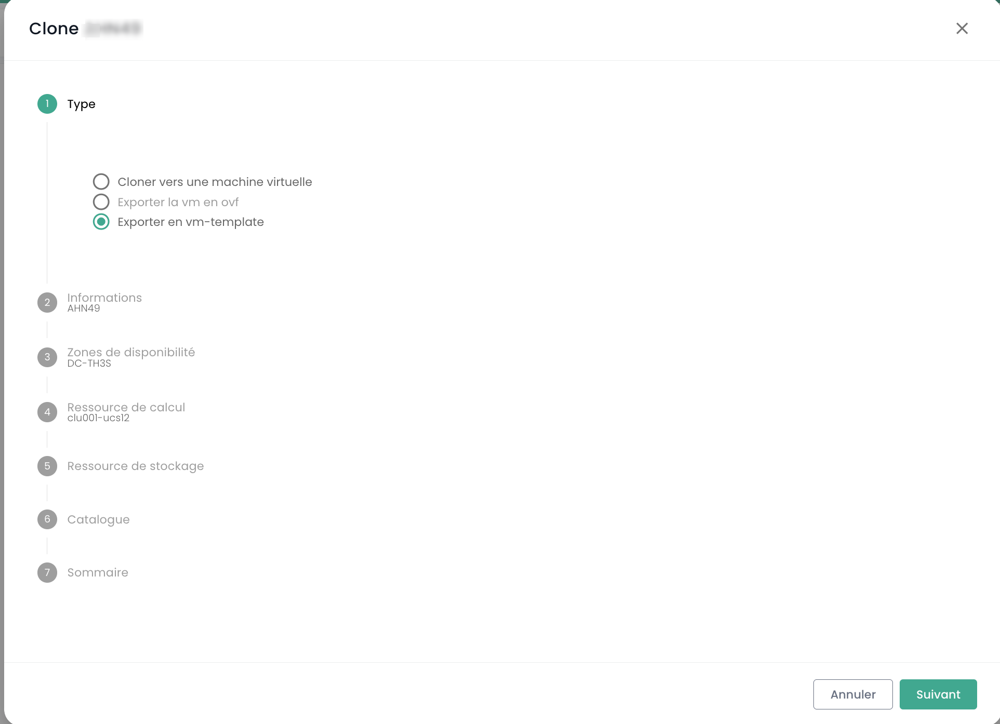
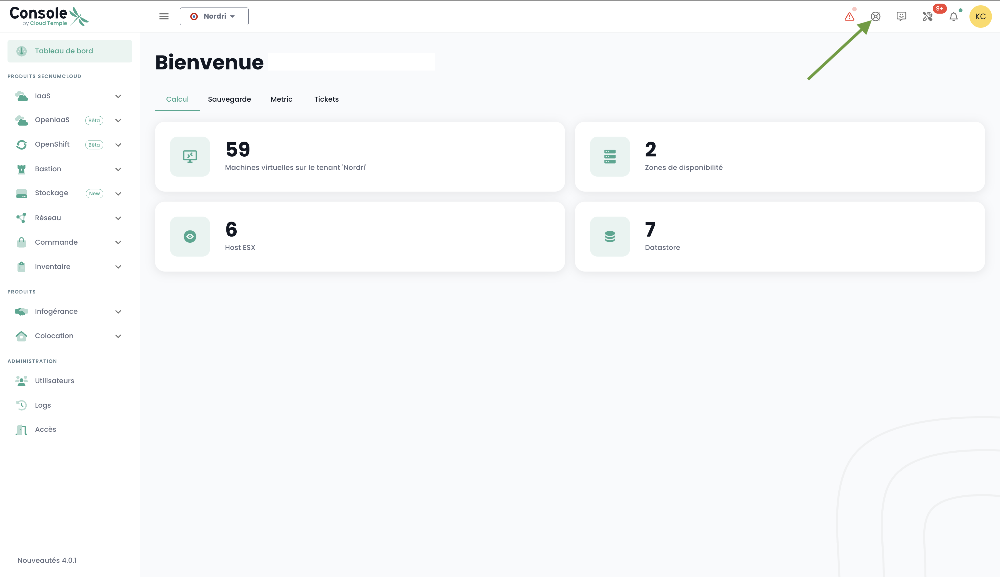

## Berechnung

### Verwaltung von Virtuellen Maschinen

Die Verwaltungsoberfläche Ihrer virtuellen Maschinen ist in der Shiva-Konsole im Menü __'IaaS'__ verfügbar, das sich auf dem grünen Balken links auf dem Bildschirm befindet.

### Liste der virtuellen Maschinen

Im Abschnitt __'Virtuelle Maschinen'__ haben Sie Zugriff auf die Liste Ihrer auf Ihrer vertrauenswürdigen Cloud gehosteten virtuellen Maschinen.


Sie haben Zugriff auf die folgenden Informationen für jede virtuelle Maschine:
- ihren Namen,
- die ihr zugewiesenen Tags,
- ihren Status (ausgeschaltet, eingeschaltet, in Bearbeitung, Host getrennt oder ungültig),
- ihren Manager (in einer VMware-Umgebung das zugehörige Vcenter),
- ihr Betriebssystem,
- die Menge der virtuellen CPUs (vCPU),
- die Menge des virtuellen Arbeitsspeichers (vRAM).

### Aktionen auf virtuellen Maschinen

Die folgenden Aktionen sind über diese Schnittstelle möglich:

- Liste der virtuellen Maschinen aktualisieren;
- Liste im CSV-Format exportieren;
- Liste filtern;
- Eine virtuelle Maschine nach ihrem Namen suchen;
- Eine neue virtuelle Maschine erstellen.


__Ein Alarmbanner kann oben in der Liste angezeigt werden__: Es zeigt an, dass kritische Alarme auf einer oder mehreren Ihrer virtuellen Maschinen ausgelöst wurden.
Die Schaltfläche __'Anzeigen'__ ermöglicht das Anzeigen der virtuellen Maschinen, die von dieser Benachrichtigung betroffen sind.


Wenn Sie auf den grünen Dropdown-Pfeil rechts in der Liste für eine virtuelle Maschine klicken:


haben Sie Zugriff auf alle Informationen zu dieser Maschine:


Ein Schnellaktionsleiste ermöglicht die Ausführung der folgenden Aktionen:


- Die virtuelle Maschine einschalten;
- Sie ausschalten;
- Sie neu starten;
- Die Energieoptionen des Gastbetriebssystems ändern;
- Die Konsole öffnen;
- Ein ISO einhängen;
- Ein ISO aushängen;
- Die virtuelle Maschine klonen;
- Sie verschieben (vMotion);
- Sie umbenennen;
- Sie löschen.

Eine Schnellansicht bietet eine Visualisierung des __Speichers__, der __CPU__ und des __RAM__ der virtuellen Maschine.


Im Tab __'Allgemeine Informationen'__ finden Sie detaillierte Informationen zu Ihrer virtuellen Maschine, wie ihr Betriebssystem, ihren physischen Standort (Datacenter, Datastore usw.), RAM, CPU, IP-Adressen, Logs und mehr.


Über diese Ansicht können Sie die folgenden Aktionen ausführen:

- Das Betriebssystem ändern (die virtuelle Maschine muss ausgeschaltet sein),
- Die Hardwareversion aktualisieren (die virtuelle Maschine muss ausgeschaltet sein),
- RAM oder CPU ändern.

Ein Tab __'Erweitert'__ bietet spezifischere Informationen wie "VMware Tools"-Informationen, die Hardwareversion, den Manager usw.


### Bearbeiten des RAM oder der CPU einer virtuellen Maschine
Gehen Sie zum Tab __'Virtuelle Maschinen'__, zeigen Sie die Details einer virtuellen Maschine an,
wählen Sie den Tab __'Allgemeine Informationen'__ und klicken Sie auf die Schaltfläche zum Bearbeiten der zu ändernden Variable:


### Die Betriebsmodi von Festplatten

Sie können verschiedene Festplattenmodi hinzufügen:
  - __Persistente__ : Änderungen werden sofort und dauerhaft auf die virtuelle Festplatte geschrieben. **Dies ist der empfohlene Modus.**
  - __Unabhängig, nicht persistent__ : Änderungen an der virtuellen Festplatte werden in einem neuen Logbuch aufgezeichnet und beim Ausschalten gelöscht. Nicht betroffen von Snapshots. **Wird nicht von der Sicherung unterstützt.**
  - __Unabhängig, persistent__ : Änderungen werden sofort und dauerhaft auf die virtuelle Festplatte geschrieben. Nicht betroffen von Snapshots. **Wird nicht von der Sicherung unterstützt.**

### Verwaltung der Controller einer virtuellen Maschine

Sie können den Festplattentyp Ihrer virtuellen Maschine ändern.


Virtuelle Maschinen können mit SCSI- und NVME-Controllern ausgestattet werden, mit einer Grenze von 4 Controllern pro Typ. Jeder Controller kann bis zu 15 Festplatten verwalten.

Ein SCSI-Controller kann mit verschiedenen Untertypen konfiguriert werden: Para Virtual, Bus Logic, LSI Logic oder LSI Logic SAS.

Der Para Virtual Controller zeichnet sich durch seine erweiterte Kapazität aus. Er kann bis zu 64 Festplatten unterstützen, wenn die Hardwareversion der virtuellen Maschine mit einem ESXi ab Version 6.7 kompatibel ist.

> **Wichtig**: Wenn Sie den Typ eines Para Virtual Controllers ändern möchten, der mehr als 15 Festplatten besitzt, müssen Sie zunächst die Festplatten an den betreffenden Steckplätzen trennen.

### Konsole einer virtuellen Maschine

Die Konsole einer virtuellen Maschine ist über die Liste der virtuellen Maschinen zugänglich, indem Sie auf das Symbol __'Konsole'__ klicken:


Ein neuer Tab in Ihrem Browser wird geöffnet und die Konsole Ihrer Maschine, basierend auf einem VNC-Client, wird angezeigt:


Im VNC-Menü sind folgende Aktionen möglich:

- Eine spezielle Taste senden,
- Kopieren/Einfügen aus der Zwischenablage Ihres Betriebssystems,
- In den Vollbildmodus wechseln,
- Die Fenstergröße ändern (Skalierung).

Die Tastatursteuerung mit der Konsole virtueller Maschinen funktioniert perfekt in einer vollständig *englischen* Umgebung.

Die Eingabe in die Konsole hängt von der Sprache der Tastatur Ihrer physischen Maschine, der Sprache der Tastatur der virtuellen Maschine und davon ab, ob die Option 'Tastatur erzwingen' links auf dem Bildschirm aktiviert ist oder nicht.
Hier ist eine Zusammenfassung der möglichen Situationen für die französische Sprache:

| Sprache der Tastatur der physischen Maschine (Eingabe) | Sprache der Tastatur der virtuellen Maschine | Option 'Tastatur erzwingen' ausgewählt | Ergebnis (Ausgabe)                                   |
| ------------------------------------------------------- | -------------------------------------------- | ------------------------------------- | ---------------------------------------------------- |
| Französisch                                              | Französisch                                   | Nein                                  | Nicht empfohlen (Problem mit Sonderzeichen) |
| Französisch                                              | Französisch                                   | Ja                                    | < und > funktionieren nicht                      |
| Französisch                                              | Englisch                                     | Nein                                  | Nicht empfohlen (Problem mit Sonderzeichen) |
| Französisch                                              | Englisch                                     | Ja                                    | Englisch                                              |
| Englisch                                                | Französisch                                   | Nein                                  | < und > funktionieren nicht                       |
| Englisch                                                | Französisch                                   | Ja                                    | < und > funktionieren nicht                      |
| Englisch                                                | Englisch                                     | Nein                                  | Englisch                                              |
| Englisch                                                | Englisch                                     | Ja                                    | Englisch                                              |

__Hinweis__:

- Wenn die Kombination __'AltGr'__ und __'@'__ auf der Tastatur nicht funktioniert, aktivieren Sie die Schaltfläche __'Taste erzwingen'__ im __'VNC'__-Menü der Konsole und versuchen Sie es erneut.
- Wenn es weiterhin nicht funktioniert und das Betriebssystem der physischen Maschine __Windows_ ist, stellen Sie die Tastatur der physischen Maschine auf Englisch
und versuchen Sie, das @-Zeichen auf die normale Weise einzugeben__ *(AZERTY-Ausgabe: AltGr + 0-Taste oder QWERTY-Ausgabe: 2-Taste)*.

### Kataloge von virtuellen Maschinen bei Cloud Temple

Cloud Temple stellt Ihnen einen regelmäßig von unseren Teams erweiterten und aktualisierten `Templates`-Katalog zur Verfügung.
Er umfasst derzeit mehrere Dutzend `Templates` und Images, die Sie auf Ihren virtuellen Maschinen verwenden können.


Um ein ISO/OVF zu veröffentlichen, gehen Sie zur Ansicht __'Katalog'__ und klicken Sie auf die Schaltfläche __'Dateien veröffentlichen'__ oben auf der Seite:


Sie können eine virtuelle Maschine in ein Modell umwandeln und in den Katalog exportieren. Wählen Sie dazu eine virtuelle Maschine aus und verwenden Sie die Schaltfläche __'Klonen'__:


Wählen Sie __'Als VM-Template exportieren'__:



Geben Sie dann die erforderlichen Informationen ein. Es wird möglich sein, eine neue VM aus dem Modell über die Schaltfläche __'Neue virtuelle Maschine'__ oder über die Seite __'Kataloge'__ zu starten. Es ist auch möglich, die VM im OVF-Format zu exportieren.

**Gut zu wissen**: Es ist möglich, eine OVA-Datei in eine OVF-Datei zu konvertieren und umgekehrt.
Die am häufigsten verwendete Methode ist der VMware-Konverter, aber es gibt auch eine einfache Methode unter Verwendung von ```tar```

Extrahieren der OVA-Datei:
```
$ tar -xvf vmName.ova
```

Erstellen einer OVA-Datei aus einer OVF-Datei:
```
$ tar -cvf vmName-NEW.ova vmName.ovf vmName-disk1.vmdk vmName.mf
```

### Erweiterte Einstellungen für virtuelle Maschinen: Extra Config

Die Extra Config bietet eine flexible Möglichkeit, Schlüssel=Wert-Paare in die Konfiguration einer virtuellen Maschine aufzunehmen. Die Schlüssel und Werte werden vom System interpretiert, wenn die virtuelle Maschine bereitgestellt wird.

Jetzt können Sie selbst die Eigenschaften vom Typ __Extra Config__ in den erweiterten Optionen einer virtuellen Maschine ändern:


Sie können eine Eigenschaft aus einer Liste von Schlüsseln hinzufügen. Außerdem können Sie den Wert eines Schlüssels ändern, den Sie selbst hinzugefügt haben. Bereits vorhandene Schlüssel=Wert-Paare können nicht geändert werden.

Bitte kontaktieren Sie den Support für Anfragen zum Hinzufügen neuer Schlüssel.


__Hinweis__ : *Für die Verwendung von GPU durch die virtuelle Maschine ist es obligatorisch, den Schlüssel 'pciPassthru.use64bitMMIO' zu aktivieren und die notwendige Menge an MMIO-Speicherplatz (Memory-mapped I/O) über 'pciPassthru.64bitMMIOSizeGB' zuzuweisen. Es wird dringend empfohlen, sich auf die [offizielle Nvidia-Dokumentation](https://docs.nvidia.com/vgpu/17.0/grid-vgpu-release-notes-vmware-vsphere/index.html#tesla-p40-large-memory-vms) zu beziehen.*

### Erweiterte Einstellungen für virtuelle Maschinen: vAPP

Sie können auch Eigenschaften vom Typ __vAPP__ in den erweiterten Optionen einer virtuellen Maschine ändern:


Sie können eine Eigenschaft hinzufügen, ändern oder löschen. Es werden vier Arten von Eigenschaften angeboten: String, Zahl, Boolean, Passwort:


__Hinweis__ : *Die virtuelle Maschine muss gestoppt sein, um ihre vAPP-Eigenschaften zu ändern.*

### Verwaltung von __'Hypervisoren'__ und __'Cpool'__ (Hypervisor-Clustern)

Die Verwaltung Ihrer Hypervisoren erfolgt im Untermenü __'Berechnung'__ des Menüs __'IaaS'__, das sich im grünen Banner auf der linken Seite Ihres Bildschirms befindet.


In diesem Untermenü haben Sie eine Ansicht auf:

- Den Hypervisor-Software-Stack, ihre AZ und ihre Ressourcen,
- Den Backup-Software-Stack.

Im Januar 2024 basiert das auf der qualifizierten Cloud Temple-Infrastruktur verfügbare Hypervisor-Angebot auf VMware. Die verwendete Backup-Software ist IBM Spectrum Protect Plus.

### Verwaltung von VMware-Clustern

Um auf die Verwaltung von VMware-Clustern zuzugreifen, klicken Sie im Untermenü __'Berechnung'__ des Menüs __'IaaS'__:

Standardmäßig listet der erste Tab alle Hypervisoren auf (alle Cluster zusammen):


Sie können die Details eines Hypervisors anzeigen, indem Sie auf seinen Namen klicken:


Es gibt einen Tab für jeden Hypervisor-Cluster, um die Details jedes einzelnen einzusehen:


Wenn Sie auf einen Cluster klicken, sehen Sie eine Zusammenfassung seiner Zusammensetzung:

- Die gesamte Rechenleistung in Ghz,
- Der gesamte verfügbare Speicher und das verwendete Verhältnis,
- Der gesamte Speicherplatz (alle Typen zusammen) sowie der verwendete Anteil,
- Automatisierungsmechanismen bei Nichtverfügbarkeit einer Recheneinheit (__'Vsphere DRS'__),
- Die Anzahl der virtuellen Maschinen,
- Die Anzahl der Hypervisoren.

<!-- TODO: Add missing page. -->
<!-- Wenn Sie die Seite eines Clusters aufrufen, stehen mehrere Tabs zur Verfügung. Der Tab __'Regeln'__ ermöglicht es Ihnen, die [Affinitäts-/Anti-Affinitätsregeln](compute.md#verwaltung-der-affinität-ihrer-virtuellen-maschinen) zu definieren. -->


Für jeden Hypervisor im Tab __'Hosts'__ sehen Sie:

- Die __CPU__- und __Speicher__-Nutzung,
- Die Anzahl der zugewiesenen virtuellen Maschinen,
- Die Verfügbarkeit eines neuen Builds für das Betriebssystem des Hypervisors, falls zutreffend,
- Den Status des Hypervisors (verbunden in Produktion, in Wartung, ausgeschaltet, ...),
- Ein Aktionsmenü.


Mehrere Aktionen sind vom Tab __'Hosts'__ aus möglich:

- Neue Hypervisoren über die Schaltfläche __'Host hinzufügen'__ bestellen:


- Möglichkeit, __die Details eines Hypervisors__ einzusehen:


- Einen Hypervisor in den __Wartungszustand__ zu versetzen oder aus diesem herauszunehmen,
- Diesen Hypervisor gegebenenfalls __zu aktualisieren__; dazu __muss er unbedingt in Wartung sein__. Es gibt zwei Arten von Updates:

1. VMware-Builds (neue Versionen des Hypervisors):


2. Aktualisierung der Firmware Ihrer Recheneinheit (BIOS und Firmware der Tochterkarten):


*__Anmerkung__* :

- *Cloud Temple stellt in regelmäßigen Abständen Builds für Hypervisoren zur Verfügung.
Es ist wichtig, Ihre Hypervisoren regelmäßig zu aktualisieren, insbesondere um die Anwendung von Sicherheitspatches zu ermöglichen.
Allerdings __aktualisieren wir Ihre Hypervisoren nicht selbst__. Cloud Temple hat keinen Einblick in die Verfügbarkeitsverpflichtungen Ihrer Workloads.
Wir überlassen es Ihnen daher, Ihr Änderungsmanagement umzusetzen und die neuen Builds zum bestmöglichen Zeitpunkt anzuwenden.*
- *Der Aktualisierungsprozess ist vollständig automatisiert. Sie müssen mindestens zwei Hypervisoren in Ihrem Cluster haben, um eine Aktualisierung ohne Serviceunterbrechung zu ermöglichen.*

<!-- TODO: Add missing page. -->
<!-- - *Es ist notwendig, [die entsprechenden Berechtigungen](../console/permissions.md) zu haben, um die verschiedenen Aktionen durchzuführen.* -->

Sie sehen auch alle Affinitäts-/Anti-Affinitätsregeln für Ihren Hypervisor-Cluster im Abschnitt __'Regeln'__.

### Verwaltung der Affinität Ihrer virtuellen Maschinen

Die __Affinitäts- und Anti-Affinitätsregeln__ ermöglichen es Ihnen, die Platzierung von virtuellen Maschinen auf Ihren Hypervisoren zu kontrollieren.
Sie können verwendet werden, um die Ressourcennutzung Ihres __'Cpool'__ zu verwalten.
Zum Beispiel können sie helfen, die Arbeitslast zwischen Servern auszugleichen oder ressourcenhungrige Arbeitslasten zu isolieren.
In einem __'Cpool'__ VMware werden diese Regeln oft verwendet, um das Verhalten von virtuellen Maschinen mit vMotion zu verwalten.
vMotion ermöglicht das Verschieben von virtuellen Maschinen von einem Host zu einem anderen ohne Serviceunterbrechung.

Mit der Regelverwaltung können Sie konfigurieren:

- __Affinitätsregeln__: Diese Regeln stellen sicher, dass bestimmte virtuelle Maschinen auf demselben physischen Host ausgeführt werden.
Sie werden verwendet, um die Leistung zu verbessern, indem virtuelle Maschinen, die häufig miteinander kommunizieren,
auf demselben Server gehalten werden, um die Netzwerklatenz zu reduzieren. Affinitätsregeln sind nützlich in Szenarien,
in denen die Leistung kritisch ist, wie im Fall von Datenbanken oder Anwendungen, die eine schnelle Kommunikation zwischen Servern erfordern.

- __Anti-Affinitätsregeln__: Im Gegensatz dazu stellen diese Regeln sicher, dass bestimmte virtuelle Maschinen nicht auf
demselben physischen Host ausgeführt werden. Sie sind wichtig für die Verfügbarkeit und Resilienz, zum Beispiel,
um zu vermeiden, dass alle kritischen Maschinen bei einem Ausfall eines einzelnen Servers betroffen sind.
Anti-Affinitätsregeln sind entscheidend für Anwendungen, die eine hohe Verfügbarkeit erfordern,
wie in Produktionsumgebungen, in denen die Fehlertoleranz eine Priorität ist.
Zum Beispiel möchten Sie nicht, dass Ihre beiden Active Directories auf demselben Hypervisor sind.

Bei der Erstellung einer Regel definieren Sie den Regeltyp (Affinität / Anti-Affinität), den Namen der Regel,
ihren Aktivierungsstatus (__'Status'__) und die betroffenen Maschinen Ihres Hypervisor-Clusters.


*Anmerkung: Die in der Konsole angebotenen Affinitäts-/Anti-Affinitätsregeln sind Regeln, die virtuelle Maschinen untereinander betreffen (keine Regeln zwischen Hypervisoren und virtuellen Maschinen).*

## Sicherung

### Eine Sicherungskopie-Richtlinie erstellen

Um eine neue Sicherungskopie-Richtlinie hinzuzufügen, müssen Sie eine Anfrage an den Support stellen. Der Support ist über das Rettungsring-Symbol oben rechts im Fenster zugänglich.

Die Erstellung einer neuen Sicherungskopie-Richtlinie erfolgt durch __eine Serviceanfrage__ mit Angabe von:

    Der Name Ihrer Organisation
    Der Name eines Kontakts mit seiner E-Mail und Telefonnummer zur Fertigstellung der Konfiguration
    Der Name des Tenants
    Der Name der Sicherungskopie-Richtlinie
    Die Eigenschaften (x Tage, y Wochen, z Monate, ...)



### Eine Sicherungskopie-Richtlinie einer virtuellen Maschine zuweisen

Wenn einer virtuellen Maschine (VM) eine SLA zugewiesen wird, erben alle mit dieser VM verbundenen Festplatten automatisch dieselbe SLA. Anschließend ist es möglich, die Ausführung der Sicherung manuell über den Tab "Sicherungskopie-Richtlinien" zu starten. Ohne manuellen Start wird die Sicherung automatisch gemäß dem von der SLA konfigurierten Zeitplan ausgeführt.

SecNumCloud macht es obligatorisch, einer virtuellen Maschine vor ihrem Start eine Sicherungskopie-Richtlinie zuzuweisen. Andernfalls erhalten Sie die folgende Benachrichtigung:


Klicken Sie auf den Tab __'Sicherungskopie-Richtlinien'__ im Menü Ihrer virtuellen Maschine. Sie können die der Maschine zugewiesene(n) Sicherungskopie-Richtlinie(n) einsehen.

Um der virtuellen Maschine eine neue Sicherungskopie-Richtlinie zuzuweisen, klicken Sie auf die Schaltfläche __'Richtlinie hinzufügen'__ und wählen Sie die gewünschte Sicherungskopie-Richtlinie aus.


### Eine Sicherungskopie-Richtlinie einer virtuellen Festplatte zuweisen

Es ist auch möglich, eine SLA direkt einer bestimmten virtuellen Festplatte einer Maschine zuzuweisen. In diesem Fall erbt die virtuelle Maschine nicht die individuell auf die Festplatte angewendete SLA. Es ist jedoch nicht möglich, die Ausführung der Sicherung auf Festplattenebene manuell zu starten, da diese Funktionalität in Spectrum Protect Plus nicht unterstützt wird.

Andererseits ist es möglich, bestimmte Festplatten von einer oder mehreren Sicherungskopie-Richtlinien (SLAs) der VM auszuschließen, was es ermöglicht, eine oder mehrere SLA(s) auf Festplatte-für-Festplatte-Basis abzumelden. Dieser Ansatz bietet die Flexibilität, die Ausführung der Sicherung einer SLA manuell zu starten, ohne alle Festplatten der virtuellen Maschine zu beeinflussen, was eine feinere Verwaltung der Sicherungen ermöglicht.

Klicken Sie auf die Aktionsleiste der Festplatte, der Sie eine Sicherungskopie-Richtlinie zuweisen möchten. Klicken Sie dann auf __'Richtlinien'__ und wählen Sie die gewünschte Sicherungskopie-Richtlinie aus.


*Hinweis* : Die hinzuzufügende Richtlinie muss sich in einer anderen Verfügbarkeitszone als die virtuelle Maschine befinden.

### Ausführen einer Sicherheitskopie-Richtlinie

Im Menü __'Sicherheitskopie-Richtlinien'__ Ihrer virtuellen Maschine klicken Sie auf die Schaltfläche __'Ausführen'__ in der Spalte __'Aktionen'__ der Sicherheitskopie-Richtlinie, die Sie ausführen möchten.


Um eine Sicherheitskopie-Richtlinie auszuführen, können Sie auch zum Abschnitt __'Sicherungen'__ im Menü Ihrer virtuellen Maschine gehen. Klicken Sie auf die Schaltfläche __'Sicherung ausführen'__, und wählen Sie die Sicherung aus, die Sie in der Dropdown-Liste ausführen möchten.


### Eine Sicherheitskopie-Richtlinie entfernen

Im Menü __'Sicherheitskopie-Richtlinien'__ Ihrer virtuellen Maschine klicken Sie auf die Schaltfläche __'Entfernen'__ in der Spalte __'Aktionen'__ der Sicherheitskopie-Richtlinie, die Sie entfernen möchten.


__Achtung, es ist nicht möglich, die letzte SLA auf einer eingeschalteten virtuellen Maschine zu entfernen:__


### Löschen einer Sicherheitskopie-Richtlinie: Fall einer gestoppten Sicherheitskopie-Richtlinie ("held")

Wenn die letzte Ressource von einer SLA-Richtlinie dissiziert wird, erkennt das System diese Situation automatisch. Infolgedessen wechseln alle Arbeiten, die mit dieser SLA-Richtlinie verbunden sind, automatisch in den Zustand "Gestoppt" ("Held"). Es ist wichtig zu beachten, dass in diesem Stadium das direkte Löschen der SLA-Richtlinie aufgrund der Existenz abhängiger Arbeiten nicht möglich ist. Um die Richtlinie zu löschen, muss eine Reihe von Schritten befolgt werden.

Es muss überprüft werden, dass die betroffenen Arbeiten tatsächlich im Zustand "Gestoppt" sind. Nach dieser Überprüfung können diese Arbeiten gelöscht werden. Erst nach dem Löschen dieser abhängigen Arbeiten kann die SLA-Richtlinie endgültig aus dem System gelöscht werden.

Ein spezieller Fall verdient besondere Aufmerksamkeit: das Hinzufügen einer neuen Ressource zu einer SLA-Richtlinie, deren abhängige Arbeiten nicht gelöscht wurden. In dieser Situation werden die Arbeits-IDs beibehalten. Es ist jedoch wichtig zu beachten, dass die Arbeiten im Zustand "Gestoppt" nicht automatisch wieder aufgenommen werden. Ein manuelles Eingreifen ist erforderlich, um sie wieder zu aktivieren und ihre Ausführ
