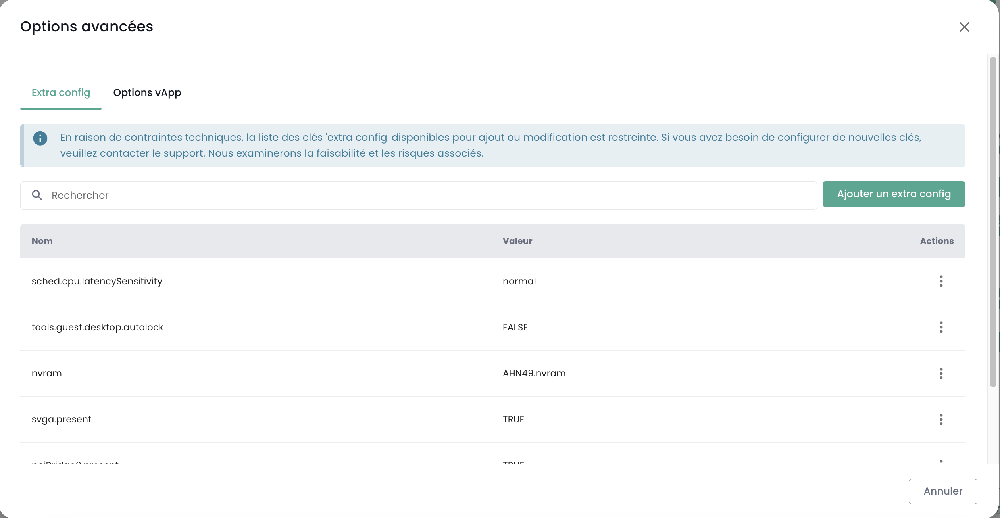
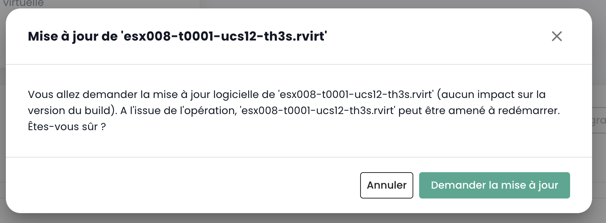

### Berechnung

### Management of Virtual Machines

The management interface for your virtual machines is accessible in the Shiva console, under the 'IaaS' menu located on the top left bar of the screen.

### Liste der virtuellen Maschinen

In der Abschnitt "Virtuelle Maschinen" erhalten Sie Zugriff auf die Liste Ihrer virtuellen Maschinen, die bei Ihrem vertrauenswürdigen Cloud-Anbieter gehostet werden.


Für jede virtuelle Maschine stehen Ihnen folgende Informationen zur Verfügung:

- Den Namen der Maschine,
- Die zugeordneten Tags,
- Der Status (ausgeschaltet, eingeschaltet, in Bearbeitung, Host abgekoppelt oder ungültig),
- Der Manager (bei VMware-Umgebungen ist dies der Vcenter-Verbundenere),
- Das Betriebssystem,
- Die Anzahl der virtuellen Prozessoren (vCPU),
- Den Speicher in virtueller Speicher (vRAM).

### Actions sur les machines virtuelles

Les opérations suivantes peuvent être effectuées à partir de cette interface :

- Mettre à jour la liste des machines virtuelles ;
- Exporter la liste dans le format CSV ;
- Filtrer la liste ;
- Rechercher une machine virtuelle par son nom ;
- Créer une nouvelle machine virtuelle.


__Un bandeau d'alertes peut apparaître en haut de la liste__, indiquant des alarmes critiques déclenchées sur l'une ou plusieurs de vos machines virtuelles. Le bouton __'Voir'__ permet de consulter les machines concernées par cette notification.


En cliquant sur la flèche déroulante verte à droite d'une machine virtuelle :


Vous accédez à toutes les informations concernant cette dernière :


Un bandeau rapide permet de réaliser les actions suivantes :


- Allumer la machine virtuelle ;
- Éteindre la machine virtuelle ;
- Redémarrer la machine virtuelle ;
- Modifier les options d'alimentation du SE invité ;
- Ouvrir la console ;
- Monter un ISO ;
- Démonter un ISO ;
- Cloner la machine virtuelle ;
- La déplacer (vMotion) ;
- La renommer ;
- La supprimer.

Une vue rapide offre une visualisation du __stockage__, du __CPU__ et de la __RAM__ de la machine virtuelle.


Dans l'onglet __'Informations générales'__, vous trouvez des informations détaillées relatives à votre machine virtuelle, telles que son OS, son emplacement physique (datacenter, datastore, etc.), la RAM, le CPU, les adresses IP, les logs, et autres.


Depuis cette vue, vous pouvez effectuer les actions suivantes :

- Modifier le système d'exploitation (la machine virtuelle devant être éteinte),
- Mettre à jour la version du matériel (la machine virtuelle devant être éteinte),
- Modifier la RAM ou le CPU.

Un onglet __'Avancé'__ permet de consulter des informations plus spécifiques comme les infos "VMware tools", la version hardware, le manager, etc...


### Änderung der RAM oder des CPUs einer virtuellen Maschine

Gehen Sie zum Tab "Virtuelle Maschinen", zeigen Sie die Details einer virtuellen Maschine an, wählen Sie den Tab "Allgemeine Informationen" und klicken Sie auf den Bearbeitungsbutton für die zu ändernde Variable:


### Speichermodi

Sie können verschiedene Speichermodi hinzufügen:

- **Persistenter**: Modifikationen werden sofort und dauerhaft auf dem virtuellen Diskimage geschrieben. __Dies ist der empfohlene Modus.__
- **Unabhängiger, nicht-persisterender**: Modifikationen am virtuellen Diskimage werden in einem neuen Log gespeichert und bei Auslöschen des Systems wieder entfernt. Nicht durch Snapshots beeinflusst. __Diese Funktion wird von der Wiederherstellung unterstützt__ nicht.
- **Unabhängiger, persisterender**: Modifikationen werden sofort und dauerhaft auf dem virtuellen Diskimage geschrieben. Nicht durch Snapshots beeinflusst. __Diese Funktion wird von der Wiederherstellung nicht unterstützt__ .

### Verwaltung von virtuellen Systempfadensteuerungen

Sie können den Typ der Festplattensteuerung für Ihre virtuelle Maschine ändern.


Virtuelle Maschinen können mit Steuerungen SCSI und NVME ausgestattet werden, wobei eine Höchstdifferenz von 4 Steuerungen pro Typ vorgegeben ist. Jede Steuerung kann bis zu 15 Festplatten verwalten.

Eine Steuerung SCSI kann mit verschiedenen Untertypen konfiguriert werden: Para Virtual, Bus Logic, LSI Logic oder LSI Logic SAS.

Die Steuerung Para Virtual ist bekannt für ihre breite Anwendung. Sie kann bis zu 64 Festplatten unterstützen, wenn die Hardware-Version der virtuellen Maschine mit ESXi 6.7 oder höher kompatibel ist.

> __Wichtig__: Wenn Sie den Typ eines Para Virtual Steuerungstyps mit mehr als 15 Festplatten ändern möchten, müssen Sie zunächst die an diesen Slots angeschlossenen Festplatten entfernen.

### Console of a Virtual Machine

The console of a virtual machine is accessible from the list of virtual machines by clicking on the 'Console' icon:


Ein neuer Tab öffnet sich in Ihrem Browser und zeigt die Konsole Ihrer Maschine an, basierend auf einem VNC-Client:


Im **VNC-Menü** können Sie:
- Das Senden bestimmter Tasten anfordern,
- Eine Tastaturzuordnung erzwingen (falls wir Ihre Tastatur nicht korrekt identifizieren konnten),
- Ein Textfeld öffnen, das an die Maschine übertragen werden kann. Diese Methode ersetzt die alte nicht funktionierende Zwischenablage,
- In den Vollbildmodus wechseln.

__Hinweis__:
Die Fensterskalierung erfolgt automatisch.

#### Unterstützung für Tastaturlayouts
Die in der Konsole eingegebenen Eingaben hängen von der Sprache der Tastatur Ihres Webbrowsers, der Sprache der Tastatur der virtuellen Maschine und davon ab, ob die Option 'Tastatur erzwingen' auf der linken Seite des Bildschirms aktiviert ist oder nicht. Hier ist eine Zusammenfassung der möglichen Situationen mit der französischen Sprache:

| Sprache der physischen Tastatur (Eingabe) | Sprache der Tastatur der virtuellen Maschine | Option 'Tastatur erzwingen' ausgewählt | Ergebnis (Ausgabe)        |
| ------------------------------------------ | -------------------------------------------- | -------------------------------------- | ------------------------ |
| Französisch                                | Französisch                                  | Nein                                   | ✅                       |
| Französisch                                | Französisch                                  | Ja                                     | Nicht empfohlen          |
| Französisch                                | Englisch                                     | Nein                                   | Englisch                 |
| Französisch                                | Englisch                                     | Ja                                     | ✅                       |
| Englisch                                   | Französisch                                  | Nein                                   | Französisch              |
| Englisch                                   | Französisch                                  | Ja                                     | ✅                       |
| Englisch                                   | Englisch                                     | Nein                                   | ✅                       |
| Englisch                                   | Englisch                                     | Ja                                     | Nicht empfohlen          |

__Hinweis__:
- Wenn bestimmte Zeichen bei der manuellen Eingabe nicht funktionieren, können Sie es über die Zwischenablage versuchen.

#### Funktionsweise der Zwischenablage
Diese Funktion ermöglicht es Ihnen, eine gesamte Zeichenkette an Ihre virtuelle Maschine zu senden. Es ist wichtig zu beachten, dass die Taste "Tastatur erzwingen" beeinflusst, wie diese Zeichenkette an Ihre virtuelle Maschine übertragen wird. Wenn Sie während der Eingabe in der Konsole feststellen, dass die Option "Tastatur erzwingen" erforderlich ist, denken Sie daran, sie vor der Verwendung der Zwischenablage zu aktivieren.  
Diese Funktion kann verwendet werden, um beispielsweise ein Passwort, einen Befehl oder den Inhalt einer Konfigurationsdatei zu senden:


Durch Klicken auf die Schaltfläche "Einfügen" wird der Inhalt Ihres Textfelds an Ihre virtuelle Maschine gesendet.

### Cloud Temple Machine Templates Catalogue

Cloud Temple bietet Ihnen ein regelmäßig aktualisiertes und erweitertes Katalog von `Templates` für Ihre virtuellen Maschinen, das durch unsere Teams kontinuierlich erweitert wird. Es umfasst derzeit mehrere Dutzend `Templates` und Bilder zum Anbringen auf Ihren virtuellen Maschinen.


Um ein ISO/OVF-Datei zu veröffentlichen, navigieren Sie bitte in die Kategorie __'Catalogue'__ und klicken Sie auf den Button __'Veröffentlichen von Dateien'__ oben auf der Seite:


Es ist möglich, eine virtuelle Maschine in ein Template zu verwandeln und es in das Katalog zu exportieren. Dazu wählen Sie zunächst eine virtuelle Maschine und klicken Sie auf den Aktionsmodus __'Klonen'__:


Wählen Sie dann __'Exportieren als Template VM'__:


Geben Sie anschließend die erforderlichen Informationen ein. Anschließend können Sie eine neue virtuelle Maschine aus dem Template erstellen, entweder über den Button __'Neue virtuelle Maschine'__ oder von der Seite __'Catalogues'__. Darüber hinaus ist es auch möglich, die virtuelle Maschine in OVF-Format zu exportieren.

__Wissenswert__: Es ist möglich, ein OVA-Datei in ein OVF-Datei umzuwandeln und umgekehrt. Die am häufigsten verwendete Methode ist VMware Converter, aber es gibt auch eine einfache Möglichkeit mit `tar`.

Extrahieren einer OVA-Datei:

```
tar -xvf vmName.ova
```

Erstellen einer neuen OVA-Datei aus einer OVF-Datei:

```
tar -cvf vmName-NEW.ova vmName.ovf vmName-disk1.vmdk vmName.mf
```

### Ergänzende Konfiguration von virtuellen Maschinen: Zusätzliche Einstellungen

Die zusätzlichen Konfigurationsoptionen (Extra Config) bieten eine flexible Möglichkeit, Paare Schlüssel=Wert in die Konfiguration einer virtuellen Maschine einzubinden. Diese Einstellungen werden vom System während des Ausführungs der Maschine interpretiert.

Ab sofort können Sie selbst die Eigenschaften des Typs __Extra Config__ in den fortgeschrittenen Optionen einer virtuellen Maschine anpassen:



Sie können eine Eigenschaft aus einer Liste von Schlüsseln hinzufügen. Darüber hinaus können Sie die Werte einer Eigenschaft, die Sie selbst eingefügt haben, ändern. Die bereits existierenden Paare Schlüssel=Wert sind nicht modifizierbar.

Bitte wenden Sie sich an unser Support für Anfragen zur Hinzufügung neuer Schlüssel.


__Hinweis__: *Für die Nutzung von GPUs durch die virtuelle Maschine ist es Pflicht, die Schlüssel 'pciPassthru.use64bitMMIO' zu aktivieren und die erforderliche Menge an MMIO-Speicher (Memory-mapped I/O) über 'pciPassthru.64bitMMIOSizeGB' zuzuweisen. Es wird empfohlen, sich an die offizielle [Nvidia-Dokumentation](https://docs.nvidia.com/vgpu/17.0/grid-vgpu-release-notes-vmware-vsphere/index.html#tesla-p40-large-memory-vms) zu wenden.*

### Avanzate Konfigurazione delle Macchine Virtuali: vAPP

Inoltre, è possibile modificare le proprietà di tipo __vAPP__ nelle opzioni avanzate di una macchina virtuale:


È possibile aggiungere una proprietà, modificarla o rimuoverla. Sono disponibili quattro tipi di proprietà: String, Numero, Bool, Password:


**Nota**: *La macchina virtuale deve essere fermata per modificare le sue proprietà vAPP.*

### Management of __'Hypervisors__ and __'Cpool'__ (Hypervisor Clusters)

The management of your hypervisors is handled within the 'Compute' sub-menu under the 'IaaS' main menu, located in the top left navigation bar on your screen.


Within this sub-menu, you have access to:

- The hypervisor software stack, their AZ (Availability Zone), and resources,
- The backup software stack.

As of January 2024, the available hypervisor offering on Cloud Temple's qualified infrastructure is based on VMware. The backup software utilized is IBM Spectrum Protect Plus.

### Management of VMware Clusters

To access the management of VMware clusters, navigate to the "Compute" submenu under the "IaaS" menu:

By default, the first tab lists all hosts (all clusters combined):


You can view the details of a host by clicking on its name:


There is one tab per VMware cluster to view details for each:


If you click on a cluster, you see a summary of its composition:

- Total computing power expressed in GHz,
- Total available memory and usage ratio,
- Total storage (all types combined) along with utilization rate,
- Fault tolerance mechanisms (__'Vsphere DRS__'),
- Number of virtual machines,
- Number of hosts.

<!-- TODO: Add missing page. -->
<!-- Consulting a cluster's page reveals several tabs. The __'Rules'__ tab allows you to define affinity/anti-affinity rules for your virtual machines (compute.md#managing-vm-affinity). -->


You'll find the following details in the __'Hosts'__ tab for each host:

- CPU and memory usage,
- Number of virtual machines attached,
- Availability of a new OS build for the host (if applicable),
- Host status (production, maintenance, powered off, etc.),
- An action menu.


Multiple actions are available from the __'Hosts'__ tab:

- Adding a new host via the __'Add Host'__ button:


- Viewing details of a host:


- Entering or exiting maintenance mode for an host,
- Updating the host (if applicable), which requires the host to be in maintenance mode. There are two types of updates:

1. VMware hypervisor builds (__'New versions of the host__'):


2. Firmware update of your compute node (BIOS and firmware on attached cards):



*Note*:

- *Cloud Temple provides VMware hypervisor builds at regular intervals. It's crucial to keep your hosts updated, especially for security patches. However, Cloud Temple does not automatically update your hosts. We do not have visibility into the availability commitments of your workloads.*
- *The update process is fully automated. You must have at least two hosts in your cluster to perform an upgrade without service interruption.*

<!-- TODO: Add missing page. -->
<!-- - *You'll also find the entire set of affinity/anti-affinity rules for your VMware host cluster in the 'Rules' section.* -->

### Management of Virtual Machine Affinity

The __affinity and anti-affinity rules__ allow you to control the placement of your virtual machines on your hypervisors. They can be used to manage your __'Cpool'__ resources effectively. For instance, they can help balance workload distribution across servers or isolate resource-intensive workloads. In a VMware 'Cpool', these rules are frequently employed for managing the behavior of virtual machines with vMotion.

vMotion enables you to move virtual machines from one host to another without service interruption.

You can configure these rules through management:

- __Affinity Rules__ : These ensure that certain virtual machines run on the same physical host. They enhance performance by keeping frequently communicating VMs on the same server, reducing network latency. Affinity rules are beneficial in scenarios where high performance is critical, such as with databases or applications requiring rapid communication between servers.

- __Anti-Affinity Rules__ : Conversely, these ensure that certain virtual machines do not run on the same physical host. They are crucial for availability and resilience, preventing all critical VMs from being affected by a single server failure. Anti-affinity rules are vital for applications demanding high availability, like production environments where fault tolerance is paramount. For example, you wouldn't want both your Active Directory instances on the same hypervisor.

When creating a rule, you define its type (affinity/anti-affinity), name, activation status (__'Status'__), and the VMs involved in your cluster of hypervisors.


*Note: The affinity/anti-affinity rules provided in the console pertain to virtual machines among themselves (not between hypervisors and virtual machines).*

---
backup: true
---

### Erstellen einer Backup-Politik

Um eine neue Backup-Politik zu erstellen, müssen Sie bei unserem Support einen Antrag stellen. Der Support ist über die Schnellstart-Schale in der rechten oberen Ecke des Fensters zugänglich.

Die Erstellung einer neuen Backup-Politik erfolgt durch **einen Serviceantrag**, bei dem Sie folgende Informationen angeben müssen:

    Den Namen Ihrer Organisation
    Der Name eines Kontaktpersonals mit seinem Mailadresse und Telefonnummer zur Endkontrolle der Konfiguration
    Der Name des Benutzers
    Der Name der Backup-Politik
    Die Merkmale (x Tage, y Wochen, z Monate usw.)


### Assigning a Backup Policy to a Virtual Machine

When an SLA (Service Level Agreement) is assigned to a virtual machine (VM), all associated disks inherit the same SLA. Subsequently, you can manually initiate backup execution via the "Backup Policies" tab. If no manual initiation occurs, the backup will run automatically according to the schedule defined by the SLA.

SecNumCloud mandates the assignment of a backup policy to a virtual machine prior to its startup. Failure to do so results in the following notification:


Navigate to the "Backup Policies" tab on your VM's menu. Here, you can view the assigned (or assigned) backup policies for that machine.

To assign a new backup policy to the virtual machine, click the "Add Policy" button and select the desired policy from the list.


### Zugrichten einer Backup-Politik auf einen virtuellen Disk

Es ist auch möglich, eine SLA direkt einem spezifischen virtuellen Disk eines Servers zuzuweisen. In diesem Fall erbt die Maschine keine dieser SLA individuell auf dem Disk an sich. Allerdings kann man keinen manuellen Start der Backup-Ausführung auf Basis von Disks durchführen, da diese Funktionalität in Spectrum Protect Plus nicht unterstützt wird.

Stattdessen ist es möglich, bestimmte Disks aus einer oder mehreren Backup-Politik (SLA) einer VM zu entfernen, was bedeutet, dass man eine oder mehrere SLA(s) auf Basis des Disks löscht. Diese Methode bietet die Flexibilität, manuell die Ausführung einer Backup-Politik zu starten, ohne alle Disks der Maschine virtuelle zu betreffen, was eine präzisere Verwaltung der Backups ermöglicht.

Klicken Sie auf das Aktionsmenü des virtuellen Disks, an dem Sie eine Backup-Politik zuzuweisen möchten. Dann klicken Sie auf __'Politik'__ und wählen Sie die gewünschte Backup-Politik aus.


*Hinweis*: Die hinzuzufügende Politik muss sich in einer verfügbaren Zone außerhalb der Maschine virtuelle befinden.

### Ausführen einer Backup-Politik

In der Menüleiste __'Backup-Politik'__ Ihrer virtuellen Maschine, klicken Sie auf den Button __'Ausführen'__ in der Spalte __'Aktionen__ der Backup-Politik, die Sie ausführen möchten.


Um eine Backup-Politik auszuführen, können Sie sich auch von der Abschnitt __'Backups'__ im Menü Ihrer virtuellen Maschine begeben. Klicken Sie auf den Button __'Backup ausführen__ und wählen Sie die Backup-Datei aus, die Sie ausführen möchten, in der Dropdown-Liste aus.


### Löschen einer Backup-Politik

In der Menüfunktion __'Backup-Politik'__ Ihrer virtuellen Maschine klicken Sie auf den Button __'Löschen'__ in der Spalte __'Aktionen__ der Backup-Politik, die Sie entfernen möchten.


**Beachten Sie:** Es ist nicht möglich, eine letzte SLA (Service Level Agreement) von einer laufenden virtuellen Maschine zu löschen:


### Entfernung einer Backup-Politik: Fall einer suspendierten Backup-Politik ("gehalten")

Wenn die letzte Ressource aus einer SLA-Politik entfernt wird, erkennt das System diese Situation automatisch. Als Folge davon werden alle mit dieser SLA-Politik verbundenen Aufgaben automatisch in den Zustand "Gelöst" (Held) geändert. Es ist wichtig zu beachten, dass die direkte Entfernung der SLA-Politik an diesem Punkt nicht möglich ist, da Abhängigkeiten bestehen. Um eine solche Entfernung durchzuführen, müssen bestimmte Schritte befolgt werden.

Zunächst muss überprüft werden, ob die betroffenen Aufgaben tatsächlich im Zustand "Gelöst" sind. Sobald diese Überprüfung erfolgreich abgeschlossen wurde, können diese Aufgaben entfernt werden. Nachdem die Abhängigkeiten gelöst wurden, kann die SLA-Politik endgültig aus dem System entfernt werden.

Ein besonderer Fall erfordert besondere Aufmerksamkeit: Die Einführung einer neuen Ressource in eine SLA-Politik, bei der die Abhängigkeiten nicht entfernt wurden. In diesem Fall werden die Identifikatoren der Aufgaben behalten. Es ist jedoch zu beachten, dass Aufgaben im Zustand "Gelöst" keine automatische Wiederbelebung erfahren. Eine manuelle Intervention wird erforderlich sein, um diese Aufgaben wieder aufzunehmen und deren Ausführung zu ermöglichen.

Hinweis: Für weitere Details zu dieser Situation wenden Sie sich bitte an den Cloud-Tempel-Support.

Die Cloud-Tempel-Konsole verhindert die Zuordnung einer virtuellen Maschine zu einer suspendierten Backup-Politik:


Ebenso ist es nicht möglich, eine virtuelle Maschine mit einer suspendierten Backup-Politik zu starten:


### Wiederherstellen einer Backup

Der Register __'Backups'__ Ihres virtuellen Maschinen-Managers ermöglicht Ihnen, die Liste der verfügbaren Backups Ihrer virtuellen Maschinen zu durchsuchen.
Um eine Backup wiederherzustellen, klicken Sie auf den Schaltknopf __'Wiederherstellen'__ neben der entsprechenden Backup-Eintragung.


1. **Produktionsmodus**: Der Produktionsmodus ermöglicht die Wiederbelebung nach einem Ausfall auf dem lokalen Standort aus dem Primärspeicher oder einem Standort für eine Wiederbelebung nach einem Ausfall entfernt, indem die Original-Maschinenbilder durch Wiederherstellungsbilder ersetzt werden. Alle Konfigurationen, einschließlich Namen und Identifikatoren, sowie alle mit der virtuellen Maschine verbundenen Datenkopierungsarbeiten, werden während des Wiederbelebungsprozesses übertragen. In einem Produktionswiederherstellungsmodus können Sie die Speicherung in der virtuellen Maschine durch einen virtuellen Scheibenwerker aus einer früheren Backup-Maschinenbackup ersetzen.

2. **Testmodus**: Der Testmodus erstellt zeitweilige virtuelle Maschinen für Entwicklung, Test, Instantie-Überprüfung und Wiederbelebungsüberprüfung nach einem Plan, ohne die Produktionsumgebung zu beeinträchtigen. Die Testmaschinen laufen so lange wie erforderlich, um den Test und die Überprüfung durchzuführen, danach werden sie geräumt. Durch das Einrichten eines isolierten Netzwerks können Sie einen sicheren Testumgebung für Ihre Arbeit erstellen, ohne die virtuellen Maschinen zu beeinträchtigen, die für die Produktion verwendet werden. Die in diesem Modus erstellten virtuellen Maschinen besitzen einzigartige Namen und Identifikatoren, um Konflikte in Ihrer Produktionsumgebung zu vermeiden.

3. **Klonen**: Der Klon-Modus erstellt Kopien virtueller Maschinen für Fälle, die eine dauerhafte oder langfristige Backup-Maschine erfordern, wie z.B. Datenexploration oder das Erstellen eines Testumgebungen auf einem isolierten Netzwerk. Die in diesem Modus erstellten virtuellen Maschinen besitzen einzigartige Namen und Identifikatoren, um Konflikte in Ihrer Produktionsumgebung zu vermeiden. Beachten Sie, dass der Klon-Modus dauerhafte oder langfristige virtuelle Maschinen erstellt, daher ist es wichtig, die Ressourcennutzung zu überwachen.

Die Wiederherstellung ist standardmäßig im Testmodus konfiguriert, um die Produktion zu schützen, und Sie können den Namen der wiederhergestellten virtuellen Maschine auswählen:


Beachten Sie, dass bei erfolgreichen Tests eine virtuelle Maschine vom Testmodus in den Produktionsmodus übertragen werden kann:


