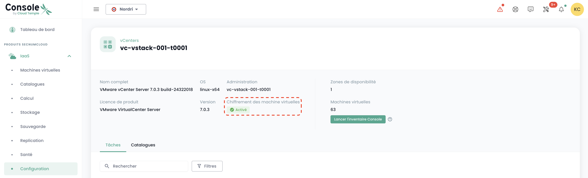
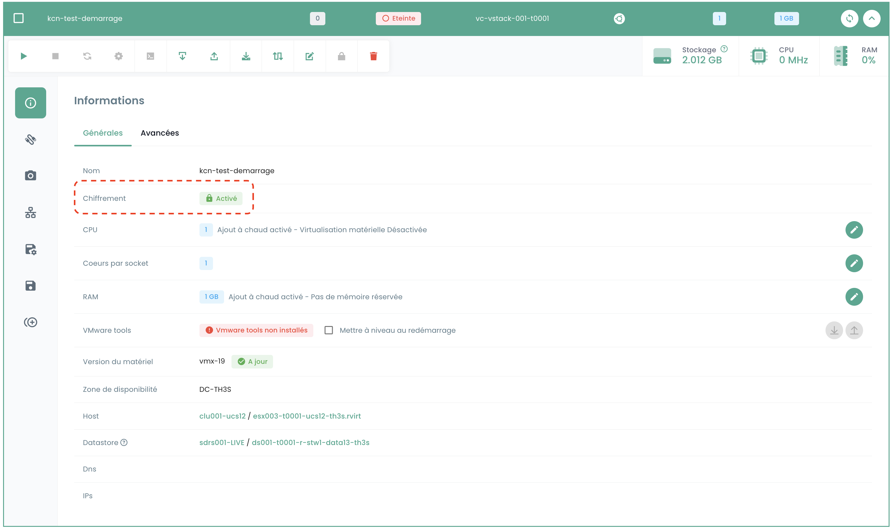

Diese Tutorien helfen Ihnen, die IaaS VMWare-Komponente über das Shiva-Portal zu nutzen und zu konfigurieren.

## Eine VMWare-VM verschlüsseln

## Voraussetzungen

1. **Schlüsselanbieter (HSM/KMS)**:
   - Ein Schlüsselanbieter muss auf dem vStack konfiguriert sein. (Falls kein Schlüsselanbieter konfiguriert ist, wenden Sie sich bitte über ein Ticket an den Support-Service.)
   - Stellen Sie sicher, dass der Schlüsselanbieter ordnungsgemäß aktiviert ist.

2. **Status der virtuellen Maschine**:
   - Die virtuelle Maschine muss ausgeschaltet sein.
   - Die virtuelle Maschine darf sich nicht im 'Test'-Modus befinden.
   - Die virtuelle Maschine darf nicht bereits verschlüsselt sein.

## Schnittstelle

Nach der Anmeldung am Shiva-Webportal finden Sie im Menü __'IaaS'__, Untermenü __'Konfiguration'__ und dem Tab __'vCenters'__, Informationen darüber, ob die Verschlüsselung auf dem betreffenden vStack aktiviert ist.

Navigieren Sie anschließend zum Untermenü __'Virtuelle Maschinen'__ und wählen Sie die Maschine aus, die Sie verschlüsseln möchten.

In den allgemeinen Informationen der virtuellen Maschine finden Sie die Angabe, ob die Maschine bereits verschlüsselt ist oder nicht.

Wenn die virtuelle Maschine die Voraussetzungen erfüllt, können Sie den Vorgang fortsetzen, indem Sie auf die Schaltfläche mit einem Schloss-Logo in der Werkzeugleiste klicken, die __'Virtuelle Maschine verschlüsseln'__ anzeigt.

Ein Bestätigungsfenster erscheint, wählen Sie Verschlüsseln.

Nach Abschluss der Aktion sollten Sie sehen, dass sich die Information geändert hat und angibt, dass Ihre Maschine verschlüsselt ist.

