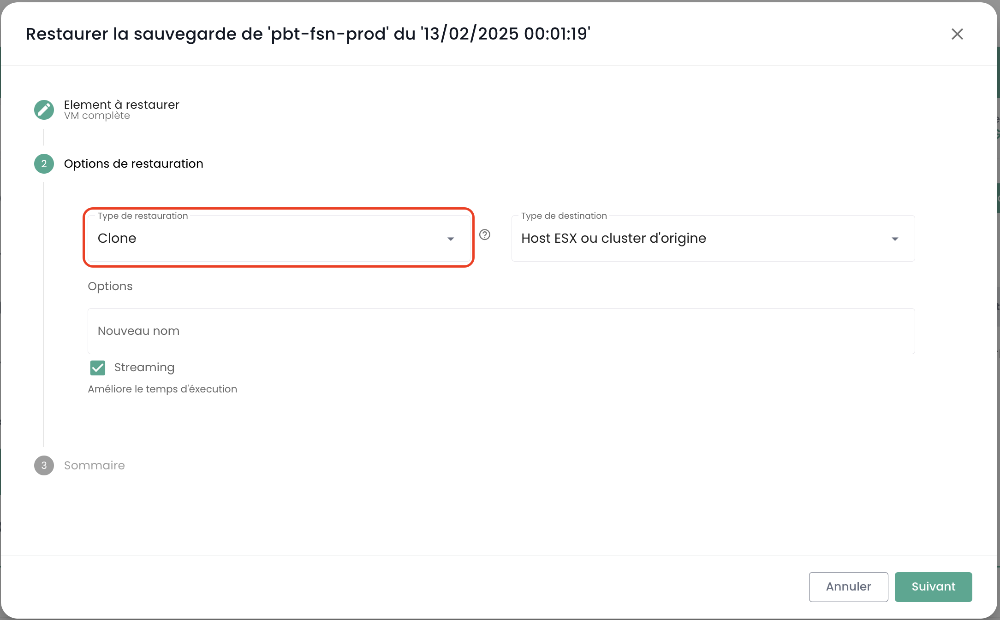
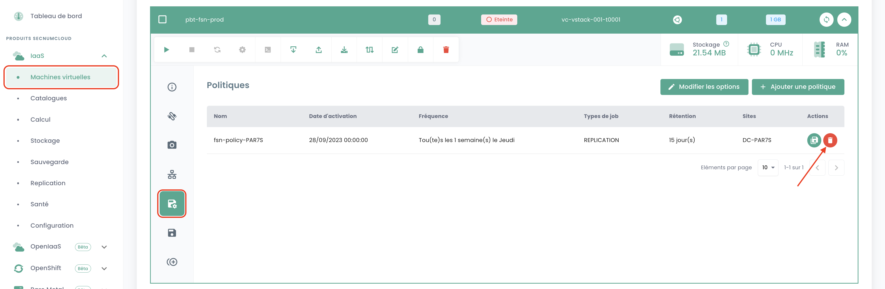

#### Wie klone ich eine virtuelle Maschine?

Es gibt 2 Möglichkeiten, eine virtuelle Maschine zu klonen:

- Die erste Option ermöglicht das Klonen einer virtuellen Maschine direkt über das __'Clone'__ -Symbol Ihrer virtuellen Maschine:

- Die zweite Lösung besteht darin, die virtuelle Maschine mithilfe eines Backups der virtuellen Maschine zu klonen und dann __die Wiederherstellung im Clone-Modus__ eines Backups zu verwenden.
Gehen Sie zum __'Backup'__ -Bereich Ihrer virtuellen Maschine und wählen Sie die Aktion __'Wiederherstellen'__:

Wählen Sie dann die Option __'Clone'__ zur Wiederherstellung:

#### Warum sehe ich bei der Auswahl einer Richtlinie auf der Seite "Backups-Richtlinien" nicht dieselben virtuellen Maschinen, wie wenn ich im "Backups-Bericht" dieselbe Richtlinie auswähle?

Das bedeutet, dass die fehlenden virtuellen Maschinen die betreffende Richtlinie für eine gewisse Zeit zugewiesen hatten (was ihre Anwesenheit in den Backup-Berichten erklärt), dass dies jedoch __nicht mehr der Fall ist__.

#### Wie füge ich einer virtuellen Maschine eine Backup-Richtlinie hinzu?

Gehen Sie zur Seite __'Virtuelle Maschinen'__ im Abschnitt __'IaaS'__ im grünen Menüband auf der linken Seite des Bildschirms.

Wählen Sie eine virtuelle Maschine und dann die Registerkarte __'Backups-Richtlinien'__ dieser Maschine:

Fügen Sie die gewünschte Backup-Richtlinie hinzu:

### Wie entferne ich eine Backup-Richtlinie von einer virtuellen Maschine?

Gehen Sie zur Seite __'Virtuelle Maschinen'__, wählen Sie eine virtuelle Maschine und dann die Registerkarte __'Backups-Richtlinien'__ dieser Maschine.

Löschen Sie die gewünschte Backup-Richtlinie und bestätigen Sie die Löschung:

__*Hinweis:*__ *Achtung! __Secnumcloud verlangt, dass jede virtuelle Maschine mindestens eine Backup-Richtlinie haben muss.__*

### Wie kann ich feststellen, ob ein Backup erfolgreich ausgeführt wurde?

Es gibt 2 mögliche Lösungen:

1. Gehen Sie zur Seite __'Jobs'__ im Menü __'Backup'__ im grünen Menüband auf der linken Seite Ihres Bildschirms. Wählen Sie den Job aus, der dem Backup entspricht, und selektieren Sie ihn.
Dann finden Sie die *jobsession*, die Ihrem Backup entspricht, und wählen Sie diese über das Menü __'Aktionen'__ aus.

Diese Aktionen zeigen detaillierte Protokolle der Backup-Ausführung. Sie können in den Backup-Protokollen suchen:

2. Gehen Sie zur Seite __'Backups-Berichte'__ und wählen Sie die Richtlinie aus, die Sie interessiert:

Sie können dann nach einem Datum filtern, den Bericht im __PDF__- oder __CSV__-Format herunterladen, um ihn in Drittanbieter-Tools zu verwenden.

### Wie starte ich eine Wiederherstellung?

Gehen Sie zur Seite __'Virtuelle Maschinen'__, wählen Sie eine virtuelle Maschine und dann die Registerkarte __'Backups'__ dieser Maschine. Um die Wiederherstellung zu starten, wählen Sie das wiederherzustellende Backup aus.

### Was ist die Quiescing-Option?

__Quiescing__ ist ein Prozess, der das System dazu auffordert, sich vor Beginn des Snapshots in einen geeigneten Zustand zu versetzen.
Standardmäßig ist __quiescing aktiviert__. Es kann manuell deaktiviert werden, wenn das System den Snapshot schlecht verwaltet oder wenn der Hypervisor-Agent nicht auf der virtuellen Maschine installiert ist.

Um dies zu tun, klicken Sie im __'Backups'__-Bereich Ihrer virtuellen Maschine auf __'Optionen bearbeiten'__ und deaktivieren Sie die __quiescing__:

### Welche Wiederherstellungsoptionen gibt es für eine virtuelle Maschine?

3 Hauptoptionen, um eine VM auf ihrem ursprünglichen Ziel oder einem anderen Ziel wiederherzustellen:

- __'CLONE'__: Stellt die virtuelle Maschine umbenannt wieder her, ohne die ursprüngliche virtuelle Maschine zu ersetzen.

- __'PRODUCTION'__: Stellt die Produktions-VM wieder her und __ersetzt__ diese (die aktuelle Produktions-VM wird __zerstört__).

- __'TEST'__: Stellt die Produktions-VM wieder her, __ohne sie zu überschreiben__.

### Wie stelle ich die Produktions-VM wieder her und ersetze sie, ohne die aktuell in Produktion befindliche VM zu behalten?

Wählen Sie den Wiederherstellungsmodus __'Production'__. Die Option 'VM überschreiben' ist standardmäßig aktiviert.

### Warum ist die Anzahl der virtuellen Maschinen in den Backup- und Compute-Modulen unterschiedlich?

Der Unterschied in den virtuellen Maschinen kann daran liegen, dass das Backup-Modul die zuletzt erstellten Maschinen nicht abgerufen hat.

Um das Backup-Modul zu aktualisieren, müssen Sie die Backup-Software anweisen, die virtuellen Maschinen erneut zu inventarisieren.
Um dies zu tun, gehen Sie im Menü __'Infrastruktur'__ im grünen Menüband auf der linken Seite des Bildschirms in das Untermenü __'Spectrum Protect Plus'__ und verwenden Sie die __'Aktion'__-Schaltfläche im Inventar:

Beachten Sie, dass das Datum des letzten Inventars angezeigt wird.

Falls immer noch ein Unterschied besteht, kann dies an den virtuellen Maschinen liegen, die das System hosten, das die Backups ermöglicht.
Diese zählen sich nämlich selbst nicht zur Anzahl der Maschinen im Backup-Modul.

### Wie inventarisiere ich virtuelle Maschinen im Backup-Modul?

Um eine Inventarisierung der virtuellen Maschinen im Backup-Modul durchzuführen, gehen Sie im Menü __'Infrastruktur'__ im grünen Menüband auf der linken Seite des Bildschirms in das Untermenü __'Spectrum Protect Plus'__ und verwenden Sie die __'Aktion'__-Schaltfläche im Inventar:

Beachten Sie, dass das Datum des letzten Inventars angezeigt wird.

### Warum schlägt das Backup meiner virtuellen Maschine fehl mit dem Hinweis auf ein Snapshot-Problem?

Dieser Fehler bedeutet, dass es das erste Mal ist, dass Ihre Maschine versucht, gesichert zu werden.

__Bei der ersten Sicherung einer virtuellen Maschine darf kein Snapshot auf der Maschine vorhanden sein.__

### Wie stelle ich die Produktions-VM wieder her und ersetze sie, indem ich die aktuell in Produktion befindliche VM beibehalte und umbenenne?

Hier ist wie es geht:

- Wählen Sie den Modus __'CLONE'__ (der Clone-Modus führt zu einer Änderung der MAC-Adresse und der UUID der virtuellen Maschine),
- Benennen Sie die wiederhergestellte virtuelle Maschine mit dem endgültigen Namen (der Produktions-VM) um,
- Benennen Sie die alte Produktions-VM (in _OLD) um.

### Wie stelle ich eine virtuelle Maschine wieder her, ohne die ursprüngliche VM zu ersetzen?

Hier ist wie es geht:

- Wählen Sie den Modus __'CLONE'__ (der Clone-Modus führt zu einer Änderung der MAC-Adresse und der UUID der virtuellen Maschine)
- Definieren Sie den Namen des Clones (_REST oder anderes)

### Warum kann ich eine Festplatte im Instant-Access-Modus nicht von meiner virtuellen Maschine löschen?

Führen Sie die Inventarisierung des Backups aus: Gehen Sie im Menü __'Infrastruktur'__ im grünen Menüband auf der linken Seite des Bildschirms in das Untermenü __'Spectrum Protect Plus'__ und verwenden Sie die __'Aktion'__-Schaltfläche im Inventar:

Löschen Sie die Festplatte, nachdem die Inventarisierung abgeschlossen ist. Aktualisieren Sie die virtuelle Maschine, um zu überprüfen, ob die Festplatte gelöscht wurde.

### Warum kann ich eine virtuelle Maschine mit einer Backup-Richtlinie im Status Held (ausgesetzte Richtlinie) nicht starten?

Eine "Held"-Richtlinie ist eine Funktion, die es ermöglicht, Retentions- und Datenlöschaktionen vorübergehend auszusetzen, wodurch sichergestellt wird, dass die Daten über ihren Standard-Retentionszeitraum hinaus aus bestimmten Gründen wie Compliance oder rechtlichen Anforderungen intakt und verfügbar bleiben.

Angenommen, ein Unternehmen hat eine 30-tägige Backup-Retention-Richtlinie für bestimmte Produktionsdaten. Aufgrund einer rechtlichen Untersuchung erhalten sie die Anforderung, alle relevanten Backups auf unbestimmte Zeit aufzubewahren. Sie können die zugehörige Backup-Richtlinie über den Status "Held" aussetzen, um die automatische Löschung dieser Backups nach 30 Tagen zu verhindern und sicherzustellen, dass die Daten für die Dauer der Untersuchung verfügbar bleiben.

Eine ausgesetzte Backup-Richtlinie (im Status Held) wird die ihr zugewiesenen geplanten Backups nicht ausführen, wodurch die virtuelle Maschine nicht als geschützt angesehen werden kann, was den SecNumCloud-Standards nicht entspricht.

Zögern Sie nicht, sich bei Fragen an unser Support-Team zu wenden.