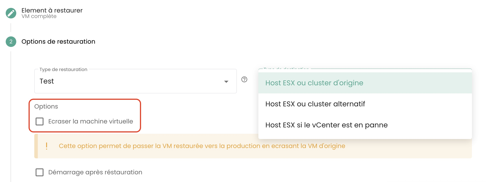

## Wie klone ich eine virtuelle Maschine?

Es gibt 2 Möglichkeiten, eine virtuelle Maschine zu klonen:

- Die erste Option ermöglicht das Klonen einer virtuellen Maschine direkt über das Symbol __'Klone'__ Ihrer virtuellen Maschine:

- Die zweite Lösung besteht darin, die virtuelle Maschine zu klonen, indem __ein Backup__ der virtuellen Maschine verwendet und anschließend __die Klon-Wiederherstellung__ eines Backups ausgeführt wird.
Gehen Sie zum Abschnitt __'Backup'__ Ihrer virtuellen Maschine und wählen Sie die Aktion __'Wiederherstellen'__:

Wählen Sie dann die Option __'Klonen'__ zur Wiederherstellung aus:

## Warum sehe ich auf der Seite "Backup-Richtlinien", wenn ich eine Richtlinie auswähle, nicht dieselben virtuellen Maschinen wie auf der Seite "Backup-Berichte", wenn ich dieselbe Richtlinie auswähle?

Dies bedeutet, dass die fehlenden virtuellen Maschinen die betreffende Richtlinie für eine gewisse Zeit zugewiesen bekamen (was ihre Anwesenheit in den Backup-Berichten erklärt), aber dass __dies derzeit nicht mehr der Fall ist__.

## Wie füge ich einer virtuellen Maschine eine Backup-Richtlinie hinzu?

Gehen Sie auf die Seite __'Virtuelle Maschinen'__ im Abschnitt __'IaaS'__ des grünen Menübands auf der linken Seite des Bildschirms.

Wählen Sie eine virtuelle Maschine und dann den Tab __'Backup-Richtlinien'__ dieser Maschine:

Fügen Sie die gewünschte Backup-Richtlinie hinzu:

## Wie entferne ich eine Backup-Richtlinie von einer virtuellen Maschine?

Gehen Sie auf die Seite __'Virtuelle Maschinen'__, wählen Sie eine virtuelle Maschine und dann den Reiter __'Backup-Richtlinien'__ dieser Maschine.

Entfernen Sie die gewünschte Backup-Richtlinie und bestätigen Sie die Löschung:

__*Hinweis:*__ *Bitte beachten Sie! __Secnumcloud erfordert, dass für jede virtuelle Maschine mindestens eine Backup-Richtlinie__ vorhanden ist.*

## Wie weiß ich, ob ein Backup erfolgreich ausgeführt wurde?

Es gibt 2 mögliche Lösungen:

1. Gehen Sie auf die Seite __'Jobs'__ im Menü __'Backup'__ im grünen Band auf der linken Seite Ihres Bildschirms. Wählen Sie den Job, der dem Backup entspricht, und wählen Sie ihn aus.
Finden Sie dann die *jobsession*, die Ihrem Backup entspricht, und wählen Sie sie über das Menü __'Aktionen'__ aus.

Diese Aktionen ermöglichen den Zugriff auf die detaillierten Logs der Backup-Ausführung. Sie können in den Backup-Protokollen suchen:

2. Gehen Sie auf die Seite __'Backup-Berichte'__ und wählen Sie die Richtlinie, die Sie interessiert:

Sie können dann nach einem Datum filtern, den Bericht im __PDF__- oder __CSV__-Format herunterladen und ihn in Drittsystemen auswerten.

## Wie starte ich eine Wiederherstellung?

Gehen Sie auf die Seite __'Virtuelle Maschinen'__, wählen Sie eine virtuelle Maschine und dann den Reiter __'Backups'__ dieser Maschine. Um die Wiederherstellung zu starten, wählen Sie das Backup aus, das wiederhergestellt werden soll.

## Was ist die Quiescing-Option?

Das __Quiescing__ ist ein Prozess, bei dem das System benachrichtigt wird, dass es sich in einen geeigneten Zustand versetzen soll, bevor der Snapshot beginnt.
Standardmäßig ist das __Quiescing aktiviert__. Es kann manuell deaktiviert werden, wenn das System den Snapshot nicht gut verarbeitet oder wenn der Hypervisor-Agent nicht auf der virtuellen Maschine installiert ist.

Gehen Sie dazu im Bereich __'Backups'__ Ihrer virtuellen Maschine auf __'Optionen ändern'__ und deaktivieren Sie das __Quiescing__:

## Welche Wiederherstellungsoptionen gibt es für eine virtuelle Maschine?

Es gibt 3 Hauptoptionen, um eine VM wiederherzustellen, auf ihr ursprüngliches Ziel oder auf ein anderes Ziel:

- __'CLONE'__: Stellt die virtuelle Maschine umbenannt wieder her, ohne die ursprüngliche virtuelle Maschine zu ersetzen.

- __'PRODUKTION'__: Stellt die Produktionsmaschine wieder her und __ersetzt__ diese (die derzeit in Produktion befindliche virtuelle Maschine wird __gelöscht__).

- __'TEST'__: Stellt die Produktionsmaschine wieder her, __ohne sie zu überschreiben__.

Weitere Details finden Sie in der [Dokumentation zur Sicherung](../../../iaas/backup.md).

## Wie stelle ich die Produktionsmaschine wieder her und ersetze sie, ohne die derzeit in Produktion befindliche Maschine zu behalten?

Wählen Sie den Wiederherstellungsmodus __'Produktion'__. Die Option 'virtuelle Maschine überschreiben' ist standardmäßig aktiviert.

## Warum ist die Anzahl der virtuellen Maschinen zwischen den Backup- und Compute-Modulen unterschiedlich?

Der Unterschied bei den virtuellen Maschinen kann darauf zurückzuführen sein, dass das Backup-Modul die zuletzt erstellten Maschinen nicht erfasst hat.

Um das Backup-Modul zu aktualisieren, muss die Backup-Software angewiesen werden, die virtuellen Maschinen erneut zu inventarisieren.
Gehen Sie dazu im Menü __'Infrastruktur'__ im grünen Band auf der linken Seite des Bildschirms zum Untermenü __'Spectrum Protect Plus'__ und verwenden Sie die Schaltfläche __'Aktion'__ des Inventars:

Beachten Sie, dass das Datum der letzten Inventarisierung angegeben ist.

Wenn eine Differenz bei den virtuellen Maschinen bestehen bleibt, könnte dies an den virtuellen Maschinen liegen, die das System hosten, das die Backups ermöglicht.
Diese werden nicht in die Berechnung der Anzahl der Maschinen im Backup-Modul einbezogen.

## Wie führe ich das Inventar der virtuellen Maschinen im Backup-Modul durch?

Um ein Inventar der virtuellen Maschinen im Backup-Modul durchzuführen, gehen Sie im Menü __'Infrastruktur'__ im grünen Band auf der linken Seite des Bildschirms zum Untermenü __'Spectrum Protect Plus'__ und verwenden Sie die Schaltfläche __'Aktion'__ des Inventars:

Beachten Sie, dass das Datum der letzten Inventarisierung angegeben ist.

## Warum schlägt das Backup meiner virtuellen Maschine mit einer Snapshot-Fehlermeldung fehl?

Dieser Fehler bedeutet, dass Ihre Maschine zum ersten Mal versucht, gesichert zu werden.

__Bei der ersten Sicherung einer virtuellen Maschine darf kein Snapshot auf der Maschine vorhanden sein.__

## Wie stelle ich die Produktionsmaschine wieder her und ersetze sie, indem ich die derzeit in Produktion befindliche Maschine beibehalte und umbenenne?

Gehen Sie wie folgt vor:

- Wählen Sie den Modus __'CLONE'__ (der Klonmodus führt zu einer Änderung der MAC-Adresse und der UUID der virtuellen Maschine),
- Benennen Sie die wiederhergestellte virtuelle Maschine mit dem endgültigen Namen (der Produktions-VM),
- Benennen Sie die alte Produktionsmaschine um (in _OLD).

## Wie stelle ich eine virtuelle Maschine wieder her, ohne die ursprüngliche virtuelle Maschine zu ersetzen?

Gehen Sie wie folgt vor:

- Wählen Sie den Modus __'CLONE'__ (der Klonmodus führt zu einer Änderung der MAC-Adresse und der UUID der virtuellen Maschine)
- Definieren Sie den Namen des Klons (_REST oder andere)

## Warum kann ich eine Festplatte im Instant-Access-Modus auf meiner virtuellen Maschine nicht löschen?

Inventarisieren Sie das Backup: Gehen Sie im Menü __'Infrastruktur'__ im grünen Band auf der linken Seite des Bildschirms zum Untermenü __'Spectrum Protect Plus'__ und verwenden Sie die Schaltfläche __'Aktion'__ des Inventars:

Führen Sie das Löschen der Festplatte durch, nachdem die Inventarisierung abgeschlossen ist. Aktualisieren Sie die virtuelle Maschine, um sicherzustellen, dass die Festplatte gelöscht wurde.

## Warum kann ich eine virtuelle Maschine mit einer Richtlinie im Held-Status (ausgesetzte Richtlinie) nicht starten?

Eine Richtlinie im Status "Held" ist eine Funktion, die es ermöglicht, Aufbewahrungs- und Löschaktionen des Datenmaterials vorübergehend auszusetzen, um sicherzustellen, dass die Daten über ihre Standard-Aufbewahrungsdauer hinaus für spezifische Anforderungen wie Compliance oder rechtliche Erfordernisse intakt und verfügbar bleiben.

Angenommen, ein Unternehmen hat eine Aufbewahrungsrichtlinie für Sicherungen von 30 Tagen für bestimmte Produktionsdaten. Aufgrund einer rechtlichen Untersuchung erhalten sie eine Aufforderung, alle relevanten Sicherungen für eine unbestimmte Zeit zu bewahren. Sie haben die Möglichkeit, die zugehörige Backup-Richtlinie über den Status "Held" auszusetzen, um die automatische Löschung dieser Sicherungen nach 30 Tagen zu verhindern, sodass die Daten für die gesamte Dauer der Untersuchung verfügbar bleiben.

Eine ausgesetzte Backup-Richtlinie (im Status Held) führt die Sicherungen des ihr zugewiesenen Plans nicht aus, sodass die virtuelle Maschine nicht als geschützt betrachtet werden kann, was den SecNumCloud-Normen nicht entspricht.

Zögern Sie nicht, unser Support-Team zu diesem Thema um Rat zu fragen.