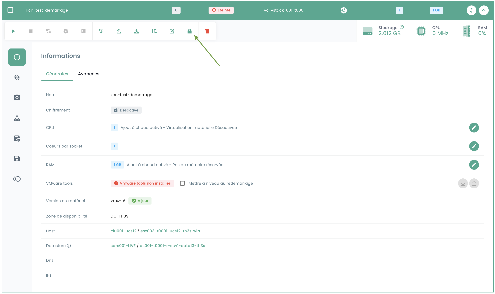

Dieses Tutorial hilft Ihnen, eine IaaS VMware-virtuelle Maschine über das Shiva-Portal zu verschlüsseln.

### Voraussetzungen

1. **Schlüsselanbieter (HSM/KMS)**:
   - Ein Schlüsselanbieter muss auf dem vStack konfiguriert sein. (Wenn kein Schlüsselanbieter konfiguriert ist, wenden Sie sich bitte über ein Ticket an den Support-Service.)
   - Stellen Sie sicher, dass der Schlüsselanbieter ordnungsgemäß aktiviert ist.

2. **Status der virtuellen Maschine**:
   - Die virtuelle Maschine muss ausgeschaltet sein.
   - Die virtuelle Maschine darf sich nicht im spp 'Test'-Modus befinden.
   - Die virtuelle Maschine darf nicht bereits verschlüsselt sein.
   - Die virtuelle Maschine darf keine Snapshots haben.
   - Die virtuelle Maschine darf nicht repliziert sein.

### Benutzeroberfläche

Nach der Anmeldung am Shiva-Webportal finden Sie im Menü __'IaaS'__, Untermenü __'Konfiguration'__ und dann im Tab __'vCenters'__ Informationen darüber, ob die Verschlüsselung auf dem betreffenden vStack aktiviert ist.

Gehen Sie dann zum Untermenü __'Virtuelle Maschinen'__ und wählen Sie die Maschine aus, die Sie verschlüsseln möchten.

In den allgemeinen Informationen der virtuellen Maschine finden Sie Angaben darüber, ob die Maschine bereits verschlüsselt ist oder nicht.

Wenn die virtuelle Maschine die Voraussetzungen erfüllt, können Sie mit dem Verfahren fortfahren, indem Sie auf die Schaltfläche mit dem Vorhängeschloss-Symbol in der Symbolleiste klicken, die __'Virtuelle Maschine verschlüsseln'__ anzeigt.

Ein Bestätigungsfenster wird angezeigt, wählen Sie Verschlüsseln.

Sobald die Aktion abgeschlossen ist, sollten Sie die geänderten Informationen sehen, die darauf hinweisen, dass Ihre Maschine verschlüsselt ist.

