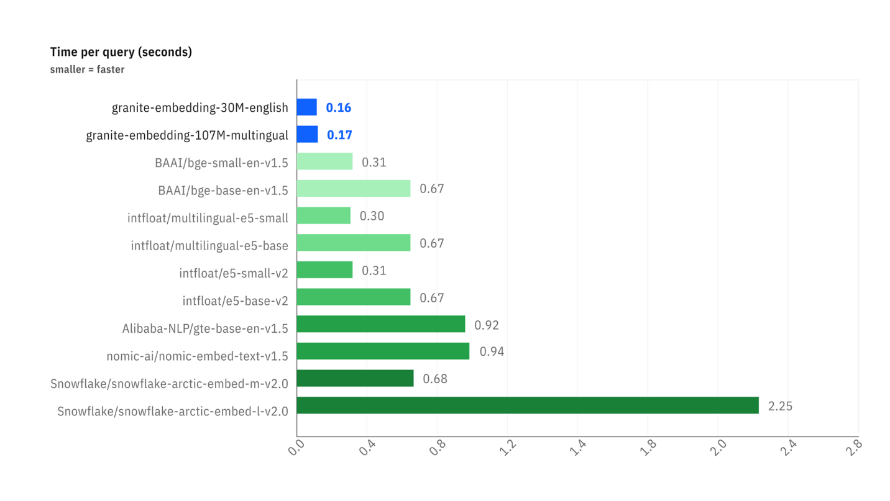

# Der RAG: Ihre Daten mit einem LLM abfragen

Dieses Dokument erklärt die grundlegenden Konzepte hinter der Technik der **Retrieval-Augmented Generation (RAG)**.

:::tip Beispielcode verfügbar
Die hier besprochenen Konzepte werden in einem vollständigen und funktionsfähigen Demonstrator dargestellt, der auf unserem GitHub verfügbar ist. Es handelt sich um eine hervorragende Ausgangsbasis, um das praktische Funktionieren eines RAG-Pipelines zu verstehen.

➡️ **[Zum Code des Simple RAG Demo](https://github.com/Cloud-Temple/product-llmaas-how-to/tree/main/simple_rag_demo)**
:::

## Das Problem: LLMs haben kein langfristiges Gedächtnis

Ein großes Sprachmodell (LLM) wie Mistral oder Granite ist sehr leistungsstark, kennt aber nur die Daten, auf denen es trainiert wurde. Es kennt Ihre internen Dokumente, die neuesten Zeitungsartikel oder die Besonderheiten Ihres Berufs nicht.

**RAG** ist eine Technik, die dem LLM ein „externes Gedächtnis“ verleiht, indem sie ihm bei der Fragestellung die relevantesten Dokumentenauszüge liefert, um ihm bei der Formulierung der Antwort zu helfen.

Der Prozess erfolgt in zwei Schritten:
1. **Retrieval (Abruf)**: Die richtigen Dokumente finden.
2. **Augmented Generation (Erweiterte Generierung)**: Diese Dokumente zur Generierung einer Antwort nutzen.

Dieser **Retrieval**-Schritt steht im Mittelpunkt unseres Themas. Wie gelingt es einem Computer, „zu verstehen“, dass eine Frage und ein Absatz dasselbe behandeln? Die Magie geschieht durch **Vektoren**.

## Schritt 1: Das Embedding: Wörter in Zahlen umwandeln

Ein Computer versteht keine Wörter, aber er ist sehr gut darin, mit Zahlen zu arbeiten. Das **Embedding** ist der Prozess, der einen Text (ein Wort, einen Satz, ein Dokument) in eine Liste von Zahlen umwandelt, die als **Vektor** bezeichnet wird.

:::tip Was ist ein Vektor?
Im einfachsten Sinne ist ein Vektor eine Liste von Zahlen, die einen Punkt in einem mehrdimensionalen Raum darstellt. Jede Zahl im Vektor entspricht einer Koordinate auf einem „Achse“ dieses Raums. Bei Text-Embeddings sind diese Achsen nicht `x`, `y`, `z`, sondern abstrakte semantische Dimensionen (z. B. könnte eine Achse den Begriff „Königtum“ darstellen, eine andere den Begriff „Katze“ usw.).
:::

`"Le chat est sur le tapis."`  →  `[-0.01, 0.98, 0.45, ..., -0.33]`

Dieser Vektor ist nicht zufällig. Er stellt die „Position“ des Textes in einem mehrdimensionalen semantischen Raum dar. Texte mit ähnlicher Bedeutung haben Vektoren, die in ähnliche Richtungen zeigen.

:::tip Geografische Analogie
Stellen Sie sich eine Karte vor. „Paris“ und „Frankreich“ wären sehr nahe beieinander, genauso wie „Rom“ und „Italien“. „Paris“ wäre weiter von „Rom“ entfernt als von „Frankreich“, aber näher als von „Tokio“. Das Embedding macht dasselbe, aber mit tausenden von „Dimensionen“ statt zwei, um komplexe Bedeutungsnuancen zu erfassen.
:::

In unserem Skript ist der Endpunkt `/v1/embeddings` und das Modell `granite-embedding:278m` für diese Umwandlung verantwortlich.

### Fokus auf die Granite-Embedding-Modelle

Embeddings sind ein unverzichtbarer Bestandteil des LLM-Ökosystems. Ein präziser und effizienter Weg, um Wörter, Anfragen und Dokumente in numerischer Form darzustellen, ist entscheidend für eine Vielzahl von Unternehmensaufgaben, darunter semantische Suche, Vektor-Suche und RAG, sowie für die Aufrechterhaltung effizienter Vektor-Datenbanken. Ein effektives Embedding-Modell kann die Fähigkeit des Systems, die Absicht des Benutzers zu verstehen, erheblich verbessern und die Relevanz der Informationen und Quellen in Antwort auf eine Anfrage erhöhen.

Während die letzten beiden Jahre eine Verbreitung autoregressiver Open-Source-LLMs gezeigt haben, die immer kompetitiver für Aufgaben wie Textgenerierung und -synthese sind, sind Open-Source-Embedding-Modelle, die von den führenden Anbietern veröffentlicht wurden, relativ selten.

#### Warum Granite Embedding?

Die neuen **Granite Embedding**-Modelle von IBM, die wir Ihnen zur Verfügung stellen, sind eine verbesserte Weiterentwicklung der Slate-Familie von nur-Encoder-Modellen basierend auf RoBERTa. Sie unterscheiden sich in mehreren entscheidenden Punkten für den Einsatz in Unternehmen:

1.  **Ethikgerechtes und kommerziell sicheres Training**: Während die meisten offenen Embedding-Modelle im Hugging Face MTEB-Ranking auf Trainingsdatensätzen mit nur Forschungslizenzen (wie MS-MARCO) basieren, hat IBM die kommerzielle Eignung aller Datenquellen, die für das Training von Granite Embedding verwendet wurden, überprüft.
2.  **Entschädigung für geistiges Eigentum**: Unterstreicht die Sorgfalt, die bei der Unternehmensnutzung angewandt wird, unterstützt IBM Granite Embedding mit der gleichen unbegrenzten Entschädigung für Drittanwaltsklagen im Zusammenhang mit geistigem Eigentum wie für die Nutzung anderer von IBM entwickelter Modelle.
3.  **Leistung und Effizienz**: Die Bemühungen von IBM bei der Organisation und Filterung der Trainingsdaten haben nicht verhindert, dass die Granite Embedding-Modelle mit den führenden offenen Quellcode-Embedding-Modellen ähnlicher Größe Schritt halten.

Die Benchmarks unten zeigen zwei entscheidende Vorteile:

-   **Genauigkeit der Suche**: Das erste Diagramm zeigt, dass die Granite-Modelle (blau) auf semantischen Suchaufgaben (`Retrieval Tasks`) sehr wettbewerbsfähig, manchmal sogar überlegen sind, im Vergleich zu Modellen ähnlicher Größe.
-   **Inferengeschwindigkeit**: Das zweite Diagramm zeigt, dass die Granite-Modelle **deutlich schneller** sind (geringerer Zeitbedarf pro Anfrage) als die meisten populären Alternativen, was ein großes Plus für Anwendungen ist, die Echtzeitantworten erfordern.

*Vergleich der Leistungsfähigkeit bei Suchaufgaben (BEIR) und Code-Suche (CoIR).*

*Vergleich der Latenz (Zeit pro Anfrage in Sekunden) zwischen verschiedenen Embedding-Modellen.*

Aus diesem Gleichgewicht zwischen **Leistung, Geschwindigkeit, rechtlicher Sicherheit und Ethik** haben wir uns dafür entschieden, das Modell `granite-embedding:278m` (die leistungsstärkste multilinguale Version) als Standard-Embedding-Dienst zu integrieren.

## Schritt 2: Die Suche: Die semantische Nähe messen

Sobald unsere Frage und alle unsere Dokumente in Vektoren umgewandelt wurden, wird die Suche zu einem mathematischen Problem: **den Vektor des Dokuments finden, der dem Vektor der Frage am nächsten ist.**

Es gibt mehrere Möglichkeiten, diese "Nähe" zu messen. Unser Skript verwendet zwei davon: die Cosinus-Ähnlichkeit und die Euklidische Distanz.

### Die Kosinus-Ähnlichkeit (Der Standard)

-   **Konzept** : Sie misst nicht den Abstand, sondern den **Winkel** zwischen zwei Vektoren. Ein kleiner Winkel (nahe 0°) bedeutet, dass die Vektoren in dieselbe Richtung zeigen, und somit haben die Texte eine sehr ähnliche Bedeutung.
-   **Score** : Der Kosinus eines Winkels von 0° ist 1 (perfekte Ähnlichkeit). Der Kosinus eines Winkels von 90° ist 0 (keine Ähnlichkeit).
-   **Warum wird sie so häufig verwendet ?** Für Texte ist die **semantische Richtung** viel wichtiger als die **Magnitude** (die Länge) des Vektors. Die Kosinus-Ähnlichkeit ignoriert die Magnitude und konzentriert sich ausschließlich auf die Richtung.

**Einfaches Beispiel in 2D :**
-   Frage : `v_q = [2, 2]`
-   Dokument A : `v_a = [4, 4]` (gleiche Richtung, länger)
-   Dokument B : `v_b = [-2, 2]` (andere Richtung)

Die Berechnung der Kosinus-Ähnlichkeit ergibt:
-   `cos(v_q, v_a) = 1,0` → Winkel von 0°. Perfekte Ähnlichkeit.
-   `cos(v_q, v_b) = 0,0` → Winkel von 90°. Keine Ähnlichkeit.

Das ist das Ergebnis, das wir wollen: Dokument A ist semantisch identisch mit der Frage, auch wenn seine Formulierung länger ist.

### Die euklidische Distanz (Die Regel)

-   **Konzept** : Das ist die „Vogel-Flug“-Entfernung zwischen den Endpunkten der beiden Vektoren.
-   **Score** : Ein Score von 0 bedeutet, dass die Vektoren identisch sind. Je höher der Score, desto weiter entfernt sind sie.
-   **Nachteil bei Texten** : Sie ist empfindlich gegenüber der Magnitude. In unserem Beispiel oben wäre die Distanz zwischen `v_q` und `v_a` nicht null, da die Vektoren nicht die gleiche Länge haben, auch wenn sie die gleiche Richtung haben.

## Fazit

Die Tabelle, die vom Skript `simple-rag-demo` angezeigt wird, ermöglicht es Ihnen, diese beiden Metriken zu visualisieren. Sie werden bemerken, dass die Rangfolgen manchmal leicht variieren können, aber die **cosinusähnlichkeit ist in der Regel die bevorzugte Metrik** für semantische Textsuchanwendungen.

Das größte Problem, wie das Beispiel zeigt, bleibt die **Qualität des Embedding-Modells**. Ein gutes Modell erzeugt Vektoren, die den Sinn genau erfassen, wodurch die Berechnung der Nähe, egal welche Methode verwendet wird, viel zuverlässiger wird.