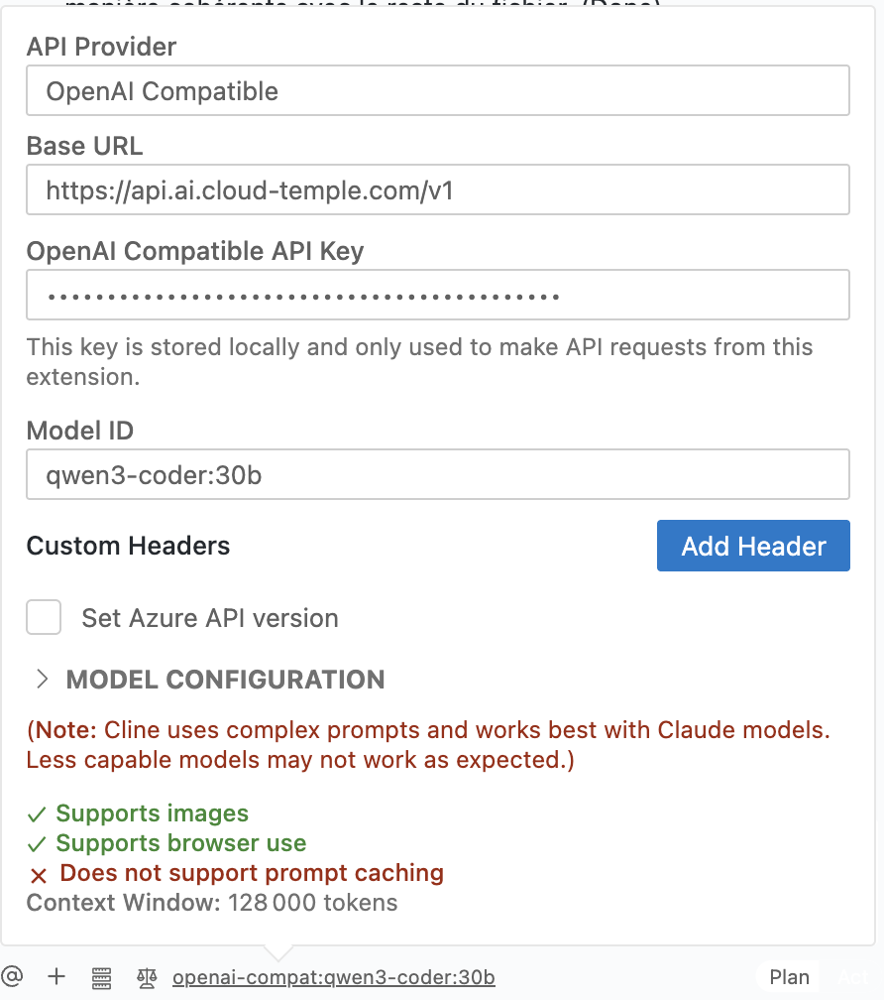

# LLMaaS-Tutorials

## Übersicht

Diese erweiterten Tutorials behandeln Integration, Optimierung und Best Practices, um LLMaaS Cloud Temple in der Produktion voll auszuschöpfen. Jedes Tutorial enthält getesteten Code und reale Performance-Metriken.

## 🚀 LangChain-Integrationen und -Frameworks

### 1. Grundlegende Integration mit LangChain

Dieses erste Beispiel demonstriert, wie unsere LLMaaS-API mit dem beliebten LangChain-Framework integriert werden kann, indem ein benutzerdefinierter "Wrapper" erstellt wird. Ein Wrapper ist eine Klasse, die unsere API "kapselt", um sie mit den internen Mechanismen von LangChain kompatibel zu machen.

#### Code Explained

Der folgende Code definiert eine `CloudTempleLLM`-Klasse, die von der Basis `LLM`-Klasse in LangChain erbt. Dies ermöglicht uns, benutzerdefiniertes Verhalten zu definieren, während die Kompatibilität mit dem LangChain-Ökosystem (Ketten, Agenten usw.) erhalten bleibt.

1.  **`CloudTempleLLM(LLM)`**: Unsere Klasse erbt von `LLM`, was die Implementierung bestimmter Methoden, insbesondere `_call`, erfordert.
2.  **`_call(self, prompt: str, ...)`**: Dies ist der Kern unseres Wrappers. Jedes Mal, wenn LangChain unser Sprachmodell aufrufen muss, wird diese Methode aufgerufen. Darin formatieren wir eine standardmäßige HTTP POST-Anfrage mit den korrekten Headern (`Authorization`) und der erwarteten `Payload` für unseren API-Endpunkt `/v1/chat/completions`.
3.  **`example_langchain_basic()`**: Diese Demonstrationsfunktion zeigt, wie unser Wrapper verwendet wird. Wir instanziieren ihn, erstellen ein `PromptTemplate`, um unsere Anfrage zu strukturieren, und kombinieren sie zu einer `LLMChain`. Wenn wir die Kette (`chain.run(...)`) ausführen, ruft LangChain intern die von uns definierte `_call`-Methode auf.

Dieser Ansatz ist nützlich, wenn Sie die volle Kontrolle darüber benötigen, wie LangChain mit der API interagiert, ist aber ausführlicher als die Verwendung des `ChatOpenAI`-Clients (siehe [API-Referenz](./api#langchain)).

```python
# Abhängigkeiten installieren

# pip install langchain requests pydantic

from langchain.llms.base import LLM
from langchain.schema import LLMResult, Generation
from typing import Optional, List, Any
from pydantic import Field
import requests
import json
import os

# --- Konfiguration ---

# Es wird empfohlen, Ihren API-Schlüssel in einer Umgebungsvariable zu speichern
API_KEY = os.getenv("LLMAAS_API_KEY", "Ihr-API-Schlüssel-hier")
BASE_URL = "https://api.ai.cloud-temple.com/v1"

class CloudTempleLLM(LLM):
    """
    Benutzerdefinierter LangChain-Wrapper für die LLMaaS-API von Cloud Temple.
    Diese Klasse ermöglicht die Nutzung unserer API als Standard-LLM innerhalb von LangChain.
    """
    
    api_key: str = Field(default="")
    model_name: str = Field(default="granite3.3:8b")
    temperature: float = Field(default=0.7)
    max_tokens: int = Field(default=1000)
    
    @property
    def _llm_type(self) -> str:
        """Eindeutiger Bezeichner für unseren LLM-Typ."""
        return "cloud_temple_llmaas"
    
    def _call(self, prompt: str, stop: Optional[List[str]] = None) -> str:
        """
        Hauptmethode, die den Aufruf an die LLMaaS-API durchführt.
        LangChain verwendet diese Methode für jede Anfrage an das Modell.
        """
        headers = {
            "Authorization": f"Bearer {self.api_key}",
            "Content-Type": "application/json"
        }
        
        payload = {
            "model": self.model_name,
            "messages": [{"role": "user", "content": prompt}],
            "temperature": self.temperature,
            "max_tokens": self.max_tokens
        }
        
        if stop:
            payload["stop"] = stop
        
        # POST-Anfrage an die API ausführen
        response = requests.post(
            f"{BASE_URL}/chat/completions",
            headers=headers,
            json=payload,
            timeout=60
        )
        
        response.raise_for_status()  # Löst eine Ausnahme bei HTTP-Fehlern aus
        result = response.json()
        
        # Inhalt der Assistentenmeldung zurückgeben
        return result['choices'][0]['message']['content']

# --- Beispielnutzung ---
from langchain.chains import LLMChain
from langchain.prompts import PromptTemplate

def example_langchain_wrapper():
    """Demonstriert die Verwendung des LLM-Wrappers mit einer LangChain-Kette."""
    
    # 1. Unser benutzerdefiniertes LLM initialisieren
    llm = CloudTempleLLM(
        api_key=API_KEY,
        model_name="granite3.3:8b"
    )
    
    # 2. Eine Prompt-Vorlage erstellen, um Anfragen zu strukturieren
    template = """
    Sie sind ein Experte in {domaine}. 
    Beantworten Sie diese Frage detailliert und professionell:
    
    Frage: {question}
    
    Antwort:
    """
    prompt = PromptTemplate(
        input_variables=["domaine", "question"],
        template=template
    )
    
    # 3. Eine Kette erstellen, die den Prompt und das LLM kombiniert
    chain = LLMChain(llm=llm, prompt=prompt)
    
    # 4. Die Kette mit spezifischen Variablen ausführen
    result = chain.run(
        domaine="Cybersicherheit",
        question="Was sind die Best Practices für die Sicherung einer REST-API?"
    )
    
    return result

# --- Test durchführen ---
if __name__ == "__main__":
    if API_KEY == "Ihr-API-Schlüssel-hier":
        print("Bitte setzen Sie Ihren LLMAAS_API_KEY in Ihren Umgebungsvariablen.")
    else:
        response = example_langchain_wrapper()
        print("Antwort des Cybersicherheitsexperten:\n")
        print(response)
```

### 2. RAG (Retrieval-Augmented Generation) mit der LLMaaS-API

RAG ist eine leistungsstarke Technik, die es einem Large Language Model (LLM) ermöglicht, Fragen zu beantworten, indem es eine externe Wissensbasis nutzt. Dieses Tutorial führt Sie durch die Erstellung eines einfachen RAG-Pipelines mithilfe unserer API für Embeddings und Generierung sowie FAISS, einer Bibliothek für Vektorähnlichkeit, um einen In-Memory-Index zu erstellen.

#### Code Explained

Die Pipeline ist in mehrere logische Schritte unterteilt:

1.  **Konfiguration**: Wir importieren die notwendigen Bibliotheken und laden unseren API-Schlüssel aus den Umgebungsvariablen. Wir definieren die zu verwendenden Modelle: `granite-embedding:278m` für die Vektorisierung und `granite3.3:8b` für die Antwortgenerierung.
2.  **`LLMaaSEmbeddings`**: Wie im vorherigen Beispiel benötigen wir einen Wrapper, um mit unserer Embeddings-API zu interagieren. Diese Klasse ist dafür verantwortlich, Text-Chunks in numerische Vektoren (Embeddings) umzuwandeln.
3.  **`setup_rag_pipeline`**: Diese Funktion orchestriert die Erstellung der Pipeline.
    *   **Laden von Dokumenten**: `DirectoryLoader` lädt Textdateien aus unserer Wissensbasis.
    *   **Aufteilung in Chunks**: `RecursiveCharacterTextSplitter` teilt die Dokumente in kleinere Teile. Dies ist entscheidend, damit das Embedding-Modell den Text effizient verarbeiten und eine genaue Ähnlichkeitssuche gewährleisten kann.
    *   **Vektorisierung und Indexierung**: `FAISS.from_documents` ist ein wichtiger Schritt. Es nimmt die Text-Chunks, verwendet unsere `LLMaaSEmbeddings`-Klasse, um die API aufzurufen und entsprechende Vektoren zu erhalten, und speichert diese Vektoren dann in einem In-Memory-FAISS-Index.
    *   **LLM-Konfiguration**: Wir verwenden `ChatOpenAI`, das nativ mit unserer API für die Antwortgenerierungs-Teil kompatibel ist.
    *   **Erstellen der `RetrievalQA`-Kette**: Dies ist die LangChain-Kette, die alles miteinander verbindet. Wenn eine Frage gestellt wird, tut sie Folgendes:
        a. Verwendet den `retriever` (basierend auf unserem FAISS-Index), um die relevantesten Text-Chunks zu finden.
        b. "Füllt" (stapelt) diese Chunks zusammen mit der Frage in einen Prompt.
        c. Sendet diesen angereicherten Prompt an das LLM, um eine kontextuell relevante Antwort zu generieren.
4.  **Ausführung**: Die `main`-Funktion simuliert die reale Nutzung, indem sie temporäre Wissensdateien erstellt, die Pipeline aufbaut und eine Frage stellt.

```python
import os
import tempfile
import shutil
from pathlib import Path
from dotenv import load_dotenv
from typing import List

# --- LangChain Imports ---
from langchain_core.embeddings import Embeddings
from langchain_openai import ChatOpenAI
from langchain_community.document_loaders import DirectoryLoader, TextLoader
from langchain.text_splitter import RecursiveCharacterTextSplitter
from langchain_community.vectorstores import FAISS
from langchain.chains import RetrievalQA

# --- Konfiguration ---

# Umgebungsvariablen laden (z.B. LLMAAS_API_KEY)
load_dotenv()
API_KEY = os.getenv("LLMAAS_API_KEY")
BASE_URL = os.getenv("API_URL", "https://api.ai.cloud-temple.com/v1")
EMBEDDING_MODEL = "granite-embedding:278m"
LLM_MODEL = "granite3.3:8b"

# --- Benutzerdefinierte Embedding-Klasse ---
class LLMaaSEmbeddings(Embeddings):
    """Benutzerdefinierte Embedding-Klasse für die Cloud Temple LLMaaS API."""
    def __init__(self, api_key: str, model_name: str):
        if not api_key:
            raise ValueError("Der LLMaaS API-Schlüssel darf nicht leer sein.")
        self.api_key = api_key
        self.model_name = model_name
        self.base_url = BASE_URL
        self.headers = {
            "Authorization": f"Bearer {self.api_key}",
            "Content-Type": "application/json",
        }

    def _embed(self, texts: List[str]) -> List[List[float]]:
        import httpx
        payload = {"input": texts, "model": self.model_name}
        try:
            with httpx.Client(timeout=60.0) as client:
                response = client.post(f"{self.base_url}/embeddings", headers=self.headers, json=payload)
                response.raise_for_status()
                data = response.json()['data']
                data.sort(key=lambda e: e['index'])
                return [item['embedding'] for item in data]
        except httpx.HTTPStatusError as e:
            print(f"HTTP-Fehler bei der Embedding-Generierung: {e.response.text}")
            raise
        except Exception as e:
            print(f"Ein unerwarteter Fehler ist bei der Embedding-Generierung aufgetreten: {e}")
            raise

    def embed_documents(self, texts: List[str]) -> List[List[float]]:
        return self._embed(texts)

    def embed_query(self, text: str) -> List[float]:
        # Die _embed-Methode erwartet eine Liste, daher umschließen wir den einzelnen Text.
        return self._embed([text])[0]

# --- RAG-Pipeline ---
def setup_rag_pipeline(documents_path: str):
    """Vollständige Konfiguration der RAG-Pipeline mit LLMaaS-Tools."""
    print("1. Laden und Aufteilen von Dokumenten...")
    loader = DirectoryLoader(documents_path, glob="*.txt", loader_cls=TextLoader, loader_kwargs={'encoding': 'utf-8'})
    documents = loader.load()
    text_splitter = RecursiveCharacterTextSplitter(chunk_size=1000, chunk_overlap=200)
    splits = text_splitter.split_documents(documents)
    print(f"   -> {len(documents)} Dokument(e) geladen und in {len(splits)} Chunks aufgeteilt.")
    
    print(f"2. Embeddings über LLMaaS erstellen (Modell: {EMBEDDING_MODEL})...")
    embeddings = LLMaaSEmbeddings(api_key=API_KEY, model_name=EMBEDDING_MODEL)
    
    print("3. In-Memory-Vektorindex (FAISS) erstellen...")
    vectorstore = FAISS.from_documents(splits, embeddings)
    print("   -> FAISS-Index erfolgreich erstellt.")
    
    print(f"4. LLM konfigurieren (Modell: {LLM_MODEL})...")
    # Fix für Pydantic/LangChain-Kompatibilität
    from langchain_core.caches import BaseCache
    from langchain_core.callbacks.base import Callbacks
    ChatOpenAI.model_rebuild()
    
    llm = ChatOpenAI(
        api_key=API_KEY,
        base_url=BASE_URL,
        model=LLM_MODEL,
        temperature=0.3,
        model_kwargs={"max_tokens": 300}
    )
    
    print("5. Question/Answer-Kette (RAG) erstellen...")
    qa_chain = RetrievalQA.from_chain_type(
        llm=llm,
        chain_type="stuff",
        retriever=vectorstore.as_retriever(),
        return_source_documents=True
    )
    print("   -> RAG-Pipeline bereit.")
    return qa_chain

# --- Ausführung ---
def main():
    """Hauptfunktion zur Ausführung der End-to-End-RAG-Pipeline."""
    if not API_KEY:
        print("Fehler: Die Umgebungsvariable LLMAAS_API_KEY ist nicht gesetzt.")
        return

    # Temporäre Testdokumente erstellen
    temp_dir = tempfile.mkdtemp()
    print(f"\nErstelle Testdokumente in: {temp_dir}")
    try:
        documents_content = {
            "overview.txt": "Cloud Temple ist ein französischer souveräner Cloud-Anbieter, der SecNumCloud-qualifiziert ist.",
            "pricing.txt": "Die LLMaaS-API-Preise betragen 0,9 € pro Million Input-Token und 4 € pro Million Output-Token."
        }
        for filename, content in documents_content.items():
            with open(Path(temp_dir) / filename, 'w', encoding='utf-8') as f:
                f.write(content)
        
        # Pipeline einrichten und ausführen
        rag_chain = setup_rag_pipeline(temp_dir)
        
        print("\n--- RAG-Pipeline abfragen ---")
        question = "Wie hoch ist die Output-Token-Rate für die LLMaaS-API bei Cloud Temple?"
        result = rag_chain({"query": question})
        
        print(f"\nFrage: {question}")
        print(f"Antwort: {result['result']}")
        print("\nVerwendete Quellen für die Antwort:")
        for source in result["source_documents"]:
            print(f"- Datei: {os.path.basename(source.metadata['source'])}")
            print(f"  Inhalt: \"{source.page_content}\"")

    finally:
        # Temporäres Verzeichnis bereinigen
        print(f"\nBereinige temporäres Verzeichnis: {temp_dir}")
        shutil.rmtree(temp_dir)

if __name__ == "__main__":
    main()
```

### 3. Integration mit einer Vektordatenbank (Qdrant)

Für RAG-Anwendungen in der Produktion wird die Verwendung einer dedizierten Vektordatenbank wie **Qdrant** empfohlen. Im Gegensatz zu FAISS, das im Speicher arbeitet, bietet Qdrant Datenpersistenz, erweiterte Suchfunktionen und eine bessere Skalierbarkeit.

#### Code Explained

Dieses Tutorial passt die vorherige RAG-Pipeline an die Verwendung von Qdrant an.

1.  **Voraussetzungen**: Der erste Schritt ist der Start einer Qdrant-Instanz. Am einfachsten ist die Verwendung von Docker.
2.  **`setup_qdrant_rag_pipeline`**:
    *   **Embeddings und Dokumente**: Die Erstellung von Embeddings und Dokumenten bleibt dieselbe wie im vorherigen Beispiel.
    *   **Verbindung zu Qdrant**: Anstatt einen FAISS-Index zu erstellen, verwenden wir `Qdrant.from_documents`. Diese LangChain-Methode verwaltet mehrere Schritte:
        a. Sie stellt eine Verbindung zu Ihrer Qdrant-Instanz über die bereitgestellte URL her.
        b. Sie erstellt eine neue "Sammlung" (das Äquivalent einer Tabelle in einer SQL-Datenbank), falls sie noch nicht existiert.
        c. Sie ruft unsere `LLMaaSEmbeddings`-Klasse auf, um die Dokumente zu vektorisieren.
        d. Sie fügt die Dokumente und ihre Vektoren in die Qdrant-Sammlung ein.
    *   **`force_recreate=True`**: Für dieses Tutorial verwenden wir diesen Parameter, um sicherzustellen, dass die Sammlung bei jedem Lauf leer ist. In der Produktion würden Sie ihn auf `False` setzen, um Ihre Daten zu erhalten.
3.  Der Rest der Pipeline (LLM-Konfiguration, Erstellung der `RetrievalQA`-Kette) bleibt identisch, was die Flexibilität von LangChain demonstriert: Ein einfacher Wechsel der `retriever`-Quelle (Informationsabrufer) ermöglicht den Wechsel von FAISS zu Qdrant.

:::info Voraussetzungen: Qdrant starten
Für dieses Tutorial benötigen Sie eine Qdrant-Instanz. Sie können diese einfach mit Docker starten:

```bash


# 1. Laden Sie das neueste Qdrant-Image herunter
docker pull qdrant/qdrant

# 2. Starten Sie den Qdrant-Container
docker run -p 6333:6333 -p 6334:6334 qdrant/qdrant
```
:::

Der folgende Code zeigt, wie die RAG-Pipeline an die Verwendung von Qdrant als Vektordatenbank angepasst werden kann.

```python
import os
from dotenv import load_dotenv
from langchain_openai import ChatOpenAI
from langchain.chains import RetrievalQA
from langchain_community.vectorstores import Qdrant
from langchain.docstore.document import Document
from langchain.text_splitter import RecursiveCharacterTextSplitter
from typing import List
from langchain_core.embeddings import Embeddings

# (Die LLMaaSEmbeddings-Klasse ist dieselbe wie im vorherigen Beispiel,
# Wir verwenden sie hier wieder. Stellen Sie sicher, dass sie in Ihrem Skript definiert ist.)

# --- Konfiguration ---
load_dotenv()
API_KEY = os.getenv("LLMAAS_API_KEY")
BASE_URL = os.getenv("API_URL", "https://api.ai.cloud-temple.com/v1")
EMBEDDING_MODEL = "granite-embedding:278m"
LLM_MODEL = "granite3.3:8b"
QDRANT_URL = os.getenv("QDRANT_URL", "http://localhost:6333")
QDRANT_COLLECTION_NAME = "tutorial_collection"

# --- Embedding-Klasse (aus vorherigem Beispiel wiederverwendet) ---
class LLMaaSEmbeddings(Embeddings):
    def __init__(self, api_key: str, model_name: str):
        if not api_key: raise ValueError("API-Schlüssel ist erforderlich.")
        self.api_key, self.model_name, self.base_url = api_key, model_name, BASE_URL
        self.headers = {"Authorization": f"Bearer {self.api_key}", "Content-Type": "application/json"}
    def _embed(self, texts: List[str]) -> List[List[float]]:
        import httpx
        payload = {"input": texts, "model": self.model_name}
        with httpx.Client(timeout=60.0) as client:
            r = client.post(f"{self.base_url}/embeddings", headers=self.headers, json=payload)
            r.raise_for_status()
            data = r.json()['data']
            data.sort(key=lambda e: e['index'])
            return [item['embedding'] for item in data]
    def embed_documents(self, texts: List[str]) -> List[List[float]]: return self._embed(texts)
    def embed_query(self, text: str) -> List[float]: return self._embed([text])[0]

def setup_qdrant_rag_pipeline():
    """Konfiguriert und gibt eine RAG-Pipeline unter Verwendung von Qdrant zurück."""
    print("1. LLMaaS Embedding-Client initialisieren...")
    embeddings = LLMaaSEmbeddings(api_key=API_KEY, model_name=EMBEDDING_MODEL)

    print("2. Dokumente vorbereiten...")
    documents_content = [
        "Cloud Temple ist ein französischer souveräner Cloud-Anbieter, der SecNumCloud-zertifiziert ist.",
        "Die LLMaaS-Preise betragen 0,9 € für Input- und 4 € für Output-Token pro Million Token."
    ]
    documents = [Document(page_content=d) for d in documents_content]
    
    print(f"3. Verbindung zu Qdrant herstellen und Sammlung '{QDRANT_COLLECTION_NAME}' füllen...")
    vectorstore = Qdrant.from_documents(
        documents,
        embeddings,
        url=QDRANT_URL,
        collection_name=QDRANT_COLLECTION_NAME,
        force_recreate=True, # Stellt eine saubere Sammlung für das Tutorial sicher
    )
    print("   -> Sammlung erfolgreich erstellt und gefüllt.")

    print(f"4. LLM konfigurieren (Modell: {LLM_MODEL})...")
    llm = ChatOpenAI(
        api_key=API_KEY,
        base_url=BASE_URL,
        model=LLM_MODEL,
        temperature=0.3
    )

    print("5. RAG-Kette erstellen...")
    qa_chain = RetrievalQA.from_chain_type(
        llm=llm,
        retriever=vectorstore.as_retriever(),
        return_source_documents=True
    )
    print("   -> Qdrant-basierte RAG-Pipeline bereit.")
    return qa_chain

# --- Ausführung ---
def main_qdrant():
    """Hauptfunktion zur Ausführung der RAG-Pipeline mit Qdrant."""
    if not API_KEY:
        print("Fehler: Die Umgebungsvariable LLMAAS_API_KEY ist nicht gesetzt.")
        return
        
    try:
        rag_chain = setup_qdrant_rag_pipeline()
        question = "Wie lauten die Preisdetails für die LLMaaS-API von Cloud Temple?"

        print(f"\n--- Pipeline abfragen ---")
        result = rag_chain({"query": question})

        print(f"\nFrage: {question}")
        print(f"Antwort: {result['result']}")
        print("\nFür die Antwort verwendete Quellen:")
        for source in result["source_documents"]:
            print(f"- Inhalt: \"{source.page_content}\"")
            
    except Exception as e:
        print(f"\nEin Fehler ist aufgetreten: {e}")
        print("Bitte stellen Sie sicher, dass der Qdrant-Container läuft.")

if __name__ == "__main__":
    main_qdrant()
```

### 4. LangChain-Agenten mit Tools

Ein Agent ist ein LLM, das mehr als nur eine Frage beantwortet – es kann eine Reihe von **Tools** (Funktionen, APIs usw.) verwenden, um eine komplexere Antwort zu erstellen. Es kann Schlussfolgerungen ziehen, ein Problem zerlegen, ein geeignetes Tool auswählen, es ausführen, das Ergebnis beobachten und diesen Zyklus wiederholen, bis es zu einer endgültigen Antwort kommt.

#### Code Explained

Dieses Beispiel erstellt einen einfachen Agenten, der zwei Tools verwenden kann: eines zum Abfragen einer (simulierten) Cloud Temple-API und eines zum Ausführen von Berechnungen.

1.  **Tool-Definitionen**: Die Klassen `CloudTempleAPITool` und `CalculatorTool` erben von `BaseTool`. Jedes Tool hat:
    *   Einen `Namen`: einen einfachen und beschreibenden Namen.
    *   Eine `Beschreibung`: **entscheidend** – dies ist, was das LLM liest, um zu entscheiden, welches Tool verwendet werden soll. Es muss sehr klar sein, was das Tool tut und wann es verwendet werden soll.
    *   Eine `_run`-Methode: der eigentliche Code, der ausgeführt wird, wenn der Agent dieses Tool auswählt.

2.  **`create_agent_with_tools`**:
    *   **LLM-Initialisierung**: Wir verwenden unseren `CloudTempleLLM`-Wrapper, der im ersten Tutorial definiert wurde.
    *   **Tool-Liste**: Wir stellen dem Agenten eine Liste von Tools zur Verfügung, die er verwenden darf.
    *   **Agent-Prompt**: Der Prompt ist sehr spezifisch. Es ist ein "Reasoning-Prompt", der das LLM anweist, wie es denken (`Thought`), eine Aktion auswählen (`Action`), eine Eingabe für diese Aktion bereitstellen (`Action Input`) und das Ergebnis beobachten (`Observation`) soll. Dies ist der Kernmechanismus des hier verwendeten ReAct-Frameworks (Reasoning and Acting).
    *   **Agent-Erstellung**: `create_react_agent` setzt das LLM, die Tools und den Prompt zusammen, um den Agenten zu erstellen.
    *   **`AgentExecutor`**: Dies ist die Engine, die den Agenten in einer Schleife ausführt, bis er eine `Final Answer` produziert. Der Parameter `verbose=True` ist sehr nützlich, um den "inneren Dialog" des Agenten (seine Gedanken, Aktionen usw.) zu sehen.

```python
from langchain.agents import Tool, AgentExecutor, create_react_agent
from langchain.tools import BaseTool
from langchain.prompts import PromptTemplate
import requests
import json
import os

# (Die CloudTempleLLM-Klasse ist dieselbe wie im ersten Beispiel)

# --- Tool-Definitionen ---

class CloudTempleAPITool(BaseTool):
    """Ein Tool, das den Aufruf einer internen API simuliert, um Informationen über Dienste abzurufen."""
    name = "cloud_temple_api_checker"
    description = "Nützlich, um Informationen über Dienste, Produkte und Angebote von Cloud Temple zu erhalten."

    def _run(self, query: str) -> str:
        # In einem realen Szenario würde dies eine echte API aufrufen.
        print(f"--- CloudTempleAPITool aufgerufen mit der Abfrage: '{query}' ---")
        if "Dienst" in query.lower():
            return "Cloud Temple bietet folgende Dienste an: IaaS, PaaS, LLMaaS, Managed Security."
        return "Informationen nicht gefunden."

    async def _arun(self, query: str) -> str:
        # Eine asynchrone Implementierung ist für dieses Beispiel nicht erforderlich.
        raise NotImplementedError("Das API-Tool unterstützt keine asynchrone Ausführung.")

class SimpleCalculatorTool(BaseTool):
    """Ein einfaches Tool zum Ausführen mathematischer Berechnungen."""
    name = "simple_calculator"
    description = "Nützlich zum Ausführen einfacher mathematischer Berechnungen. Nimmt einen gültigen Python-Ausdruck entgegen."

    def _run(self, expression: str) -> str:
        print(f"--- SimpleCalculatorTool aufgerufen mit dem Ausdruck: '{expression}' ---")
        try:
            # WARNUNG: eval() ist in der Produktion gefährlich. Dies dient nur zu Demonstrationszwecken.
            return str(eval(expression))
        except Exception as e:
            return f"Berechnungsfehler: {e}"

    async def _arun(self, expression: str) -> str:
        raise NotImplementedError("Das Rechner-Tool unterstützt keine asynchrone Ausführung.")

# --- Agenten-Erstellung ---

def create_agent():
    """Konfiguriert und gibt einen LangChain-Agenten mit den definierten Tools zurück."""
    print("1. Initialisiere das LLM für den Agenten...")
    llm = CloudTempleLLM(api_key=os.getenv("LLMAAS_API_KEY", "Ihr-API-Schlüssel-hier"))

    tools = [CloudTempleAPITool(), SimpleCalculatorTool()]
    
    # Die Prompt-Vorlage ist entscheidend: Sie leitet das LLM in seinen Überlegungen.
    template = """
    Beantworten Sie die folgenden Fragen so gut wie möglich. Sie haben Zugriff auf die folgenden Tools:

    {tools}

    Verwenden Sie das folgende Format:

    Frage: die Frage, die Sie beantworten müssen
    Thought: Sie müssen immer darüber nachdenken, was Sie tun werden
    Action: die auszuführende Aktion, muss einer von [{tool_names}] sein
    Action Input: die Eingabe für die Aktion
    Observation: das Ergebnis der Aktion
    ... (diese Thought/Action/Action Input/Observation-Sequenz kann sich wiederholen)
    Thought: Ich kenne jetzt die endgültige Antwort.
    Final Answer: die endgültige Antwort auf die ursprüngliche Frage

    Beginnen Sie!

    Frage: {input}
    Thought:{agent_scratchpad}
    """
    
    prompt = PromptTemplate.from_template(template)
    
    print("2. Erstellen des Agenten mit dem ReAct-Framework...")
    agent = create_react_agent(llm, tools, prompt)

    # Der AgentExecutor ist für die Ausführung der Agentenzyklen verantwortlich.
    agent_executor = AgentExecutor(agent=agent, tools=tools, verbose=True)
    print("   -> Agent bereit.")
    return agent_executor

# --- Ausführung ---

def run_agent():
    """Führt den Agenten mit verschiedenen Fragen aus, um seine Fähigkeiten zu testen."""
    if os.getenv("LLMAAS_API_KEY") is None:
        print("Bitte setzen Sie Ihren LLMAAS_API_KEY.")
        return
        
    agent_executor = create_agent()
    
    print("\n--- Test 1: Frage, die ein Informationstool erfordert ---")
    question1 = "Welche Dienste bietet Cloud Temple an?"
    response1 = agent_executor.invoke({"input": question1})
    print(f"\nEndgültige Agentenantwort: {response1['output']}")
    
    print("\n--- Test 2: Frage, die eine Berechnung erfordert ---")
    question2 = "Was ist das Ergebnis von 125 * 8 + 50?"
    response2 = agent_executor.invoke({"input": question2})
    print(f"\nEndgültige Agentenantwort: {response2['output']}")

if __name__ == "__main__":
    run_agent()
```

### 5. OpenAI SDK-Integration

**Nahtlose Migration von OpenAI**

```python
from openai import OpenAI

# Cloud Temple LLMaaS-Konfiguration

def setup_cloud_temple_client():
    """OpenAI-Client-Konfiguration für Cloud Temple"""
    
    client = OpenAI(
        api_key="Ihr-Cloud-Temple-API-Schlüssel",
        base_url="https://api.ai.cloud-temple.com/v1"
    )
    
    return client

def test_openai_compatibility():
    """Kompatibilitätstest mit dem OpenAI SDK"""
    
    client = setup_cloud_temple_client()
    
    # Standard-Chat-Vervollständigung
    response = client.chat.completions.create(
        model="granite3.3:8b",
        messages=[
            {"role": "system", "content": "Sie sind ein professioneller KI-Assistent."},
            {"role": "user", "content": "Erklären Sie die Cloud-Native-Architektur."}
        ],
        max_tokens=300,
        temperature=0.7
    )
    
    print(f"Antwort: {response.choices[0].message.content}")
    
    # Streaming
    stream = client.chat.completions.create(
        model="granite3.3:8b",
        messages=[
            {"role": "user", "content": "Schreiben Sie ein Gedicht über KI."}
        ],
        stream=True,
        max_tokens=200
    )
    
    print("Streaming:")
    for chunk in stream:
        if chunk.choices[0].delta.content is not None:
            print(chunk.choices[0].delta.content, end="")
    print()

# Kompatibilitätstest
test_openai_compatibility()
```

### 5. Semantic Kernel Integration (Microsoft)

[Semantic Kernel](https://learn.microsoft.com/en-us/semantic-kernel/overview/) ist ein Open-Source-SDK von Microsoft, das die Integration von LLMs in .NET-, Python- und Java-Anwendungen ermöglicht. Obwohl es für Azure OpenAI-Dienste optimiert ist, kann es dank seiner Flexibilität mit jeder OpenAI-kompatiblen API, einschließlich unserer eigenen, verwendet werden.

#### Code Explained

Dieses Beispiel erfordert nicht das vollständige Semantic Kernel SDK. Es demonstriert, wie das **Konzept einer "semantischen Funktion"** mit einem einfachen Aufruf unserer API implementiert werden kann. Eine semantische Funktion ist im Wesentlichen ein strukturierter Prompt, der an ein Large Language Model (LLM) gesendet wird, um eine bestimmte Aufgabe auszuführen.

1.  **`semantic_kernel_simple()`**: Diese Funktion simuliert eine "Zusammenfassungsfunktion".
2.  **Strukturierter Prompt**: Wir verwenden eine `system`-Nachricht, um dem LLM eine Rolle zuzuweisen ("Sie sind ein Experte für Zusammenfassungen"), und eine `user`-Nachricht, die den zusammenzufassenden Text enthält. Dies ist der Kern des Konzepts der semantischen Funktion.
3.  **Direkter API-Aufruf**: Ein einfacher `requests.post`-Aufruf unseres `/v1/chat/completions`-Endpunkts reicht aus, um die Funktion auszuführen.

Dieses Beispiel veranschaulicht die Flexibilität der LLMaaS-API, die als grundlegender Baustein für die Textgenerierung in jedem Framework dienen kann – selbst in solchen, für die keine offizielle Integration existiert.

```python
import requests
import os
from dotenv import load_dotenv

def semantic_kernel_simulation():
    """
    Simuliert eine "semantische Funktion" zur Zusammenfassung, indem die LLMaaS-API direkt aufgerufen wird.
    """
    load_dotenv()
    api_key = os.getenv("LLMAAS_API_KEY")
    if not api_key:
        print("Bitte setzen Sie die Umgebungsvariable LLMAAS_API_KEY.")
        return

    headers = {
        "Authorization": f"Bearer {api_key}",
        "Content-Type": "application/json"
    }
    
    text_to_summarize = """
    Künstliche Intelligenz (KI) transformiert zahlreiche Industriesektoren durch die Automatisierung von Aufgaben, 
    die Optimierung von Prozessen und die Ermöglichung fortschrittlicher prädiktiver Analysen. 
    Cloud Temple ermöglicht Unternehmen mit seinem souveränen und SecNumCloud-zertifizierten LLMaaS-Angebot, 
    diese KI-Funktionen zu integrieren und dabei die Sicherheit und Vertraulichkeit ihrer Daten zu gewährleisten.
    """
    
    # Der Prompt kombiniert eine Anweisung (Systemrolle) und Daten (Benutzerrolle)
    payload = {
        "model": "granite3.3:8b",
        "messages": [
            {"role": "system", "content": "Sie sind ein erfahrener Assistent zum Zusammenfassen technischer Dokumente."},
            {"role": "user", "content": f"Fassen Sie den folgenden Text in einem einzigen prägnanten Satz zusammen: {text_to_summarize}"}
        ],
        "max_tokens": 100,
        "temperature": 0.5
    }
    
    try:
        response = requests.post(
            "https://api.ai.cloud-temple.com/v1/chat/completions",
            headers=headers,
            json=payload,
            timeout=30
        )
        response.raise_for_status()
        result = response.json()
        summary = result['choices'][0]['message']['content']
        
        print("Originaltext:\n", text_to_summarize)
        print("\nGenerierte Zusammenfassung:\n", summary)
        return summary
        
    except requests.exceptions.RequestException as e:
        print(f"Ein API-Fehler ist aufgetreten: {e}")

if __name__ == "__main__":
    semantic_kernel_simulation()
```

### 6. Haystack Framework

[Haystack](https://haystack.deepset.ai/) ist ein weiteres leistungsstarkes Open-Source-Framework zum Erstellen von semantischen Such-, RAG- und Agent-Anwendungen. Wie beim Semantic Kernel kann unsere API direkt integriert werden.

#### Code Explained

Dieses Beispiel simuliert eine einfache Haystack-artige "Pipeline" zur Beantwortung von Fragen innerhalb eines bestimmten Kontexts (Question Answering).

1.  **`process_with_context`**: Diese Funktion stellt den Kern einer QA-Pipeline dar. Sie nimmt einen `context` (z. B. einen Absatz aus einem Dokument) und eine `question` entgegen.
2.  **Kontextbezogener Prompt**: Der Prompt ist sorgfältig strukturiert, um sowohl den Kontext als auch die Frage zu enthalten. Dies ist eine grundlegende Technik bei RAG: Wir stellen dem LLM relevante Informationen zur Verfügung, damit es eine sachliche Antwort formulieren kann.
3.  **API-Aufruf**: Auch hier reicht ein einfacher `requests.post`-Aufruf unserer API aus. Das LLM erhält den Kontext und die Frage, und seine Aufgabe ist es, eine Antwort zu synthetisieren, die sich *ausschließlich* auf die bereitgestellten Informationen stützt.

Dieses Beispiel demonstriert die Flexibilität der LLMaaS-API, die als grundlegender Baustein für die Textgenerierung in jedem Framework dienen kann – selbst in solchen, für die keine offizielle Integration existiert.

```python
import requests
import os
from dotenv import load_dotenv

def haystack_simulation():
    """
    Simuliert eine Question-Answering-Pipeline im Haystack-Stil
    unter Verwendung eines direkten Aufrufs der LLMaaS-API.
    """
    load_dotenv()
    api_key = os.getenv("LLMAAS_API_KEY")
    if not api_key:
        print("Bitte setzen Sie die Umgebungsvariable LLMAAS_API_KEY.")
        return

    headers = {
        "Authorization": f"Bearer {api_key}",
        "Content-Type": "application/json"
    }
    
    # Der Kontext sind die Informationen, die das LLM verwenden darf.
    context = """
    Eine souveräne Cloud ist eine Cloud-Computing-Infrastruktur, die vollständig 
    innerhalb der Grenzen eines bestimmten Landes enthalten und dessen Gesetzen unterworfen ist. 
    Die Hauptvorteile sind die garantierte Datenresidenz, die Einhaltung lokaler Vorschriften 
    (wie der DSGVO in Europa) und ein verbesserter Schutz vor dem Zugriff durch ausländische Unternehmen 
    unter extraterritorialen Gesetzen wie dem U.S. CLOUD Act.
    """
    
    question = "Was sind die Vorteile einer souveränen Cloud?"
    
    # Der Prompt leitet das LLM an, seine Antwort ausschließlich auf den bereitgestellten Kontext zu stützen.
    prompt = f"""
    Beantworten Sie die Frage ausschließlich auf der Grundlage des folgenden Kontexts.
    
    Context:
    ---
    {context}
    ---
    
    Question: {question}
    """
    
    payload = {
        "model": "granite3.3:8b",
        "messages": [{"role": "user", "content": prompt}],
        "max_tokens": 200,
        "temperature": 0.2  # Niedrige Temperatur für eine faktische Antwort
    }
    
    try:
        response = requests.post(
            "https://api.ai.cloud-temple.com/v1/chat/completions",
            headers=headers,
            json=payload,
            timeout=30
        )
        response.raise_for_status()
        result = response.json()
        answer = result['choices'][0]['message']['content']
        
        print(f"Frage: {question}")
        print("\nGenerierte Antwort:\n", answer)
        return answer
        
    except requests.exceptions.RequestException as e:
        print(f"Ein API-Fehler ist aufgetreten: {e}")

if __name__ == "__main__":
    haystack_simulation()
```

### 7. LlamaIndex-Integration

[LlamaIndex](https://www.llamaindex.ai/) ist ein Framework, das auf die Erstellung von RAG-Anwendungen spezialisiert ist. Es bietet High-Level-Komponenten für die Datenerfassung, Indexierung und Abfrage. Unsere API, die mit der OpenAI-Schnittstelle kompatibel ist, lässt sich sehr einfach integrieren.

#### Code Explained

Dieses Beispiel demonstriert, wie LlamaIndex konfiguriert wird, um die LLMaaS-API für die Textgenerierung zu verwenden, während ein lokales Embedding-Modell für die Vektorisierung verwendet wird.

1.  **`setup_and_run_llamaindex`**: Diese einzelne Funktion orchestriert den gesamten Prozess.
    *   **LLM-Konfiguration**: LlamaIndex bietet eine `OpenAILike`-Klasse, die die Verbindung zu jeder mit dem OpenAI-Format kompatiblen API ermöglicht. Geben Sie einfach Ihre `api_base` und einen `api_key` an. Dies ist der einfachste Weg, Ihr LLM kompatibel zu machen.
    *   **Embedding-Konfiguration**: Für dieses Beispiel verwenden wir ein lokales Embedding-Modell (`HuggingFaceEmbedding`). Dies veranschaulicht die Flexibilität von LlamaIndex, das das Mischen verschiedener Komponenten ermöglicht. Sie könnten genauso einfach die `LLMaaSEmbeddings`-Klasse aus früheren Beispielen verwenden, um unsere Embedding-API zu nutzen.
    *   **`Settings`**: Das `Settings`-Objekt in LlamaIndex ist eine bequeme Möglichkeit, Standardkomponenten (LLM, Embedding-Modell, Chunk-Größe usw.) zu konfigurieren, die von anderen LlamaIndex-Objekten verwendet werden.
    *   **Datenerfassung**: `SimpleDirectoryReader` lädt Dokumente aus einem Verzeichnis.
    *   **Index-Erstellung**: `VectorStoreIndex.from_documents` ist die High-Level-Methode von LlamaIndex. Sie übernimmt automatisch das Chunking, die Vektorisierung von Chunks (unter Verwendung des in `Settings` konfigurierten `embed_model`) und die Erstellung von In-Memory-Indizes.
    *   **Abfrage-Engine**: `.as_query_engine()` erstellt eine einfache Schnittstelle zum Stellen von Fragen an Ihren Index. Wenn Sie `.query()` aufrufen, vektorisiert die Engine Ihre Frage, ruft die relevantesten Dokumente aus dem Index ab und sendet sie zusammen mit der Frage an das LLM (in `Settings` konfiguriert), um eine Antwort zu generieren.

```python


# Abhängigkeiten:

# pip install llama-index llama-index-llms-openai-like llama-index-embeddings-huggingface

import os
from dotenv import load_dotenv
from llama_index.core import VectorStoreIndex, SimpleDirectoryReader, Settings
from llama_index.llms.openai_like import OpenAILike
from llama_index.embeddings.huggingface import HuggingFaceEmbedding
import shutil

def setup_and_run_llamaindex():
    """
    Konfiguriert und führt eine einfache RAG-Pipeline mit LlamaIndex und der LLMaaS-API aus.
    """
    load_dotenv()
    api_key = os.getenv("LLMAAS_API_KEY")
    if not api_key:
        print("Bitte setzen Sie die Umgebungsvariable LLMAAS_API_KEY.")
        return

    # 1. Konfigurieren Sie das LLM, um auf die LLMaaS-API über die OpenAILike-Schnittstelle zu zeigen
    print("1. Konfiguriere das LLM, um auf die LLMaaS-API zu zeigen...")
    llm = OpenAILike(
        api_key=api_key,
        api_base="https://api.ai.cloud-temple.com/v1",
        model="granite3.3:8b",
        is_chat_model=True,
        # Manchmal ist es notwendig, Kontextfensterparameter für bestimmte Modelle hinzuzufügen
        # context_window=3900, 
    )

    # 2. Konfigurieren Sie das Embedding-Modell (in diesem Beispiel lokal zur Vereinfachung)
    print("2. Konfiguriere das lokale Embedding-Modell...")
    embed_model = HuggingFaceEmbedding(
        model_name="sentence-transformers/all-MiniLM-L6-v2"
    )

    # 3. Wenden Sie die Konfigurationen global über das Settings-Objekt von LlamaIndex an
    Settings.llm = llm
    Settings.embed_model = embed_model
    print("   -> LLM und Embedding-Modell konfiguriert.")

    # 4. Erstellen Sie eine einfache Wissensbasis in einem temporären Verzeichnis
    print("4. Erstelle und lade eine temporäre Wissensbasis...")
    temp_dir = "temp_llama_data"
    os.makedirs(temp_dir, exist_ok=True)
    knowledge_file = os.path.join(temp_dir, "knowledge.txt")
    with open(knowledge_file, "w", encoding="utf-8") as f:
        f.write("Das LLMaaS-Angebot von Cloud Temple ist eine souveräne generative KI-Lösung, "
                "die vollständig in Frankreich betrieben und von der ANSSI SecNumCloud-zertifiziert ist.")
    
    documents = SimpleDirectoryReader(temp_dir).load_data()
    print(f"   -> {len(documents)} Dokument(e) geladen.")

    # 5. Erstellen Sie den Vektorindex. LlamaIndex übernimmt das Chunking und Embedding automatisch.
    print("5. Erstelle den Vektorindex...")
    index = VectorStoreIndex.from_documents(documents)
    print("   -> Index erstellt.")

    # 6. Erstellen Sie die Abfrage-Engine und fragen Sie die Wissensbasis ab
    print("6. Erstelle die Abfrage-Engine und frage ab...")
    query_engine = index.as_query_engine()
    question = "Was sind die Souveränitätsgarantien des LLMaaS-Angebots?"
    response = query_engine.query(question)
    
    print(f"\nFrage: {question}")
    print(f"Antwort: {response}")

    # Temporäres Verzeichnis bereinigen
    shutil.rmtree(temp_dir)
    print(f"\nTemporäres Verzeichnis '{temp_dir}' gelöscht.")

if __name__ == "__main__":
    setup_and_run_llamaindex()
```

### 8. Konfiguration der CLINE-Erweiterung für VSCode

Dieses Tutorial führt Sie durch die Einrichtung der CLINE-Erweiterung in Visual Studio Code, um die Sprachmodelle von Cloud Temple direkt aus Ihrem Editor zu nutzen.

#### Konfigurationsschritte

1.  **CLINE-Einstellungen öffnen**: Öffnen Sie in VSCode die Einstellungen für die CLINE-Erweiterung.
2.  **Neues Modell erstellen**: Fügen Sie eine neue Modellkonfiguration hinzu.
3.  **Felder ausfüllen**: Konfigurieren Sie die Felder wie unten gezeigt, basierend auf dem untenstehenden Bild.

    

    *   **API-Anbieter**: Wählen Sie `OpenAI Kompatibel`.
    *   **Basis-URL**: Geben Sie den LLMaaS-API-Endpunkt von Cloud Temple ein: `https://api.ai.cloud-temple.com/v1`.
    *   **OpenAI-kompatibler API-Schlüssel**: Fügen Sie den API-Schlüssel ein, den Sie von der Cloud Temple-Konsole generiert haben.
    
    :::tip API-Schlüssel generieren
    Um Ihren API-Schlüssel zu generieren, gehen Sie zur Cloud Temple-Konsole, navigieren Sie zu **LLMaaS** > **API-Schlüssel** und klicken Sie dann auf **"API-Schlüssel erstellen"**.
    
    
    :::
    
    *   **Modell-ID**: Geben Sie das Modell an, das Sie verwenden möchten, z. B. `qwen3-coder:30b`. Eine Liste der verfügbaren Modelle finden Sie im Abschnitt [Modelle](./models.md).
    *   **Modellkonfiguration**:
        *   **Unterstützt Bilder**: Aktivieren Sie dieses Kontrollkästchen, wenn das Modell Bilder unterstützt.
        *   **Unterstützt Browsernutzung**: Aktivieren Sie dieses Kontrollkästchen.
        *   **Kontextfenstergröße**: Geben Sie die Kontextfenstergröße des Modells ein (z. B. `128000`).
        *   **Maximale Ausgabe-Token**: Lassen Sie den Wert `−1` für eine unbegrenzte Ausgabe standardmäßig.
        *   **Temperatur**: Stellen Sie die Temperatur nach Ihren Bedürfnissen ein (z. B. `0`).

Sie können nun ein Modell in CLINE auswählen und es verwenden, um Code zu generieren, Fragen zu beantworten und vieles mehr.

## 💡 Erweiterte Beispiele

Das folgende GitHub-Verzeichnis enthält eine Sammlung von Codebeispielen und Skripten, die die verschiedenen Funktionen und Anwendungsfälle des LLM as a Service (LLMaaS)-Angebots von Cloud Temple demonstrieren:

[Cloud-Temple/product-llmaas-how-to](https://github.com/Cloud-Temple/product-llmaas-how-to/tree/main)

Dort finden Sie praktische Anleitungen für:

-   **Informationsgewinnung und Textanalyse:** Fähigkeit, Dokumente zu analysieren und strukturierte Daten wie Entitäten, Ereignisse, Beziehungen und Attribute zu extrahieren, unter Nutzung domänenspezifischer Ontologien (z. B. Recht, Personalwesen, IT).

-   **Konversationelle Interaktion und Chatbots:** Entwicklung von Konversationsagenten, die dialogfähig sind, den Gesprächsverlauf aufrechterhalten, System-Prompts verwenden und externe Tools aufrufen können.

-   **Audio-Transkription (Speech-to-Text):** Umwandlung von Audioinhalten in Text, auch für große Dateien, unter Verwendung von Techniken wie Segmentierung, Normalisierung und Stapelverarbeitung.

-   **Textübersetzung:** Übersetzung von Dokumenten von einer Sprache in eine andere, wobei der Kontext über mehrere Segmente hinweg verwaltet wird, um die Kohärenz zu verbessern.

-   **Modellverwaltung und -bewertung:** Auflistung verfügbarer Sprachmodelle über die API, Überprüfung ihrer Spezifikationen und Durchführung von Tests zum Vergleich der Leistung.

-   **Echtzeit-Antwort-Streaming:** Demonstration der Fähigkeit, Modellantworten schrittweise (Token für Token) zu empfangen und anzuzeigen, unerlässlich für interaktive Anwendungen.

-   **RAG-Pipeline mit In-Memory-Wissensbasis:** Lehrreiches RAG-Demonstrationsprogramm, das den Workflow der Retrieval-Augmented Generation veranschaulicht. Nutzt die LLMaaS-API für Embedding und Generierung, mit Vektorspeicherung im Speicher (FAISS) für ein klares Verständnis des Prozesses.

-   **RAG-Pipeline mit Vektordatenbank (Qdrant):** Vollständiges, containerisiertes RAG-Demonstrationsprogramm, das Qdrant als Vektordatenbank verwendet. Die LLMaaS-API wird für das Embedding von Dokumenten und die Generierung angereicherter Antworten verwendet.

-   **OCR- und Dokumentenanalyse (DeepSeek-OCR):** Umfassende Anleitung und Demonstrationswerkzeug zur Konvertierung von Bildern und PDFs in strukturiertes Markdown, zum Extrahieren von Tabellen und zum Transkribieren mathematischer Formeln. Siehe die [spezielle Dokumentation](./ocr).
