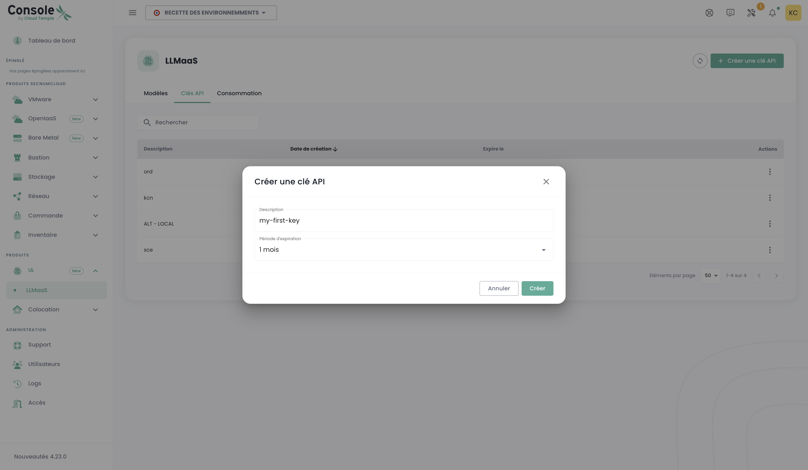

# Tutorials LLMaaS

## Übersicht

Diese fortgeschrittenen Tutorials decken die Integration, Optimierung und Best Practices ab, um LLMaaS Cloud Temple in der Produktion voll auszuschöpfen. Jeder Tutorial enthält getesteten Code und reale Leistungsmetriken.

## 🚀 Integrationen von LangChain und Frameworks

### 1. Grundlegende Integration mit LangChain

Dieses erste Beispiel zeigt, wie die LLMaaS-API mit dem populären Framework LangChain integriert wird, indem ein benutzerdefinierter "Wrapper" erstellt wird. Ein Wrapper ist eine Klasse, die unsere API "umhüllt", um sie mit den internen Mechanismen von LangChain kompatibel zu machen.

#### Der Code erklärt

Der folgende Code definiert eine Klasse `CloudTempleLLM`, die von der Basisklasse `LLM` von LangChain erbt. Dies ermöglicht es uns, ein benutzerdefiniertes Verhalten zu definieren, während wir gleichzeitig kompatibel mit dem LangChain-Ökosystem (Chains, Agents usw.) bleiben.

1.  **`CloudTempleLLM(LLM)`** : Unsere Klasse erbt von `LLM`, was uns verpflichtet, bestimmte Methoden zu implementieren, insbesondere `_call`.
2.  **`_call(self, prompt: str, ...)`** : Dies ist der Kern unseres Wrappers. Jedes Mal, wenn LangChain unseren Sprachmodell aufrufen muss, ruft es diese Methode auf. Darin formatieren wir eine standardmäßige HTTP-POST-Anfrage mit den richtigen Headern (`Authorization`) und dem vom unserer API `/v1/chat/completions` erwarteten `payload`.
3.  **`exemple_langchain_basic()`** : Diese Demonstrationsfunktion zeigt, wie unser Wrapper verwendet wird. Wir instanziieren ihn, erstellen ein `PromptTemplate`, um unsere Anfrage zu strukturieren, und kombinieren sie in einer `LLMChain`. Wenn wir die Kette ausführen (`chain.run(...)`), ruft LangChain im Hintergrund die von uns definierte `_call`-Methode auf.

Dieser Ansatz ist nützlich, wenn Sie die volle Kontrolle über die Weise haben möchten, wie LangChain mit der API interagiert, ist aber ausführlicher als die Verwendung des Clients `ChatOpenAI` (siehe [API Reference](./api#langchain)).

```python

# Installation der Abhängigkeiten

# pip install langchain requests pydantic

from langchain.llms.base import LLM
from langchain.schema import LLMResult, Generation
from typing import Optional, List, Any
from pydantic import Field
import requests
import json
import os

# --- Konfiguration ---

# Es wird empfohlen, Ihren API-Schlüssel in einer Umgebungsvariablen zu speichern
API_KEY = os.getenv("LLMAAS_API_KEY", "votre-clé-api-ici")
BASE_URL = "https://api.ai.cloud-temple.com/v1"

class CloudTempleLLM(LLM):
    """
    Wrapper LangChain personnalisé pour l'API LLMaaS de Cloud Temple.
    Cette classe permet d'utiliser notre API comme un LLM standard dans LangChain.
    """
    
    api_key: str = Field()
    model_name: str = Field(default="granite3.3:8b")
    temperature: float = Field(default=0.7)
    max_tokens: int = Field(default=1000)
    
    @property
    def _llm_type(self) -> str:
        """Identifiant unique pour notre type de LLM."""
        return "cloud_temple_llmaas"
    
    def _call(self, prompt: str, stop: Optional[List[str]] = None) -> str:
        """
        La méthode principale qui effectue l'appel à l'API LLMaaS.
        LangChain utilise cette méthode pour chaque requête au modèle.
        """
        headers = {
            "Authorization": f"Bearer {self.api_key}",
            "Content-Type": "application/json"
        }
        
        payload = {
            "model": self.model_name,
            "messages": [{"role": "user", "content": prompt}],
            "temperature": self.temperature,
            "max_tokens": self.max_tokens
        }
        
        if stop:
            payload["stop"] = stop
        
        # Exécution de la requête POST vers l'API
        response = requests.post(
            f"{BASE_URL}/chat/completions",
            headers=headers,
            json=payload,
            timeout=60
        )
        
        response.raise_for_status()  # Lève une exception en cas d'erreur HTTP
        result = response.json()
        
        # Retourne le contenu du message de l'assistant
        return result['choices'][0]['message']['content']

# --- Beispielanwendung ---
from langchain.chains import LLMChain
from langchain.prompts import PromptTemplate

def beispiel_langchain_wrapper():
    """Zeigt die Verwendung des LLM-Wrappers mit einer LangChain-Kette an."""
    
    # 1. Initialisierung unseres benutzerdefinierten LLMs
    llm = CloudTempleLLM(
        api_key=API_KEY,
        model_name="granite3.3:8b"
    )
    
    # 2. Erstellung einer Prompt-Vorlage zur Strukturierung der Anfragen
    template = """
    Sie sind ein Experte im Bereich {domaine}. 
    Beantworten Sie diese Frage detailliert und professionell:
    
    Frage: {question}
    
    Antwort:
    """
    prompt = PromptTemplate(
        input_variables=["domaine", "question"],
        template=template
    )
    
    # 3. Erstellung einer Kette, die den Prompt und den LLM kombiniert
    chain = LLMChain(llm=llm, prompt=prompt)
    
    # 4. Ausführung der Kette mit spezifischen Variablen
    result = chain.run(
        domaine="Cybersicherheit",
        question="Welche sind die besten Praktiken, um eine REST-API zu sichern?"
    )
    
    return result

# --- Teststart ---
if __name__ == "__main__":
    if API_KEY == "votre-clé-api-ici":
        print("Bitte konfigurieren Sie Ihre LLMAAS_API_KEY in Ihren Umgebungsvariablen.")
    else:
        reponse = exemple_langchain_wrapper()
        print("Antwort des Sicherheitsexperten:\n")
        print(reponse)
```

### 2. RAG (Retrieval-Augmented Generation) mit der LLMaaS-API

RAG ist eine leistungsstarke Technik, die es einem LLM ermöglicht, Fragen anhand einer externen Wissensbasis zu beantworten. Dieses Tutorial führt Sie durch die Erstellung eines einfachen RAG-Pipelines unter Verwendung unserer API für Embeddings und Generierung sowie FAISS, einer Bibliothek für Vektorähnlichkeit, um einen In-Memory-Index zu erstellen.

#### Der Code erläutert

Der Pipeline besteht aus mehreren logischen Schritten:

1.  **Konfiguration**: Wir importieren die notwendigen Bibliotheken und laden unsere API-Schlüssel aus den Umgebungsvariablen. Wir definieren die zu verwendenden Modelle: `granite-embedding:278m` für die Vektorisierung und `granite3.3:8b` für die Generierung.
2.  **`LLMaaSEmbeddings`**: Wie im vorherigen Beispiel benötigen wir einen Wrapper, um mit unserer Embeddings-API zu interagieren. Diese Klasse verwaltet die Umwandlung von Textstücken (Chunks) in numerische Vektoren (Embeddings).
3.  **`setup_rag_pipeline`**: Diese Funktion koordiniert die Erstellung der Pipeline.
    *   **Dokumente laden**: `DirectoryLoader` lädt Textdateien aus unserer Wissensbasis.
    *   **Aufteilung in Chunks**: `RecursiveCharacterTextSplitter` teilt Dokumente in kleinere Stücke. Dies ist entscheidend, damit das Embeddings-Modell den Text effizient verarbeiten kann und die Ähnlichkeitssuche präzise ist.
    *   **Vektorisierung und Indizierung**: `FAISS.from_documents` ist ein entscheidender Schritt. Sie nimmt die Textchucks, verwendet unsere Klasse `LLMaaSEmbeddings`, um die API aufzurufen und die entsprechenden Vektoren zu erhalten, und speichert diese Vektoren in einem FAISS-Index im Speicher.
    *   **Konfiguration des LLM**: Wir verwenden `ChatOpenAI`, das nativ mit unserer API für die Antwortgenerierung kompatibel ist.
    *   **Erstellung der Kette `RetrievalQA`**: Dies ist die LangChain-Kette, die alle Elemente verknüpft. Wenn eine Frage gestellt wird, tut sie Folgendes:
        a. Nutzt den `retriever` (auf Basis unseres FAISS-Index), um die relevantesten Textchucks zu finden.
        b. "Stuff" (fügt) diese Chucks mit der Frage in einen Prompt ein.
        c. Sendet diesen angereicherten Prompt an das LLM, um eine kontextuelle Antwort zu generieren.
4.  **Ausführung**: Die Funktion `main` simuliert eine reale Nutzung, indem sie temporäre Wissensdateien erstellt, die Pipeline aufbaut und eine Frage stellt.

```python
import os
import tempfile
import shutil
from pathlib import Path
from dotenv import load_dotenv
from typing import List


# --- Imports LangChain ---
from langchain_core.embeddings import Embeddings
from langchain_openai import ChatOpenAI
from langchain_community.document_loaders import DirectoryLoader, TextLoader
from langchain.text_splitter import RecursiveCharacterTextSplitter
from langchain_community.vectorstores import FAISS
from langchain.chains import RetrievalQA

# --- Konfiguration ---

# Lädt die Umgebungsvariablen (z.B. LLMAAS_API_KEY)
load_dotenv()
API_KEY = os.getenv("LLMAAS_API_KEY")
BASE_URL = os.getenv("API_URL", "https://api.ai.cloud-temple.com/v1")
EMBEDDING_MODEL = "granite-embedding:278m"
LLM_MODEL = "granite3.3:8b"

# --- Benutzerdefinierte Embedding-Klasse ---
class LLMaaSEmbeddings(Embeddings):
    """Benutzerdefinierte Embedding-Klasse für die LLMaaS-API von Cloud Temple."""
    def __init__(self, api_key: str, model_name: str):
        if not api_key:
            raise ValueError("Die LLMaaS-API-Schlüssel darf nicht leer sein.")
        self.api_key = api_key
        self.model_name = model_name
        self.base_url = BASE_URL
        self.headers = {
            "Authorization": f"Bearer {self.api_key}",
            "Content-Type": "application/json",
        }

    def _embed(self, texts: List[str]) -> List[List[float]]:
        import httpx
        payload = {"input": texts, "model": self.model_name}
        try:
            with httpx.Client(timeout=60.0) as client:
                response = client.post(f"{self.base_url}/embeddings", headers=self.headers, json=payload)
                response.raise_for_status()
                data = response.json()['data']
                data.sort(key=lambda e: e['index'])
                return [item['embedding'] for item in data]
        except httpx.HTTPStatusError as e:
            print(f"HTTP-Fehler bei der Generierung der Embeddings: {e.response.text}")
            raise
        except Exception as e:
            print(f"Eine unerwartete Fehler ist bei der Generierung der Embeddings aufgetreten: {e}")
            raise

    def embed_documents(self, texts: List[str]) -> List[List[float]]:
        return self._embed(texts)

    def embed_query(self, text: str) -> List[float]:
        # Die Methode _embed erwartet eine Liste, daher kapseln wir den einzelnen Text.
        return self._embed([text])[0]

# --- RAG-Pipeline ---
def setup_rag_pipeline(documents_path: str):
    """Vollständige Konfiguration der RAG-Pipeline mit den LLMaaS-Tools."""
    print("1. Laden und Aufteilen der Dokumente...")
    loader = DirectoryLoader(documents_path, glob="*.txt", loader_cls=TextLoader, loader_kwargs={'encoding': 'utf-8'})
    documents = loader.load()
    text_splitter = RecursiveCharacterTextSplitter(chunk_size=1000, chunk_overlap=200)
    splits = text_splitter.split_documents(documents)
    print(f"   -> {len(documents)} Dokument(e) geladen und in {len(splits)} chunks aufgeteilt.")
    
    print(f"2. Erstellung der Embeddings über LLMaaS (Modell: {EMBEDDING_MODEL})...")
    embeddings = LLMaaSEmbeddings(api_key=API_KEY, model_name=EMBEDDING_MODEL)
    
    print("3. Erstellung des in-Memory-Vektorindexes (FAISS)...")
    vectorstore = FAISS.from_documents(splits, embeddings)
    print("   -> FAISS-Index erfolgreich erstellt.")
    
    print(f"4. Konfiguration des LLM (Modell: {LLM_MODEL})...")
    # Korrektur für die Kompatibilität Pydantic/LangChain
    from langchain_core.caches import BaseCache
    from langchain_core.callbacks.base import Callbacks
    ChatOpenAI.model_rebuild()
    
    llm = ChatOpenAI(
        api_key=API_KEY,
        base_url=BASE_URL,
        model=LLM_MODEL,
        temperature=0.3,
        model_kwargs={"max_tokens": 300}
    )
    
    print("5. Erstellung der Frage/Antwort-Kette (RAG)...")
    qa_chain = RetrievalQA.from_chain_type(
        llm=llm,
        chain_type="stuff",
        retriever=vectorstore.as_retriever(),
        return_source_documents=True
    )
    print("   -> RAG-Pipeline bereit.")
    return qa_chain

# --- Ausführung ---
def main():
    """Hauptfunktion zum Ausführen des end-to-end RAG-Pipelines."""
    if not API_KEY:
        print("Fehler: Die Umgebungsvariable LLMAAS_API_KEY ist nicht definiert.")
        return

    # Erstellen von temporären Testdokumenten
    temp_dir = tempfile.mkdtemp()
    print(f"\nErstellung von Testdokumenten in: {temp_dir}")
    try:
        documents_content = {
            "overview.txt": "Cloud Temple ist ein französischer Anbieter von souveränen Cloud-Diensten mit der Zertifizierung SecNumCloud.",
            "pricing.txt": "Die Preise der LLMaaS-API betragen 0,90 € pro Million Eingabetokens und 4 € pro Million Ausgabetokens."
        }
        for filename, content in documents_content.items():
            with open(Path(temp_dir) / filename, 'w', encoding='utf-8') as f:
                f.write(content)
        
        # Pipeline konfigurieren und ausführen
        rag_chain = setup_rag_pipeline(temp_dir)
        
        print("\n--- Abfragen der RAG-Pipeline ---")
        question = "Wie hoch ist der Preis für Ausgabetokens der LLMaaS-API von Cloud Temple?"
        result = rag_chain({"query": question})
        
        print(f"\nFrage: {question}")
        print(f"Antwort: {result['result']}")
        print("\nQuellen, die für die Antwort verwendet wurden:")
        for source in result["source_documents"]:
            print(f"- Datei: {os.path.basename(source.metadata['source'])}")
            print(f"  Inhalt: \"{source.page_content}\"")

    finally:
        # Temporäres Verzeichnis bereinigen
        print(f"\nBereinigung des temporären Verzeichnisses: {temp_dir}")
        shutil.rmtree(temp_dir)

if __name__ == "__main__":
    main()
```

### 3. Integration mit einer Vektor-Datenbank (Qdrant)

Für Produktionsanwendungen der RAG-Technologie wird die Verwendung einer spezialisierten Vektor-Datenbank wie **Qdrant** empfohlen. Im Gegensatz zu FAISS, das im Speicher arbeitet, bietet Qdrant Datenpersistenz, erweiterte Suchfunktionen und bessere Skalierbarkeit.

#### Der Code erklärt

Dieses Tutorial passt den vorherigen RAG-Pipeline an, um Qdrant zu verwenden.

1.  **Voraussetzungen**: Der erste Schritt besteht darin, eine Instanz von Qdrant zu starten. Der einfachste Weg ist die Verwendung von Docker.
2.  **`setup_qdrant_rag_pipeline`**:
    *   **Einbettungen und Dokumente**: Die Erstellung der Einbettungen und Dokumente bleibt identisch wie im vorherigen Beispiel.
    *   **Verbindung zu Qdrant**: Anstatt einen FAISS-Index zu erstellen, verwenden wir `Qdrant.from_documents`. Diese Methode von LangChain verwaltet mehrere Schritte:
        a. Sie verbindet sich mit Ihrer Qdrant-Instanz über die angegebene URL.
        b. Sie erstellt eine neue "Sammlung" (das Äquivalent einer Tabelle in einer SQL-Datenbank), falls sie noch nicht existiert.
        c. Sie ruft unsere Klasse `LLMaaSEmbeddings` auf, um die Dokumente zu vektorisieren.
        d. Sie fügt die Dokumente und ihre Vektoren in die Qdrant-Sammlung ein.
    *   **`force_recreate=True`**: Für dieses Tutorial verwenden wir diesen Parameter, um sicherzustellen, dass die Sammlung bei jeder Ausführung leer ist. In der Produktion würden Sie ihn auf `False` setzen, um Ihre Daten beizubehalten.
3.  **Der Rest des Pipelines** (Konfiguration des LLM, Erstellung der Kette `RetrievalQA`) ist identisch, was die Flexibilität von LangChain zeigt: Es reicht aus, die Quelle des `retriever` (der Informationssuche) zu ändern, um von FAISS zu Qdrant zu wechseln.

:::info Voraussetzungen: Qdrant starten
Für dieses Tutorial benötigen Sie eine Qdrant-Instanz. Sie können sie leicht mit Docker starten:

```bash

# 1. Das letzte Image von Qdrant herunterladen
docker pull qdrant/qdrant

# 2. Qdrant-Container starten
docker run -p 6333:6333 -p 6334:6334 qdrant/qdrant
```
:::

Der folgende Code zeigt, wie der RAG-Pipeline angepasst wird, um Qdrant als Vektor-Datenbank zu verwenden.

```python
import os
from dotenv import load_dotenv
from langchain_openai import ChatOpenAI
from langchain.chains import RetrievalQA
from langchain_community.vectorstores import Qdrant
from langchain.docstore.document import Document
from langchain.text_splitter import RecursiveCharacterTextSplitter
from typing import List
from langchain_core.embeddings import Embeddings


# (Die Klasse LLMaaSEmbeddings ist die gleiche wie im vorherigen Beispiel,

# wir verwenden sie hier wieder. Stellen Sie sicher, dass sie in Ihrem Skript definiert ist.)

# --- Konfiguration ---
load_dotenv()
API_KEY = os.getenv("LLMAAS_API_KEY")
BASE_URL = os.getenv("API_URL", "https://api.ai.cloud-temple.com/v1")
EMBEDDING_MODEL = "granite-embedding:278m"
LLM_MODEL = "granite3.3:8b"
QDRANT_URL = os.getenv("QDRANT_URL", "http://localhost:6333")
QDRANT_COLLECTION_NAME = "tutorial_collection"

# --- Embedding-Klasse (wiederholt aus dem vorherigen Beispiel) ---
class LLMaaSEmbeddings(Embeddings):
    def __init__(self, api_key: str, model_name: str):
        if not api_key: raise ValueError("API Key ist erforderlich.")
        self.api_key, self.model_name, self.base_url = api_key, model_name, BASE_URL
        self.headers = {"Authorization": f"Bearer {self.api_key}", "Content-Type": "application/json"}
    def _embed(self, texts: List[str]) -> List[List[float]]:
        import httpx
        payload = {"input": texts, "model": self.model_name}
        with httpx.Client(timeout=60.0) as client:
            r = client.post(f"{self.base_url}/embeddings", headers=self.headers, json=payload)
            r.raise_for_status()
            data = r.json()['data']
            data.sort(key=lambda e: e['index'])
            return [item['embedding'] for item in data]
    def embed_documents(self, texts: List[str]) -> List[List[float]]: return self._embed(texts)
    def embed_query(self, text: str) -> List[float]: return self._embed([text])[0]

def setup_qdrant_rag_pipeline():
    """Konfiguriert und gibt einen RAG-Pipeline mit Qdrant zurück."""
    print("1. Initialisierung des Embedding-Clients LLMaaS...")
    embeddings = LLMaaSEmbeddings(api_key=API_KEY, model_name=EMBEDDING_MODEL)

    print("2. Vorbereitung der Dokumente...")
    documents_content = [
        "Cloud Temple ist ein französischer Anbieter von souveränen Cloud-Diensten mit der Zertifizierung SecNumCloud.",
        "Die Preise für LLMaaS betragen 0,90 € für Eingabe und 4 € für Ausgabe pro Million Tokens."
    ]
    documents = [Document(page_content=d) for d in documents_content]
    
    print(f"3. Verbindung zu Qdrant und Bevölkerung der Sammlung '{QDRANT_COLLECTION_NAME}'...")
    vectorstore = Qdrant.from_documents(
        documents,
        embeddings,
        url=QDRANT_URL,
        collection_name=QDRANT_COLLECTION_NAME,
        force_recreate=True, # Stellt eine saubere Sammlung für das Tutorial sicher
    )
    print("   -> Sammlung erfolgreich erstellt und befüllt.")

    print(f"4. Konfiguration des LLM ({LLM_MODEL})...")
    llm = ChatOpenAI(
        api_key=API_KEY,
        base_url=BASE_URL,
        model=LLM_MODEL,
        temperature=0.3
    )

    print("5. Erstellung der RAG-Kette...")
    qa_chain = RetrievalQA.from_chain_type(
        llm=llm,
        retriever=vectorstore.as_retriever(),
        return_source_documents=True
    )
    print("   -> RAG-Pipeline mit Qdrant bereit.")
    return qa_chain

# --- Ausführung ---
def main_qdrant():
    """Hauptfunktion zum Ausführen des RAG-Pipelines mit Qdrant."""
    if not API_KEY:
        print("Fehler: Die Umgebungsvariable LLMAAS_API_KEY ist nicht definiert.")
        return
        
    try:
        rag_chain = setup_qdrant_rag_pipeline()
        question = "Welche Preise hat die LLMaaS-API von Cloud Temple ?"
        
        print(f"\n--- Abfrage des Pipelines ---")
        result = rag_chain({"query": question})

        print(f"\nFrage: {question}")
        print(f"Antwort: {result['result']}")
        print("\nQuellen, die für die Antwort verwendet wurden:")
        for source in result["source_documents"]:
            print(f"- Inhalt: \"{source.page_content}\"")
            
    except Exception as e:
        print(f"\nEin Fehler ist aufgetreten: {e}")
        print("Stellen Sie sicher, dass der Qdrant-Container ausgeführt wird.")

if __name__ == "__main__":
    main_qdrant()
```

### 4. LangChain-Agenten mit Werkzeugen

Ein Agent ist ein LLM, das nicht nur eine Frage beantwortet, sondern einen **Satz von Werkzeugen** (Funktionen, APIs usw.) verwenden kann, um eine komplexere Antwort zu konstruieren. Er kann sich überlegen, ein Problem zerteilen, ein Werkzeug wählen, es ausführen, das Ergebnis beobachten und diesen Zyklus wiederholen, bis eine Endantwort erzielt wird.

#### Der Code erläutert

Dieses Beispiel erstellt einen einfachen Agenten, der zwei Tools verwenden kann: eines zur Abfrage einer (simulierten) Cloud Temple API und eines zur Durchführung von Berechnungen.

1.  **Definition der Tools**: Die Klassen `CloudTempleAPITool` und `CalculatorTool` erben von `BaseTool`. Jedes Tool hat:
    *   Ein `name`: Ein einfacher und beschreibender Name.
    *   Eine `description`: **Entscheidend**, dies ist das, was der LLM liest, um zu entscheiden, welches Tool verwendet werden soll. Sie muss sehr klar sein, was das Tool tut und wann es verwendet werden soll.
    *   Eine Methode `_run`: Der Code, der tatsächlich ausgeführt wird, wenn der Agent dieses Tool wählt.
2.  **`create_agent_with_tools`**:
    *   **Initialisierung des LLM**: Wir verwenden unseren Wrapper `CloudTempleLLM`, der im ersten Tutorial definiert wurde.
    *   **Liste der Tools**: Wir geben dem Agenten die Liste der Tools, die er verwenden darf.
    *   **Agent-Prompt**: Der Prompt ist sehr spezifisch. Es handelt sich um einen „Denkprozess-Prompt“, der dem LLM anweist, wie zu denken (`Thought`), eine Aktion zu wählen (`Action`), eine Eingabe für diese Aktion bereitzustellen (`Action Input`) und das Ergebnis zu beobachten (`Observation`). Dies ist das zentrale Mechanismus des ReAct-Frameworks (Reasoning and Acting), das hier verwendet wird.
    *   **Erstellung des Agents**: `create_react_agent` verbindet LLM, Tools und Prompt, um den Agenten zu erstellen.
    *   **`AgentExecutor`**: Dies ist der Motor, der den Agenten in einer Schleife ausführt, bis er eine `Final Answer` produziert. Der Parameter `verbose=True` ist sehr nützlich, um den „inneren Dialog“ des Agenten (seine Gedanken, Aktionen usw.) zu sehen.

```python
from langchain.agents import Tool, AgentExecutor, create_react_agent
from langchain.tools import BaseTool
from langchain.prompts import PromptTemplate
import requests
import json
import os


# (Die Klasse CloudTempleLLM ist die gleiche wie im ersten Beispiel)

# --- Definition der Werkzeuge ---

class CloudTempleAPITool(BaseTool):
    """Ein Werkzeug, das einen Aufruf einer internen API simuliert, um Informationen zu Diensten zu erhalten."""
    name = "cloud_temple_api_checker"
    description = "Nützlich, um Informationen zu Diensten, Produkten und Angeboten von Cloud Temple zu erhalten."

    def _run(self, query: str) -> str:
        # In einem echten Fall würde dies einen echten API-Aufruf auslösen.
        print(f"--- Werkzeug CloudTempleAPITool mit der Anfrage aufgerufen: '{query}' ---")
        if "service" in query.lower():
            return "Cloud Temple bietet folgende Dienste an: IaaS, PaaS, LLMaaS, Managed Security."
        return "Information nicht gefunden."

    async def _arun(self, query: str) -> str:
        # Asynchrone Implementierung ist für dieses Beispiel nicht erforderlich.
        raise NotImplementedError("Das API-Werkzeug unterstützt keine asynchrone Ausführung.")

class SimpleCalculatorTool(BaseTool):
    """Ein einfaches Werkzeug zur Durchführung mathematischer Berechnungen."""
    name = "simple_calculator"
    description = "Nützlich zur Durchführung einfacher mathematischer Berechnungen. Akzeptiert einen gültigen Python-Ausdruck."

    def _run(self, expression: str) -> str:
        print(f"--- Werkzeug SimpleCalculatorTool mit dem Ausdruck aufgerufen: '{expression}' ---")
        try:
            # ACHTUNG: eval() ist in der Produktion gefährlich. Dies ist nur für die Demo.
            return str(eval(expression))
        except Exception as e:
            return f"Berechnungsfehler: {e}"

    async def _arun(self, expression: str) -> str:
        raise NotImplementedError("Das Rechenwerkzeug unterstützt keine asynchrone Ausführung.")

# --- Erstellung des Agents ---

def create_agent():
    """Konfiguriert und gibt einen LangChain-Agenten mit den definierten Tools zurück."""
    print("1. Initialisierung des LLM für den Agenten...")
    llm = CloudTempleLLM(api_key=os.getenv("LLMAAS_API_KEY", "votre-clé-api-ici"))

    tools = [CloudTempleAPITool(), SimpleCalculatorTool()]
    
    # Der Prompt-Template ist entscheidend: Er leitet das Denken des LLMs.
    template = """
    Beantworte die folgenden Fragen so gut du kannst. Du hast Zugriff auf die folgenden Tools:

    {tools}

    Verwende das folgende Format:

    Frage: Die Frage, auf die du antworten musst
    Gedanke: Du musst immer darüber nachdenken, was du tun wirst
    Aktion: Die auszuführende Aktion, muss einer der folgenden sein [{tool_names}]
    Aktionseingabe: Die Eingabe für die Aktion
    Beobachtung: Das Ergebnis der Aktion
    ... (diese Sequenz aus Gedanke/Aktion/Aktionseingabe/Beobachtung kann sich wiederholen)
    Gedanke: Ich kenne nun die endgültige Antwort.
    Endgültige Antwort: Die endgültige Antwort auf die ursprüngliche Frage

    Los geht's!

    Frage: {input}
    Gedanke:{agent_scratchpad}
    """
    
    prompt = PromptTemplate.from_template(template)
    
    print("2. Erstellung des Agents mit dem ReAct-Framework...")
    agent = create_react_agent(llm, tools, prompt)

    # Der AgentExecutor ist für die Ausführung der Agenten-Zyklen verantwortlich.
    agent_executor = AgentExecutor(agent=agent, tools=tools, verbose=True)
    print("   -> Agent bereit.")
    return agent_executor

# --- Ausführung ---

def run_agent():
    """Führt den Agenten mit verschiedenen Fragen aus, um seine Fähigkeiten zu testen."""
    if os.getenv("LLMAAS_API_KEY") is None:
        print("Bitte konfigurieren Sie Ihre LLMAAS_API_KEY.")
        return
        
    agent_executor = create_agent()
    
    print("\n--- Test 1: Frage, die ein Informationswerkzeug erfordert ---")
    question1 = "Welche Dienste bietet Cloud Temple an?"
    response1 = agent_executor.invoke({"input": question1})
    print(f"\nEndgültige Antwort des Agents: {response1['output']}")
    
    print("\n--- Test 2: Frage, die eine Berechnung erfordert ---")
    question2 = "Was ist das Ergebnis von 125 * 8 + 50?"
    response2 = agent_executor.invoke({"input": question2})
    print(f"\nEndgültige Antwort des Agents: {response2['output']}")

if __name__ == "__main__":
    run_agent()
```

### 5. OpenAI SDK-Integration

**Transparente Migration von OpenAI**

```python
from openai import OpenAI

# Konfiguration für Cloud Temple LLMaaS
def setup_cloud_temple_client():
    """Client-Konfiguration für OpenAI für Cloud Temple"""
    
    client = OpenAI(
        api_key="your-cloud-temple-api-key",
        base_url="https://api.ai.cloud-temple.com/v1"
    )
    
    return client

def test_openai_compatibility():
    """Test der Kompatibilität mit dem OpenAI-SDK"""
    
    client = setup_cloud_temple_client()
    
    # Standard-Chat-Completion
    response = client.chat.completions.create(
        model="granite3.3:8b",
        messages=[
            {"role": "system", "content": "Sie sind ein professioneller IA-Assistent."},
            {"role": "user", "content": "Erklären Sie mir die Cloud-Native-Architektur."}
        ],
        max_tokens=300,
        temperature=0.7
    )
    
    print(f"Antwort: {response.choices[0].message.content}")
    
    # Streaming
    stream = client.chat.completions.create(
        model="granite3.3:8b",
        messages=[
            {"role": "user", "content": "Schreibe ein Gedicht über KI."}
        ],
        stream=True,
        max_tokens=200
    )
    
    print("Stream:")
    for chunk in stream:
        if chunk.choices[0].delta.content is not None:
            print(chunk.choices[0].delta.content, end="")
    print()

# Kompatibilitätstest
test_openai_compatibility()

### 5. Semantic Kernel-Integration (Microsoft)

[Semantic Kernel](https://learn.microsoft.com/fr-fr/semantic-kernel/overview/) ist ein open-source SDK von Microsoft, das es ermöglicht, LLMs in .NET-, Python- und Java-Anwendungen zu integrieren. Obwohl es für Azure OpenAI-Dienste optimiert ist, ermöglicht seine Flexibilität die Verwendung mit jeder kompatiblen OpenAI-API, einschließlich unserer eigenen.

#### Der Code erläutert

Dieses Beispiel benötigt nicht das vollständige Semantic Kernel SDK. Es zeigt, wie der **Begriff "semantische Funktion"** durch einen einfachen Aufruf unserer API implementiert werden kann. Eine semantische Funktion ist im Grunde ein strukturierter Prompt, der an ein LLM gesendet wird, um eine bestimmte Aufgabe zu erledigen.

1.  **`semantic_kernel_simple()`** : Diese Funktion simuliert eine "Zusammenfassungsfunktion".
2.  **Strukturierter Prompt** : Wir verwenden eine `system`-Nachricht, um dem LLM eine Rolle zu geben ("Sie sind ein Experte für Dokumentensynthesen.") und eine `user`-Nachricht mit dem zu zusammenfassenden Text. Dies ist der Kern des Konzepts der semantischen Funktion.
3.  **Direkter API-Aufruf** : Ein einfacher Aufruf `requests.post` an unseren Endpunkt `/v1/chat/completions` reicht aus, um die Funktion auszuführen.

Dieses Beispiel zeigt, dass es nicht immer notwendig ist, ein schweres Framework zu verwenden. Für einfache und gut definierte Aufgaben ist ein direkter API-Aufruf von LLMaaS oft die effizienteste und leistungsstärkste Lösung.

```python
import requests
import os
from dotenv import load_dotenv

def semantic_kernel_simulation():
    """
    Simuliert eine "semantische Funktion" zur Zusammenfassung durch direkten Aufruf der LLMaaS-API.
    """
    load_dotenv()
    api_key = os.getenv("LLMAAS_API_KEY")
    if not api_key:
        print("Bitte setzen Sie die Umgebungsvariable LLMAAS_API_KEY.")
        return

    headers = {
        "Authorization": f"Bearer {api_key}",
        "Content-Type": "application/json"
    }
    
    text_to_summarize = """
    Künstliche Intelligenz (KI) verändert viele Industriebereiche durch Automatisierung von Aufgaben, 
    Optimierung von Prozessen und ermöglicht fortgeschrittene prädiktive Analysen. 
    Cloud Temple mit seinem souveränen und zertifizierten LLMaaS-Angebot gemäß SecNumCloud ermöglicht Unternehmen 
    die Integration dieser KI-Fähigkeiten, wobei die Sicherheit und Vertraulichkeit ihrer Daten gewährleistet wird.
    """
    
    # Der Prompt kombiniert eine Anweisung (Systemrolle) und Daten (Nutzerrolle)
    payload = {
        "model": "granite3.3:8b",
        "messages": [
            {"role": "system", "content": "Sie sind ein Experte für die Zusammenfassung technischer Dokumente."},
            {"role": "user", "content": f"Zusammenfassung des folgenden Textes in einer kurzen Satz: {text_to_summarize}"}
        ],
        "max_tokens": 100,
        "temperature": 0.5
    }
    
    try:
        response = requests.post(
            "https://api.ai.cloud-temple.com/v1/chat/completions",
            headers=headers,
            json=payload,
            timeout=30
        )
        response.raise_for_status()
        result = response.json()
        summary = result['choices'][0]['message']['content']
        
        print("Originaltext:\n", text_to_summarize)
        print("\nGenerierte Zusammenfassung:\n", summary)
        return summary
        
    except requests.exceptions.RequestException as e:
        print(f"Es ist ein API-Fehler aufgetreten: {e}")

if __name__ == "__main__":
    semantic_kernel_simulation()
```

### 6. Framework Haystack

[Haystack](https://haystack.deepset.ai/) ist ein weiteres leistungsstarkes Open-Source-Framework zur Erstellung von Anwendungen für semantische Suche, RAG und Agenten. Wie bei Semantic Kernel kann unsere API direkt integriert werden.

#### Der Code erläutert

Dieses Beispiel simuliert einen grundlegenden Haystack-Pipeline für die Antwortsuche in einem gegebenen Kontext (Question Answering).

1.  **`process_with_context`** : Diese Funktion stellt den Kern eines QA-Pipelines dar. Sie erhält einen `Kontext` (z. B. einen Absatz eines Dokuments) und eine `Frage`.
2.  **Kontextueller Prompt** : Der Prompt ist sorgfältig strukturiert, um sowohl den Kontext als auch die Frage zu enthalten. Dies ist eine grundlegende Technik in RAG: Wir geben dem LLM relevante Informationen, damit es eine faktische Antwort formulieren kann.
3.  **API-Aufruf** : Ein einfacher `requests.post`-Aufruf an unsere API reicht aus. Das LLM erhält den Kontext und die Frage, und seine Aufgabe besteht darin, eine Antwort basierend *nur* auf den bereitgestellten Informationen zu synthetisieren.

Dieses Beispiel zeigt die Flexibilität der LLMaaS-API, die als Grundbaustein für die Textgenerierung in jedem Framework dienen kann, sogar in solchen, für die keine offizielle Integration existiert.

```python
import requests
import os
from dotenv import load_dotenv

def haystack_simulation():
    """
    Simuliert einen Question-Answering-Pipeline-Modus von Haystack
    durch einen direkten API-Aufruf an LLMaaS.
    """
    load_dotenv()
    api_key = os.getenv("LLMAAS_API_KEY")
    if not api_key:
        print("Bitte setzen Sie die Umgebungsvariable LLMAAS_API_KEY.")
        return

    headers = {
        "Authorization": f"Bearer {api_key}",
        "Content-Type": "application/json"
    }
    
    # Der Kontext ist die Information, die das LLM verwenden darf.
    context = """
    Ein souveräner Cloud-Service ist eine Cloud-Computing-Infrastruktur, die vollständig innerhalb der Grenzen eines bestimmten Landes liegt und dessen Gesetzen unterliegt. 
    Die Hauptvorteile sind die Gewährleistung der Datenresidenz, die Einhaltung lokaler Vorschriften (z. B. der DSGVO in Europa) und ein erhöhter Schutz vor Zugriffen durch ausländische Entitäten gemäß extraterritorialen Gesetzen wie der US-CLOUD Act.
    """
    
    question = "Welche Vorteile bietet ein souveräner Cloud-Service?"
    
    # Der Prompt leitet das LLM an, seine Antwort auf den bereitgestellten Kontext zu stützen.
    prompt = f"""
    Basierend ausschließlich auf dem folgenden Kontext beantworte die Frage.
    
    Kontext:
    ---
    {context}
    ---
    
    Frage: {question}
    """
    
    payload = {
        "model": "granite3.3:8b",
        "messages": [{"role": "user", "content": prompt}],
        "max_tokens": 200,
        "temperature": 0.2 # Niedrige Temperatur für eine faktische Antwort
    }
    
    try:
        response = requests.post(
            "https://api.ai.cloud-temple.com/v1/chat/completions",
            headers=headers,
            json=payload,
            timeout=30
        )
        response.raise_for_status()
        result = response.json()
        answer = result['choices'][0]['message']['content']
        
        print(f"Frage: {question}")
        print("\nGenerierte Antwort:\n", answer)
        return answer
        
    except requests.exceptions.RequestException as e:
        print(f"Es ist ein API-Fehler aufgetreten: {e}")

if __name__ == "__main__":
    haystack_simulation()
```

### 7. Integration von LlamaIndex

[LlamaIndex](https://www.llamaindex.ai/) ist ein Framework, das speziell für die Erstellung von RAG-Anwendungen entwickelt wurde. Es bietet hochwertige Komponenten für die Daten-Eingabe, Indexierung und Abfrage. Unsere API, die mit der OpenAI-Schnittstelle kompatibel ist, integriert sich sehr einfach.

#### Der Code erklärt

Dieses Beispiel zeigt, wie LlamaIndex so konfiguriert wird, dass die LLMaaS-API für die Textgenerierung verwendet wird, während gleichzeitig ein lokaler Embedding-Modell für die Vectorisierung genutzt wird.

1.  **`setup_and_run_llamaindex`** : Diese Funktion koordiniert den gesamten Prozess.
    *   **Konfiguration des LLM** : LlamaIndex bietet eine Klasse `OpenAILike`, die es ermöglicht, sich an jede API anzuschließen, die das OpenAI-Format respektiert. Es reicht aus, unsere `api_base` und eine `api_key` bereitzustellen. Dies ist die einfachste Methode, um unsere LLM kompatibel zu machen.
    *   **Konfiguration der Embeddings** : Für dieses Beispiel verwenden wir ein lokales Embedding-Modell (`HuggingFaceEmbedding`). Dies zeigt die Flexibilität von LlamaIndex, das es ermöglicht, Komponenten zu kombinieren. Sie könnten genauso gut die Klasse `LLMaaSEmbeddings` aus früheren Beispielen verwenden, um unsere Embedding-API zu nutzen.
    *   **`Settings`** : Das `Settings`-Objekt von LlamaIndex ist eine praktische Möglichkeit, die Standardkomponenten (LLM, Embedding-Modell, Chunk-Größe usw.) zu konfigurieren, die von anderen LlamaIndex-Objekten verwendet werden.
    *   **Daten-Ingestion** : `SimpleDirectoryReader` lädt Dokumente aus einem Verzeichnis.
    *   **Erstellung des Indexes** : `VectorStoreIndex.from_documents` ist die Hochlevel-Methode von LlamaIndex. Sie verwaltet automatisch das Aufteilen in Chunks, die Vectorisierung der Chunks (unter Verwendung des `embed_model`, das in `Settings` konfiguriert ist) und die Erstellung des Indexes im Speicher.
    *   **Abfrage-Motor** : `.as_query_engine()` erstellt eine einfache Schnittstelle, um Fragen an unseren Index zu stellen. Wenn Sie `.query()` aufrufen, vectorisiert der Motor Ihre Frage, findet die relevantesten Dokumente im Index und sendet diese mit der Frage an das LLM (das in `Settings` konfiguriert ist), um eine Antwort zu generieren.

```python

# Abhängigkeiten:

# pip install llama-index llama-index-llms-openai-like llama-index-embeddings-huggingface

import os
from dotenv import load_dotenv
from llama_index.core import VectorStoreIndex, SimpleDirectoryReader, Settings
from llama_index.llms.openai_like import OpenAILike
from llama_index.embeddings.huggingface import HuggingFaceEmbedding
import shutil

def setup_and_run_llamaindex():
    """
    Konfiguriert und führt einen einfachen RAG-Pipeline mit LlamaIndex und der LLMaaS-API aus.
    """
    load_dotenv()
    api_key = os.getenv("LLMAAS_API_KEY")
    if not api_key:
        print("Bitte setzen Sie die Umgebungsvariable LLMAAS_API_KEY.")
        return

    # 1. Konfiguration des LLMs, um die LLMaaS-API über die OpenAILike-Schnittstelle zu verwenden
    print("1. Konfiguration des LLMs, um auf die LLMaaS-API zu verweisen...")
    llm = OpenAILike(
        api_key=api_key,
        api_base="https://api.ai.cloud-temple.com/v1",
        model="granite3.3:8b",
        is_chat_model=True,
        # Manchmal ist es notwendig, Kontextparameter für bestimmte Modelle hinzuzufügen
        # context_window=3900, 
    )

    # 2. Konfiguration des Embedding-Modells (lokal in diesem Beispiel für Einfachheit)
    print("2. Konfiguration des lokalen Embedding-Modells...")
    embed_model = HuggingFaceEmbedding(
        model_name="sentence-transformers/all-MiniLM-L6-v2"
    )

    # 3. Anwenden der globalen Konfiguration über das Settings-Objekt von LlamaIndex
    Settings.llm = llm
    Settings.embed_model = embed_model
    print("   -> LLM und Embedding-Modell konfiguriert.")

    # 4. Erstellung einer einfachen Wissensbasis in einem temporären Verzeichnis
    print("4. Erstellung und Laden einer temporären Wissensbasis...")
    temp_dir = "temp_llama_data"
    os.makedirs(temp_dir, exist_ok=True)
    knowledge_file = os.path.join(temp_dir, "knowledge.txt")
    with open(knowledge_file, "w", encoding="utf-8") as f:
        f.write("Das LLMaaS-Angebot von Cloud Temple ist eine souveräne generative KI-Lösung, "
                "die vollständig in Frankreich betrieben wird und von der ANSSI als SecNumCloud qualifiziert ist.")
    
    documents = SimpleDirectoryReader(temp_dir).load_data()
    print(f"   -> {len(documents)} Dokument(e) geladen.")

    # 5. Erstellung des Vektorindex. LlamaIndex verwaltet das Chunking und das Embedding.
    print("5. Erstellung des Vektorindex...")
    index = VectorStoreIndex.from_documents(documents)
    print("   -> Index erstellt.")

    # 6. Erstellung des Abfragesystems und Abfrage der Wissensbasis
    print("6. Erstellung des Abfragesystems und Abfrage...")
    query_engine = index.as_query_engine()
    question = "Welche Souveränitätsgarantien bietet das LLMaaS-Angebot?"
    response = query_engine.query(question)
    
    print(f"\nFrage: {question}")
    print(f"Antwort: {response}")

    # Bereinigung des temporären Verzeichnisses
    shutil.rmtree(temp_dir)
    print(f"\nTemporäres Verzeichnis '{temp_dir}' gelöscht.")

if __name__ == "__main__":
    setup_and_run_llamaindex()
```

### 8. Konfiguration der CLINE-Erweiterung für VSCode

Dieses Tutorial führt Sie durch die Konfiguration der CLINE-Erweiterung in Visual Studio Code, um die Sprachmodelle von Cloud Temple direkt in Ihrem Editor zu verwenden.

#### Konfigurationsschritte

1.  **CLINE-Einstellungen öffnen**: Öffnen Sie in VSCode die Einstellungen der CLINE-Erweiterung.
2.  **Neues Modell erstellen**: Fügen Sie eine neue Modellkonfiguration hinzu.
3.  **Felder ausfüllen**: Konfigurieren Sie die Felder wie folgt, basierend auf dem Bild unten.

    

    *   **API Provider**: Wählen Sie `OpenAI Compatible`.
    *   **Base URL**: Geben Sie den Endpunkt der Cloud Temple LLMaaS-API ein: `https://api.ai.cloud-temple.com/v1`.
    *   **OpenAI Compatible API Key**: Fügen Sie den API-Schlüssel ein, den Sie in der Cloud Temple-Konsole generiert haben.
    
    :::tip API-Schlüssel generieren
    Um Ihren API-Schlüssel zu generieren, gehen Sie zur Cloud Temple-Konsole, zum Abschnitt **LLMaaS** > **API-Schlüssel**, und klicken Sie dann auf **"API-Schlüssel erstellen"**.
    
    
    :::
    
    *   **Model ID**: Geben Sie das Modell an, das Sie verwenden möchten, z. B. `qwen3-coder:30b`. Eine Liste der verfügbaren Modelle finden Sie im Abschnitt [Modelle](./models.md).
    *   **Model Configuration**:
        *   **Supports Images**: Aktivieren Sie dieses Kontrollkästchen, wenn das Modell Bilder unterstützt.
        *   **Supports browser use**: Aktivieren Sie dieses Kontrollkästchen.
        *   **Context Window Size**: Geben Sie die Größe des Kontextfensters des Modells an (z. B. `128000`).
        *   **Max Output Tokens**: Lassen Sie den Wert auf `-1` für eine standardmäßig unbegrenzte Ausgabe.
        *   **Temperature**: Passen Sie die Temperatur nach Bedarf an (z. B. `0`).

Sie können jetzt ein Modell in CLINE auswählen und es verwenden, um Code zu generieren, Fragen zu beantworten usw.

## 💡 Fortgeschrittene Beispiele

Sie finden im folgenden GitHub-Verzeichnis eine Sammlung von Code-Beispielen und Skripten, die die verschiedenen Funktionen und Anwendungsfälle des LLM as a Service (LLMaaS)-Angebots von Cloud Temple demonstrieren:

[Cloud-Temple/product-llmaas-how-to](https://github.com/Cloud-Temple/product-llmaas-how-to/tree/main)

Darin finden Sie praktische Anleitungen für:
- __Informationsextraktion und Textanalyse:__ Fähigkeit, Dokumente zu analysieren, um strukturierte Daten wie Entitäten, Ereignisse, Beziehungen und Attribute zu extrahieren, basierend auf spezifischen Ontologien für bestimmte Bereiche (z. B. Recht, Personalwesen, IT).

- __Konversationelle Interaktion und Chatbots:__ Entwicklung konversationeller Agenten, die mit Benutzern kommunizieren, Austauschverläufe verfolgen, Systemanweisungen (System-Prompts) verwenden und externe Tools aufrufen können.

- __Audio-Transkription (Speech-to-Text):__ Konvertierung von Audio-Inhalten in Text, einschließlich großer Dateien, durch Techniken wie Aufteilung, Normalisierung und Batch-Verarbeitung.

- __Textübersetzung:__ Übersetzung von Dokumenten von einer Sprache in eine andere, wobei der Kontext über mehrere Segmente verwaltet wird, um die Kohärenz zu verbessern.

- __Modellverwaltung und -bewertung:__ Auflistung der über die API verfügbaren Sprachmodelle, Anzeige ihrer Spezifikationen und Ausführung von Tests zur Vergleich der Leistung.

- __Echtzeit-Antwort-Streaming:__ Demonstration der Fähigkeit, Antworten der Modelle in Echtzeit (Token für Token) zu empfangen und anzuzeigen, was für interaktive Anwendungen entscheidend ist.
- __RAG-Pipeline mit Speicher-Knowledge-Base:__ Pädagogischer RAG-Demonstrator, der den Funktionsweise des Retrieval-Augmented Generation veranschaulicht. Nutzt die LLMaaS-API für Embedding und Generierung, mit Speicherung der Vektoren im Speicher (FAISS) für eine klare Verständnis des Prozesses.
- __RAG-Pipeline mit Vektor-Datenbank (Qdrant):__ Vollständiger und containerisierter RAG-Demonstrator, der Qdrant als Vektor-Datenbank verwendet. Die LLMaaS-API wird für die Embedding von Dokumenten und die Generierung erweiterten Antworten genutzt.
