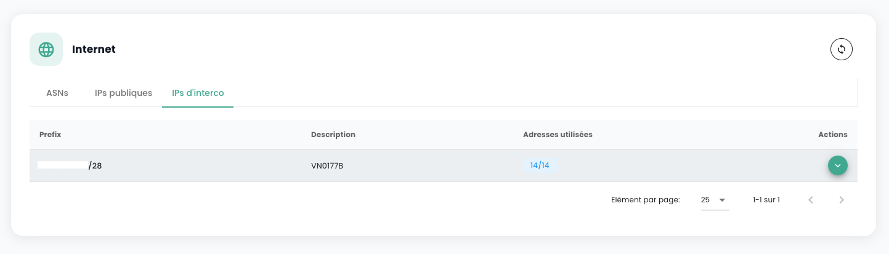

## Verwaltung Ihrer Internetverbindungen

Die Verwaltung der Konnektivität erfolgt über das Menü **'Netzwerk'** > **'Internet'**. Dieses Menü zentralisiert die Verwaltung von IP-Adressen und bietet zwei unterschiedliche Kategorien:

1. **Öffentliche IP-Adressen**: Diese werden verwendet, um Ihre Dienste im Internet bereitzustellen und den Austausch eingehender und ausgehender Daten zu erleichtern.
2. **Interconnect-IP-Adressen**: Diese Adressen ermöglichen es Ihren Gateways, den Datenverkehr in das spezifische Netzwerk von Cloud Temple zu leiten und so eine sichere und effiziente Verbindung zu gewährleisten.

Öffentliche IP-Adressen ermöglichen den Internetzugang, während Interconnect-IP-Adressen, die mit dem BGP4-Protokoll verwendet werden, sichere Verbindungen zwischen Netzwerken sicherstellen. Letztere erleichtern zuverlässige und sichere Datenübertragungen zwischen Ihrem Tenant und dem Cloud Temple Netzwerk. Die kombinierte Verwendung dieser Adressen verbessert das Verkehrsmanagement und erhöht die Sicherheit und Leistung des Netzwerks.

Hier ist die Hauptschnittstelle zur Verwaltung von IP-Adressen:

Der Start-Tab entspricht Ihrem dedizierten internen ASN für Ihren Tenant. Er gibt insbesondere wichtige Informationen zur Konfiguration Ihrer BGP-Konnektivität an.

### Öffentliche IP-Adressen

Es ist möglich, die Blöcke und Adressen, die Ihrem Tenant zugewiesen sind, über das in die Cloud Temple Konsole integrierte IPAM anzuzeigen und zu kommentieren:

Die Bestellung von öffentlichen IP-Adressen erfolgt über die Schaltfläche **'Öffentliche IPs bestellen'**:

Die Reservierung und Zuweisung einer IP-Adresse erfolgen über die Schaltfläche **'Adresse reservieren'**:

Die Änderung oder Löschung der Reservierung erfolgt über die Schaltflächen **'Aktionen'**:

Das Löschen einer Reservierung bedeutet, dass die Ressource für eine andere Verwendung zur Verfügung steht, aber dem Kunden weiterhin zugewiesen und in Rechnung gestellt wird.

Bei einigen Zeilen ist die Schaltfläche **'Aktion'** nicht verfügbar, was bedeutet, dass die IP-Adressen reserviert und somit nicht für die Nutzung verfügbar sind.

### Interconnect-IP-Adressen

Auf die gleiche Weise können Sie die Blöcke der Interconnect-IP-Adressen anzeigen und kommentieren. Sie können die Subnetze der Interconnect-Adressen mit dem Cloud Temple Netzwerk und deren Nutzung visualisieren:

Sie können deren Nutzung in der integrierten IPAM-Verwaltung wie bei den öffentlichen Adressen leicht ändern:

