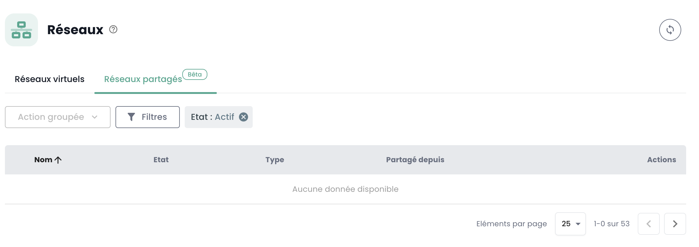

## Regionale private Netzwerke

Die Verwaltung der privaten Netzwerke innerhalb einer Region erfolgt direkt in der Cloud Temple-Konsole.

### Innerhalb eines Tenants

Das Erstellen eines virtuellen Netzwerks erfolgt im Menü __*Network*__ auf dem grünen Band auf der linken Seite des Bildschirms.

Klicken Sie dann auf die Schaltfläche __*Neues Netzwerk*__

Sie müssen den Namen Ihres Netzwerks angeben, der angezeigt wird. Standardmäßig haben alle Ihre Cluster Zugriff auf Ihr neues Netzwerk.
Im Untermenü __*Erweiterte Optionen*__ können Sie jedoch den Verbreitungsbereich innerhalb des Tenants zwischen Ihren verschiedenen Clustern genauer festlegen.

Alle möglichen Aktionen für Ihre Netzwerke finden Sie im Menü __*Aktionen*__ jedes Netzwerks:

- Aktivierung der Freigabe eines Netzwerks zwischen Tenants derselben Organisation.
- Deaktivierung der Freigabe eines Netzwerks zwischen Tenants derselben Organisation.
- Hinzufügen einer Freigabe eines Netzwerks zwischen Tenants derselben Organisation.
- Entfernen einer Freigabe eines Netzwerks zwischen Tenants derselben Organisation.
- Grafische Darstellung der Verbreitung eines Netzwerks auf alle Ihre Cluster und Hypervisoren innerhalb eines Tenants.
- Entfernen einer Verbreitung innerhalb eines Tenants.
- Änderung einer Verbreitung innerhalb eines Tenants.
- Löschen eines Netzwerks.

#### Visualisierung der Verbreitung Ihrer Netzwerke

Im Menü __*Aktionen*__ können Sie die Verbreitung eines Netzwerks auf Ihre verschiedenen Cluster innerhalb desselben Tenants leicht visualisieren.
Wählen Sie die Option *"Verbreitung anzeigen"*:

#### Änderung der Verbreitung

Die Änderung einer Verbreitung innerhalb eines Tenants erfolgt über die Option *"Verbreiten"*:
Wählen Sie dann die Cluster, die in diese Verbreitung einbezogen werden sollen.

__*Hinweis:*__ *Die Änderung der Verbreitung ist auf 20 Netzwerke pro Aktion begrenzt.*

#### Löschen eines Netzwerks

Das Löschen eines Netzwerks innerhalb eines Tenants erfolgt über die Option *"Netzwerk löschen"*:

### Netzwerkfreigabe zwischen Tenants

Standardmäßig __sind Netzwerke nur innerhalb eines Tenants verfügbar__. Sie können wählen, __ein Netzwerk zwischen mehreren Tenants__ aus technischen oder Konnektivitätsgründen freizugeben.
Es ist möglich, ein Netzwerk zwischen Ihren __[Tenant](../../../console/iam/concepts/#tenant)__ innerhalb derselben Organisation zu teilen.

Aktivieren Sie einfach die Freigabe wie unten gezeigt.

Sobald die Freigabe aktiviert ist, fügen Sie eine Freigabe wie unten gezeigt hinzu.

Wählen Sie dann den Zieltenant aus. Beachten Sie, dass die Liste der Tenants dynamisch ist.
Sie hängt von Ihrer Organisation und Ihren Rechten ab.

Sobald das Netzwerk freigegeben ist, wird es im Reiter 'Freigegebene Netzwerke' von Ihrem zweiten Tenant aus sichtbar.

