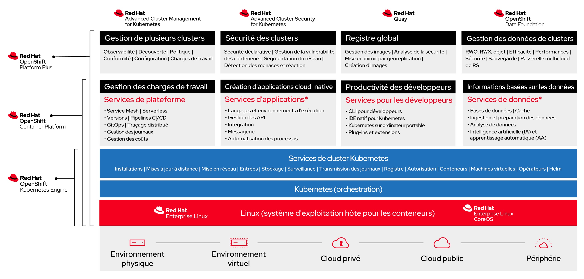

## Einführung in RedHat Openshift

**Red Hat OpenShift** ist eine Unternehmens-Containerplattform, die die Bereitstellung, Verwaltung und Skalierung containerisierter Anwendungen automatisiert. Es ist eine Plattform, die auf Docker, einem Containerisierungssystem, das es ermöglicht, eine Anwendung und ihre Abhängigkeiten in einem virtuellen Container zu verpacken, und auf Kubernetes, einem Container-Orchestrierungssystem, das das Ausführen und Koordinieren von Containern in einem Servercluster verwaltet, aufgebaut ist.

### Hauptfunktionen von Red Hat OpenShift:

- **Automatisierte Bereitstellung und Verwaltung:** OpenShift vereinfacht den Prozess der Anwendungsbereitstellung, indem es Verwaltungsroutinen wie Skalierung, Gesundheit und Lebensdauer der Container automatisiert. Es bietet eine integrierte Umgebung für die Entwicklung, das Testen und die Produktion von Anwendungen.

- **Unterstützung mehrerer Sprachen und Dienste:** Die Plattform unterstützt eine Vielzahl von Programmiersprachen (wie Java, Node.js, Python, Ruby und PHP) und bietet integrierte Dienste wie Messaging, Caching und Datenbanken, wodurch Entwickler sich auf den Code und nicht auf die Infrastruktur konzentrieren können.

- **Kontinuierliche Integration (CI) und kontinuierliche Bereitstellung (CD):** OpenShift integriert CI/CD-Tools, die die Softwareentwicklungspipeline vom ersten Commit bis zur Produktion automatisieren und somit DevOps-Praktiken fördern.

- **Betriebsverwaltung:** OpenShift bietet Tools zur Überwachung, Leistungsverwaltung und Diagnose von Anwendungen und Infrastrukturen, die den Betreibern helfen, die Gesundheit und Leistung der Systeme aufrechtzuerhalten.

- **Erhöhte Sicherheit:** Die Plattform ist mit integrierter Sicherheit konzipiert und bietet rollenbasierte Zugriffskontrollen, Aufgabenverteilung und automatisiertes Management von Geheimnissen zum Schutz von Anwendungen und Daten.

### Vorteile von Red Hat OpenShift:

- **Flexibilität:** Entwickler können mit den Tools, Sprachen und Frameworks ihrer Wahl arbeiten.
- **Betriebliche Effizienz:** OpenShift optimiert die Ressourcennutzung, verkürzt die Markteinführungszeit und steigert die Produktivität der Entwickler.
- **Skalierbarkeit:** Die Plattform skaliert automatisch die Anwendungen, um den Nachfrageänderungen gerecht zu werden.
- **Sicherheit und Konformität:** Mit seinen eingebauten Sicherheitsrichtlinien hilft OpenShift, die Sicherheits- und Konformitätsstandards aufrechtzuerhalten.

Red Hat OpenShift ist eine umfassende Lösung für die Entwicklung, Bereitstellung und Verwaltung containerisierter Anwendungen und bietet eine robuste, sichere und flexible Plattform für Unternehmen, die moderne Softwareentwicklungsansätze einsetzen.

### RedHat Openshift Data Foundation

Red Hat OpenShift Data Foundation (ODF) ist eine integrierte Lösung für Datenmanagement und -speicherung, die nahtlos mit dem OpenShift-Ökosystem zusammenarbeitet. Es bietet eine persistente, sichere und hochverfügbare Dateninfrastruktur für containerisierte Anwendungen und unterstützt damit moderne container- und microservicebasierte Entwicklungsumgebungen. ODF ist darauf ausgelegt, das Datenmanagement in hybriden und Multi-Cloud-Umgebungen zu vereinfachen und zu automatisieren und bietet eine solide Basis für geschäftskritische Unternehmensanwendungen.

#### Hauptfunktionen der OpenShift Data Foundation:

- **Persistente Speicherung:** ODF bietet eine Persistenzschicht für Container, die für Unternehmensanwendungen wie Datenbanken, Content-Management-Systeme und Anwendungen, die einen persistenten Zustand erfordern, unerlässlich ist.

- **Multi-Cloud und Hybrid:** ODF ist für hybride und Multi-Cloud-Umgebungen ausgelegt und ermöglicht ein konsistentes Datenmanagement-Erlebnis über verschiedene Cloud-Umgebungen hinweg, was die Mobilität von Anwendungen und Daten erleichtert.

- **Automatisierung und Orchestrierung:** Die tiefe Integration mit Kubernetes und OpenShift ermöglicht es ODF, das Bereitstellen, Skalieren und das Management des Lebenszyklus von Speichermedien an den Anwendungsbedarf anzupassen.

- **Hohe Verfügbarkeit und Widerstandsfähigkeit:** ODF verwendet Datenreplikation und Snapshotting zur Sicherstellung hoher Verfügbarkeit und Datenhaltbarkeit, was für die Kontinuität von Unternehmensoperationen entscheidend ist.

- **Datensicherheit:** Die Lösung integriert fortschrittliche Sicherheitsfunktionen wie Datenverschlüsselung im Ruhezustand und während der Übertragung sowie anpassbare Sicherheits- und Konformitätsrichtlinien.

#### Vorteile der OpenShift Data Foundation:

- **Betriebliche Flexibilität:** ODF ermöglicht es Unternehmen, ihre Daten effizient in verteilten Umgebungen zu verwalten und bietet die Flexibilität, die erforderlich ist, um den sich ändernden Anforderungen moderner Anwendungen gerecht zu werden.

- **Vereinfachung des Datenmanagements:** Indem viele Datenverwaltungsaufgaben automatisiert werden, reduziert ODF die Komplexität und entlastet IT-Ressourcen, die sich auf Initiativen mit höherem Mehrwert konzentrieren können.

- **Kostenoptimierung:** Die Fähigkeit von ODF, sich dynamisch an den Speicherbedarf anzupassen, hilft, Kosten zu optimieren, indem Überprovisionierung vermieden und Ressourcen effizienter genutzt werden.

- **Leistungsverbesserung:** ODF ist darauf ausgelegt, hohe Leistung für Unternehmensanwendungen zu bieten, mit Optimierungsmöglichkeiten für verschiedene Arbeitslasttypen.

Red Hat OpenShift Data Foundation ist eine fortschrittliche Datenspeicherlösung, die die Effizienz, Widerstandsfähigkeit und Sicherheit von unternehmenskritischen Anwendungen auf OpenShift verbessert. Durch die Bereitstellung von persistenter, automatisierter und sicherer Speicherung spielt ODF eine entscheidende Rolle bei der Ermöglichung von Unternehmen, das volle Potenzial von Container- und Hybrid-Cloud-Technologien auszuschöpfen.

## Allgemeine Architektur der Plattform 

### Allgemeines

Die Red Hat OpenShift Plattform von Cloud Temple ist als regionales Angebot konzipiert, das nativ auf **drei verschiedenen Verfügbarkeitszonen** innerhalb einer Cloud Temple-Region bereitgestellt wird. Diese dreizonenbasierte Architektur erhöht die Verfügbarkeit und Widerstandsfähigkeit der Daten erheblich.

Die Plattform besteht aus einem Kontrollplan und Arbeitsknoten, die alle von der Cloud Temple-Infrastruktur verwaltet werden. Der Kontrollplan wird gleichmäßig über die drei Verfügbarkeitszonen verteilt und gewährleistet eine zentrale und sichere Verwaltung. Die Arbeitsknoten werden durch Recheneinheiten dargestellt, die so angeordnet sind, dass jede Verfügbarkeitszone eine enthält.

Für die Arbeitsknoten stehen mehrere Arten von Recheneinheiten zur Verfügung, die eine flexible Anpassung an verschiedene betriebliche Anforderungen ermöglichen:

| Unités d'œuvre Redhat Openshift 4 with Data Foundations - On Demand - 1 month                                                | Unité                   | SKU                                   |
| :--------------------------------------------------------------------------------------------------------------------------- | :---------------------- | :------------------------------------ |
| OPENSHIFT - Plan de contrôle - 3 nœuds - Région FR1                                                                          | 1 plan dédié            | csp:fr1:paas:oshift:plan:payg:v1      |
| OPENSHIFT - WORKER NODES - TINY - 3 x ( 10 cores / 20 threads - 64 Go de ram - 512 Gio FLASH 1500 iops)                      | 3 workers dédiés        | csp:fr1:paas:oshift:wkr:tiny:payg:v1  |
| OPENSHIFT - WORKER NODES - SMALL  - 3 x ( 20 cores / 40 threads - 128 Go de ram - 512 Gio FLASH 1500 iops)                   | 3 workers dédiés        | csp:fr1:paas:oshift:wkr:small:payg:v1 |
| OPENSHIFT - WORKER NODES - STANDARD  - 3 x ( 32 cores / 64 threads - 384 Go de ram - 512 Gio FLASH 1500 iops)                | 3 workers dédiés        | csp:fr1:paas:oshift:wkr:std:payg:v1   |
| OPENSHIFT - WORKER NODES - ADVANCED - 3 x ( 48 cores / 96 threads - 768 Go de ram - 512 Gio FLASH 1500 iops)                 | 3 workers dédiés        | csp:fr1:paas:oshift:wkr:adv:payg:v1   |
| OPENSHIFT - WORKER NODES - PERF - 3 x ( 56 cores / 112 threads - 1.5 To de ram - 512 Gio FLASH 1500 iops)                    | 3 workers dédiés        | csp:fr1:paas:oshift:wkr:perf:payg:v1  |
| OPENSHIFT - WORKER NODES - GPU - 3 x ( 32 cores / 64 threads - 512 Go de ram - 512 Gio FLASH 1500 iops - 2xNVIDIA L40S 48GO) | 3 workers dédiés + GPUs | csp:fr1:paas:oshift:wkr:gpu:payg:v1   |

Die Red Hat OpenShift Cloud Temple Produkte sind nach dem Nutzungsmodell oder mit einer 12-Monats-Reservierung verfügbar.

**Anmerkungen**: 

1. *Die Betriebs- und Sicherheitsmaintenanz des Kontrollplans obliegt Cloud Temple im Rahmen eines PaaS-Service.*
   
2. *Ab dem 15. Juni 2024 ist die Version 1 der Plattform absichtlich softwareseitig auf einen Kontrollplan mit 30 Arbeitsknoten (unabhängig vom Typ der Arbeitsknoten) und einen globalen persistierenden Speicher von 50 Tio begrenzt. Wenn diese Grenzen für Ihr Projekt hinderlich sind, wenden Sie sich bitte an den Support.*

3. *Jeder Arbeitsknoten wird mit 512Gio Flash-Block-Speicher geliefert, was 1,5 Tio für jede Arbeitseinheit (1 Arbeitsknoten pro AZ) ergibt.*

4. *Das OpenShift PaaS-Angebot beinhaltet nativ den Zugang zu den 3 Verfügbarkeitszonen, ohne dass eine zusätzliche Anmeldung erforderlich ist.*

5. *Es ist möglich, später Blockspeicher zum OpenShift-Cluster hinzuzufügen.*
   
6. *Die Knoten werden ausgewogen zwischen den 3 Verfügbarkeitszonen bereitgestellt (1 Knoten pro Zone). Es ist nicht möglich, einen Cluster unausgewogen zu machen, indem mehr Knoten einer einzigen Zone zugewiesen werden.*
### Offre RedHat déployée dans le cadre de la plateforme Openshift Cloud Temple

La plateforme est une Redhat Openshift 4 basée sur [RedHat Openshift Platform Plus](https://www.redhat.com/en/technologies/cloud-computing/openshift/platform-plus) et inclut [OpenShift DataFoundation Essential](https://www.redhat.com/en/resources/add-capabilities-enterprise-deployments-datasheet). 

## Stratégie de sauvegarde de votre plateforme PaaS Openshift

La sauvegarde et la restauration de la plateforme PaaS Openshift est de la responsabilité de Cloud Temple pour la partie **ETCD** au titre du management de la plateforme. **La sauvegarde et la restauration pour la partie déploiement et données applicatives est de la responsabilité du Commanditaire**. 

Cloud Temple met à disposition pour ses clients l’offre **Veeam Kasten K10** (Veeam [**Kasten K10**](https://www.veeam.com/fr/kubernetes-native-backup-and-restore.html)), plateforme spécialisée dans la gestion des données pour les environnements Kubernetes. Conçue pour répondre aux besoins en matière de protection des données, elle offre des fonctionnalités robustes pour la sauvegarde, la restauration, la migration et la reprise après sinistre. Kasten K10 s’intègre de manière native aux environnements Kubernetes, qu'ils soient gérés sur des clusters cloud ou sur site, et peut s’adapter à différents cas d’usage, notamment la migration de clusters entre différentes distributions Kubernetes telles que Kubernetes Vanilla, VMware Tanzu, Red Hat Kubernetes Engine et Red Hat OpenShift.

Einer der Hauptanwendungsfälle von Kasten K10 ist **die Migration von Clustern zwischen verschiedenen Kubernetes-Plattformen**. Ob für eine Umstellung auf eine robustere Infrastruktur oder zur Konsolidierung bestehender Umgebungen, Kasten K10 bietet einfache und effektive Werkzeuge für die Verwaltung dieser Migrationen:

 - **Datensicherung und Schutz**: Bei der Migration eines Kubernetes Vanilla oder VMware Tanzu Clusters zu Red Hat Kubernetes Engine oder OpenShift ist der erste Schritt die Sicherung der Anwendungsdaten und ihrer Zustände. Kasten K10 integriert sich problemlos mit den Kubernetes-APIs, um Anwendungen, deren Abhängigkeiten sowie die damit verbundenen Datenspeicher zu identifizieren. Dies umfasst die Sicherung persistenter Volumes (Persistent Volumes - PV), Datenbanken, Konfigurationen und Geheimnisse. Kasten K10 unterstützt eine Vielzahl von Speicheranbietern (S3, Google Cloud Storage, Azure Blob Storage usw.), was es ermöglicht, Snapshots der zu migrierenden Anwendungen zu erstellen. Diese Sicherungen werden dann sicher mit Verschlüsselungsoptionen und granularem Zugriffskontrollen gespeichert, um die Datensicherheit während des gesamten Prozesses zu gewährleisten.

 - **Portabilität und Migration**: Die Migration zwischen Kubernetes-Distributionen wie Vanilla oder Tanzu und Red Hat-Lösungen wie OpenShift oder Kubernetes Engine kann aufgrund der unterschiedlichen Architekturen und spezifischen Konfigurationen jeder Plattform komplex sein. Kasten K10 vereinfacht diesen Prozess, indem es eine Abstraktionsschicht für die Portabilität von Anwendungen bietet. Bei der Migration repliziert Kasten K10 die Konfigurationen und Daten von einem Quellcluster zu einem Zielcluster, wobei die Besonderheiten jeder Umgebung berücksichtigt werden. Beispielsweise können Kubernetes-Objekte wie ConfigMaps, Secrets, PV sowie CRDs (Custom Resource Definitions) unter Berücksichtigung der besonderen Anforderungen jeder Kubernetes-Distribution migriert werden, sei es ein Red Hat OpenShift- oder ein Kubernetes Engine-Cluster. Der Prozess ist automatisiert, was das Risiko von manuellen Fehlern erheblich verringert. Darüber hinaus ermöglicht Kasten K10 eine schrittweise oder vollständige Migration je nach Bedarf und bietet Echtzeiteinblicke in den Migrationsstatus, was die Verwaltung und Überwachung des Übergangs erleichtert.

 - **Multi-Cloud- und Multi-Distribution-Kompatibilität**: Kasten K10 ist für den Betrieb in hybriden und Multi-Cloud-Umgebungen konzipiert, was es zu einem idealen Werkzeug für Organisationen macht, die Anwendungen von Tanzu- oder Vanille-Clustern in Red Hat-Umgebungen in der Cloud (Cloud Temple, Amazon EKS, Azure AKS, Google GKE) oder auf On-Premises-Infrastrukturen migrieren möchten. Dies gewährleistet maximale Flexibilität und ermöglicht es DevOps-Teams, das beste Umfeld basierend auf geschäftlichen Anforderungen oder Infrastrukturmodernisierungsstrategien auszuwählen.

 - **Einfache Verwaltung und Automatisierung**: Kasten K10 bietet eine intuitive Benutzeroberfläche, die Administratoren die einfache Verwaltung von Migrations- und Sicherungsoperationen ermöglicht, ohne tiefgehende Fachkenntnisse jeder Kubernetes-Plattform zu benötigen. Die Lösung ist auch mit Automatisierungsfunktionen ausgestattet, die es ermöglichen, regelmäßige Migrations- und Sicherungsrichtlinien festzulegen, welche sich in CI/CD-Pipelines integrieren lassen, um kontinuierliche Operationen zu gewährleisten. Benutzer können Migrationen oder Wiederherstellungen entsprechend geplanten Wartungsfenstern durchführen, Validierungstests nach der Migration durchführen und Failover-Prozesse im Falle von Problemen im Quellcluster automatisieren.

 - **Sicherheit und Compliance**: Bei Migrationen in kritische Umgebungen wie Red Hat OpenShift oder Kubernetes Engine sind Datensicherheit und die Einhaltung von Standards (ISO, SOC, GDPR usw.) wesentliche Aspekte. Kasten K10 gewährleistet die Verschlüsselung von Daten während der Übertragung und im Ruhezustand und bietet gleichzeitig Audit- und Rückverfolgbarkeitsoptionen für Sicherungs- und Wiederherstellungsoperationen. Diese Fähigkeiten sind entscheidend, um die Sicherheit der migrierten Daten, sei es in Produktions- oder Testumgebungen, zu gewährleisten. Kasten K10 ist eine unverzichtbare Lösung für Unternehmen, die Kubernetes Vanilla- oder VMware Tanzu-Cluster effizient und sicher zu Red Hat Kubernetes Engine oder OpenShift migrieren möchten.

Die Abrechnung erfolgt pro Anzahl der Worker Nodes.

| Unités d'œuvre Redhat Openshift 4 with Data Foundations - Worker Node Backup Solution | Unité     | SKU                         |
| :------------------------------------------------------------------------------------ | :-------- | :-------------------------- |
| VEEAM - KASTEN K10 - Kubernetes data protection and application mobility              | 3 workers | csp:fr1:paas:kasten:3wkr:v1 |

**Note** : *Attention, la volumétrie disque nécessaire au bon fonctionnement de votre backup est à prévoir sur l'environnement de réception de votre backup, généralement en stockage S3. Elle n'est pas incluse dans les unités d'oeuvre Openshift ou Kasten.*

**(1)** _OADP n'est pas installé nativement dans le cluster. Seul Kasten est activé pour la gestion des migrations, des sauvegardes et de la restauration_

## Droits et Permissions 

Voici les permissions principales misent en oeuvre :

|       Groupe       |         d'API          |                                                                                       Ressources Permissions                                                                                       |
|--------------------|------------------------|----------------------------------------------------------------------------------------------------------------------------------------------------------------------------------------------------|
|        Core        |       ("")/Apps        |ConfigMaps, Endpoints, PersistentVolumeClaims, Pods, ReplicationControllers, Secrets, Services, DaemonSets, Deployments, ReplicaSets, StatefulSets, Create, Get, List, Watch, Update, Patch, Delete |
|        Core        |          ("")          |                                                                                           Secrets Create                                                                                           |
|config.kio.kasten.io|        Profiles        |                                                                          Get, List, Watch, Create, Update, Patch, Delete                                                                           |
|config.kio.kasten.io|     PolicyPresets,     |                                                TransformSets, BlueprintBindings, StorageSecurityContexts, StorageSecurityContextBindings Get, List                                                 |
|config.kio.kasten.io|         Toutes         |                                                                                    les ressources (*) Get, List                                                                                    |
|       Batch        |       CronJobs,        |                                                                        Jobs Create, Get, List, Watch, Update, Patch, Delete                                                                        |
|    Autoscaling     |HorizontalPodAutoscalers|                                                                          Create, Get, List, Watch, Update, Patch, Delete                                                                           |
|     Networking     |       Ingresses,       |                                                                  NetworkPolicies Create, Get, List, Watch, Update, Patch, Delete                                                                   |
|       Policy       |  PodDisruptionBudgets  |                                                                          Create, Get, List, Watch, Update, Patch, Delete                                                                           |
|       Route        |      (OpenShift)       |                                                                       Routes Create, Get, List, Watch, Update, Patch, Delete                                                                       |

|       Build        |      (OpenShift)       |                                                         BuildConfigs, Builds, BuildLogs Erstellen, Abrufen, Auflisten, Beobachten, Aktualisieren, Patchen, Löschen                                                          |
|       Image        |      (OpenShift)       |                                                          ImageStreams, ImageStreamTags Erstellen, Abrufen, Auflisten, Beobachten, Aktualisieren, Patchen, Löschen                                                           |
|        Apps        |      (OpenShift)       |                                                                DeploymentConfigs Erstellen, Abrufen, Auflisten, Beobachten, Aktualisieren, Patchen, Löschen                                                                  |
|      Template      |      (OpenShift)       |                                                           Templates, TemplateInstances Erstellen, Abrufen, Auflisten, Beobachten, Aktualisieren, Patchen, Löschen                                                            |
|   Authorization    |         Roles,         |                                                                   RoleBindings Erstellen, Abrufen, Auflisten, Beobachten, Aktualisieren, Patchen, Löschen                                                                    |
|        RBAC        |         Roles,         |                                                                   RoleBindings Erstellen, Abrufen, Auflisten, Beobachten, Aktualisieren, Patchen, Löschen                                                                    |
|      Project       |      (OpenShift)       |                                                                               Projects Abrufen, Löschen, Aktualisieren, Patchen                                                                                 |
|     Operators      |     Subscriptions,     |                                       ClusterServiceVersions, CatalogSources, InstallPlans, OperatorGroups Erstellen, Abrufen, Auflisten, Beobachten, Aktualisieren, Patchen, Löschen                                        |
|    Cert-Manager    |     Certificates,      |                                                   CertificateRequests, Issuers, ClusterIssuers Erstellen, Abrufen, Auflisten, Beobachten, Aktualisieren, Patchen, Löschen                                                    |
|      Logging       |      (OpenShift)       |                                                      ClusterLogForwarders, ClusterLoggings Erstellen, Abrufen, Auflisten, Beobachten, Aktualisieren, Patchen, Löschen                                                        |
|      Storage       |    VolumeSnapshots     |                                                                         Abrufen, Auflisten, Beobachten, Erstellen, Aktualisieren, Patchen, Löschen                                                                           |
|        Ceph        |         (Rook)         |                                         CephClusters, CephBlockPools, CephFilesystems, CephObjectStores Erstellen, Abrufen, Auflisten, Beobachten, Aktualisieren, Patchen, Löschen                                           |
|       NooBaa       |     BackingStores,     |                                                          BucketClasses, NooBaaAccounts Erstellen, Abrufen, Auflisten, Beobachten, Aktualisieren, Patchen, Löschen                                                            |
|    ObjectBucket    |  ObjectBucketClaims,   |                                                                  ObjectBuckets Erstellen, Abrufen, Auflisten, Beobachten, Aktualisieren, Patchen, Löschen                                                                    |
|        OCS         |      (OpenShift)       |                                                        StorageClusters, StorageConsumers Erstellen, Abrufen, Auflisten, Beobachten, Aktualisieren, Patchen, Löschen                                                          |
|       Local        |        Storage         |                                                       LocalVolumes, LocalVolumeDiscoveries Erstellen, Abrufen, Auflisten, Beobachten, Aktualisieren, Patchen, Löschen                                                        |
|        CSI         |         Addons         |                                                          CSIAddonsNodes, NetworkFences Erstellen, Abrufen, Auflisten, Beobachten, Aktualisieren, Patchen, Löschen                                                            |
|      Metrics       |         Pods,          |                                                                                            Nodes Abrufen                                                                                              |
|      Security      |PodSecurityPolicyReviews|                                                                                              Erstellen                                                                                               |
|       Custom       |       Resources        |                                      Diverse kundenspezifische Ressourcen im Zusammenhang mit Kasten K10, Keycloak usw. Erstellen, Abrufen, Auflisten, Beobachten, Aktualisieren, Patchen, Löschen                                        |

## Aktuelle Einschränkungen des Redhat Openshift-Angebots in der SecNumCloud-Umgebung

Hier sind einige Einschränkungen aufgrund der SecNumCloud-Qualifikation:

### Dedizierter Kontrollplan

Arbeitslasten können aufgrund von Ressourcenzuweisungen und Sicherheitsbeschränkungen der OpenShift-Plattform in der SecNumCloud-Umgebung nicht auf dem Kontrollplan ausgeführt werden.

### Verbot der Bereitstellung von Bildern mit hohen Rechten (rootless)

Um die Sicherheitsanforderungen des SecNumCloud-Repositorys zu erfüllen, müssen rootless Container verwendet werden. 

Dieser Ansatz erhöht die Sicherheit insgesamt, indem er jeglichen privilegierten Zugriff auf Container verhindert. Anwendungen, die Container mit erhöhten Rechten benötigen, müssen angepasst werden, da deren Bereitstellung nicht erlaubt ist. 

Diese Einschränkung betrifft auch Helm Charts und Operatoren, die nicht-rootless Images verwenden, wodurch deren Bereitstellung innerhalb der Infrastruktur nicht möglich ist.

### Beschränkungen der Rechte von ClusterRole

Im Rahmen unseres OpenShift-Angebots setzen wir ein striktes Rechte-Management auf Clusterebene um, das den Anforderungen von SecNumCloud entspricht. 

Dies beinhaltet eine Begrenzung der ClusterRoles für unsere Kunden und schränkt bestimmte Aspekte des globalen Cluster-Managements ein. Obwohl diese Maßnahme zunächst restriktiv erscheinen mag, dient sie der Stärkung der Sicherheit und Stabilität der Infrastruktur. 

Wir sind uns bewusst, dass dies technische Herausforderungen mit sich bringen kann, insbesondere bei der Konfiguration fortgeschrittener Einstellungen und möglicherweise auch bei der Anpassung Ihrer Anwendungen oder der Anschaffung zusätzlicher Werkzeuge. 

Unser Supportteam steht Ihnen zur Verfügung, um Sie auf diesem Gebiet zu unterstützen und zu beraten.

### Das SCC-Kontext kann in einer SecNumCloud-Umgebung nicht geändert werden

Die Security Context Constraints (SCC) unterliegen strengen Beschränkungen und können von den Benutzern nicht geändert werden. Diese Einschränkung hat erhebliche Auswirkungen auf die Bereitstellung und den Betrieb von Containern.

Praktisch bedeutet dies, dass Container-Ausführungseinstellungen wie Systemzugriffsrechte oder Linux-Fähigkeiten vordefiniert und nicht anpassbar sind.

Diese Sicherheitsmaßnahme soll den nicht autorisierten Zugriff auf kritische Ressourcen des Clusters verhindern. Anwendungen, die spezielle Sicherheitskontexte erfordern, insbesondere solche mit privilegiertem Zugriff, können bei der Bereitstellung auf Hindernisse stoßen.

Technisch kann dies eine Überarbeitung der Anwendungsarchitektur und eine Anpassung der Bereitstellungsprozesse erfordern, um den vordefinierten SCCs zu entsprechen. Operativ kann diese Einschränkung die Flexibilität der Bereitstellungen verringern und die Verwaltung bestimmter Anwendungen in der OpenShift-Umgebung, insbesondere solcher, die Helm Charts oder Operatoren verwenden, die nicht den geltenden SCCs entsprechen, komplexer machen.

### Einschränkungen bei den benutzerdefinierten Ressourcen-Definitionen (CRDs)

Um sich für die SecNumCloud-Qualifikation zu qualifizieren, gilt eine wichtige Einschränkung für die Verwendung von benutzerdefinierten Ressourcen-Definitionen (CRDs) und benutzerdefinierten Controllern. Diese Maßnahme in Bezug auf Clusterrechte zielt darauf ab, die Bereitstellung potenziell instabiler oder nicht autorisierter benutzerdefinierter Ressourcen zu verhindern.

Diese Beschränkung gilt auch für Operatoren und Helm Charts und beeinflusst direkt die RBAC-Rechte, da CRDs die Kubernetes-API erweitern. Daher müssen Operatoren und Helm Charts über eine Zertifizierungsschiene unserer Dienste laufen, um deren Konformität und Sicherheit zu gewährleisten.

Benutzerdefinierte CRDs, insbesondere solche für spezifische Geschäftsanforderungen, können aufgrund der Risiken, die sie für die Stabilität und Sicherheit der Plattform darstellen, in der Infrastruktur abgelehnt werden. Diese Richtlinie, die dazu dient, die Integrität und Zuverlässigkeit des Clusters zu schützen, erlaubt nur CRDs, die von offiziell zertifizierten Operatoren oder Helm Charts stammen.

Unser Supportteam steht Ihnen zur Verfügung, um Sie zu diesem Thema zu beraten und bewährte Verfahren in diesem Rahmen zu empfinden.

### Keine Unterstützung dynamischer IPs für Runner

Die OpenShift SecNumCloud-Plattform erfordert, dass Runner mit festen IP-Adressen konfiguriert werden. Diese Anforderung ergibt sich aus dem Bedarf, die IPs zu autorisieren, die unsere Cloud Temple-Konsole verwalten, die für das Zugriffskontrolltool auf die API erforderlich sind. Die autorisierten IP-Adressen werden auch verwendet, um auf die OpenShift-API sowie auf die OpenShift- und Shiva-Verwaltungsschnittstellen zuzugreifen. 

Daher wird die Verwendung dynamischer IP-Adressen für diese Komponenten nicht unterstützt, was die Konfiguration fester IPs erforderlich macht, um die Sicherheit und den Zugriff auf die API zu gewährleisten.

## Load Balancer
L'environnement SecNumCloud Openshift bietet Load-Balancing-Optionen auf verschiedenen Ebenen, um ein sicheres und effizientes Verkehrsmanagement zu gewährleisten. Die API des Load Balancers ist über die Ports 6443 und 443 zugänglich, wobei die Sicherheit durch eine von der Cloud Temple-Konsole verwaltete Whitelist kontrolliert wird. Diese API nutzt eine öffentliche IP-Adresse, die mit unserem Backbone verbunden ist, ist jedoch standardmäßig nicht zugänglich, wodurch die Zugriffssicherheit weiter verbessert wird.

Für den privaten Load Balancer verwendet die Umgebung Ingress (nginx) als Standardlösung, was eine effektive Verwaltung des internen Verkehrs ermöglicht. Zusätzlich steht TCP-Support über die IaaS-Infrastruktur von Cloud Temple zur Verfügung, was zusätzliche Flexibilität für Anwendungen bietet, die auf dieser Ebene ein Load Balancing erfordern.

Beim öffentlichen Load Balancer wird die Unterstützung der Ebene 4 über Ingress gewährleistet, obwohl derzeit einige Einschränkungen mit dem Befehl "expose" bestehen. Dies bedeutet, dass das System in der Lage ist, TCP- und UDP-Verbindungen zuverlässig zu verwalten, während es weiterhin entwickelt wird, um eine größere Kompatibilität und Flexibilität zu bieten.