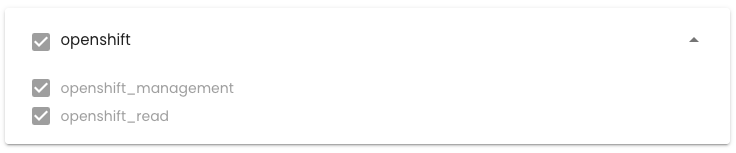
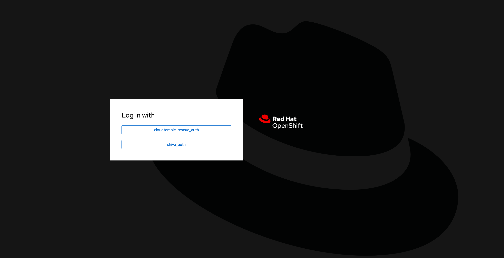

## Bereitstellen einer Redhat OpenShift-Plattform in Ihrem Tenant

### Zuweisung von Zugriffsrechten

Es ist unerlässlich, dass der Administrator des [Tenants](../console/iam/concepts.md#tenants) dem OpenShift-Administrator die Verwaltungsrechte für die OpenShift-Plattform gewährt, um darauf zugreifen zu können:



### Zugriff auf die OpenShift-Umgebung innerhalb eines Tenants

Nach der Zuweisung der Rechte erscheint das Modul '__Openshift__' im Menü der Cloud Temple-Konsole:


Sie sehen dann die OpenShift-Cluster, die in Ihrem Tenant bereitgestellt sind.

Klicken Sie auf den Cluster, den Sie verwalten möchten. Sie greifen auf die Verwaltungsumgebung des Clusters zu:



Nach der Authentifizierung können Sie Ihren Cluster verwalten:


### Ressourcen Ihrer Umgebung

Hier sind die Verbindungs- und Konfigurationsinformationen, die spezifisch für Ihre OpenShift-Umgebung sind.

#### Verbindungsdetails

Um auf die verschiedenen OpenShift-Komponenten zuzugreifen, stellen Sie sicher, dass Ihr Tenant in der Konsole auf der Whitelist steht (siehe Dokumentation: [Cloud Temple Documentation](https://docs.cloud-temple.com/)).

- __URL Shiva Tenant__:
  [https://**Ihr-Tenant-ID**.shiva.cloud-temple.com/](https://**Ihr-Tenant-ID**.shiva.cloud-temple.com/)
  
- __OpenShift UI__:
  [https://ui-ocp01-**Ihr-ID**.paas.cloud-temple.com/](https://ui-ocp01-**Ihr-ID**.paas.cloud-temple.com/)
  
- __Externe API__:
  [https://api-ocp01-**Ihr-ID**.paas.cloud-temple.com](https://api-ocp01-**Ihr-ID**.paas.cloud-temple.com)
  
- __GitOps (ARGOCD)__:
  [https://gitops-ocp01-**Ihr-ID**.paas.cloud-temple.com/applications](https://gitops-ocp01-**Ihr-ID**.paas.cloud-temple.com/applications)

#### Verbindung zum Cluster über CLI

Um sich über die Kommandozeile (CLI) zu verbinden, verwenden Sie den folgenden Befehl:

```bash
oc login https://api-ocp01-{Ihr-ID}.paas.cloud-temple.com/ --web
```

#### Zugriff auf das Register

Um auf das Register zuzugreifen, melden Sie sich mit den folgenden Befehlen an:

```bash
oc login https://api-ocp01-{Ihr-ID}.paas.cloud-temple.com --web
docker login -u {Ihr-Benutzername} -p $(oc whoami -t) registry-ocp01-{Ihr-ID}.paas.cloud-temple.com
```

Testen Sie anschließend den Aufbau und das Hochladen eines Docker-Images:

```bash
docker build -t <namespace>/temp:latest .
docker tag <namespace>/temp:latest registry-ocp01-{Ihr-ID}.paas.cloud-temple.com/<namespace>/temp:latest
docker push registry-ocp01-{Ihr-ID}.paas.cloud-temple.com/<namespace>/temp:latest
```

#### Konfiguration der Router und Load Balancer

Die Plattform bietet flexible Optionen für das __Routing von Flussdaten__ und das __Lastenausgleich__:

- Standardmäßig werden private Load Balancer für Routen und Ingresses verwendet.
- Domains:
  - `*.apps-priv-ocp01-{Ihr-ID}.paas.cloud-temple.com`
  - `*.apps-ocp01-{Ihr-ID}.paas.cloud-temple.com`

Stellen Sie sicher, dass Ihre Routen oder Ingresses mit den entsprechenden Labels oder Ingress-Klassen konfiguriert sind, um eine korrekte Weiterleitung zu gewährleisten.

Beispiel:

```yaml
metadata:
  labels:
    ct-router-type: public
```

#### IaaS-Interconnection

Netzwerkkonfigurationen spielen eine wesentliche Rolle bei der Sicherung der Kommunikation mit OpenShift.

- __Interconnection-Netzwerk__: 100.67.0.0/28
- __VIP des privaten Load Balancers__: 100.67.0.3

Stellen Sie sicher, dass Ihre Firewall eine dedizierte Schnittstelle hat und den Verkehr zwischen den angegebenen Netzwerken zulässt.