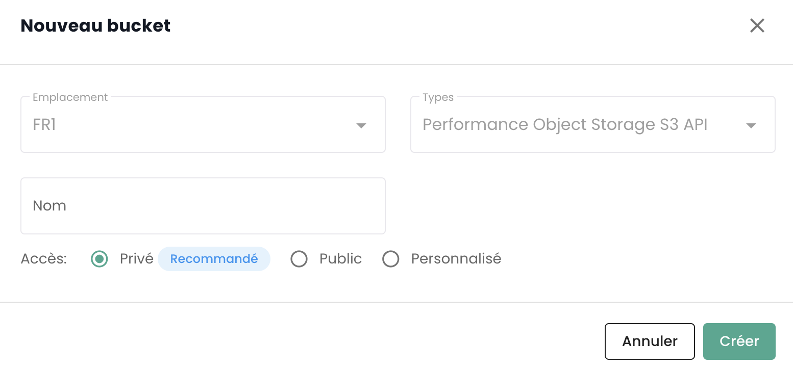

## Auflistung aller S3-Buckets Ihres Tenants

Sie können auf alle Ihre Buckets über das Menü '__Object Storage__' der Cloud Temple-Konsole zugreifen:


In der Registerkarte '__Speicherkonten__' können Sie alle auf Ihrem Tenant erstellten Konten sehen, die auf den S3-Dienst zugreifen dürfen.


## Erstellen eines neuen Speicherkontos

Das Erstellen eines Speicherkontos in Ihrem Tenant erfolgt durch Klicken auf die Schaltfläche '__Neues Speicherkonto__' oben rechts in der Registerkarte '__Speicherkonten__':


Die Plattform stellt Ihnen dann den Zugriffsschlüssel und den geheimen Schlüssel für Ihren Bucket zur Verfügung:


__ACHTUNG:__ Die geheimen und Zugangsschlüssel werden nur einmal angezeigt. Nach diesem ersten Erscheinen ist es nicht mehr möglich, den geheimen Schlüssel erneut einzusehen. Es ist daher unerlässlich, diese Informationen sofort zu notieren; andernfalls müssen Sie ein neues Schlüsselpaar generieren.

Die Neugenerierung erfolgt über die Schlüsseloptionen, indem Sie die Option "Zugangsschlüssel zurücksetzen" wählen.


## Erstellen eines S3-Buckets

Das Erstellen eines neuen Buckets erfolgt durch Klicken auf die Schaltfläche '__Neuer Bucket__' oben rechts auf dem Bildschirm:


Ein Fenster erscheint, in dem Sie folgende Informationen angeben müssen:

1. Die **Region**, in der Ihr Bucket erstellt werden soll,
2. Den **Bucket-Typ**: performant oder Archivierung,
3. Den **Namen** Ihres Buckets (der eindeutig sein muss).



Ab dem 3. April 2024 ist die verfügbare Region **FR1** (Paris) und nur der performante Typ verfügbar.

Sie müssen auch wählen, wer auf Ihren Bucket zugreifen kann:

- **Privater Zugriff**: Standardmäßig ist der Zugriff auf spezifische IP-Adressen von Cloud Temple beschränkt.
- **Öffentlicher Zugriff**: Der Zugriff ist für alle Internetadressen geöffnet (insbesondere über die Regel 0.0.0.0/0). Wir raten von dieser Konfiguration aus Sicherheitsgründen ab.
- **Benutzerdefinierter Zugriff**: Diese Option ermöglicht es Ihnen, die IPv4-Adressen oder Subnetzbereiche anzugeben, die Sie zulassen möchten.

## Zuordnung eines Speicherkontos zu einem Bucket

Kontozuweisungen zu Buckets werden in der Registerkarte '__Richtlinien__' vorgenommen


Diese Zuordnung ermöglicht es, dem Speicherkonto Zugriff auf den Bucket zu gewähren. Es gibt vier Rollen:

1. **Maintainer**: Leserechte, Schreibrechte, Verwaltungsrechte und Richtlinienverwaltung

Die S3-Berechtigungen hinter dieser Rolle:
```json
{
    "name": "maintainer",
    "permissions": [
        "s3:*"
    ]
}
```

2. **Schreiber und Leser**: Lesen und Bearbeiten, Ändern, Löschen von Dateien in den Buckets.

Die S3-Berechtigungen hinter dieser Rolle:
```json
{
    "name": "read_write",
    "permissions": [
        "s3:Get*",
        "s3:List*",
        "s3:*Object"
    ]
}
```

3. **Schreiber**: Lesen und Bearbeiten, Ändern, Löschen von Dateien in den Buckets.

Die S3-Berechtigungen hinter dieser Rolle:
```json
{
    "name": "write_only",
    "permissions": [
        "s3:List*",
        "s3:*Object"
    ]
}
```

4. **Leser**: Lesen und Herunterladen von Dateien in den Buckets.

Die S3-Berechtigungen hinter dieser Rolle:
```json
{
    "name": "read_only",
    "permissions": [
        "s3:Get*",
        "s3:List*"
    ]
}
```


## Durchsuchen eines S3-Buckets

Wenn Sie auf den Namen eines Buckets klicken, haben Sie zunächst Zugriff auf die Registerkarte '__Dateien__', um deren Inhalt zu sehen:


In der Registerkarte '__Einstellungen__' können Sie die Detailinformationen Ihres S3-Buckets sehen:


Sie sehen dann:

1. Den Namen des S3-Buckets,
2. Seine Region,
3. Die Anzahl der Objekte, die er enthält, und die Größe des Buckets in Bytes,
4. Den Endpunkt,
5. Die Lebenszykluseinstellungen, die insbesondere die Ablaufdaten der Bucket-Objekte definieren. '__0__' entspricht einer unendlichen Aufbewahrung.

Sie können den Aufbewahrungsparameter über die Schaltfläche '__Bearbeiten__' des Lebenszyklus ändern:


Schließlich können Sie die Zugriffstypologie ändern.

## Zugriffsbeschränkungen für Ihre S3-Buckets

Es ist sehr einfach, die Zugriffsrestriktionen für Ihre S3-Buckets zu konfigurieren. Beim Erstellen eines Buckets haben Sie die Wahl zwischen drei Zugriffskonfigurationen:


- **Privater Zugriff**: Standardmäßig ist der Zugriff auf spezifische IP-Adressen von Cloud Temple beschränkt.
- **Öffentlicher Zugriff**: Der Zugriff ist für alle Internetadressen offen (insbesondere über die Regel 0.0.0.0/0). Wir raten von dieser Konfiguration aus Sicherheitsgründen ab.
- **Benutzerdefinierter Zugriff**: Diese Option ermöglicht es Ihnen, die IPv4-Adressen oder Subnetzbereiche anzugeben, die Sie zulassen möchten:


*Die Unterstützung von IPv6 ist für das erste Halbjahr 2025 vorgesehen.*

## Löschen eines S3-Buckets

Das Löschen eines Buckets erfolgt über die zugehörigen Aktionen des Buckets, indem Sie die Option '__Löschen__' wählen.


_**ACHTUNG: Das Löschen ist endgültig und es gibt keine Möglichkeit, die Daten wiederherzustellen.**_

## Wie wird das S3-Angebot von Cloud Temple abgerechnet?

Der Preis ist ein monatlicher Preis, pro GB Speicher, monatlich berechnet. Die Plattform zählt jedoch die Nutzung pro Stunde und stellt die Abrechnung auf einer monatlichen Basis von 720 Stunden in Rechnung.

Beispielsweise, wenn Sie im Monat 30 GB für 1 Stunde nutzen und dann nichts, und einige Tage später erneut 30 GB für 2 Stunden, wird die monatliche Rechnung *( Preis (1 x 30GB) + 2 x Preis (30GB) ) / 720* für den betrachteten Monat betragen. Die Abrechnung erfolgt nachschüssig.
