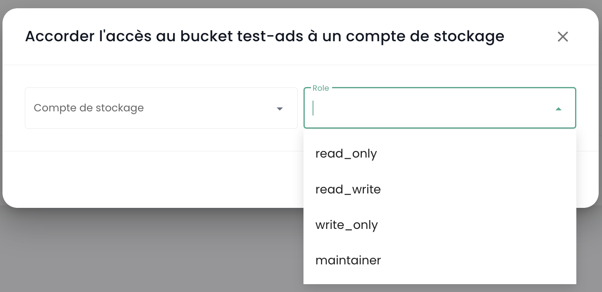
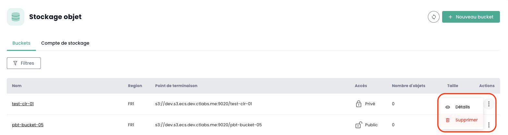

## Lister l'ensemble des bucket S3 de votre tenant

Vous pouvez accéder à l'ensemble de vos buckets via le menu '__Stockage Objet__' de la console Cloud Temple :

Vous pouvez voir tous les comptes créés sur votre tenant et autorisé à accéder au service S3 via l'onglet '__Comptes de stockage__'.

## Création d'un nouveau compte de stockage

La création d'un compte de stockage sur votre tenant se fait en appuyant sur le bouton '__Nouveau compte de stockage__' en haut à droite, dans l'onglet '__Comptes de stockage__' :

La plateforme vous donne alors la clef d'accès et la clef secrète de votre bucket :

__ATTENTION :__ Les clés secrète et d'accès sont présentées une seule fois. Après cette première apparition, il devient impossible de consulter à nouveau la clé secrète. Il est donc essentiel de noter ces informations immédiatement ; faute de quoi, il vous sera nécessaire de générer une nouvelle paire de clés.

La regeneration se fait au niveau des options de la clefs en choisissant l'option "Réinitialiser clé d'accès".

## Création d'un bucket S3 

La création de nouveau bucket se fait en cliquant sur le bouton '__Nouveau bucket__' en haut à droite de l'écran :

Eine Fenster s'affiche alors und Sie müssen ausfüllen :

1. Die **Region** der Erstellung Ihres Buckets,
2. Die **Art** des Buckets: leistungsfähig oder Archivierung,
3. Der **Name** Ihres Buckets (er muss einzigartig sein).

Am 3. April 2024 ist die verfügbare Region **FR1** (Paris) und nur die leistungsfähige Art ist verfügbar.

Sie müssen auch wählen, wer auf Ihren Bucket zugreifen kann:

- **Privater** Zugang: Standardmäßig ist der Zugang auf spezifische IP-Adressen von Cloud Temple beschränkt.
- **Öffentlicher** Zugang: Der Zugang ist für alle Internetadressen offen (insbesondere durch die Regel 0.0.0.0/0). Wir raten von dieser Konfiguration aufgrund ihrer Sicherheitsimplikationen ab.
- **Benutzerdefinierter** Zugang: Diese Option erlaubt es Ihnen, die IPv4-Adressen oder Subnetzbereiche zu spezifizieren, die Sie zulassen möchten.

## Association d'un compte de stockage à un bucket

Les associations de compte aux buckets sont réalisées dans l'onglet '__Politiques__'

Cette association permet de donner l'accès du compte de stockage au bucket. Il y trois rôle :

1. **Maintener** : Les droits lecture, ecriture, gestion des droits et gestion de la politique
2. **Lecteur** : Lire les fichiers dans les buckets et les télécharger.
3. **Ecrivain** : Lire und bearbeiten, ändern, löschen der Dateien in den Buckets.

## Parcourir un bucket S3

Lorsque vous cliquez sur le nom d'un bucket, vous avez accès en premier à l'onglet '__Fichiers__' pour voir son contenu :

Dans l'onglet '__Paramètres__' vous pouvez voir le détail des informations de votre bucket S3 :

Vous avez alors :

1. Le nom du bucket S3,
2. Sa région,
3. Le nombre d'objet qu'il contient und die Größe in Bytes des Buckets,
4. Sein Endpunkt,
5. Les paramètres de cycle de vie qui définissent notamment l'expiration des objets du bucket. '__0__' correspond à une rétention infinie.

Sie können den Aufbewahrungsparameter über die Schaltfläche '__Ändern__' des Lebenszyklus ändern:

Enfin, vous pouvez modifier sa typologie d'accès.

## Limitations des accès à vos bucket S3

Il est très simple de configurer les restrictions d'accès à vos buckets S3. Lors de la création d'un bucket, vous avez le choix entre trois configurations d'accès :

- **Privater** Zugang: Standardmäßig ist der Zugang auf spezifische IP-Adressen von Cloud Temple beschränkt.
- **Öffentlicher** Zugang: Der Zugang ist für alle Internetadressen offen (insbesondere durch die Regel 0.0.0.0/0). Wir raten von dieser Konfiguration aufgrund ihrer Sicherheitsimplikationen ab.
- **Benutzerdefinierter** Zugang: Diese Option erlaubt es Ihnen, die IPv4-Adressen oder Subnetzbereiche zu spezifizieren, die Sie zulassen möchten.

*IPv6-Support ist für das erste Halbjahr 2025 geplant.*

## Suppression d'un bucket S3

Die Löschung eines Buckets erfolgt in den dem Bucket zugeordneten Aktionen, indem Sie die Option __'Löschen'__ wählen.

_**ACHTUNG: Die Löschung ist endgültig und es gibt keine Möglichkeit, die Daten wiederherzustellen.**_

## Comment est facturé l'offre S3 de Cloud Temple ?

Der Preis ist ein monatlicher Preis pro gespeichertem Gio, der monatlich abgerechnet wird. Die Plattform zählt jedoch die Nutzung stundenweise und berechnet die Abrechnung auf einer monatlichen Basis von 720 Stunden.

Beispielsweise, wenn Sie im Monat 30 Gio für 1 Stunde nutzen, dann nichts, und dann einige Tage später 30 Gio für 2 Stunden, wird die monatliche Rechnung *(Preis (1 x 30Gio) + 2 x Preis (30Gio)) / 720* für den betrachteten Monat sein. Die Abrechnung erfolgt rückwirkend.