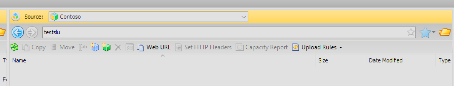

## Utiliser MINIO

Vous pouvez utiliser le client minio par exemple :

https://min.io/docs/minio/linux/reference/minio-mc.html

Par exemple :
```
    mc alias set <alias_name> https://reks2ee2b1.s3.fr1.cloud-temple.com <access_key> <secret_key>
```
Pousser un fichier :
```
    mc cp test.txt <alias_name>/<bucket_name>
```
Récupérer un fichier:
```
    mc ls <alias_name>/<bucket_name>
```
## Cloud Berry Explorer

Sie können auch [Cloud Berry Explorer](https://www.msp360.com/explorer/) verwenden.

1. Melden Sie sich unter Verwendung Ihres Endpunkts und Ihres Schlüssels an:


2. Nach der Anmeldung geben Sie den Bucketsnamen in die Navigationsleiste ein:



3. Sie können den Bucket dann normal verwenden:


## Utiliser WINSCP 6.3.x

Sie können [Winscp](https://winscp.net/eng/download.php) verwenden:

1. Melden Sie sich unter Verwendung Ihres Endpunkts, Ihres Zugriffsschlüssels und Ihres geheimen Schlüssels an:


2. Nach der Anmeldung verwenden Sie WINSCP normal wie eine FTP- oder SCP-Site:


## Ajouter le HASH d'un fichier lors de l'upload d'un objet

Im Allgemeinen wird der HASH von Dateien auf unserem Objektspeicher über die Metadaten unterstützt. Einige Clients ermöglichen das Berechnen eines HASHes und dessen Hinzufügen zu den Metadaten im Handumdrehen (zum Beispiel minio-mc mit md5), bei anderen muss die Daten direkt in den Metadaten angegeben werden.

1. Fall des Hinzufügens eines HASH mit dem minio-mc Client: dieser Client unterstützt das Berechnen eines MD5-Hashes im Handumdrehen und das Speichern in den Metadaten


            ╰─➤  cat test.txt                       
            Ceci est un test 
            ╰─➤  md5 test.txt                       
            MD5 (test.txt) = 8b34b2754802a46e3475998dfcf76f83
            ╰─➤  mc cp -md5 test.txt CLR-PUB/CLR-PUB
            ...lesur/Downloads/test.txt: 18 B / 18 B  ▓▓▓▓▓▓▓▓▓▓▓▓▓▓▓▓▓▓▓▓▓▓▓▓▓▓▓▓▓▓▓▓▓▓▓▓▓▓▓▓▓▓▓▓▓▓▓▓▓▓▓▓▓▓▓▓▓▓▓▓▓▓▓▓▓▓▓▓▓▓▓▓▓▓▓▓▓▓▓▓▓▓▓▓▓▓▓▓▓▓▓▓▓▓▓▓▓▓▓▓▓▓▓▓▓▓  111 B/s 0s
            ╰─➤  mc stat CLR-PUB/CLR-PUB/test.txt
            Name      : test.txt
            Date      : 2024-06-08 10:21:31 CEST 
            Size      : 18 B   
            ETag      : 8b34b2754802a46e3475998dfcf76f83 
            Type      : file 
            Encryption: SSE-S3
            Metadata  :
                Content-Type: text/plain 

2. Beispiel für das manuelle Hinzufügen eines sha256: dafür benutzt man die S3-Attribute der Datei.

            ╰─➤  cat test.txt
            Ceci est un test
            ╰─➤  shasum -a 256 test.txt                            
            2c5165a6a9af06b197b63b924d7ebaa0448bc6aebf8d2e8e3f58ff0597f12682  test.txt
            ╰─➤  mc cp -md5 test.txt CLR-PUB/CLR-PUB -attr "checksum-sha256=$(shasum -a 256 test.txt | cut -f1 -d' ')"
            ...lesur/Downloads/test.txt: 18 B / 18 B  ▓▓▓▓▓▓▓▓▓▓▓▓▓▓▓▓▓▓▓▓▓▓▓▓▓▓▓▓▓▓▓▓▓▓▓▓▓▓▓▓▓▓▓▓▓▓▓▓▓▓▓▓▓▓▓▓▓▓▓▓▓▓▓▓▓▓▓▓▓▓▓▓▓▓▓▓▓▓▓▓▓▓▓▓▓▓▓▓▓▓▓▓▓▓▓▓▓▓▓▓▓▓▓▓▓▓  141 B/s 0s
            ╰─➤  mc stat CLR-PUB/CLR-PUB/test.txt                                                                     
            Name      : test.txt
            Date      : 2024-06-08 10:41:17 CEST 
            Size      : 18 B   
            ETag      : 8b34b2754802a46e3475998dfcf76f83 
            Type      : file 
            Encryption: SSE-S3
            Metadata  :
                X-Amz-Meta-Checksum-Sha256: 2c5165a6a9af06b197b63b924d7ebaa0448bc6aebf8d2e8e3f58ff0597f12682 
                Content-Type              : text/plain