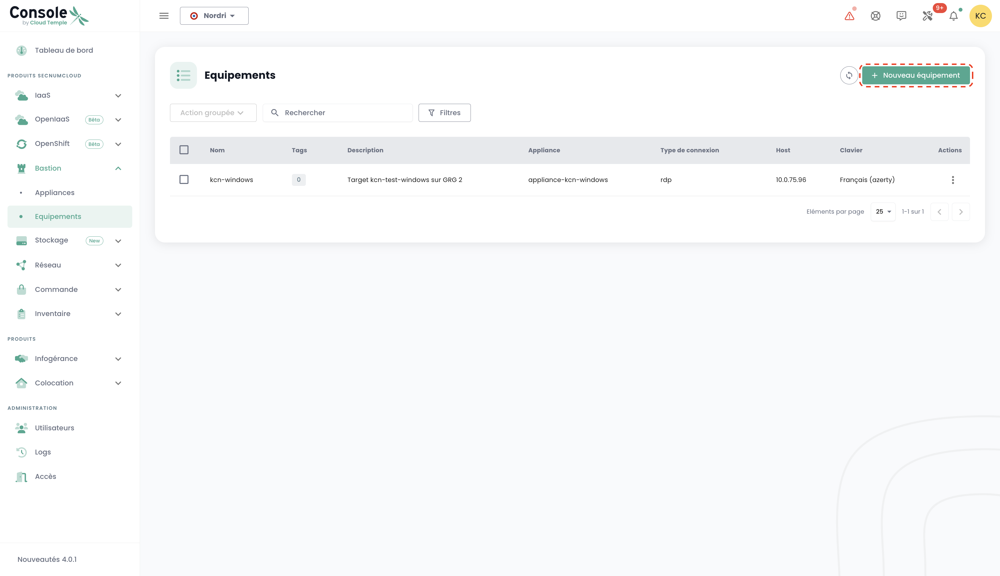

This getting started guide shows you how to request the creation of an Appliance and how to register a new session and connect to it.

## Prerequisites

1. Have subscribed to the Cloud Temple offer (Bastion Appliance subscription).
2. The equipment to be administered must be accessible from the network where the Bastion Appliance is deployed.
3. Have rights on the Bastion module.
4. In the case of an on-premise Appliance deployment, the corresponding flows must be open.

## The necessary flows for the proper functioning of the Bastion product

Several flows are necessary for the proper functioning of the Bastion Appliance.

### The bastion gateway
| Source                   | Destination                                 | Protocol |
|--------------------------|---------------------------------------------|----------|
| Bastion client Appliance | 91.223.207.71 (botg.shiva.cloud-temple.com) | UDP/4242 |

### RDP administration flows

| Source                   | Destination                 | Protocol |
|--------------------------|-----------------------------|----------|
| Bastion client Appliance | Instances to be administered | TCP/3389 |

### SSH administration flows

| Source                   | Destination                 | Protocol |
|--------------------------|-----------------------------|----------|
| Bastion client Appliance | Instances to be administered | TCP/22   |

## Request the creation of an Appliance
Before you can deploy an Appliance, you need to request a subscription to an Appliance via a support request.
Support is accessible in the Shiva console from the lifebuoy icon on the top right bar of the window.

## Register equipment

To regularly access equipment to be administered, it is more suitable to create a session, which will only require your username and password at each connection.

To do this, go to the "Equipment" tab of the "Bastion" menu, then click the "New equipment" button.

Then enter the necessary information to create your equipment:

    - Name of the equipment;
    - Description;
    - Associated Appliance;
    - Protocol type (SSH or RDP);
    - IP address of the host;
    - Keyboard configuration.

A notification indicating the creation of the equipment should appear at the top right of the page. The session then adds to your equipment list.

To create new equipment, you can also go to the “Appliances” tab by clicking on the action bar of the Appliance to which you want to associate equipment.

## Connect to equipment

Go to the "Equipment" tab of the "Bastion" tab. Click on the action bar of the equipment you want to open, and click the "Open" button.

At each connection to the equipment, you only need to provide your authentication details.

After entering your credentials, a notification confirming the start of the connection to your equipment appears, and the console to your virtual machine opens.