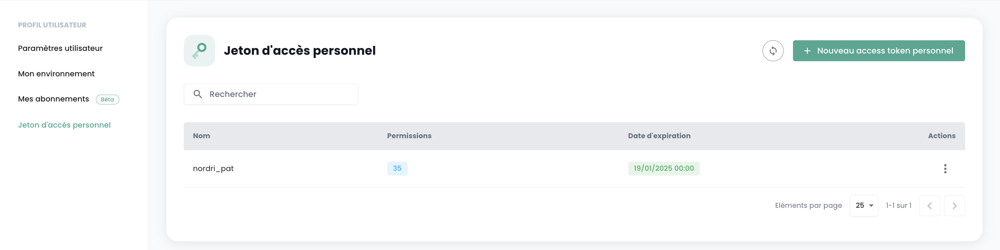
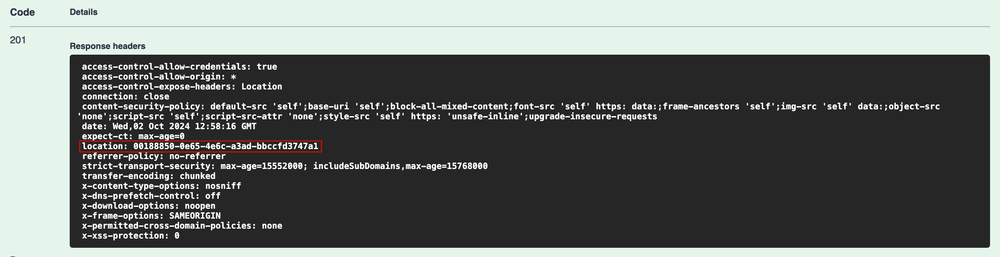
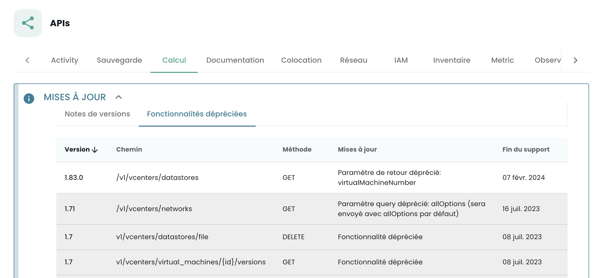

---
Documentation API
---









## API Keys

The __API Key__, also known as a __Personal Access Token (PAT)__, serves as an authentication method when you need to make requests to the Shiva API. Generating an API key is a secure way to connect to Shiva's APIs without relying on a graphical interface. Each token is tied to a tenant and the user who created it.

Creating these tokens can be done from your account. You can generate multiple keys, configuring permissions for each within the limits of your access rights.

To create an API key, simply:


From the profile menu, select __'Personal Access Token'__.


You'll then see a list of all API keys created for this user in this tenant. Click on __'New Personal Access Token'__.


You will need to:

- Provide a name for the new token,
- Specify an expiration date (maximum 12 months of validity),
- Choose the permissions associated with the token.

The details of your token are then displayed. **Note**: You cannot view these later after creation.

If you miss noting these details, you'll need to destroy and regenerate the token.


For security reasons, it's recommended to create multiple tokens with specific purposes (one for each application or business process) rather than using one token with all permissions.

You will then see the newly created token and its upcoming expiration date.


## Accessing the Cloud Temple API Portal

The OpenAPI 3.0 (Swagger) documentation for Cloud Temple's APIs is directly accessible within the application:


Access to these APIs requires authentication. Once authenticated, all operations must include the `Authorization` header with the bearer access token obtained during the authentication phase.

The API endpoints' URLs are directly provided in Swagger (within the "Servers" object of each API page).

## Activities

The tracking of write requests (POST, PUT, PATCH, DELETE) is handled through the Activity Management. Each such request automatically generates an associated activity. A HTTP status code 201 confirms the successful creation of the activity. The unique identifier of this activity is returned in the response headers under the 'Location' key.


Once the identifier is retrieved, it's possible to access the activity details via the Activity Module API:


The content of an activity includes all essential information for identifying the operation, its execution date, and its progress status. Here’s a template for an activity:

```json
{
    "tenantId": "UUIDV4",
    "description": "STRING",
    "type": "ComputeActivity" | "BackupActivity" | "IAMActivity" | "TagActivity" | "RTMSActivity" | "BastionActivity" | "SupportActivity",
    "tags": "STRING[]",
    "initiator": "UUIDV4",
    "concernedItems": [
        {
            "type": "string",
            "id": "string"
        }
    ],
    "id": "UUIDV4",
    "creationDate": "DATE",
    "operationType": "read" | "write",
    "state": "CompletedState | RunningState | WaitingState | FailedState"
}
```

The `__state__` object can take different forms depending on the activity's status:

- __waiting__, state before operation commencement:
  ```json
  waiting: {}
  ```

- __running__, state during operation execution:
  ```json
  running: {
    status: string;
    startDate: Date;
    progression: number;
  }
  ```

- __failed__, state if the operation failed:
  ```json
  failed: {
    startDate: Date;
    stopDate: Date;
    reason: string;
  }
  ```

- __completed__, state if the operation is finished:
  ```json
  completed: {
    startDate: Date;
    stopDate: Date;
    result: string;
  }
  ```

__Note:__ The identifier (UUIDv4) of the created resource is available in the activity's result once it’s completed.

### API Limitations

This section outlines the limitations associated with our API. Understanding these constraints is crucial for effective utilization and optimization of your application's interaction with our services.

1. **Rate Limiting**:
   - Each user account has a built-in rate limit to prevent abuse and ensure fair usage across all clients. The default limit is 60 requests per minute per IP address. Exceeding this threshold may result in temporary throttling or increased latency for subsequent requests until the quota resets.

2. **Quota Limits**:
   - Certain API endpoints are subject to daily, weekly, and monthly quotas based on your subscription plan. These limits vary depending on the tier of service you have subscribed to. Exceeding these limits may require additional configuration or escalation with our support team.

3. **Data Size Restrictions**:
   - For certain operations (e.g., large data retrieval), there are size limitations imposed by our infrastructure. If your request exceeds these thresholds, consider breaking down the request into smaller chunks or using pagination features provided in the API documentation.

4. **Authentication and Authorization**:
   - Ensure that all requests include valid authentication tokens. Incorrect or expired tokens will result in a 401 Unauthorized response. Additionally, ensure that the user account associated with the token has the necessary permissions to perform the requested action.

5. **Error Handling**:
   - Familiarize yourself with common error codes and messages. These provide insights into potential issues such as invalid parameters, unsupported operations, or service unavailability. Refer to our API documentation for detailed error codes and troubleshooting guides.

6. **Versioning**:
   - Our API follows versioning to allow for backward compatibility while introducing new features. Ensure that your application is compatible with the version you are using. Migrating to a newer version may require adjustments in your code, as some endpoints or parameters might change.

7. **Documentation and Updates**:
   - Always refer to the latest API documentation for the most accurate and up-to-date information regarding limits, changes, and new features. Outdated documentation can lead to misinterpretation of limitations or incorrect usage patterns.

By adhering to these guidelines, you can optimize your application's interaction with our APIs, ensuring efficient resource utilization and compliance with service terms. Should you encounter specific challenges related to API usage, please contact our support team for personalized assistance.

### Why Limits?

The Cloud Temple console sets __volume limits on requests__ that a user can make to the API over a specified period. Establishing these rate limits is a common practice in API management, implemented for several key reasons:

- **Prevention of Abuse**: These caps contribute to safeguarding the integrity of the API by preventing abusive or poorly designed usages that could compromise its operation.
- **Ensuring Service Quality**: By regulating access to the API, we ensure a fair distribution of resources, allowing all users to enjoy a stable and high-performing experience.

Consider an example of a poorly designed script repeatedly calling the API, potentially overwhelming resources and degrading performance. By setting request limits, we prevent such scenarios and guarantee a smooth, uninterrupted service for our entire clientele.

### Rate Limiting for Cloud Temple Console API

We apply quantitative restrictions on user interactions with the console for each product.

These limits are defined in __requests per second (r/s) and by IP source__. Once the threshold is exceeded, the system will respond with an HTTP 429 error code, indicating that the authorized request limit has been surpassed.

Here are the defined limits:

| Product              | Limit   |
|----------------------|---------|
| Cloud Temple Console | 60 r/s  |
| IAM                   | 60 r/s  |
| IaaS - Compute       | 60 r/s  |
| IaaS - Storage       | 20 r/s  |
| IaaS - Backup       | 60 r/s  |
| PaaS - S3           | 60 r/s  |
| PaaS - OpenShift     | 60 r/s  |
| Network             | 60 r/s  |
| Hosting              | 60 r/s  |

### How do rate limits work?

If the number of requests sent to an API endpoint exceeds the allowed limit, that API will respond with a HTTP 429 status code. This code signifies that the user has surpassed the permitted request count. Alongside this status code, the API will provide a JSON response containing detailed information about the applied limitation:

```json
{
    "error": {
        "status": "429 Too Many Requests",
        "message": "Too Many Requests"
    }
}
```

### How to Avoid Over-Requesting

It's advisable to restrict the number of API calls made by your automation to stay below the rate limit at the endpoint.

This often occurs when multiple requests are executed concurrently, using various processes or threads.

Several methods can enhance the efficiency of your automation, such as implementing __caching__ mechanisms and establishing a __retry system with gradual escalation__. This approach involves brief pauses upon encountering rate limit errors, followed by retrying the request. If the request fails again, the pause duration is incrementally increased until success or a maximum number of retries is reached.

This method offers several benefits:

- The __gradual escalation__ ensures initial attempts are made quickly while anticipating longer delays with repeated failures.
- Incorporating __random variation__ in pause times helps prevent all attempts from happening simultaneously.

It's crucial to understand that unsuccessful requests do not impact your rate limit. However, continuously resending the same request might not be a sustainable long-term solution, as this behavior could change in the future. We recommend not relying solely on this mechanism.

Python libraries like __Backoff__ ([https://pypi.org/project/backoff/]) and __Tenacity__ ([https://pypi.org/project/tenacity/]) are excellent starting points for implementing these strategies.

## Lifecycle of an API Endpoint

Details regarding the evolution of our API endpoints can be found in the release notes:


You will find a list of endpoints that are deprecated activity by activity.

Additionally, deprecated endpoints appear on our APIs as follows: `__this/is/an/endpoint__` along with a definitive removal date in the description.