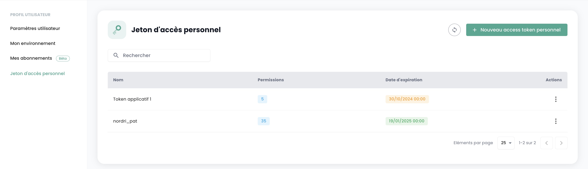
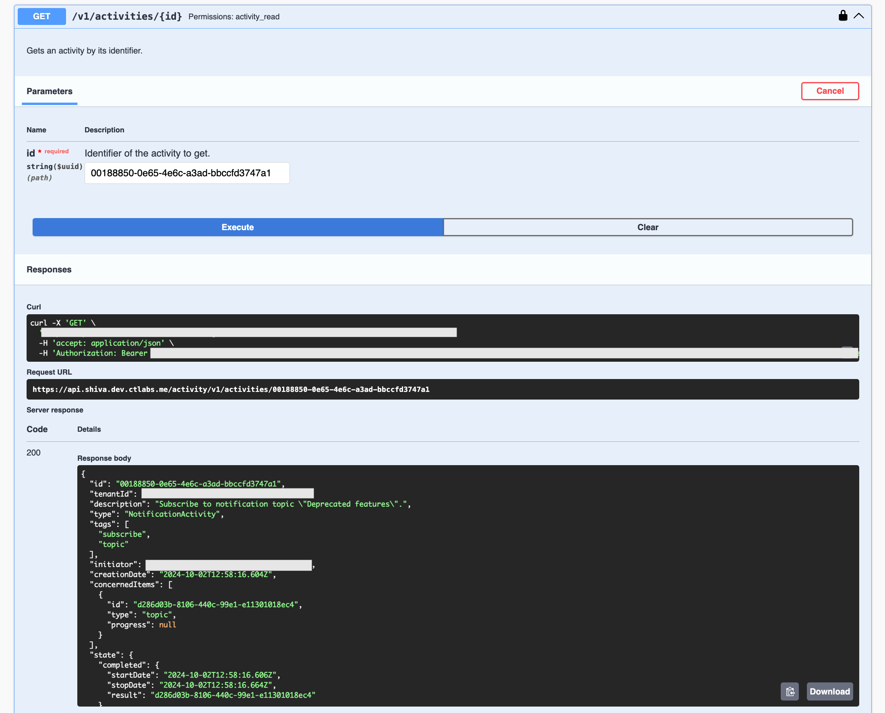

## API Keys

The __API key__ is used for authentication when making requests to the API. Generating an API key, also known as __Personal Access Token (PAT)__,
is a secure way to connect to Shiva's APIs without using a graphical interface. Each of these tokens is linked to a tenant and the user who created it.

You can create this token from your account. It is possible to generate multiple keys and configure each with permissions within your rights.

To create an API key, simply __click on your profile__:


In the profile menu, click on __'Personal Access Token'__


You will then see all the API keys created for this user in this tenant. Click on __'New personal access token'__


You will then need to:

- Provide the name of this new token,
- Specify an expiration date (maximum validity of 12 months),
- Choose the permissions associated with the token.

Details about your token are then displayed. __Note, it is not possible to access them afterward.__

If you do not note this information, you will need to destroy and recreate the token.


For security reasons, it is recommended to create multiple tokens, each with a specific use (one token for each application or business process) rather than creating one token with all the rights.

You will then see the new token created and its future expiration date.



## Access to the API portal

The OpenAPI 3.0 (Swagger) documentation of the Cloud Temple console APIs is available directly in the application:


Access to the APIs requires authentication. Once authenticated, all operations must have the header
__'Authorization'__ with the bearer access token obtained during the authentication phase.

The URL of the endpoints is directly given in __Swagger__ (in the "Servers" object on each APIs page).

## Activities

Tracking of write-type requests (POST, PUT, PATCH, DELETE) is ensured through activity management. Each such request automatically generates an associated activity. An HTTP 201 status code confirms the successful creation of the activity. The unique identifier of this activity is returned in the response headers, under the key 'Location'.


Once the identifier is retrieved, it is possible to access the activity details using the Activity module API:



The activity content includes all the essential information to identify the operation, its execution date, and its progress status. Here is the model of an activity:

```
    {
    "tenantId": "UUIDV4",
    "description": "STRING",
    "type": "ComputeActivity" | "BackupActivity" | "IAMActivity" | "TagActivity" | "RTMSActivity" | "BastionActivity" | "SupportActivity",
    "tags": "STRING[]",
    "initiator": "UUIDV4",
    "concernedItems": [
        {
        "type": "string",
        "id": "string"
        }
    ],
    "id": "UUIDV4",
    "creationDate": "DATE",
    "operationType": "read" | "write",
    "state": "CompletedState | RunningState | WaitingState | FailedState"
}
```

The **state** object can take various forms depending on the activity's status, specifically:

**waiting**, state before the operation has started:
```
    waiting: {}
```
**running**, state when the operation is in progress:
```
    running: {
    status: string;
    startDate: Date;
    progression: number;
    };
```
**failed**, state if the operation has failed:
```
    failed: {
    startDate: Date;
    stopDate: Date;
    reason: string;
    };
```
**completed**, state if the operation is completed:
```
    completed: {
    startDate: Date;
    stopDate: Date;
    result: string;
    };
```
**Note: the Identifier (UUIDv4) of the created resource is available in the activity result once it is completed.**

## API Limits

### Why limits?

The Cloud Temple console defines __limits on the volume of requests__ that a user can make
to the API over a specific period. Enforcing these rate limits is a common measure in API management, adopted for several essential reasons:

- **Abuse prevention**: These limits help safeguard the API's integrity by preventing malicious or inadvertent uses that could compromise its functionality.
- **Ensuring quality of service**: By regulating access to the API, we ensure equitable distribution of resources, thereby providing all users with a stable and performant experience.

Consider an example of a poorly designed or inefficient script that continuously attempts repetitive API calls,
risking resource saturation and performance degradation. By establishing request thresholds,
we prevent these situations and ensure __a smooth and uninterrupted service__ for all our clients.

### What are the rate limits for the Cloud Temple console API?

We apply quantitative restrictions on users' interactions with the console
for each product.

The limits are defined in __requests per second (r/s) and per source IP__. Beyond the limit threshold, the system will respond
with an HTTP 429 error code, indicating that the allowed request limit has been exceeded.

Here are the defined limits:

| Product              | Threshold limit |
|----------------------|-----------------|
| Cloud Temple Console | 60 r/s          |
| Identity (IAM)       | 60 r/s          |
| IaaS - Compute       | 60 r/s          |
| IaaS - Storage       | 20 r/s          |
| IaaS - Backup        | 60 r/s          |
| PaaS - S3            | 60 r/s          |
| PaaS - Openshift     | 60 r/s          |
| Network              | 60 r/s          |
| Hosting              | 60 r/s          |

### How do rate limits work?

If the number of requests sent to an API endpoint exceeds the allowed limit, the endpoint will respond
with __an HTTP 429 response code__. This code indicates that the user has exceeded the permitted number of requests.
When this happens, the endpoint will also provide a JSON object as a response,
containing detailed information about the applied limitation:
```
    {
        "error": {
            "status": "429 Too Many Requests",
            "message": "Too Many Requests"
        }
    }
```
### How to avoid making too many requests?

It is recommended to limit the number of API calls made by your automation to stay within
the set rate limit for the endpoint.

This situation often occurs when multiple requests are executed in parallel,
using multiple processes or threads.

There are several ways to improve the efficiency of your automation, including using __caching mechanisms__ and implementing __a backoff strategy with progressive delay__. This method involves taking a short pause when a rate limit error is encountered, then retrying the request.
If the request fails again, the pause duration is gradually increased until the request succeeds
or until a maximum number of retries is reached.

This approach has several advantages:

- __Progressive delay__ ensures that initial retries are attempted quickly, while longer delays are scheduled for repeated failures.
- Adding __random variation__ to the pause helps avoid simultaneous retry attempts.

It is important to note that __unsuccessful requests do not affect your rate limit__.
However, continuously resending a request might not be a viable long-term solution,
as this behavior could be modified in the future. Therefore, it is advisable not to rely solely on this mechanism.

The Python libraries __[Backoff](https://pypi.org/project/backoff/)__ and __[Tenacity](https://pypi.org/project/tenacity/)__ are good starting points for implementing backoff strategies.