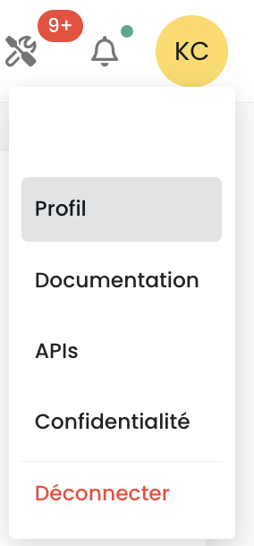

## API Keys

The __API Key__ allows authentication when you wish to make requests on the API. Generating an API key, also known as a __Personal Access Token (PAT)__,
is a secure way to connect to Shiva APIs without using a graphical interface. Each of these tokens is linked to a tenant and the user who created it.

You create this token from your account. It is possible to generate multiple keys and configure permissions for each within your granted rights.

To create an API key, simply __click on your profile__:



In the profile menu, click on __'Personal Access Token'__


You will then see all the API keys that have been created for this user in this tenant. Click on __'New Personal Access Token'__


You must then:

- Provide the name of this new token,
- Provide an expiration date (maximum of 12 months validity),
- Choose the permissions associated with the token.

The details of your token are then displayed. __Be careful, it is no longer possible to access this information afterward.__

If you do not note this information, you will have to destroy and recreate the token.


For security reasons, it is recommended to create several tokens, each with a specific use case (one token for each application or each business process) rather than creating one token with all rights.

You will then see the new token created and its future expiration date.


## Access to the API Portal

The OpenAPI 3.0 (Swagger) documentation of the Cloud Temple console APIs is available directly in the application:


Access to the APIs requires authentication. Once authenticated, all operations must have the header
__'Authorization'__ with the bearer access token obtained during the authentication phase.

The URL of the endpoints is directly provided in __Swagger__ (in the "Servers" object of each API page).

## Activities

Monitoring of write-type requests (POST, PUT, PATCH, DELETE) is handled via activity management. Each such request automatically generates an associated activity. An HTTP 201 status code confirms the successful creation of the activity. The unique identifier of this activity is returned in the response headers, under the 'Location' key.


Once the identifier is retrieved, it is possible to access the details of the activity using the Activity module API:


The content of the activity includes all the essential information to identify the operation, its execution date, and its progress status. Here is the model of an activity:

```
    {
    "tenantId": "UUIDV4",
    "description": "STRING",
    "type": "ComputeActivity" | "BackupActivity" | "IAMActivity" | "TagActivity" | "RTMSActivity" | "BastionActivity" | "SupportActivity",
    "tags": "STRING[]",
    "initiator": "UUIDV4",
    "concernedItems": [
        {
        "type": "string",
        "id": "string"
        }
    ],
    "id": "UUIDV4",
    "creationDate": "DATE",
    "operationType": "read" | "write",
    "state": "CompletedState | RunningState | WaitingState | FailedState"
}
```

The **state** object can take various forms depending on the activity status, namely:

**waiting**, state before the operation starts:
```
    waiting: {}
```
**running**, state when the operation is in progress:
```
    running: {
    status: string;
    startDate: Date;
    progression: number;
    };
```
**failed**, state if the operation failed:
```
    failed: {
    startDate: Date;
    stopDate: Date;
    reason: string;
    };
```
**completed**, state if the operation is finished:
```
    completed: {
    startDate: Date;
    stopDate: Date;
    result: string;
    };
```

**Note: the identifier (UUIDv4) of the created resource is available in the activity result once it is completed.**

## API Limits

### Why have limits?

The Cloud Temple console defines __caps on the volume of requests__ a user can send
to the API within a given period. Setting these frequency caps is a common measure in API management, adopted for several essential reasons:

- **Preventing abuse**: These limits help preserve the integrity of the API by preventing abusive or careless use that could compromise its operation.
- **Ensuring quality of service**: By regulating API access, we ensure a fair distribution of resources, allowing all users to enjoy a stable and high-performing experience.

Let’s take, for example, a poorly designed or inefficient script that attempts repetitive API calls,
risking resource saturation and performance degradation. By setting request thresholds,
we prevent these situations and ensure the maintenance of __smooth and uninterrupted service__ for all our clients.

### What are the rate limits for the Cloud Temple console API?

We apply quantitative restrictions on user interactions with the console for each product.

The limits are defined in __requests per second (r/s) and per source IP__. Beyond the limit threshold, the system will respond
with an HTTP 429 error code, indicating that the allowed request limit has been exceeded.

Here are the defined limits:

| Product              | Limit Threshold |
|----------------------|------------------|
| Cloud Temple Console | 60 r/s           |
| Identity (IAM)       | 60 r/s           |
| IaaS - Compute       | 60 r/s           |
| IaaS - Storage       | 20 r/s           |
| IaaS - Backup        | 60 r/s           |
| PaaS - S3            | 60 r/s           |
| PaaS - Openshift     | 60 r/s           |
| Network              | 60 r/s           |
| Hosting              | 60 r/s           |

### How do rate limits work?

If the number of requests sent to an API endpoint exceeds the allowed limit, the API endpoint will react by returning
__an HTTP 429 response code__. This code indicates that the user has exceeded the number of allowed requests.
When this happens, the API endpoint will also provide a JSON object in response,
containing detailed information about the applied limit:
```
    {
        "error": {
            "status": "429 Too Many Requests",
            "message": "Too Many Requests"
        }
    }
```
### How to avoid making too many requests?

It is recommended to limit the number of API calls made by your automation to stay below
the rate limit set for the endpoint.

This situation often occurs when multiple requests are executed in parallel,
using multiple processes or threads.

There are several ways to improve the efficiency of your automation, including using
__caching mechanisms__ and implementing __a replay system with progressive backoff__. This method involves
a short pause when a rate limit error is encountered, then retrying the request.
If the request fails again, the pause duration is progressively increased until the request succeeds
or a maximum number of retries is reached.

This approach offers numerous benefits:

- __Progressive backoff__ ensures that initial attempts are replayed quickly while allowing longer delays in case of repeated failures.
- Adding __random variation__ to the pause helps avoid simultaneous attempts.

It is important to note that __unsuccessful requests do not affect your rate limit__.
However, continually retrying a request may not be a viable long-term solution,
as this behavior could change in the future. We recommend not to rely solely on this mechanism.

The __[Backoff](https://pypi.org/project/backoff/)__ and __[Tenacity](https://pypi.org/project/tenacity/)__ Python libraries
are good starting points for implementing backoff strategies.

## API Endpoint Lifecycle

The endpoint evolution information is available in the update notes:


You will find the list of endpoints that are deprecated activity by activity.

Additionally, deprecated endpoints will appear this way in our APIs:
__~~this/is/an/endpoint~~__ along with a definitive deletion date in the description.