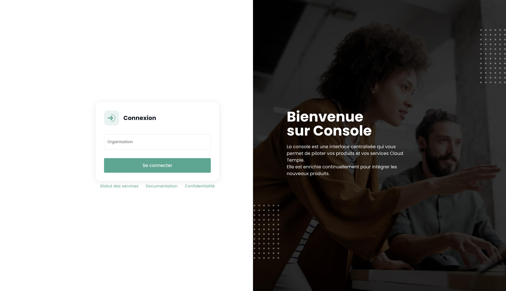
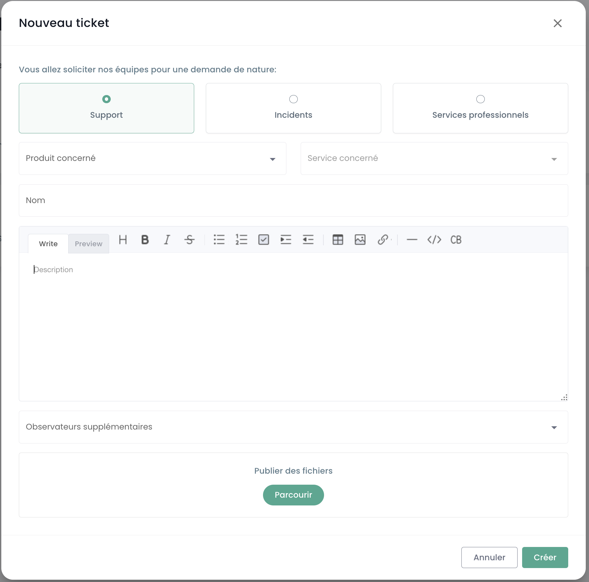
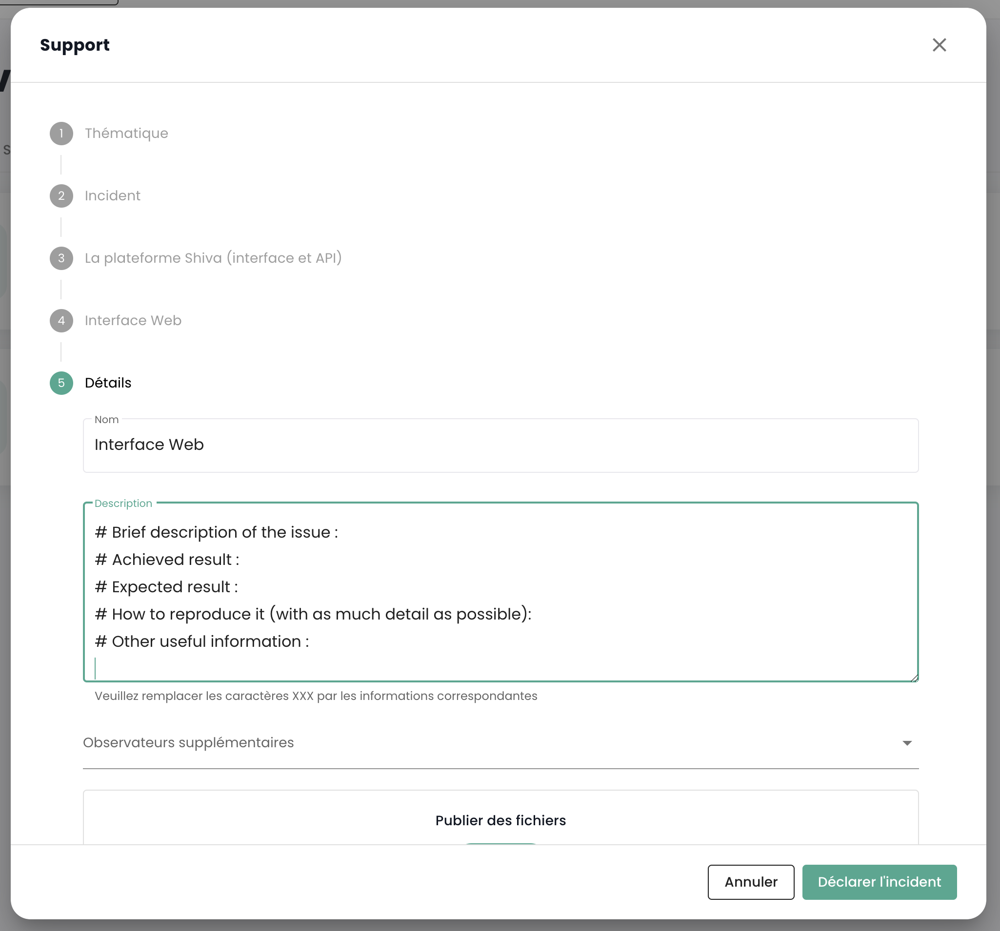
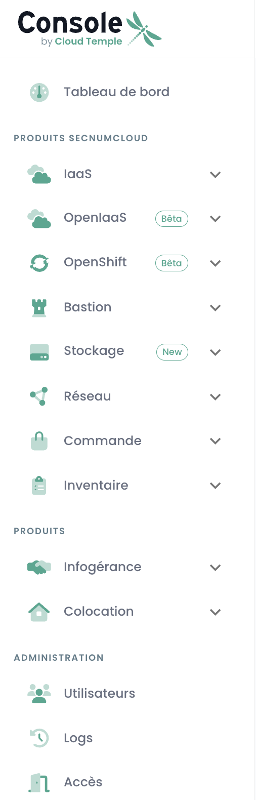
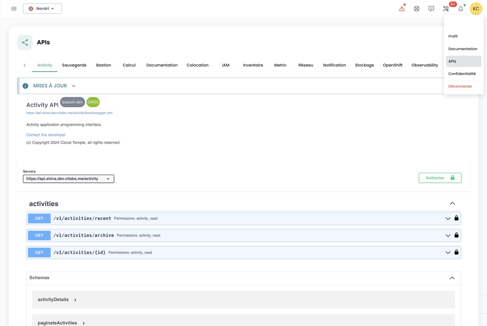

## Prérequisites
- Have subscribed to a Cloud Temple offer. To subscribe easily, you can [contact us](https://www.cloud-temple.com/contactez-nous/) or by email at __contact@cloud-temple.com__.
- Have access to the Shiva console
- Have your public IPv4 declared in the Cloud Temple trust zone (access to the Shiva console is limited to identified trusted addresses)

## Connecting to your Cloud Temple tenant
Shiva is accessible via the URL below:
    https://shiva.cloud-temple.com
    Or from the direct URL provided to you by email.

The first page allows you to select the [organization](iam/concepts.md#organisations) in which your user was created.
Once the company is provided, please click on __'Log in'__.

You will then be redirected to a page asking you to authenticate.
Once logged in, you will arrive on this page.

## Language Management
The console is available in __French__ and __English__. You can change the operating language using the __language__ icon located at the top right of the screen.

Changing a user's language is done in their __'Profile'__, at the top right of the screen, in the __'User Settings'__.

The configuration is done for each tenant [Tenant](iam/concepts.md#tenant).

## Access to technical support

At any time, you can contact the __Cloud Temple support team__ via the __'lifebuoy' icon__ located at the top right of the screen.

You will be guided through the entire support request process.

The first step is to identify the type of support request:

- Request advice on using a product (excluding incidents),
- Request assistance related to your customer account,
- Report an incident or request technical support.
- Request assistance from a professional service (provision of a Cloud Temple engineer for an issue).

You can then provide details and include files (such as images or logs).

The requester can also specify a criticality level (P1 to P4) in the ticket description, in case of an incident, such as:

**CRITICAL (P1) - Immediate notification**:

- Suspicion of sensitive data leakage
- Detection of unauthorized access to your data
- Compromise of your administration credentials
- Complete unavailability of your critical services
- Abnormal behavior on sensitive data
- Personal data breach

**HIGH (P2) - Notification < 2h**:

- User access malfunction
- Anomaly in data encryption
- Loss of access to certain critical features
- Data inconsistencies
- Major slowness affecting activity

**MEDIUM (P3) - Notification < 4h**:

- Localized performance issue
- Incident on a non-critical function
- Configuration error with limited impact
- Occasional access difficulty

**LOW (P4) - Notification < 24h**:

- Investigation request
- Anomaly with no direct impact
- Compliance question
- Need for technical clarification

Once you have submitted your request, you can find your requests via the __'lifebuoy' icon__ located at the top right of the screen:

## Access to user features via the web interface

All features accessible to your user (depending on their rights) are located on the left side of the screen, in the green band.
The features are grouped by module. This mainly includes:

- The __inventory__ of your resources,
- The __operation tracking__,
- The __management of IaaS resources__ (Compute, storage, network, ...)
- The __management of OpenIaaS resources__ (Compute, storage, network, ...)
- Access to __additional services__ (Bastion, monitoring, ...)
- The __administration of your organization__ (Management of tenants, rights, ...)

The activation of a module for a user depends on the user's rights. For example, the __'Order'__ module will not be available if the user does not have the __'ORDER'__ right.

Here is a presentation of the different modules available. New modules are regularly added to the console:

- __Dashboard__ : provides a quick view of the __total compute and storage resources__, backup statistics, and a __summary of support tickets__,
- __Inventory__ : provides an overview of all your __'virtual machines'__ resources. If __tags__ are used, it provides a view by __tag__ (e.g., business view, application view, ...),
- __Managed Services__ : gives access to the tracking of your __support requests__ and __service metrology__,
- __IaaS__ : allows the __management of VMware IaaS infrastructures__ (Virtual machines, clusters, hypervisors, replication, backup, ...),
- __OpenIaaS__ : allows the __management of Xen Orchestra resources__ (Virtual machines, backup, ...),
- __OpenShift__ : allows the management of your **RedHat Openshift PaaS architecture** and the management of your containers across the platform's 3 availability zones.
- __Bastion__ : Allows the deployment and management of SSH/RDP bastion appliances in your networks,
- __Network__ : allows the management of __Layer 2 and Layer 3 networks__, __public IPs__, and your __telecom circuits__,
- __Colocation__ : Provides a view of the equipment located in __shared or dedicated colocation__ zones,
- __Order__ : Allows the ordering of resources and tracking deployments,
- __Administration__ : Groups the administrative functions of users and tenants as well as access to global logging.

The __'NEW'__ pictograms mean that the product in question has been provisioned but is not yet qualified as a __SecNumCloud offer__, and __'BETA'__ means that the product in question has been provisioned and has just been qualified as a __SecNumCloud offer__.

## Access to user features via the API

Access to all functionalities of the Shiva console is possible via the Shiva API. You can see the details of the verbs and configurations via __'Profile'__ and __'APIs'__:

## Terraform Provider

Cloud Temple provides you with a Terraform provider to manage your Cloud platform *"as code"*. It is accessible here:

https://registry.terraform.io/providers/Cloud-Temple/cloudtemple/latest