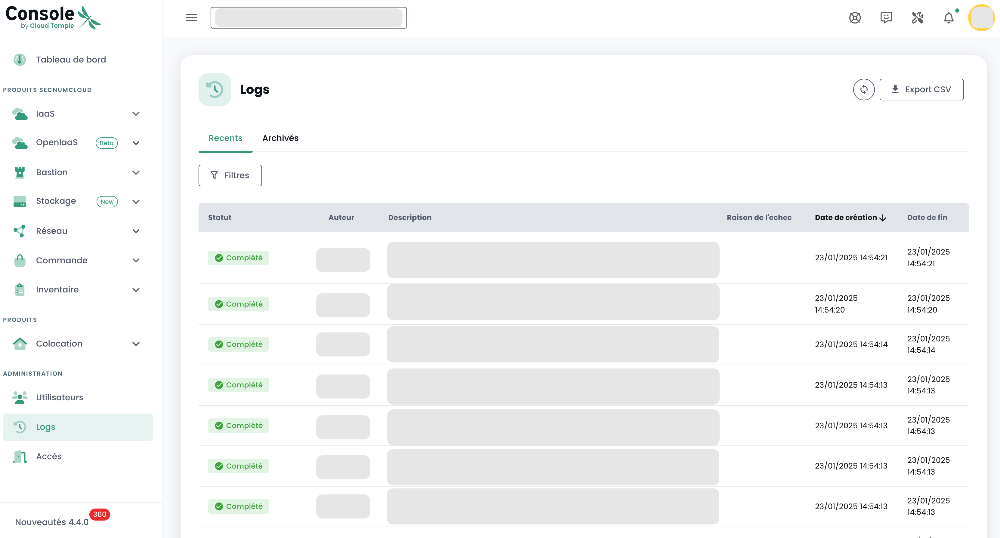

## Prerequisites
- Have subscribed to a Cloud Temple offer. To subscribe easily, you can [contact us](https://www.cloud-temple.com/contactez-nous/) or by email at __contact@cloud-temple.com__.
- Have access to the Shiva console
- Have your public IPv4 declared in the Cloud Temple trust zone (access to the Shiva console is limited to identified trusted addresses)

## Connecting to your Cloud Temple tenant
Shiva is accessible via the URL below:
    https://shiva.cloud-temple.com
    Or from the direct URL communicated to you by email.

The first page allows you to select [the organization](iam/concepts.md#organisations) where your user was created.
Once the company is provided, please click on __'Sign in'__.

You will then be redirected to a page asking you to authenticate.
Once connected, you arrive on this page.

## Language Management
The console is available in __French__, __English__. You can change the operating language using the __language__ icon located at the top right of the screen.

Changing the language for a user is done in their __'Profile'__, at the top right of the screen, in the __'User settings'__.

The configuration is done for each tenant [Tenant](iam/concepts.md#tenant).

## Access to technical support

At any time, you can contact the __Cloud Temple support team__ via the __'lifebuoy' icon__ located at the top right of the screen.

You will be guided throughout the support request process.

The first step is identifying the type of support request:

- Requesting advice on using a product (outside incident),
- Requesting assistance related to your customer account,
- Reporting an incident or requesting technical support.
- Requesting the assistance of a professional service (providing a Cloud Temple engineer for an issue).

You can then provide details and include files (image or logs, for example).

The requester can also specify a level of criticality (P1 to P4) in the ticket description in the case of an incident such as:

**CRITICAL (P1)**:

- Suspicion of sensitive data leakage
- Detection of unauthorized access to your data
- Compromise of your administration credentials
- Total unavailability of your critical services
- Abnormal behaviors on sensitive data
- Violation of personal data

**HIGH (P2)**:

- User access malfunction
- Anomaly in your data encryption
- Loss of access to some critical functionalities
- Data inconsistency
- Major slowdowns impacting activity

**MEDIUM (P3)**:

- Localized performance problem
- Incident on a non-critical function
- Configuration error with limited impact
- Occasional access difficulty

**LOW (P4)**:

- Investigation request
- Anomaly without direct impact
- Compliance question
- Need for technical clarification

Once your request is made, it is possible to find your requests via the __'lifebuoy' icon__ located at the top right of the screen:

## Access to user functionalities via the web interface

All functionalities accessible to your user (depending on rights) are located on the left of the screen in the green banner.
Features are grouped by module. This mainly includes:

- The __inventory__ of your resources,
- The __monitoring of operations__,
- The __management of IaaS resources__ (Compute, storage, network, ...)
- The __management of OpenIaaS resources__ (Compute, storage, network, ...)
- Access to __ancillary services__ (Bastion, monitoring, ...)
- The __administration of your organization__ (Tenant management, rights, ...)

The activation of a module for a user depends on the user's rights. For example, the __'Order'__ module will not be available if the user does not have the __'ORDER'__ right.

Here is a presentation of the different modules available. New modules regularly enhance the console:

- __Dashboard__: provides a quick view of the __total compute and storage resources__, __backup__ statistics, and a __summary of support tickets__,
- __Inventory__: gives a view of all your resources of the __'virtual machines'__ type. If __tags__ are used, it allows a view by __tag__ (e.g., business view, application view, ...),
- __Managed Services__: gives access to the monitoring of your __support requests__ and the __metrics of services__,
- __IaaS__: allows the __management of VMware IaaS infrastructures__ (Virtual machines, clusters, hypervisors, replication, backup, ...),
- __OpenIaaS__: allows the __management of Xen Orchestra resources__ (Virtual machines, backup, ...),
- __OpenShift__: allows the management of your **RedHat OpenShift PaaS architecture** and the management of your containers across the platform's 3 availability zones.
- __Bastion__: Allows deployment and management of SSH/RDP bastion appliances in your networks,
- __Network__: allows the management of __Layer 2 and 3 networks__, __public IPs__, and your __telecom circuits__,
- __Colocation__: Provides a view of equipment located in a __shared or dedicated colocation__ zone,
- __Order__: Allows ordering resources and monitoring deployments,
- __Administration__: Gathers the user and tenant administration functions as well as access to global logging.

The __'NEW'__ pictograms mean that the given product has been provisioned but is not yet qualified as a __SecNumCloud offer__, and __'BETA'__ means that the given product has been provisioned and has just been qualified as a __SecNumCloud offer__.

**Logging - Activity Monitoring**
=====================================

The activity page is intended to provide complete visibility of all read and write operations within the console, thus ensuring increased traceability and security. It highlights the two main tabs: Recents and Archived.

### **Page Structure**

#### **Tabs**
	+ **Recents**
		- Recent operations
		- Real-time monitoring
	+ **Archived**
		- Operations over a longer period
		- Archived operations for traceability and compliance
#### **Displayed Information**
	+ Date and Time
	+ Type of operation
    + Status
	+ User
	+ Operation description
#### **Functionality**
	+ Search/Filter for specific operations

### **Usage**
* **Access:** permission `activity_read`
* **Navigation:**
	- Select the "Recents" tab for real-time operations.
	- Choose "Archived" to view the history.
	- Use the search and filter features to locate specific operations.

#### **Compliance Note**
In accordance with SecNumCloud qualification, the storage of Cloud Temple console events is for a minimum duration of **6 months**, thus ensuring compliance with security and traceability requirements.

## Access to user functionalities via the API

Access to all Shiva console functionalities is possible via the Shiva API. You can have the details of verbs and configurations via __'Profile'__ and __'APIs'__:

## Terraform Provider

Cloud Temple provides a Terraform provider to manage your Cloud platform as code. It is accessible here:

https://registry.terraform.io/providers/Cloud-Temple/cloudtemple/latest