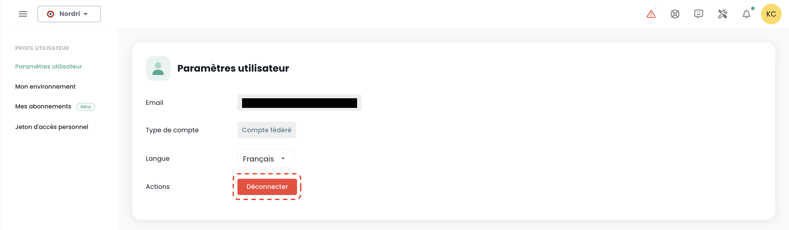

## Utilisateurs

Les comptes d'accès à la console Shiva sont créés par le compte maître du commanditaire sur invitation (quel que soit le référentiel d'authentification).
Les informations d'identification sont globales à votre [Organisation](#organisations).

*__Note:__ [Identity federation is managed at the organization level](#organisations#mecanismes-dauthentification)*

### Creating a user account in your organization

The creation of a user account in your organization is done by invitation. To invite a user to an [Organization](#organisations), go to the __'Administration'__ menu on the left of your screen on the green bar and then to the __'Users'__ submenu.

Click on the __'New User'__ button from the user page.

Then enter the user's email address

The user will then receive a verification email.

Once verification is complete, the user will be able to log in to the console.

### Assigning permissions to a user

User rights management is done from the user page.

By default, a user has no rights. Therefore, the administrator who sent the invitation must grant the necessary rights for their activities. Simply click on the user's __'Actions'__ menu and select the __'Edit'__ option.

The rights activation menu then appears:

The permissions configuration is to be done for each [Tenant](#tenants) of the [Organization](#organisations).

The list of permissions and their definitions is accessible [here](#permissions).

### Re-registering a user

When a user has been provisioned but has not confirmed their registration within the expiration time of the email sent by the Console, they can no longer confirm their registration. It then becomes possible to resend a link to renew their initial registration.

User re-registration is to be done in the __'User'__ tab of the Administration panel, at the bottom left of the screen.

Select the user you wish to re-register, then click on the action button at the end of the line, then __'Re-register'__.

**Warning**: Ensure that you are the originator of the re-registration request of your user account. Please report any requests that do not come from you via a support ticket.

### Updating your profile

This action is only available for a local account (non-SSO).

Select in your __'Profile'__, at the top right of the screen, then __'User settings'__ and select the action __'Update your profile'__.

Then check your mailbox and click on the link generated by the Console. Simply follow the steps to update your profile.

**Warning**: Ensure that you are the originator of the profile update request. Please report any requests that do not come from you via a support ticket.

### Resetting the password

This action is only available for a local account (non-SSO).

Select in your __'Profile'__, at the top right of the screen, then __'User settings'__ and select the action __'Reset password'__.

Then check your mailbox and click on the link generated by the Console. Simply follow the steps to update your password.

**Warning**: Ensure that you are the originator of the password reset request. Please report any requests that do not come from you via a support ticket.

### Resetting two-factor authentication

This action is only available for a local account (non-SSO).

Select in your __'Profile'__, at the top right of the screen, then __'User settings'__ and select the action __'Reset MFA'__.

Then check your mailbox and click on the link generated by the Console. Simply follow the steps to update your two-factor authentication.

**Warning**: Ensure that you are the originator of the two-factor authentication reset request. Please report any requests that do not come from you via a support ticket.

### Deleting a user

Deleting a user is to be done in the __'User'__ tab of the Administration panel, at the bottom left of the screen.

Select the user you wish to delete, then click on the action button at the end of the line, then __'Delete'__.

Note: You cannot delete yourself and you cannot delete a __'Owner'__ user.

### Logging out

Logging out a user is to be done in their __'Profile'__, at the top right of the screen, then __'Logout'__.

An automatic logout occurs upon session token (JWT Token) expiration.

### Changing the language of a user

Changing a user's language is to be done in their __'Profile'__, at the top right of the screen, in the __'User settings'__.

The configuration is done for each tenant [Tenant](#tenants).

### Subscribing to thematic notifications

Subscription management allows you to receive emails related to activated themes that will be automatically sent when corresponding events occur.

It is accessible in the user profile, under the "My subscriptions" tab:

For example, in case of an incident, email notifications specific to this theme will be generated.

The list of available themes is subject to evolve and will progressively expand to adapt to our needs and operational environment changes.

## Permissions

The Shiva console allows fine management of user rights in an organization, with segregation by tenant.
Initially, it is the sponsor's main account that allows the initial configuration of accounts and associated permissions.
Subsequently, the __'iam_write'__ right allows an account to administer the permissions of other users.

### Permissions available for users in your organization

The following permissions can be configured for each [user](#utilisateurs) and for each [tenant](#tenants#selection-dun-tenant) in your organization.

- __'read'__ type permissions are associated with viewing without the possibility of configuration.
- __'write'__ type permissions are associated with configuration modification.
- __These are permissions, not roles.__ As such, it is necessary to have both READ and WRITE permissions to modify a configuration.

__VERSION: 20241007__

| Permission name                               | Permission description                                                                                                         |
| --------------------------------------------- | ------------------------------------------------------------------------------------------------------------------------------ |
| activity_read                                 | View logs and activities                                                                                                        |
| activity_write                                | Manage logs and activities                                                                                                      |
| backup_iaas_opensource_read                   | Manage backup resources - OpenIaaS Offer - view                                                                                |
| backup_iaas_opensource_write                  | Manage backup resources - OpenIaaS Offer - modify                                                                              |
| backup_iaas_spp_read                          | Manage backup resources - Vmware Offer - view                                                                                  |
| backup_iaas_spp_write                         | Manage backup resources - Vmware Offer - modify                                                                                |
| bastion_read                                  | View bastion resources                                                                                                          |
| bastion_write                                 | Manage bastion resources (appliances, sessions,...)                                                                            |
| bastion_console_access                        | Authorized access to the console (ssh/rdp) of a resource protected by a Bastion appliance                                       |
| compute_iaas_opensource_console_access        | OpenIaaS Offer - Open the console of a virtual machine                                                                         |
| compute_iaas_opensource_infrastructure_read   | OpenIaaS Offer - View advanced resource data in Xen Orchestra                                                                  |
| compute_iaas_opensource_infrastructure_write  | OpenIaaS Offer - Manage advanced resources in Xen Orchestra                                                                    |
| compute_iaas_opensource_read                  | OpenIaaS Offer - View virtual machine resources                                                                                |
| compute_iaas_opensource_management            | OpenIaaS Offer - Management of Virtual Machine type resources                                                             |
| compute_iaas_opensource_virtual_machine_power | OpenIaaS Offer - Management of a virtual machine's power supply                                                              |
| compute_iaas_vmware_console_access            | Vmware Offer - Opening a virtual machine's console                                                                 |
| compute_iaas_vmware_infrastructure_read       | Vmware Offer - Consultation of advanced data for VMware resources (affinity/anti-affinity rules, DRS configuration, etc)  |
| compute_iaas_vmware_infrastructure_write      | Vmware Offer - Advanced management of VMware resources                                                                           |
| compute_iaas_vmware_read                      | Vmware Offer - Consultation of Virtual Machine type resources                                                         |
| compute_iaas_vmware_management                | Vmware Offer - Management of Virtual Machine type resources                                                              |
| compute_iaas_vmware_virtual_machine_power     | Vmware Offer - Management of a virtual machine's power supply                                                               |
| console_public_access_read                    | Consultation of IPs authorized to access the console                                                                         |
| console_public_access_write                   | Adding IPs authorized to access the console                                                                                  |
| compute_virtual_machine_power                 | Management of a virtual machine's power supply                                                                              |
| documentation_read                            | Consultation of Confluence documentation resources                                                                        |
| housing_read                                  | Consultation of colocation type resources                                                                                 |
| iam_offline_access                            | Creation and deletion of Personal Access Tokens (PAT)                                                                        |
| iam_read                                      | Consultation of user rights                                                                                           |
| iam_write                                     | Management of user rights                                                                                                |
| intervention_read                             | Consultation of planned changes and productions on the platform                                                  |
| inventory_read                                | Consultation of Inventory type resources                                                                                 |
| inventory_write                               | Management of Inventory type resources                                                                                      |
| monitoring_read                               | Consultation of monitoring                                                                                                     |
| monitoring_write                              | Management of monitoring                                                                                                          |
| metric_read                                   | Consultation of health data on virtual machines and hosts                                                         |
| network_read                                  | Consultation of network resources                                                                                             |
| network_write                                 | Management of network resources                                                                                                  |
| order_read                                    | Consultation of infrastructure orders                                                                                     |
| order_write                                   | Creation of infrastructure order                                                                                            |
| object-storage_iam_management                 | Allows management of storage accounts on the S3 product                                                                       |
| object-storage_read                           | Allows viewing of buckets and bucket configurations                                                                   |
| object-storage_write                          | Allows editing of buckets and bucket configurations                                                                  |
| openshift_management                          | Allows connection to OpenShift platforms (scoped to the tenant)                                                          |
| Owner                                         | The user has tenant administration rights                                                                        |
| support_management                            | Consultation of all support tickets for the tenant                                                                       |
| support_read                                  | Consultation of their support tickets for the tenant                                                                                  |
| support_write                                 | Creation of a support ticket on the tenant                                                                                     |
| tag_read                                      | Consultation of tags, except RTMS tags                                                                                   |
| tag_write                                     | Management of tags, except RTMS tags                                                                                        |
| ticket_comment_read                           | Consultation of comments                                                                                                  |
| ticket_comment_write                          | Management of comments                                                                                                       |
| ticket_read                                   | Consultation of tickets                                                                                                       |
| ticket_write                                  | Management of tickets                                                                                                            |

**Notes** :

- *There is no limit on the number of owners that can be defined on the tenant. However, the management interface (UI) issues a warning when there are more than 3 owners, to encourage limiting the number of owners for security and optimal access management reasons.*
- *When adding a new owner, updating their permissions can take up to 60 minutes. This propagation time is normal and ensures that access rights are correctly applied to all associated services and resources.*
- *To remove an owner from the tenant, the user must submit a request to support. This procedure ensures that access rights changes are made securely and in accordance with best access management practices.*

### Deprecated Permissions

The following permissions are no longer available:

| Permission Name                                | Date       | Permission Description                                                                                   |
| ---------------------------------------------- | ---------- | -------------------------------------------------------------------------------------------------------- |
| backup_read  (**DEPRECATED**)                  | 07/10/2024 | Consultation of backup type resources                                                                     |
| backup_write (**DEPRECATED**)                  | 07/10/2024 | Management of backup type resources - modification                                                           |
| compute_console_access (**DEPRECATED**)        | 07/10/2024 | Opening a virtual machine's console                                                                |
| compute_infrastructure_read (**DEPRECATED**)   | 07/10/2024 | Consultation of advanced data for VMware resources (affinity/anti-affinity rules, DRS configuration, etc) |
| compute_infrastructure_write (**DEPRECATED**)  | 07/10/2024 | Advanced management of VMware resources                                                                          |
| compute_read (**DEPRECATED**)                  | 07/10/2024 | Consultation of Virtual Machine type resources                                                        |
| compute_management (**DEPRECATED**)            | 07/10/2024 | Management of Virtual Machine type resources                                                             |
| compute_virtual_machine_power (**DEPRECATED**) | 07/10/2024 | Management of a virtual machine's power supply                                                              |
| iam_manage_permissions (**DEPRECATED**)        | 07/10/2024 | Management of new rights for oneself                                                                      |

## Organizations

The organization is linked to your __sponsor account__ and the associated __Cloud Temple contract__. It represents your entity (company, department, team, ...) that carries the contractual relationship between Cloud Temple and you.

### Principle of an organization

The organization has four main roles:

- It represents the __contractual entity__ for monitoring and billing aspects,
- It defines the __global configuration of the authentication mechanism__: authentication can be local to the Shiva console or remote via an identity federation service,
- It supports all __user accounts__,
- It __federates the tenants__ (Production, Preproduction, Dev, Application 1, Application 2, ...) that you define for the needs of your Cloud architecture.

The roles (rights/permissions) of users are configurable for each tenant defined in your organization. For example, an account can be authorized to order resources in one tenant, but not in another.

### Authentication Mechanisms

The Shiva console allows at the organization level __the configuration of the authentication mechanism__. You can use the local authentication repository of the Shiva console or anchor your organization to one of your authentication repositories.

The following external repositories are supported:

- __OpenID Connect__ compatible repositories,
- __SAML__ compatible repositories,
- __Microsoft ADFS__
- __Microsoft EntraID__ (Microsoft Azure Active Directory)
- Amazon AWS Cognito
- Okta
- Auth0
- KeyCloak

## Tenant

The tenant is a __grouping of resources within an organization__. An [Organization](#organizations) has at least one tenant (called __default tenant__, which can be renamed). Generally, multiple tenants are used to segment responsibilities or technical domains.

For example:

- A __Production__ tenant
- A __Preproduction__ tenant
- A __Testing__ tenant
- A __Qualification__ tenant

But it is also possible to organize things with an __application view__ or by __criticality__:

- A __Application 1__ or __Criticality 1__ tenant
- A __Application 2__ or __Criticality 2__ tenant
- ...

The technical resources ordered are assigned to a specific tenant and are not shared with other tenants. For example, a cluster of Hypervisors and associated L2 networks are only available in one tenant. Regarding networks, it is possible to request __'cross-tenant'__ networks to ensure network continuity between tenants.

User permissions are defined in each tenant. Thus, each organization must carefully consider the tenants it desires. This point is generally addressed in an initialization workshop at the time of the organization's creation.

It is possible to evolve the architecture by adding or removing tenants.

A tenant cannot be empty. It must necessarily be initialized with a minimum of resources:

- An availability zone (AZ, i.e., a physical data center),
- A compute cluster,
- A storage space,
- A network VLAN.

| Order Reference                                             | Unit    | SKU                     |  
|--------------------------------------------------------------|----------|-------------------------|
| TENANT - *(REGION)* - Tenant activation                      | 1 tenant | csp:tenant:v1           |
| TENANT - *(REGION)* - Availability zone activation           | 1 tenant | csp:(region):iaas:az:v1 |

### Tenant Access Authorization: Allowed IPs

Access to the cloud management console is strictly limited to pre-authorized IP addresses, in accordance with SecNumCloud qualification requirements. This restriction ensures an enhanced level of security by allowing access only to users coming from specified IP ranges, thereby minimizing unauthorized access risks and protecting the cloud infrastructure according to the highest security standards.

Note: *The removal of an authorized IP is done via a support request in the Cloud Temple console.*

### Resource Consumption within a Tenant

It is possible to view the cloud resources consumed within a tenant, thus offering a detailed view of the usage of the various deployed services. This feature allows users to track their resource consumption in real-time, identify the most used services, and optimize their usage based on needs.

In the console menu, click on "Consumption report" then select the desired time period. You will thus be able to view in detail the cloud resource consumption over the defined period, allowing you to analyze service usage and optimize your management accordingly:

