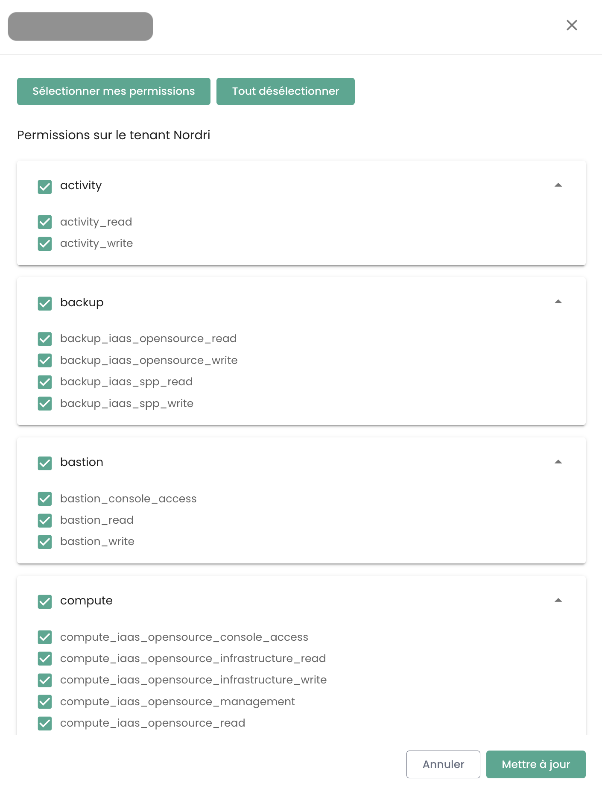

## Utilisateurs

Les comptes d'accès à la console Shiva sont créés par le compte maitre du commanditaire sur invitation (quelque soit le référentiel d'authentification).
Les informations d'identification sont globales à votre [Organisation](#organisations).

*__Nota :__ [La fédération d'identité se gère au niveau de l'organisation](#organisations#mecanismes-dauthentification)*

### Création d'un compte utilisateur dans votre organisation

La création d'un compte utilisateur dans votre organisation se fait par invitation. Pour inviter un utilisateur dans une [Organisation](#organisations), aller dans le menu __'Administration'__ à gauche de votre écran sur le bandeau vert puis dans le sous menu __'Utilisateurs'__.

Cliquez sur le bouton __'Nouvel Utilisateur'__ depuis la page des utilisateurs.

Indiquez ensuite l'adresse de messagerie de l'utilisateur

L'utilisateur va alors recevoir un mail de vérification.

Une fois la vérification terminée, l'utilisateur pourra se connecter sur la console.

### Affectation des permissions à un utilisateur

La gestion des droits utilisateurs se fait depuis la page utilisateur.

Par défaut, un utilisateur n'a pas de droit. Il est donc nécessaire que l'administrateur ayant fait l'invitation lui octroie les droits nécessaires à son activité. Il suffit de cliquer sur le menu __'Actions'__ de l'utilisateur et de choisir l'option __'Modifier'__.

Le menu d'activation des droits apparait alors :

La configuration des permissions est à faire pour chaque [Tenant](#tenants) de l'[Organisation](#organisations).

La liste des permissions et leur définition est accessible [ici](#permissions).

### Réinscription d'un utilisateur

Lorsqu'un utilisateur a été provisionné mais n'a pas validé son inscription dans le délai d'expiration du mail envoyé par la Console, il ne peut plus confirmer son inscription. Il est alors possible de lui renvoyer un lien afin qu'il renouvelle sa première inscription.

La réinscription d'un utilisateur est à réaliser dans l'onglet __'Utilisateur'__ du volet Administration, en bas à gauche de l'écran.

Sélectionnez l'utilisateur que vous souhaitez réinscrire, puis cliquer sur le bouton d'action au bout de la ligne puis __'Réinscription'__.

**Warning**: Assurez vous de bien être à l'origine de la demande de réinscription de votre compte utilisateur. Merci de signaler toutes demandes qui ne vient pas de vous via un ticket de support.

### Mettre à jour son profil

Cette action n'est disponible que pour un compte local (non SSO).

Sélectionnez dans votre __'Profil'__, en haut à droite de l'écran puis __'Paramètre utilisateur'__ et sélectionnez l'action __'Mettre à jour votre profil'__.

Rendez-vous ensuite dans votre boite mail et cliquez sur le lien généré par la Console. Suivez simplement les étapes pour mettre à jour votre profil.

**Warning**: Assurez vous de bien être à l'origine de la demande de mise à jour du profil. Merci de signaler toutes demandes qui ne vient pas de vous via un ticket de support.

### Réinitialisation du mot de passe

Cette action n'est disponible que pour un compte local (non SSO).

Sélectionnez dans votre __'Profil'__, en haut à droite de l'écran puis __'Paramètre utilisateur'__ et sélectionnez l'action __'Réinitialiser mot de passe'__.

Rendez-vous ensuite dans votre boite mail et cliquez sur le lien généré par la Console. Suivez simplement les étapes pour mettre à jour votre mot de passe.

**Warning**: Assurez vous de bien être à l'origine de la demande de réinitialisation de votre mot de passe. Merci de signaler toutes demandes qui ne vient pas de vous via un ticket de support.

### Réinitialisation du double facteur d'authentification

Cette action n'est disponible que pour un compte local (non SSO).

Sélectionnez dans votre __'Profil'__, en haut à droite de l'écran puis __'Paramètre utilisateur'__ et sélectionnez l'action __'Réinitialiser MFA'__.

Rendez-vous ensuite dans votre boite mail et cliquez sur le lien généré par la Console. Suivez simplement les étapes pour mettre à jour votre double facteur d'authentification.

**Warning**: Assurez vous de bien être à l'origine de la demande de réinitialiser de votre double facteur d'authentification. Merci de signaler toutes demandes qui ne vient pas de vous via un ticket de support.

### Suppression d'un utilisateur

La suppression d'un utilisateur est à réaliser dans l'onglet __'Utilisateur'__ du volet Administration, en bas à gauche de l'écran.

Sélectionnez l'utilisateur que vous souhaitez supprimer, puis cliquez sur le bouton d'action au bout de la ligne puis __'Supprimer'__.

Note: Vous ne pouvez pas vous supprimer vous même et vous ne pouvez pas supprimer un utilisateur __'Propriétaire'__.

### Se déconnecter

La déconnexion d'un utilisateur est à réaliser dans son __'Profil'__, en haut à droite de l'écran, puis __'Déconnecter'__.

Une déconnexion automatique est réalisée lors de l'expiration du jeton (JWT Token) de session.

### Changer la langue d'un utilisateur

Le changement de langue d'un utilisateur est à réaliser dans son __'Profil'__, en haut à droite de l'écran, dans les __'Paramètres utilisateur'__.

La configuration est faite pour chaque tenant [Tenant](#tenants).

### Abonnement aux notifications thématiques

La gestion des abonnements permet de recevoir les e-mails relatifs aux thématiques activées qui seront automatiquement envoyés lors de la survenue d'événements correspondants.

Elle est accessible dans le profil utilisateur, dans l'onglet "Mes abonnements" :

 Par exemple, en cas d'incident, des notifications par e-mail spécifiques à cette thématique seront générées.

La liste des thématiques disponibles est susceptible d'évoluer et de s'enrichir progressivement pour s'adapter aux besoins et aux changements dans notre environnement opérationnel.

## Permissions

La console Shiva permet une gestion fine des droits des utilisateurs d'une organisation, avec une ségrégation par tenant.
Initialement, c'est le compte principal du commanditaire qui permet la configuration initiale des comptes et des permissions associées.
Par la suite, le droit __'iam_write'__ permet à un compte d'administrer les permissions des autres utilisateurs.

### Permissions disponibles pour les utilisateurs de votre organisation

Lorsqu’un utilisateur est créé, il ne possède aucune permission par défaut. Chaque permission est attribuée individuellement et fonctionne de manière unitaire, sans chevauchement avec d’autres permissions. Elles s’appliquent en conjonction, ce qui signifie qu’un utilisateur doit disposer de toutes les permissions requises pour effectuer une action spécifique.

Les permissions suivantes sont configurables pour chaque utilisateur et pour chaque tenant de votre organisation :
	•	Permissions de type “read” : permettent uniquement la consultation des ressources sans possibilité de modification.
	•	Permissions de type “write” : autorisent la modification des configurations.
 	•	Permissions de type “management“ : autorisent la gestion avancées des ressources.

- __Ce sont des permissions, pas des rôles.__ À ce titre, il est nécessaire d'avoir la permission READ et WRITE pour modifier une configuration.

__VERSION : 20250123__

| Nom de la permission                          | Description de la permission                                                                                                   |
| --------------------------------------------- | ------------------------------------------------------------------------------------------------------------------------------ |
| activity_read                                 | Consultation des journaux logs et activités                                                                                    |
| activity_write                                | Gestion des journaux logs et activités                                                                                         |
| backup_iaas_opensource_read                   | Gestion des ressources de type backup - Offre OpenIaaS - consultation                                                          |
| backup_iaas_opensource_write                  | Gestion des ressources de type backup - Offre OpenIaaS - modification                                                          |
| backup_iaas_spp_read                          | Gestion des ressources de type backup - Offre Vmware - consultation                                                            |
| backup_iaas_spp_write                         | Gestion des ressources de type backup - Offre Vmware - modification                                                            |
| bastion_read                                  | Consultation des ressources de type bastion                                                                                    |
| bastion_write                                 | Gestion des ressources (appliances, sessions,...)  de type Bastion                                                             |
| bastion_console_access                        | Autorisation d'accès à la console (ssh/rdp) d'une ressource protégée par une appliance Bastion                                 |
| compute_iaas_opensource_console_access        | Offre OpenIaaS -Ouverture de la console d'une machine virtuelle                                                                |
| compute_iaas_opensource_infrastructure_read   | OpenIaaS Offer - Consultation of advanced data of Xen Orchestra resources |
| compute_iaas_opensource_infrastructure_write  | OpenIaaS Offer - Advanced management of Xen Orchestra resources          |
| compute_iaas_opensource_read                  | OpenIaaS Offer - Consultation of Virtual Machines type resources          |
| compute_iaas_opensource_management            | OpenIaaS Offer - Management of Virtual Machines type resources            |
| compute_iaas_opensource_virtual_machine_power | OpenIaaS Offer - Management of a virtual machine's power                  |
| compute_iaas_vmware_console_access            | Vmware Offer - Opening of a virtual machine's console                     |
| compute_iaas_vmware_infrastructure_read       | Vmware Offer - Consultation of advanced data of VMware resources (affinity/anti-affinity rules, drs configuration, etc) |
| compute_iaas_vmware_infrastructure_write      | Vmware Offer - Advanced management of VMware resources                    |
| compute_iaas_vmware_read                      | Vmware Offer - Consultation of Virtual Machines type resources            |
| compute_iaas_vmware_management                | Vmware Offer - Management of Virtual Machines type resources (enables encryption of a virtual machine)          |
| compute_iaas_vmware_virtual_machine_power     | Vmware Offer - Management of a virtual machine's power                    |
| baremetal_read                                | Bare Metal Offer - Consultation of Bare Metal type resources              |
| baremetal_console_access                      | Bare Metal Offer - Opening of a Bare Metal's console                      |
| console_public_access_read                    | Consultation of IPs authorized to access the console                      |
| console_public_access_write                   | Adding IPs authorized to access the console                               |
| compute_virtual_machine_power                 | Management of a virtual machine's power                                   |
| documentation_read                            | Consultation of Confluence documentation resources                        |
| housing_read                                  | Consultation of colocation type resources                                 |
| iam_offline_access                            | Creation and deletion of Personal Access Tokens (PAT)                     |
| iam_read                                      | Consultation of user rights                                               |
| iam_write                                     | Management of user rights                                                 |
| intervention_read                             | Consultation of planned changes and production deployments on the platform |
| inventory_read                                | Consultation of Inventory type resources                                  |
| inventory_write                               | Management of Inventory type resources                                    |
| monitoring_read                               | Consultation of monitoring                                                |
| monitoring_write                              | Management of monitoring                                                  |
| metric_read                                   | Consultation of health data on virtual machines and hosts                 |
| network_read                                  | Consultation of network resources                                         |
| network_write                                 | Management of network resources                                           |
| order_read                                    | Consultation of infrastructure orders                                     |
| order_write                                   | Creation of infrastructure orders                                         |
| object-storage_iam_management                 | Provides management of storage accounts on the S3 product                 |
| object-storage_read                           | Provides viewing of buckets and bucket configurations                     |
| object-storage_write                          | Provides editing of buckets and bucket configurations                     |
| openshift_management                          | Provides connection to Openshift platforms (scoped to the tenant)         |
| support_management                            | Consultation of all tenant's support tickets                              |
| support_read                                  | Consultation of tenant's support tickets                                  |
| support_write                                 | Creation of a support ticket on the tenant                                |
| tag_read                                      | Consultation of tags, except for RTMS tags                                |
| tag_write                                     | Management of tags, except for RTMS tags                                  |
| ticket_comment_read                           | Consultation of comments                                                  |
| ticket_comment_write                          | Management of comments                                                    |
| ticket_read                                   | Consultation of tickets                                                   |
| ticket_write                                  | Management of tickets                                                     |

**Notes** :

- *There is no limit to the number of owners that can be defined on the tenant. However, the management interface (GUI) issues a warning when there are more than 3 owners to encourage limiting the number of owners for security and optimal access management.*
- *When adding a new owner, updating their permissions can take up to 60 minutes. This propagation time is normal and ensures that access rights are correctly applied to all associated services and resources.*
- *To remove an owner from the tenant, the user must submit a request to support. This procedure ensures that access rights modifications are made securely and in accordance with best access management practices.*

### Deprecated Permissions

The following permissions are no longer available:

| Permission Name                               | Date       | Permission Description                                                                                 |
| ---------------------------------------------- | ---------- | ------------------------------------------------------------------------------------------------------ |
| backup_read  (**DEPRECATED**)                  | 07/10/2024 | Consultation of backup type resources                                                                   |
| backup_write (**DEPRECATED**)                  | 07/10/2024 | Management of backup type resources - modification                                                      |
| compute_console_access (**DEPRECATED**)        | 07/10/2024 | Opening of a virtual machine's console                                                                  |
| compute_infrastructure_read (**DEPRECATED**)   | 07/10/2024 | Consultation of advanced data of VMware resources (affinity/anti-affinity rules, drs configuration, etc) |
| compute_infrastructure_write (**DEPRECATED**)  | 07/10/2024 | Advanced management of VMware resources                                                                          |
| compute_read (**DEPRECATED**)                  | 07/10/2024 | Consultation of Virtual Machine resources                                                        |
| compute_management (**DEPRECATED**)            | 07/10/2024 | Management of Virtual Machine resources                                                             |
| compute_virtual_machine_power (**DEPRECATED**) | 07/10/2024 | Management of a virtual machine's power                                                              |
| iam_manage_permissions (**DEPRECATED**)        | 07/10/2024 | Management of new permissions for oneself                                                                      |

## Organizations

The organization is linked to your __sponsoring account__ and the __associated Cloud Temple contract__. It represents your entity (company, department, team, ...) which holds the contractual relationship between Cloud Temple and you.

### Principle of an organization

The organization has four main roles:

- It represents the __contractual entity__ for tracking and billing aspects,
- It defines __the global configuration of the authentication mechanism__: authentication can be local at the Shiva console level or remote via an identity federation service,
- It carries all __user accounts__,
- It __federates the tenants__ (Production, Pre-production, Dev, Application 1, Application 2, ...) that you define for the needs of your Cloud architecture.

The roles (rights/permissions) of users are configurable for each tenant defined in your organization. For example, an account may be authorized to order resources in one tenant, but not in another.

### Authentication mechanisms

The Shiva console allows, at the organization level, __the configuration of the authentication mechanism__. You can
use the local authentication directory of the Shiva console or connect your organization to one
of your authentication directories.

The following external directories are supported:

- Directories compatible with __OpenID Connect__,
- Directories compatible with __SAML__,
- __Microsoft ADFS__
- __Microsoft EntraID__ (Microsoft Azure Active Directory)
- Amazon AWS Cognito
- Okta
- Auth0
- KeyCloak

## Tenant

The tenant is a __grouping of resources within an organization__. An [Organization](#organizations) has at least one tenant (called __default tenant__, which can be renamed). Generally, multiple tenants are used to segment responsibilities or technical scopes.

For example:

- A __Production__ tenant
- A __Pre-production__ tenant
- A __Staging__ tenant
- A __Qualification__ tenant

But it is also possible to organize things with an __application view__ or by __criticality__:

- An __Application 1__ or __Criticality 1__ tenant
- An __Application 2__ or __Criticality 2__ tenant
- ...

The technical resources ordered are assigned to a specific tenant and are not shared with other tenants. For example, a Hypervisor cluster and associated L2 networks are available only in one tenant.
Regarding the networks, it is possible to request __'cross tenant'__ networks to ensure network continuity between tenants.

User permissions must be defined in each tenant. Therefore, each organization must carefully consider the desired tenants. This point is generally discussed in the initial workshop, at the time of organization creation.

It is possible to evolve the architecture by adding or removing tenants.

A tenant cannot be empty. It must necessarily be initialized with a minimum of resources:

- An availability zone (AZ, a physical datacenter),
- A compute cluster,
- A storage space,
- A network VLAN.

| Order Reference                                        | Unit    | SKU                     |
|--------------------------------------------------------------|----------|-------------------------|
| TENANT - *(REGION)* - Activation of a tenant                 | 1 tenant | csp:tenant:v1           |
| TENANT - *(REGION)* - Activation of an availability zone | 1 tenant | csp:(region):iaas:az:v1 |

### Authorization for tenant access: Allowed IPs

Access to the cloud management console is strictly limited to previously authorized IP addresses, in compliance with SecNumCloud qualification requirements. This restriction ensures an enhanced level of security by allowing access only to users coming from specified IP ranges, thereby minimizing the risks of unauthorized access and protecting the cloud infrastructure according to the highest security standards.

Note: *The removal of an authorized IP is done through a support request in the Cloud Temple console.*

### Resource consumption within a tenant

It is possible to visualize the cloud resources consumed within a tenant, thus offering a detailed view of the usage of various deployed services. This feature allows users to monitor in real time the consumption of their resources, identify the most used services, and optimize their usage based on needs.

In the console menu, click "Consumption Report" then select the desired time period. You can then view in detail the consumption of cloud resources over the defined period, allowing you to analyze service usage and optimize your management accordingly:

