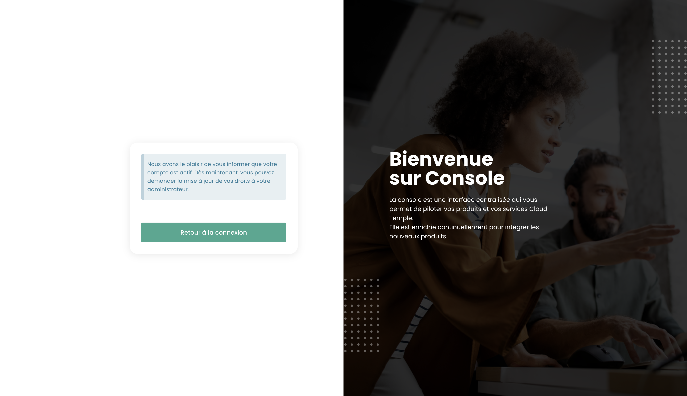

##  Tenant

### Creating a tenant

Creating a tenant is carried out through a service request indicating:

    The name of your Organization
    The name of a contact with their email and phone number to finalize the configuration
    The name of the tenant
    The availability zone or, if not available, the desired physical site for the tenant

### Selecting a tenant

Selecting the tenant is done from the main page of the Shiva console:

*__Note:__ A tenant's resources are unique to it and cannot be mixed with other tenants.*

## Access accounts for the Shiva console

The access accounts for the Shiva console are created by the sponsor's master account through invitation (regardless of the authentication directory).
The identification information is global to your [Organization](concepts.md#organisations).

*__Note:__ Identity federation is managed at the organization level.*

### Creating a user account in your organization

Creating a user account in your organization is done by invitation. To invite a user to an [Organization](concepts.md#organisations), go to the __'Administration'__ menu on the left of your screen on the green banner, and then to the __'Users'__ submenu.

Click the __'New User'__ button from the users page.

Then, provide the email address of the user

The user will then receive a verification email.

Once verification is complete, the user can log in to the console.

### Assigning permissions to a user

User rights management is done from the user page.

By default, a user has no rights. Therefore, the administrator who invited them must grant the necessary rights for their activity. Simply click on the user's __'Actions'__ menu and choose the __'Edit'__ option.

The rights activation menu will then appear:

Permissions configuration must be done for each [Tenant](concepts.md#tenants) of the [Organization](concepts.md#organisations).

The list of permissions and their definitions can be accessed [here](#permissions).

### Changing a user's language

Changing a user's language is done in their __'Profile'__, at the top right of the screen, in the __'User Settings'__.

The configuration is done for each [Tenant](concepts.md#tenants).

### Subscribing to thematic notifications

The subscription management allows you to receive email notifications related to the activated themes, which will automatically be sent when corresponding events occur.

It is available in the user profile, under the "My Subscriptions" tab:

For example, in case of an incident, email notifications specific to this theme will be generated.

The list of available themes is likely to evolve and expand progressively to adapt to needs and changes in our operating environment.

## Permissions

### What permissions are available for user accounts in the Shiva console?

Here is the list of [available permissions](#permissions).

### How to add a permission?

The [procedure for granting permission is available here](#permissions).

### Why can't I add a permission?

To add a permission, you need to have the __'iam_write'__ permission as well as the __permission you wish to add__.

### How to add a user?

*__Note__ : To add a user, you must have the __'iam_write'__ right.*

### How to audit user access/permissions?

Go to the user page and click the __'Export CSV'__ button:

### How to delete a user?

In the __'Administration'__ menu on the left green banner, in the __'Users'__ submenu, click the target user's __'Action'__ icon and choose __'Delete'__.

*__Note__ :*
- *To add a user, you must have the __'iam_write'__ right.*
- *If it is a federated user, __make sure that the user has also been deleted from the identity directory__.*

### How to reset a password?
It is possible to reset a password from the Shiva console login page by clicking on __'Forgot password?'__.

### Why are some users grayed out?
Grayed-out users are those who haven't validated their account. When the account was created, the user received a verification email.

Once the verification is complete, the user will be able to log in to the console.

The account remains grayed out until verification is finalized.

### What is a Personal Access Token (PAT)?

Generating an API key, also called a __Personal Access Token (PAT)__, 
is a secure way to connect to Shiva APIs without using a graphical interface.

### What is MFA and is it mandatory?
MFA (multi-factor authentication) is a concept of verifying a user's identity in two steps, also known as __two-factor authentication__.

The user must provide two distinct proofs of identity. In the case of the Shiva console, two-factor authentication is mandatory and requires entering a one-time code after entering the account password.

## Access and authentication management

### Granting access to a tenant: Authorized IPs

Access to the cloud management console is strictly limited to pre-authorized IP addresses, in compliance with the SecNumCloud qualification requirements. This restriction ensures an enhanced level of security by only allowing access from specified IP ranges, thus minimizing the risks of unauthorized access and protecting the cloud infrastructure according to the highest security standards.

It is now possible to display the list of authorized public IP addresses for the tenant and add a new public IP address to this list directly from the "Administration > Access" tab.

For this, the user must have the `console_public_access_read` right to view authorized IPs and the `console_public_access_write` right to add a public IP address to the list.

A new IP can then be added:

Note: *Removing an authorized IP requires a support request in the Cloud Temple console.*