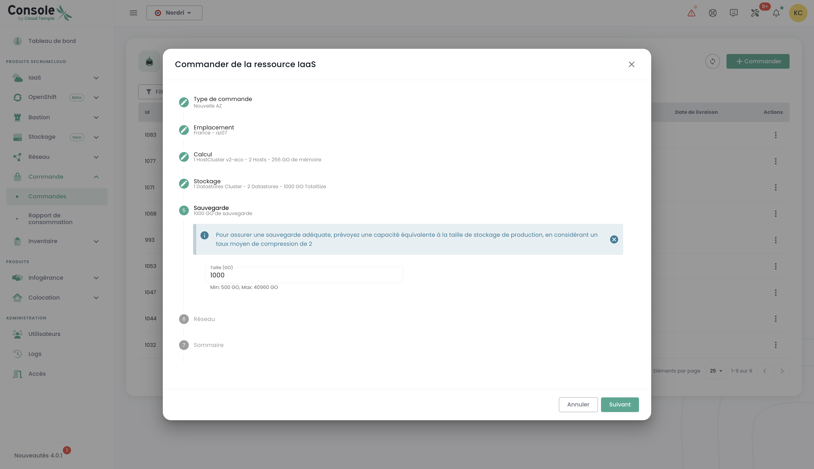
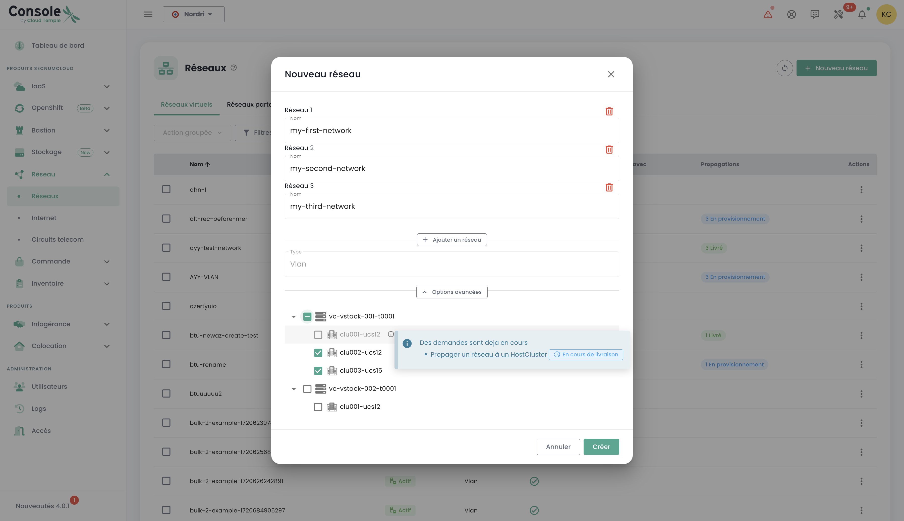

## Concept

The deployment tracking of new resources is done in the __'Orders'__ menu accessible in the green sidebar on the left of the screen.

It allows you to visualize the Cloud resources ordered, being deployed, and any potential errors within a [Tenant](iam/concepts.md#tenant) of your [Organization](iam/concepts.md#organisations).

*__Note: At this time, it is not yet possible to have a global view at the organization level of all the resources deployed in the various tenants.__ This topic will be addressed in 2024 by the implementation of a dedicated portal for the initiator (in the sense of the signatory) and the management of their organization.*

The deployment or removal of resources is done within each product in the __'IaaS'__ and __'Network'__ menus on the left of the screen in the green sidebar.

It is also possible to directly see the deliveries in the Cloud Temple console notifications:

From the orders page, you can see the progress of a delivery and possibly interact with the team by adding comments or clarifications:

**Note**: **It is not possible to launch multiple orders for the same type of resource simultaneously. Therefore, you will need to wait for the current order to be processed and finalized before placing a new one. This ensures efficient and orderly management of resources within your environment.**

## Order a new availability zone

It is possible to add a new availability zone by accessing the "**Order**" menu. This option allows you to extend your resources and improve the availability and resilience of your applications in just a few clicks:

Start by selecting the desired location by first choosing the geographic region, then the corresponding availability zone (AZ) from the available ones. This step allows you to tailor the deployment of your resources based on location and the requirements of your infrastructure:

Next, proceed to select the desired type of hypervisor cluster, choosing the one that best meets the performance and management needs of your cloud infrastructure:

Then, select the number of hypervisors as well as the desired amount of memory to tailor the resources to the workload and specific requirements of your cloud environment:

Then, select the number of datastores to provision in the cluster and their types. It is important to note that the maximum number of allowed datastores is 10, with a minimum of 2 datastores required. Each different type of datastore will result in the creation of an additional datastoreCluster. For example, if you choose 2 datastores of type "live" and 1 datastore of type "mass", it will result in the formation of 2 distinct datastoreClusters:

Define the required backup storage size while ensuring to anticipate an equivalent capacity to your production storage. Consider an average compression rate of 2 to optimize backup space and ensure efficient data protection:

Select the networks to propagate based on your needs. You also have the option to enable the "Internet access" option if necessary, by defining the desired number of IP addresses, with a choice between 1 and a maximum of 8:

You then obtain a summary of the selected options before validating your order.

## Order additional storage resources

The logic of block storage allocation on compute clusters is TODO

### Deploy a new compute cluster

Place an order for a hypervisor cluster by selecting the options suited to your virtualization needs. Define the key characteristics such as the number of hypervisors, cluster type, amount of memory, and required compute resources:

Select the availability zone:

Choose the type of compute blade:

You then have the option to select existing networks and propagate them, or create new ones directly at this stage, according to the needs of your infrastructure. Note that the total number of configurable networks is limited to a maximum of 20:

You then obtain a summary of the selected options before validating your order and can then view your order in progress:

### Deploy a new storage cluster

In the "**order**" menu, place an order for a **new storage cluster** for your environment by selecting the options that correspond to your needs in terms of capacity, performance, and redundancy. Select the location:

Define the number of datastores to provision in the cluster and their type, adhering to the following limits: a minimum of 2 datastores and a maximum of 10 can be configured. Choose the types of datastores that best meet your needs in terms of performance, capacity, and usage to optimize storage in your environment:

Select the desired type of storage from the available options:

You then access a complete summary of the options you have selected, allowing you to review all parameters before finalizing your order:

### Deploy a new datastore within a VMware SDRS cluster

In this example, we will add block mode storage for a VMware infrastructure.
To add an additional datastore in your SDRS storage cluster, go to the __'Infrastructure'__ submenu then __'VMWare'__. 
Then choose the VMware stack and the availability zone. Then go to the __'Storage'__ submenu.

Choose the SDRS cluster corresponding to the performance characteristics you desire and click on the __'Add a datastore'__ button located in the table 
listing the datastores.

__note__:  
- *The smallest LUN activatable on a cluster is __500 GiB__.*  
- *The performance of a datastore ranges from 500 IOPS/TiB on average to 15000 IOPS/TiB on average. __This is a software throttling performed at the storage controllers level__.*  
- *The volume of disk consumed by your organization is the sum of all LUNs across all utilized AZs*.  
- *The __'order'__ rights as well as __'compute'__ rights are required on the account for this action.*

### Order new networks

The network technology used on the Cloud Temple infrastructure is based on [VPLS](https://en.wikipedia.org/wiki/Virtual_Private_LAN_Service). It allows you to benefit from __level 2 networks continuity between your availability zones within a region__. 
It is also possible to share networks between your tenants and terminate them in the hosting zone.
Basically, you can imagine a Cloud Temple network as an 802.1q VLAN available at any point in your tenant.

TODO

Ordering a new network and decisions on sharing between your tenants, are done in the __'Network'__ menu of the green sidebar on the left of the screen. Networks will first be created, and then a separate order will be generated to propagate them. You can track the progress of ongoing orders by accessing the "Orders" tab in the menu, or by clicking on the information labels that redirect you to active or in-process orders.

It is also possible to propagate existing networks or separate the two steps, starting with network creation, then proceeding to propagation later as needed. The propagation option is found in the options of the selected network:

Click on the "Propagate" option for an existing network, then select the desired propagation target. This step allows you to define the location or resources where the network should be propagated:

### Disable a network

A network can also be disabled if necessary. This option allows you to temporarily pause network access or usage without permanently deleting it, thus offering flexibility in managing your infrastructure according to your needs.

The disable option is found in the options of the selected network. '

## Add additional hypervisors to a compute cluster

The logic of the compute clusters operation is TODO

Adding hypervisors to a compute cluster is done in the __'IaaS'__ menu in the green sidebar on the left of the screen.
In the following example, we will add compute to a hypervisor cluster using VMware technology.
Allez dans le sous menu __'Infrastructure'__ puis __'VMWare'__. Choisissez alors la stack vmware et la zone de disponibilité et le cluster de calcul.
Dans cet exemple, il s'agit du __'clu001-ucs12'__. Cliquez sur le bouton __'Ajouter un host'__ qui se situe dans le tableau avec la liste des hosts, en haut à droite.

__nota__ : 

- *__La configuration d'un cluster doit être homogène__. Ainsi, il n'est pas permis de mixer les types d'hyperviseur au sein d'un cluster. Toutes les lames doivent être de même type.*
- *Les droits __'order'__ ainsi que __'compute'__ sont nécessaires au compte pour mener cette action.*

## Add additional memory resource to a compute cluster

The logic of memory allocation on compute clusters is TODO

To add RAM to a cluster, simply go to the cluster configuration (as for adding a compute host as previously seen) and click on __'Modify memory'__.

__nota__ :  
- *__Machines are delivered with all physical memory__. The unlocking of the memory resource is only a software activation at the cluster level.*  
- *It is not possible to change the amount of physical memory of a blade type. Be sure to take into account the maximum capacity of a blade when creating a cluster.*  
- *The rights __'order'__ and __'compute'__ are necessary for the account to carry out this action.*